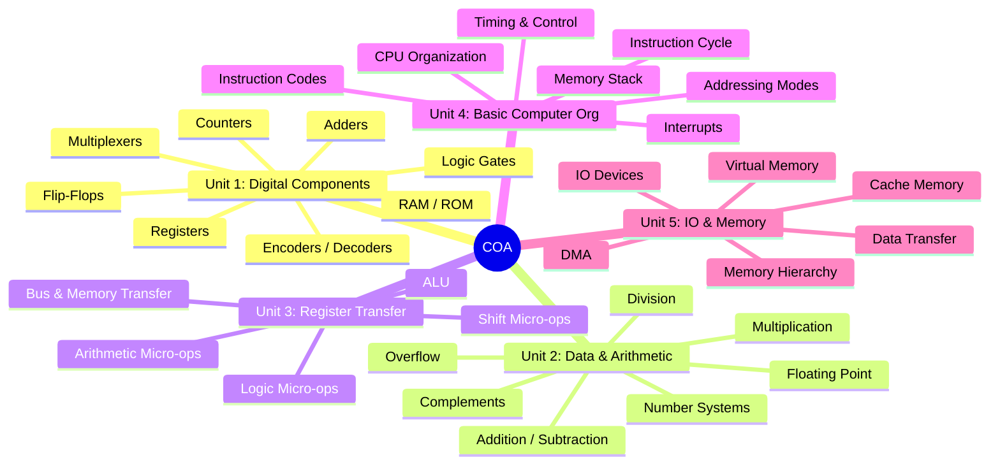
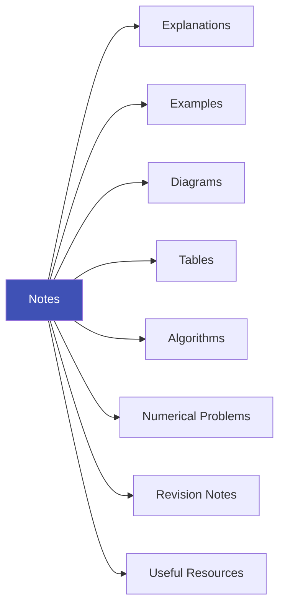
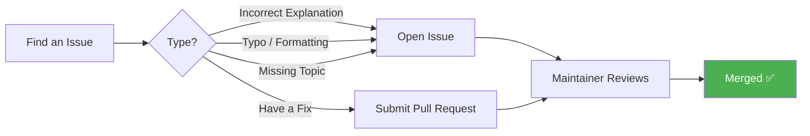

# Computer Organization and Architecture (COA)

### A visual, structured collection of notes covering digital components, computer arithmetic, CPU organization, memory, and I/O systems.

---

## About

This repository is based on my college syllabus for **Computer Organization and Architecture**, and is meant to help students build a working understanding of how a computer functions — from logic gates to virtual memory.

> **Goal:** Not just definitions — but *how the pieces fit together.*

---

## Syllabus Map

---

## 📚 Topics Covered

<table>
<tr>
<th>Unit</th>
<th>Title</th>
<th>Key Topics</th>
</tr>
<tr>
<td align="center">1️⃣</td>
<td><b>Digital Components</b></td>
<td>Logic Gates, Adders, Flip-Flops, Encoders, Decoders, Multiplexers, Registers, Shift Registers, Counters, RAM, ROM</td>
</tr>
<tr>
<td align="center">2️⃣</td>
<td><b>Data Representation & Arithmetic</b></td>
<td>Number Systems, ASCII, r's & (r-1)'s Complement, Overflow, Floating-Point, Signed-Magnitude, Multiplication & Division Algorithms</td>
</tr>
<tr>
<td align="center">3️⃣</td>
<td><b>Register Transfer & Micro-operations</b></td>
<td>Bus & Memory Transfers, Three-State Buffers, Binary Adder/Incrementer, Arithmetic Circuit, Logic & Shift Micro-ops, ALU</td>
</tr>
<tr>
<td align="center">4️⃣</td>
<td><b>Basic Computer Organization</b></td>
<td>Instruction Codes, Addressing Modes, Timing & Control, Instruction Cycle, Memory-Reference & I/O Instructions, CPU Registers, Memory Stack, Interrupts</td>
</tr>
<tr>
<td align="center">5️⃣</td>
<td><b>I/O & Memory Organization</b></td>
<td>Input Devices, Sync/Async Communication, Data Transfer Modes, DMA, Memory Hierarchy, Cache Memory, Virtual Memory</td>
</tr>
</table>

---

## 🗂️ Repository Structure

```mermaid
flowchart TD
    Root[📁 Computer-Organization-and-Architecture]

    Root --> U1[📁 Unit-1-Digital-Components]
    U1 --> U1a[Logic Gates]
    U1 --> U1b[Adders]
    U1 --> U1c[Flip-Flops]
    U1 --> U1d[Encoders-Decoders]
    U1 --> U1e[Multiplexers]
    U1 --> U1f[Registers / Counters / RAM-ROM]

    Root --> U2[📁 Unit-2-Data-Representation-Arithmetic]
    U2 --> U2a[Number Systems]
    U2 --> U2b[Complements]
    U2 --> U2c[Addition & Subtraction]
    U2 --> U2d[Overflow / Floating-Point]
    U2 --> U2e[Multiplication / Division]

    Root --> U3[📁 Unit-3-Register-Transfer-Microoperations]
    U3 --> U3a[Bus & Memory Transfers]
    U3 --> U3b[Arithmetic / Logic / Shift Micro-ops]
    U3 --> U3c[ALU]

    Root --> U4[📁 Unit-4-Basic-Computer-Organization]
    U4 --> U4a[Instruction Codes / Addressing Modes]
    U4 --> U4b[Timing & Control / Instruction Cycle]
    U4 --> U4c[CPU Organization / Memory Stack / Interrupts]

    Root --> U5[📁 Unit-5-IO-and-Memory-Organization]
    U5 --> U5a[IO Devices / Data Transfer / DMA]
    U5 --> U5b[Memory Hierarchy / Main Memory]
    U5 --> U5c[Cache Memory / Virtual Memory]

    Root --> L[📄 LICENSE]
    Root --> Rd[📄 README.md]
```

> Structure evolves as new topics, diagrams, and resources are added.

---

## Who Is This For?

| Audience | Fits If You... |
|---|---|
| Students | Are studying COA in college |
| Exam Prep | Need organized revision notes |
| Beginners | Want to understand hardware & CPU basics |
| Reference Seekers | Want structured, example-driven explanations |

---

## Content Types Included

---

## Contributing

Please keep contributions **educational, clear, accurate, and relevant** to the subject.

---

## Author

### **Mehrunnisa**
*Student exploring Computer Science, Python, AI, and Systems.*

---

## Copyright & License

| | |
|---|---|
| **Copyright** | © 2026 Mehrunnisa. All rights reserved. |
| **License** | MIT License — see [`LICENSE`](./LICENSE) |
| **Usage** | Free for personal & educational use. Redistribution/reuse of substantial content must retain original attribution. |
| **Third-Party Content** | Remains property of respective authors, under their own licenses. |

---

## ⚠️ Disclaimer

> These notes are created for **educational and study purposes**, based on my college syllabus. They are **not** a replacement for textbooks, lectures, or official course material.

---

## Support

If this repository helped you learn COA, consider giving it a **star** on GitHub!

