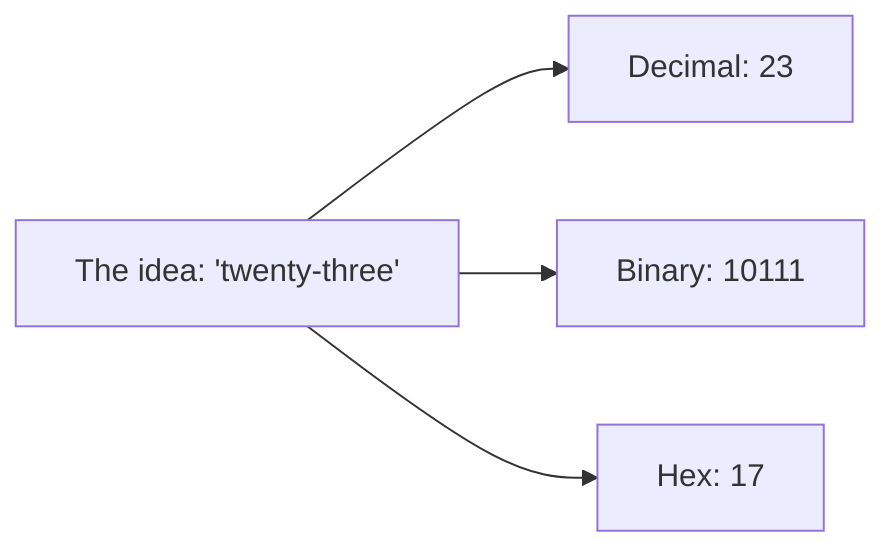
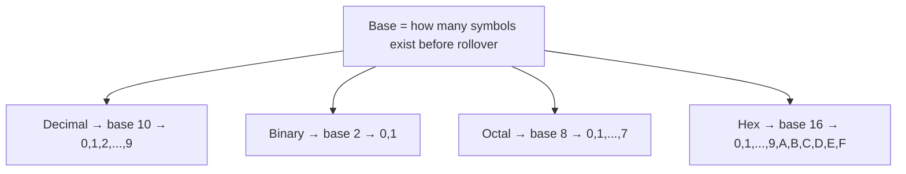
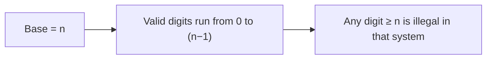
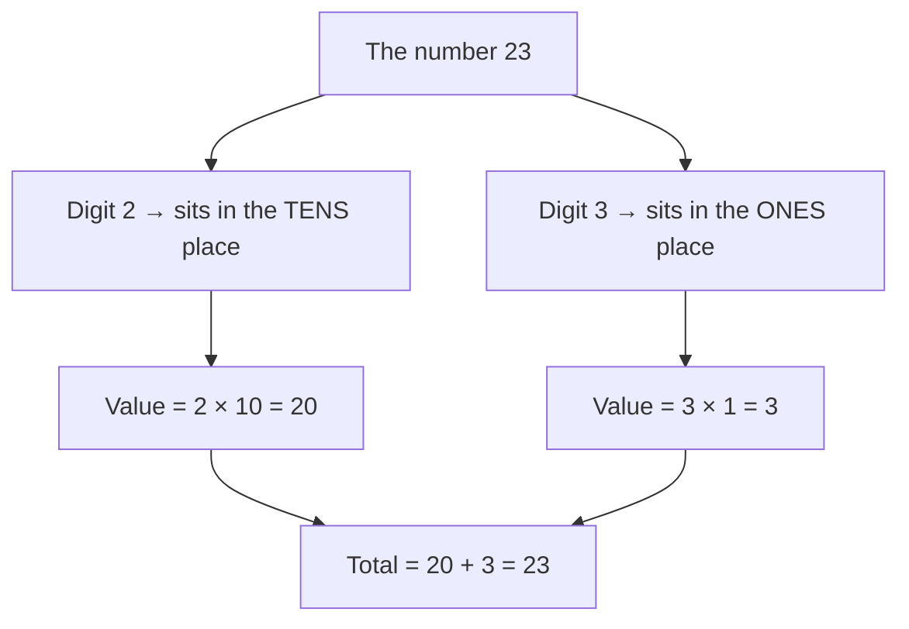
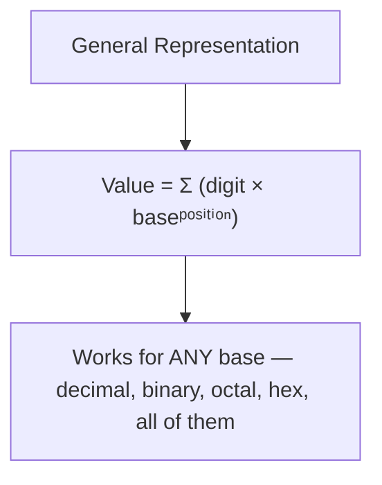
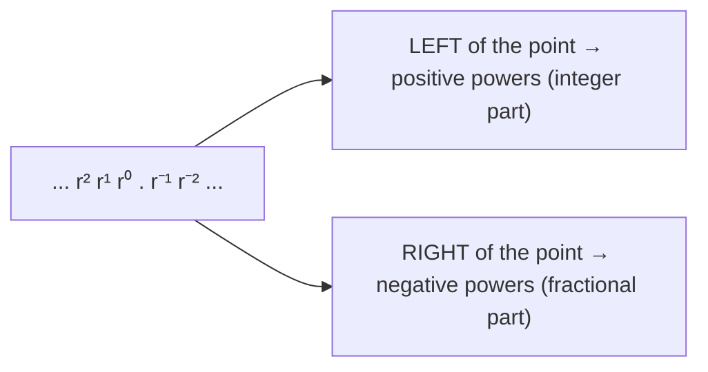
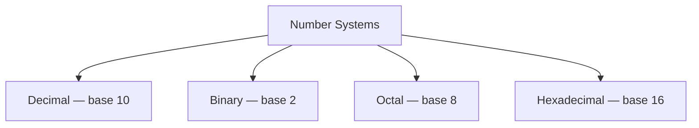
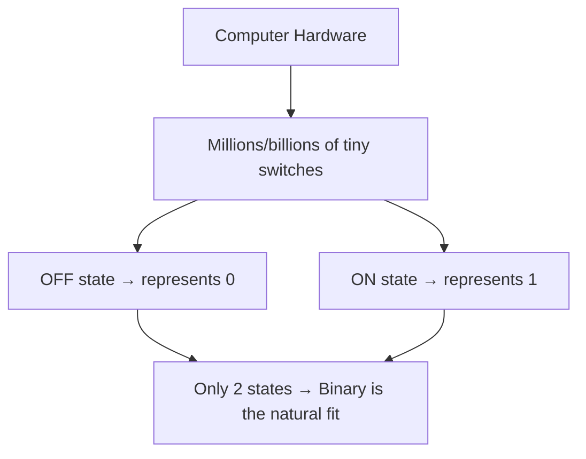
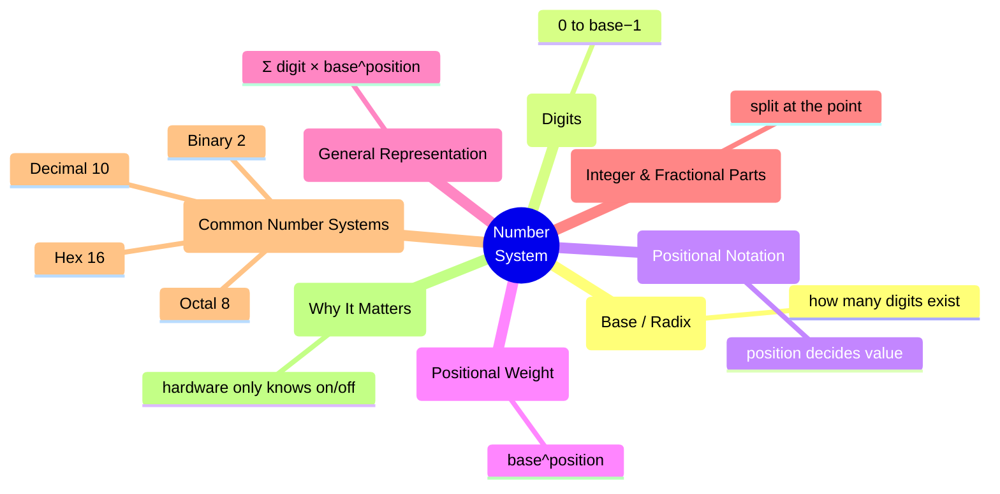

<div align="center">


</div>

### *Computer Organization and Architecture (COA) — Study Notes by Mehrunnisa*

Alright, welcome to file #1 of COA. Before we touch binary, hex, logic gates, or any of the scary-sounding stuff — we need to zoom all the way out and answer one dumb-simple question: **what even IS a number system?**

Spoiler: you already use one every single day and never think about it. Let's fix that.

---

## Table of Contents

- [1. What Actually Is a Number System?](#1-what-actually-is-a-number-system)
- [2. Base / Radix](#2-base--radix)
- [3. Digits](#3-digits)
- [4. Positional Notation & Place Value](#4-positional-notation--place-value)
- [5. Positional Weights & General Representation](#5-positional-weights--general-representation)
- [6. Integer and Fractional Representation](#6-integer-and-fractional-representation)
- [7. Common Number Systems (Quick Intro Only)](#7-common-number-systems-quick-intro-only)
- [8. Why Number Systems Matter in Computers](#8-why-number-systems-matter-in-computers)
- [9. Quick Revision](#9-quick-revision)
- [10. Mini Quiz](#10-mini-quiz)
- [11. End Concept Map](#11-end-concept-map)
- [12. What We'll Learn Next](#12-what-well-learn-next)

---

## 1. What Actually Is a Number System?

Okay, first thing first — I need to understand this without the textbook jargon.

A **number system** is just a *set of rules* for writing and representing numbers using a fixed group of symbols (digits). That's genuinely it. It's the "grammar" for how numbers get written down.

Think about it like this: you already know a number system. It's called **decimal**, and you've been using it since you learned to count on your fingers (literally — that's why it uses 10 digits, more on that later 👀).

The easiest way to think about it: a number system is just an agreed-upon *language* for numbers. Different number systems are basically different languages saying the exact same thing, just with different vocab.



Same value. Three totally different outfits. That's the whole vibe of number systems — one underlying quantity, dressed up differently depending on the system you're using.

> **The important thing here is:** a number system isn't "the numbers" — it's the *rules* for writing them. The number 23 doesn't stop existing if I switch systems; it just gets written differently.

---

## 2. Base / Radix

Now, here's the question that actually defines a number system: **how many unique symbols am I allowed to use before I have to "roll over" to the next place?**

That count is called the **base** (also called the **radix**). It's the single most important number in this whole topic, so let it sink in.

The easiest way to think about it: the base tells you *how many fingers this number system has*.

- Decimal has **10** symbols (0-9) → base 10
- Binary has **2** symbols (0-1) → base 2
- Octal has **8** symbols (0-7) → base 8
- Hexadecimal has **16** symbols (0-9, then A-F) → base 16

This basically means: once you run out of symbols, you don't invent a new one — you reset back to 0 and bump the next column over by 1. That's literally why, in decimal, after 9 comes 10 (not some new magical symbol) — you ran out of digits, so you rolled over.



Honestly, the base is the DNA of a number system. Everything else — digits, place value, all of it — is downstream of "how many symbols do we get to work with."

---

## 3. Digits

Now let's talk about the actual symbols you're allowed to use — the **digits**.

Here's the rule that ties straight back to Section 2: **a number system's valid digits always run from 0 up to (base − 1).** No more, no less.

```
Decimal (base 10)  → digits: 0,1,2,3,4,5,6,7,8,9
Binary  (base 2)   → digits: 0,1
Octal   (base 8)   → digits: 0,1,2,3,4,5,6,7
Hex     (base 16)  → digits: 0,1,2,3,4,5,6,7,8,9,A,B,C,D,E,F
```

Wait — why do hex digits go into **letters**? This basically means: once we hit base 16, we've used up all ten number symbols (0-9), but we still need 6 more unique symbols before rollover. So math just borrowed letters (A through F) to keep going. A = 10, B = 11, C = 12, D = 13, E = 14, F = 15.

> **A common mistake I can make here** is writing a digit that's too big for the base, like writing `9` in binary or `8` in octal. If a digit is ≥ the base, it's just... not valid in that system. It doesn't exist there.



---

## 4. Positional Notation & Place Value

Alright, here's where it gets actually interesting. Why does the number `23` mean "twenty-three" and not something else? Why does the *position* of a digit matter so much?

This is called **positional notation** — a fancy term for "where a digit sits changes what it's worth."

Take the number `23`. It's got two digits: `2` and `3`. But they don't mean the same thing just because they're both single digits.

```
   2         3
   │         │
   ▼         ▼
tens place  ones place
= 2×10      = 3×1
= 20        + 3
            = 23
```

**Now I can see why** this matters — if I just added the digits together without caring about position, `2 + 3 = 5`, which is obviously NOT what 23 means. The *position* of each digit gives it a multiplier, called its **place value**, and that's what actually makes the system work.



Quick analogy: think of positional notation like seating in a classroom. Sitting in the "front row" or "back row" changes your vibe/role, even if you're the exact same person. A digit's *position* changes its contribution to the total value, even if the digit itself doesn't change.

---

## 5. Positional Weights & General Representation

So we just saw that "tens place" and "ones place" are really just **powers of the base**. Let's make that official, because this is the part that actually explains *everything* about how number systems function.

Each position in a number has a **weight**, and that weight is the base raised to a power based on its position (counting from the right, starting at 0).

```
   2         3
   │         │
   ▼         ▼
 10¹        10⁰
  │          │
  ▼          ▼
 20    +     3    =   23
```

This basically means: as I move one step left, the weight of that position gets multiplied by the base again. In decimal, each step left is ×10. In binary, each step left is ×2. Same exact logic, different multiplier.

### The general formula

For ANY number system with base `r`, a number with digits `dₙ dₙ₋₁ ... d₁ d₀` is actually worth:

```
Value = dₙ×r^n + dₙ₋₁×r^(n-1) + ... + d₁×r^1 + d₀×r^0
```

Scary-looking formula, simple idea: **multiply each digit by its position's power of the base, then add everything up.**



This one formula is genuinely the entire skeleton of every number system that exists. Once this clicks, converting between systems later (which we're NOT doing yet, chill) becomes way less scary — it's all just this same formula in different costumes.

---

## 6. Integer and Fractional Representation

Numbers aren't always clean whole numbers — sometimes there's a decimal point involved, like `23.45`. Turns out, positional weights handle that too, just by continuing the *same pattern* into negative powers once you cross the point.



Example, using decimal (`base = 10`):

```
   2      3   .   4        5
   │      │       │        │
   ▼      ▼       ▼        ▼
  10¹    10⁰     10⁻¹     10⁻²
   │      │       │        │
   ▼      ▼       ▼        ▼
  20  +   3   +  0.4   +  0.05  =  23.45
```

This basically means: the **integer part** (left of the point) uses positive powers of the base, and the **fractional part** (right of the point) uses negative powers. It's the exact same weight system from Section 5 — it just keeps going in both directions from that little point in the middle.

> **The important thing here is:** we're not learning HOW to convert fractions between number systems yet (that's for later files) — just recognizing that the same positional-weight logic applies on both sides of the decimal point.

---

## 7. Common Number Systems (Quick Intro Only)

Okay, quick heads up before we start: this section is a **trailer, not the movie.** I'm just introducing you to the four main characters. Full backstories, conversions, and drama for each one gets its own dedicated file later. For now — just vibes and basics.



### 7.1 Decimal (Base 10)

The one you already know and (mostly) love. Uses digits 0-9. It's the number system humans use in everyday life, almost certainly because we've got 10 fingers to count on. Not exactly a coincidence.

It's relevant here mainly as the "home base" — the system we compare every other one against, since it's the one your brain already runs on.

### 7.2 Binary (Base 2)

Uses only **0 and 1**. This is THE number system of computers — like, the entire reason we're even studying this stuff for COA.

Why only two digits? Because deep down, computer hardware is just billions of tiny electrical switches that are either **off (0)** or **on (1)**. There's no "half on" setting in digital electronics (analog stuff aside) — so binary maps perfectly onto how hardware actually behaves.

### 7.3 Octal (Base 8)

Uses digits 0-7. Historically used as a shorthand for binary, back when writing out long strings of 1s and 0s got exhausting for early programmers (fair honestly). Each octal digit conveniently represents exactly 3 binary digits — but we're not proving that yet, just noting it exists.

### 7.4 Hexadecimal (Base 16)

Uses 0-9 and then A-F for the extra 6 symbols. Also a shorthand for binary, but an even more popular one today — you'll see hex constantly in memory addresses, color codes, and low-level programming. Each hex digit represents exactly 4 binary digits — again, not proving it yet, just flagging it.

> We are going to study **each of these four number systems separately and in serious detail** in their own upcoming files — their digits, their patterns, conversions, arithmetic, all of it. This section was just so you're not meeting them as total strangers later.

---

## 8. Why Number Systems Matter in Computers

Real talk: why are we even doing this? Why can't computers just... use decimal, like the rest of us?

Because computers don't "think" — they're built out of physical circuits that can only reliably detect two clean states: **electricity flowing (1)** or **not flowing (0)**. Trying to build reliable hardware that detects 10 different voltage levels (for decimal) would be a nightmare — way more room for error, way more complex circuitry.



This is genuinely the WHOLE reason Computer Organization and Architecture even cares about number systems. Every single thing a computer does — running an app, playing a video, this markdown file existing — eventually boils down to patterns of 1s and 0s at the hardware level.

But binary gets long and annoying to read/write for humans (imagine writing out 32-bit binary numbers by hand — no thanks 😭). That's exactly why **octal and hex exist** — they're human-friendlier shorthand notations that still map cleanly back to binary, so programmers and engineers don't lose their minds reading raw 1s and 0s all day.

So in short:

- **Binary** → what the hardware actually understands
- **Hex/Octal** → human-friendly shortcuts for binary
- **Decimal** → what our brains naturally understand

Number systems are the translation layer between "how humans think about numbers" and "how machines physically store and process them." That's the entire plot of COA in one sentence, honestly.

---

## 9. Quick Revision

| Term | Meaning |
|---|---|
| Number System | A set of rules for writing numbers using a fixed set of digits |
| Base / Radix | How many unique digits exist before rollover |
| Digits | Valid symbols in a system, ranging from 0 to (base − 1) |
| Positional Notation | The idea that a digit's position determines its value |
| Place Value | The value contributed by a digit based on where it sits |
| Positional Weight | base raised to a power, based on position |
| General Formula | Value = Σ (digit × baseᵖᵒˢⁱᵗⁱᵒⁿ) |
| Integer part | uses positive powers of the base (left of the point) |
| Fractional part | uses negative powers of the base (right of the point) |

| System | Base | Digits Used |
|---|---|---|
| Decimal | 10 | 0–9 |
| Binary | 2 | 0–1 |
| Octal | 8 | 0–7 |
| Hexadecimal | 16 | 0–9, A–F |

**Memory trick:**
- Base = how many symbols exist before you roll over
- Digits always run 0 to (base − 1), no exceptions
- Position → power of the base → that's the whole system
- Binary exists because hardware only has 2 states: on/off
- Hex & octal exist so humans don't lose their sanity reading binary

---

## 10. Mini Quiz

Try these before checking the answers below — no cheating, I'll know 👀

1. What's the base of a number system that uses digits 0-7?
2. In the number `456`, what's the place value of the digit `5`?
3. True or false: hexadecimal digits can go higher than F.
4. Why does binary only use 0 and 1?
5. What's the positional weight of the 3rd digit from the right (starting count at 0) in a base-10 number?
6. In `12.34`, which part uses negative powers of the base — `12` or `.34`?
7. Name the 4 number systems we'll study in detail in upcoming files.
8. What's the general formula for representing a number in any base `r`?

<details>
<summary>Click to check answers</summary>

1. Base 8 (Octal) — digits 0-7 means 8 total symbols
2. `5` is in the tens place → place value = 5 × 10 = 50
3. False — hex only goes up to F (which equals 15); there's nothing higher in a single digit
4. Because computer hardware only reliably has two physical states: on (1) and off (0)
5. 10² (i.e., hundreds place)
6. `.34` — the fractional part uses negative powers
7. Decimal, Binary, Octal, Hexadecimal
8. Value = dₙ×r^n + dₙ₋₁×r^(n-1) + ... + d₁×r¹ + d₀×r⁰

</details>

---

## 11. End Concept Map



That's the full picture — from "what even is a number system" all the way to "why computers are obsessed with binary." Nothing here was memorized for the sake of it; every rule traced back to one core idea: **position = power of the base.** Hold onto that, it's about to carry you through every number system file coming up.

---

## 12. What We'll Learn Next

This file was the trailer. Up next, we go full movie mode — each number system gets its own dedicated, detailed file:

- 📁 **Binary (Base 2)** — in depth, hardware-relevant, the real MVP of COA
- 📁 **Decimal (Base 10)** — yes, even the "obvious" one deserves a proper breakdown
- 📁 **Octal (Base 8)** — where it's used and why it still matters
- 📁 **Hexadecimal (Base 16)** — memory addresses, color codes, and more

We will **not** be jumping into conversions, Boolean algebra, logic gates, complements, signed numbers, or binary arithmetic yet — one thing at a time. Baby steps. See you in the next file. 🚀

---

<div align="center">

⋆˚꩜｡

</div>

<div align="center">


</div>

If you enjoyed these notes, you'll probably enjoy the rest too.

| Platform | Link |
|---|---|
| Instagram | @mehrunnisa.ai |
| SubStack | The Epoch |
| YouTube | @mehrunnisa.ai |


**Usage Terms**
These notes are free to use for personal learning, revision, and study. Please do not:
- Sell or redistribute for profit.
- Claim them as your own work.
- Modify and republish without permission.
- Use for any unethical or unauthorized purpose.

Thank you for respecting the effort behind these notes. Happy learning. ♡

</div>
