# Binary Number System 
### *Computer Organization and Architecture (COA) — Study Notes by Mehrunnisa*

Alright, file #2. Last time we met the whole squad of number systems as strangers. Now it's time to properly sit down with the main character of COA — **binary**. Everything your computer has ever done, is doing right now, or will ever do, traces back to this system. No pressure or anything.

---

## Table of Contents

- [1. Binary Digits: 0 and 1](#1-binary-digits-0-and-1)
- [2. Base-2 Number System](#2-base-2-number-system)
- [3. Binary Place Values](#3-binary-place-values)
- [4. Binary Representation of Numbers](#4-binary-representation-of-numbers)
- [5. Binary to Decimal Conversion](#5-binary-to-decimal-conversion)
- [6. Binary to Octal Conversion](#6-binary-to-octal-conversion)
- [7. Binary to Hexadecimal Conversion](#7-binary-to-hexadecimal-conversion)
- [8. Binary Addition](#8-binary-addition)
- [9. Binary Subtraction](#9-binary-subtraction)
- [10. Binary Multiplication](#10-binary-multiplication)
- [11. Binary Division](#11-binary-division)
- [12. Binary Fractions](#12-binary-fractions)
- [13. Binary Fraction to Decimal Conversion](#13-binary-fraction-to-decimal-conversion)
- [14. Binary Fraction to Octal Conversion](#14-binary-fraction-to-octal-conversion)
- [15. Binary Fraction to Hexadecimal Conversion](#15-binary-fraction-to-hexadecimal-conversion)
- [16. Uses of Binary Number System in Computers](#16-uses-of-binary-number-system-in-computers)
- [17. Common Mistakes](#17-common-mistakes)
- [18. Quick Revision](#18-quick-revision)
- [19. Mini Quiz](#19-mini-quiz)
- [20. End Concept Map](#20-end-concept-map)

---

## 1. Binary Digits: 0 and 1

First things first — binary keeps it minimal. Only **two** symbols exist in this system: `0` and `1`. That's the entire alphabet. No 2, no 7, nothing else. Just these two.

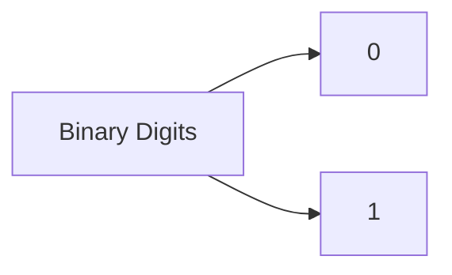

These two symbols are called **bits** (short for "binary digit" — bi-nary digit → bit, someone clearly wanted a cute nickname). Every single value in binary, no matter how huge, is built out of nothing but a sequence of these two characters.

This basically means: binary isn't "simplified" decimal or some dumbed-down version of numbers — it's a complete, fully functional number system that just chose to run on the smallest possible digit set. Two options is literally the minimum you need before a number system stops being useful (one digit alone can't represent change).

---

## 2. Base-2 Number System

Remember from file #1: the base tells you how many unique digits exist before rollover. Binary only has 2 digits (`0` and `1`), so its base is **2**.

```
Binary = Base 2
```

This means every position in a binary number represents a **power of 2**, instead of a power of 10 like decimal. That's really the entire "personality" of binary — same positional rules from file #1, just with the multiplier swapped from 10 to 2.

> **The important thing here is:** rollover happens super fast in binary. In decimal, you count 0 through 9 before rolling over. In binary, you count `0`, then `1`... and boom, you're already out of digits. Next number has to roll over: `10` (which is "two," not "ten" — more on that trap in Section 17).

---

## 3. Binary Place Values

Since binary is base 2, each position (starting from the rightmost digit, position 0) carries a weight of `2^position`.

```
Position:   ...  2⁵   2⁴   2³   2²   2¹   2⁰
Value:      ...   32   16    8    4    2    1
```

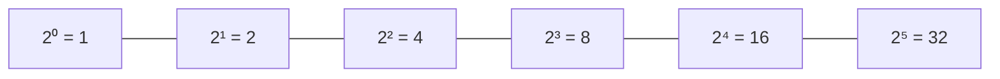

The easiest way to think about this: every step you move left, the place value **doubles**. That's it. 1, 2, 4, 8, 16, 32... a nice, predictable doubling pattern, forever.

Memorizing at least the first 8 of these (1, 2, 4, 8, 16, 32, 64, 128) will genuinely save your life later when doing conversions by hand.

---

## 4. Binary Representation of Numbers

Now let's actually read and write full binary numbers using these place values.

Take the binary number `1011`. Each digit sits in a specific position, and I multiply it by that position's weight:

```
     1        0        1        1
     │        │        │        │
     ▼        ▼        ▼        ▼
    2³       2²       2¹       2⁰
     │        │        │        │
     ▼        ▼        ▼        ▼
     8    +   0    +   2    +   1   =   11
```

So `1011` in binary represents the value **11** (in decimal terms). This basically means reading binary isn't magic — it's the exact same "digit × positional weight, then add" formula from file #1, just running on powers of 2 instead of 10.

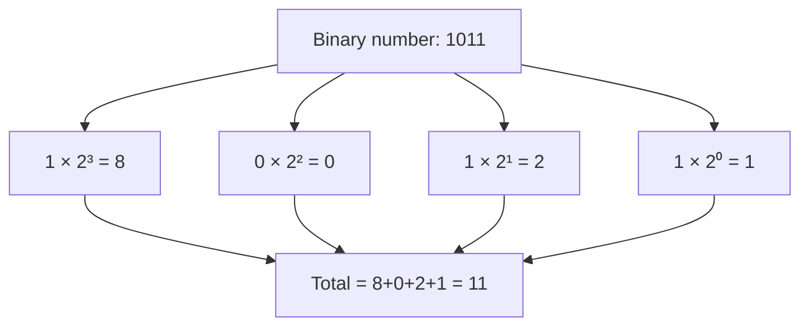

> **A common mistake I can make here** is reading `1011` and thinking "one thousand eleven" out of habit. In binary, we read digit-by-digit: "one-zero-one-one," never as a whole decimal-style number. Say it wrong and someone in your COA class WILL judge you.

---

## 5. Binary to Decimal Conversion

We basically already did this in Section 4 — converting binary to decimal is just applying the general representation formula and adding up the results.

**Method:** multiply each bit by its positional weight (`2^position`), then sum everything.

### Example: Convert `1101` to decimal

```
   1      1      0      1
   │      │      │      │
   ▼      ▼      ▼      ▼
  2³     2²     2¹     2⁰
   │      │      │      │
   ▼      ▼      ▼      ▼
   8   +  4   +  0   +  1   =   13
```

```
1101 (binary) = 13 (decimal)
```

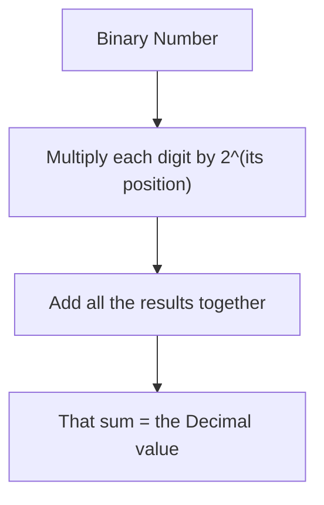

### One more: Convert `100000` to decimal

```
1 × 2⁵ = 32
0 × 2⁴ = 0
0 × 2³ = 0
0 × 2² = 0
0 × 2¹ = 0
0 × 2⁰ = 0
─────────────
Total = 32
```

Neat pattern to notice: any binary number that's a single `1` followed by all zeros is just `2^(number of zeros)`.

---

## 6. Binary to Octal Conversion

Remember from file #1 how I mentioned octal digits secretly represent exactly **3 binary digits** each? Time to actually use that.

**Method:** starting from the right (the decimal point, if there is one — covered later), split the binary number into **groups of 3 bits**. Convert each group to its decimal equivalent — that decimal value IS the octal digit.

### Example: Convert `101110` to octal

Split into groups of 3, from the right:

```
101   110
```

Convert each group separately using Section 5's method:

```
101 → 1×4 + 0×2 + 1×1 = 5
110 → 1×4 + 1×2 + 0×1 = 6
```

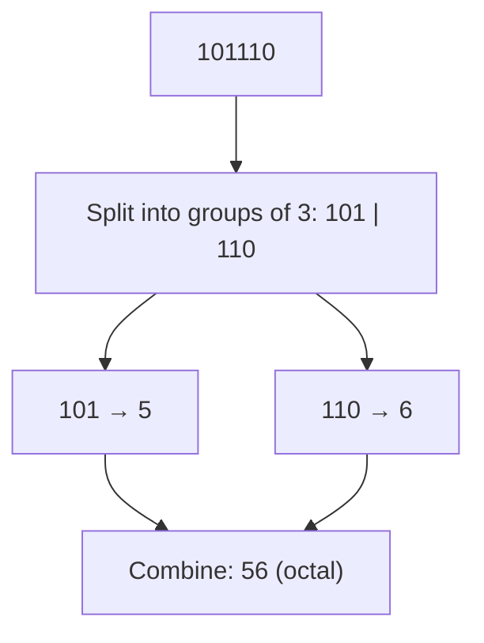

```
101110 (binary) = 56 (octal)
```

> **The important thing here is:** if the leftmost group doesn't have a full 3 digits, just pad it with extra zeros on the LEFT (they don't change the value). Example: `10` becomes `010` before grouping.

---

## 7. Binary to Hexadecimal Conversion

Same exact logic as octal, but hex digits represent exactly **4 binary digits** each (since 2⁴ = 16, which matches hex's base perfectly).

**Method:** split the binary number into groups of **4 bits** from the right, convert each group individually, using letters A-F for values 10-15.

### Example: Convert `10111010` to hexadecimal

Split into groups of 4:

```
1011   1010
```

Convert each group:

```
1011 → 8+0+2+1 = 11 → B
1010 → 8+0+2+0 = 10 → A
```

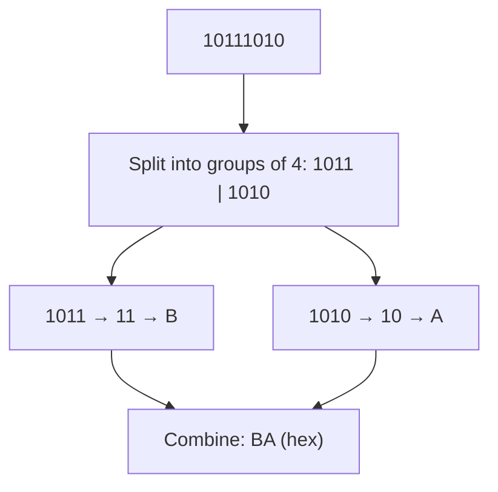

```
10111010 (binary) = BA (hex)
```

This is EXACTLY why hex is everywhere in programming — one hex digit cleanly represents 4 bits, so a full byte (8 bits) fits perfectly into just 2 hex digits. Way easier on the eyes than staring at 8 raw 1s and 0s.

---

## 8. Binary Addition

Binary addition works exactly like the addition you already know — just with only 2 digits to work with, so carrying happens way more often.

There are only 4 possible cases:

```
0 + 0 = 0
0 + 1 = 1
1 + 0 = 1
1 + 1 = 10   (that's "0, carry 1" — because 1+1=2, and 2 in binary is "10")
```

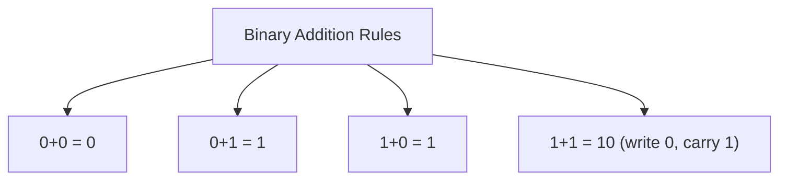

### Example: `1011 + 1101`

```
    1 1 1     ← carries
    1 0 1 1
  + 1 1 0 1
  ─────────
  1 1 0 0 0
```

Walking through it column by column, right to left:
- `1+1 = 10` → write 0, carry 1
- `1+0+1(carry) = 10` → write 0, carry 1
- `0+1+1(carry) = 10` → write 0, carry 1
- `1+1+1(carry) = 11` → write 1, carry 1 → bring down the final carry

```
1011 + 1101 = 11000
```

Sanity check using Section 5: `1011 = 11`, `1101 = 13`, and `11+13 = 24`. Convert `11000` to decimal: `16+8 = 24` ✅ Matches!

---

## 9. Binary Subtraction

Same energy, but now we borrow instead of carry — same as decimal subtraction, when a digit isn't big enough to subtract from.

```
0 - 0 = 0
1 - 0 = 1
1 - 1 = 0
0 - 1 = 1  (borrow 1 from the next column)
```

### Example: `1101 - 0110`

```
    0 10  10        ← borrows happening
    1  1   0  1
  - 0  1   1  0
  ────────────
    0  1   1  1
```

Column by column, right to left:
- `1 - 0 = 1`
- `0 - 1` → can't do it, borrow from next column → becomes `10 - 1 = 1`
- `0(after lending) - 1` → borrow again → `10 - 1 = 1`
- `0(after lending) - 0 = 0`

```
1101 - 0110 = 0111
```

Sanity check: `1101 = 13`, `0110 = 6`, `13-6 = 7`. Convert `0111` to decimal: `4+2+1 = 7` ✅

> **A common mistake I can make here** is forgetting that borrowing in binary gives you `2` (not `10` like in decimal), since a borrowed 1 from the next column is worth 2 in the column you borrowed it into.

---

## 10. Binary Multiplication

Good news — binary multiplication is honestly EASIER than decimal multiplication, because you're only ever multiplying by 0 or 1.

```
0 × 0 = 0
0 × 1 = 0
1 × 0 = 0
1 × 1 = 1
```

Multiplying by `0` = write all zeros. Multiplying by `1` = just copy the number down. That's genuinely the whole trick.

### Example: `101 × 11`

```
      1 0 1
    ×   1 1
    ───────
      1 0 1     ← 101 × 1
    1 0 1       ← 101 × 1, shifted one place left
    ───────
    1 1 1 1
```

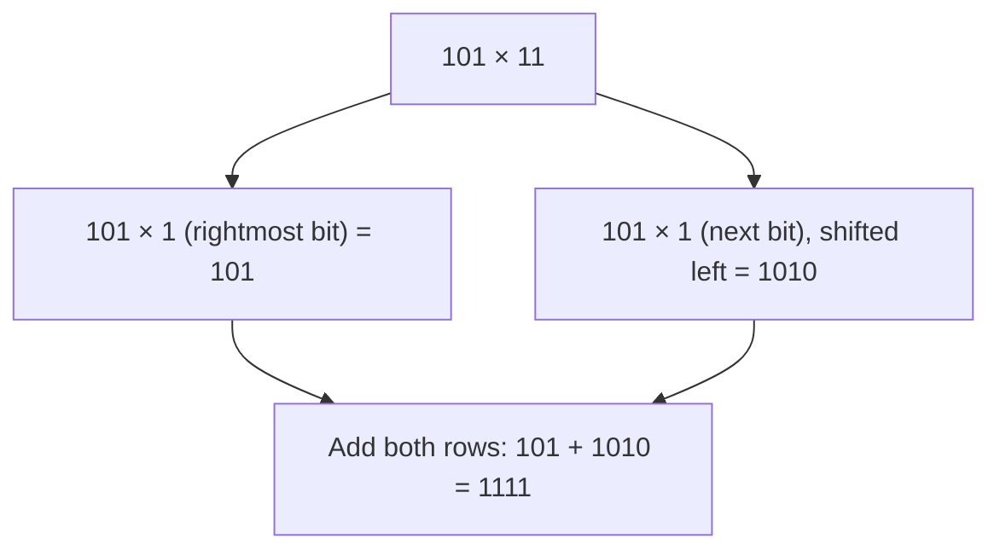

```
101 × 11 = 1111
```

Sanity check: `101 = 5`, `11 = 3`, `5×3 = 15`. Convert `1111`: `8+4+2+1 = 15` ✅

---

## 11. Binary Division

Binary division works just like decimal long division — repeatedly check if the divisor "fits," subtract, bring down the next bit, repeat. Except again, since we're only working with 0s and 1s, the "does it fit" question always has a boring yes/no answer, which honestly makes it less painful than decimal long division.

### Example: `1010 ÷ 10` (that's 10 ÷ 2 in decimal terms)

```
        101
      ┌──────
  10  │ 1010
      - 10
      ────
        10
      -  10
      ────
         0
```

Step by step:
- Does `10` (divisor) fit into the first bit `1`? No → bring down next bit → `10`
- Does `10` fit into `10`? Yes → write `1`, subtract → remainder `0`
- Bring down next bit `1` → `01`. Does `10` fit? No → write `0`
- Bring down next bit `0` → `10`. Does `10` fit? Yes → write `1`, subtract → remainder `0`

```
1010 ÷ 10 = 101
```

Sanity check: `1010 = 10`, `10 = 2`, `10÷2 = 5`. Convert `101`: `4+0+1 = 5` ✅

---

## 12. Binary Fractions

Just like in file #1, once we cross a "binary point" (same idea as a decimal point, just for base 2), the digits to the right represent **negative powers of 2**.

```
Position:  2²   2¹   2⁰  .  2⁻¹   2⁻²   2⁻³
Value:      4    2    1  .  0.5  0.25  0.125
```

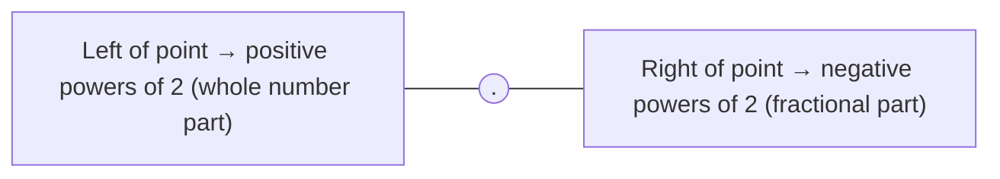

Example: `101.11`

```
   1     0    1  .  1     1
   │     │    │     │     │
   ▼     ▼    ▼     ▼     ▼
  2²    2¹   2⁰   2⁻¹   2⁻²
   │     │    │     │     │
   ▼     ▼    ▼     ▼     ▼
   4  +  0  +  1  + 0.5 + 0.25  =  5.75
```

```
101.11 (binary) = 5.75 (decimal)
```

---

## 13. Binary Fraction to Decimal Conversion

We basically just did this above, but let's make the method official.

**Method:** convert the integer part like normal (Section 5), convert the fractional part using negative powers of 2, then add the two results together.

### Example: Convert `1101.101` to decimal

**Integer part `1101`:**
```
8 + 4 + 0 + 1 = 13
```

**Fractional part `.101`:**
```
1×2⁻¹ + 0×2⁻² + 1×2⁻³
= 0.5 + 0 + 0.125
= 0.625
```

**Combine:**
```
13 + 0.625 = 13.625
```

```
1101.101 (binary) = 13.625 (decimal)
```

---

## 14. Binary Fraction to Octal Conversion

**Method:** group into 3s from the **binary point in both directions** — pad the integer part with zeros on the left if needed, and pad the fractional part with zeros on the **right** if needed. Then convert each group like Section 6.

### Example: Convert `10.011` to octal

Group in 3s from the point, going outward both ways:

```
010 . 011
```

(padded the integer part with a leading zero to make a full group of 3)

Convert each group:

```
010 → 2
011 → 3
```

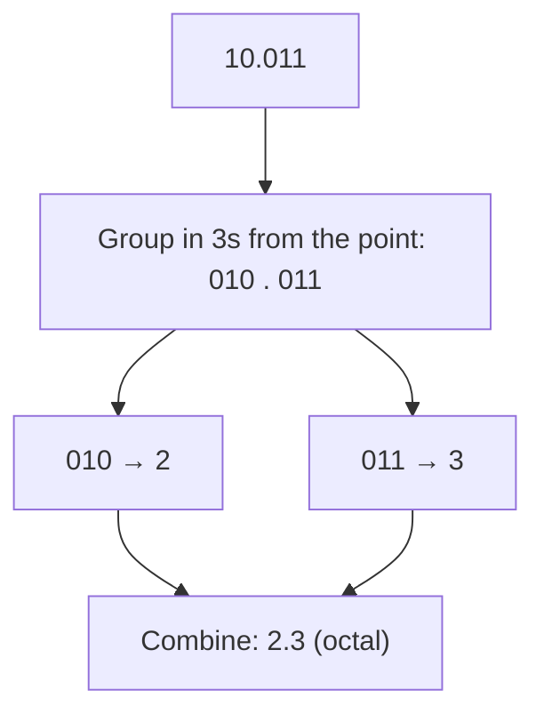

```
10.011 (binary) = 2.3 (octal)
```

---

## 15. Binary Fraction to Hexadecimal Conversion

Exact same idea, but grouping in **4s** from the point (since hex digits = 4 bits each).

### Example: Convert `1010.0110` to hexadecimal

Group in 4s from the point:

```
1010 . 0110
```

Convert each group:

```
1010 → 8+0+2+0 = 10 → A
0110 → 0+4+2+0 = 6  → 6
```

```
1010.0110 (binary) = A.6 (hex)
```

> **A common mistake I can make here** is padding zeros on the wrong side. For the **integer part**, pad on the LEFT (since leading zeros don't change a whole number's value). For the **fractional part**, pad on the RIGHT (since trailing zeros after a decimal point don't change a fraction's value either) — but padding on the wrong side WILL mess up your answer.

---

## 16. Uses of Binary Number System in Computers

Okay, so why does ALL of this actually matter? Let's zoom out. Binary isn't just "a number system we're forced to learn" — it's the literal foundation everything in computing sits on.

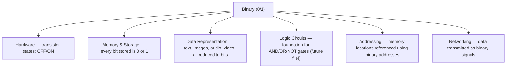

A few real-world spots you'll bump into binary constantly:

- **Transistors** — the tiny switches inside every chip only have two reliable states (current flowing / not flowing), which maps perfectly onto 1 and 0.
- **Memory (RAM, storage)** — every single file, photo, and app you've ever used is, underneath it all, just a massive sequence of bits.
- **Character encoding** — even the letters you're reading right now get stored as binary codes behind the scenes (there's a whole system for that, not today's topic though).
- **Networking** — data sent over the internet ultimately travels as binary signals.
- **CPU operations** — every calculation your processor runs is binary arithmetic under the hood (yes, literally the addition/subtraction/multiplication/division we just did above, just happening billions of times per second).

This basically means binary isn't some optional "extra" topic in COA — it's the actual substrate everything else in this subject gets built on top of. Every future file in this repo is, in some way, going to lean back on what you just learned here.

---

## 17. Common Mistakes

- ❌ Reading `10` in binary as "ten" → ✅ it's "one-zero," and its actual value is 2
- ❌ Writing a digit like `2` or `5` in a binary number → ✅ only `0` and `1` are valid; anything else doesn't belong in binary
- ❌ Forgetting to carry during addition when `1+1` happens → ✅ `1+1 = 10`, always write 0 and carry the 1
- ❌ Padding fractional zeros on the wrong side during octal/hex conversion → ✅ integer part pads LEFT, fractional part pads RIGHT
- ❌ Grouping bits in the wrong size for the target base → ✅ groups of 3 for octal, groups of 4 for hex
- ❌ Thinking binary subtraction "borrows 10" like decimal → ✅ it borrows 2, since each binary place is worth double the next

---

## 18. Quick Revision

| Concept | Rule |
|---|---|
| Digits | Only 0 and 1 |
| Base | 2 |
| Place values | ...,32,16,8,4,2,1 (doubling each step left) |
| Fractional place values | 0.5, 0.25, 0.125... (halving each step right) |
| Binary → Decimal | Multiply each bit by 2^position, sum it all |
| Binary → Octal | Group bits in 3s from the point, convert each group |
| Binary → Hex | Group bits in 4s from the point, convert each group |
| Addition carry | 1+1 = 10 (write 0, carry 1) |
| Subtraction borrow | borrowed 1 is worth 2 in binary |
| Multiplication | only ×0 or ×1 — no complex tables needed |
| Division | same long-division process as decimal |

**Memory trick:**
- Binary = only 0s and 1s, base 2
- Groups of **3** → Octal | Groups of **4** → Hex
- Pad integer part on the LEFT, fractional part on the RIGHT
- 1+1 always creates a carry — binary "runs out of room" fast
- Binary is the language of hardware — everything else is just a human-friendly translation of it

---

## 19. Mini Quiz

Try these before checking the answers below — no peeking! 👀

1. Convert `1110` to decimal.
2. Convert `1001` to octal.
3. Convert `11110000` to hexadecimal.
4. `1010 + 0101 = ?`
5. `1111 - 0011 = ?`
6. `110 × 10 = ?`
7. `1100 ÷ 100 = ?`
8. Convert `11.01` to decimal.
9. Convert `101.11` to octal.
10. Why does binary use only 0 and 1 in computer hardware?

<details>
<summary>Click to check answers</summary>

1. `1110 = 8+4+2+0 = 14`
2. `1001 → 001,001 → 1,1 → 11` (octal)
3. `11110000 → 1111,0000 → F,0 → F0` (hex)
4. `1010 + 0101 = 1111`
5. `1111 - 0011 = 1100`
6. `110 × 10 = 1100`
7. `1100 ÷ 100 = 11`
8. `11.01 = 2+1+0+0.25 = 3.25`
9. `101.11 → group in 3s: 101 . 110 → 5.6` (octal, note the padded trailing zero)
10. Because hardware transistors only reliably represent two physical states: current flowing (1) or not flowing (0)

</details>

---

## 20. End Concept Map

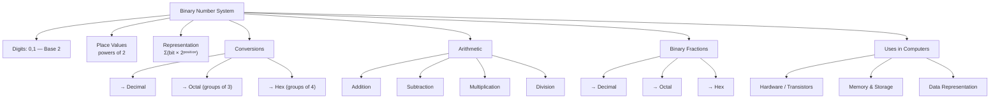

That's the full binary picture — from "just two digits" to full arithmetic, fractions, and conversions across every major number system. Every single rule here comes back to one thing: **powers of 2, doubling each step.** Hold onto that pattern — Decimal, Octal, and Hex are all coming up next, and they'll each get the same deep-dive treatment.

---

<div align="center">

⋆˚꩜｡

</div>

<div align="center">


</div>

If you enjoyed these notes, you'll probably enjoy the rest too.

| Platform | Link |
|---|---|
| Instagram | @mehrunnisa.ai |
| SubStack | The Epoch |
| YouTube | @mehrunnisa.ai |


**Usage Terms**
These notes are free to use for personal learning, revision, and study. Please do not:
- Sell or redistribute for profit.
- Claim them as your own work.
- Modify and republish without permission.
- Use for any unethical or unauthorized purpose.

Thank you for respecting the effort behind these notes. Happy learning. ♡

</div>
