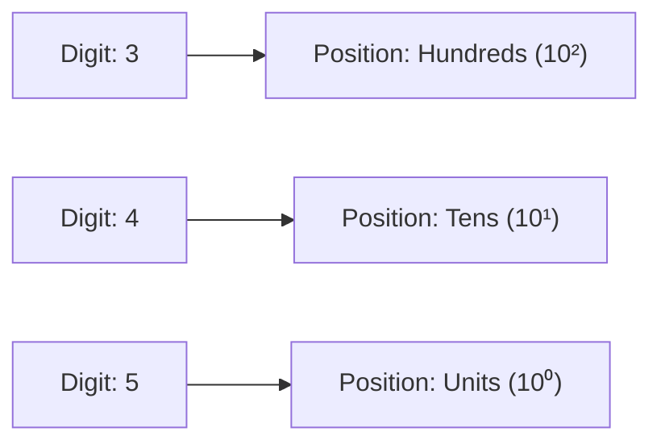
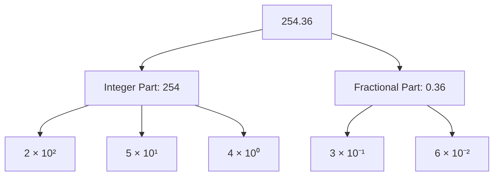
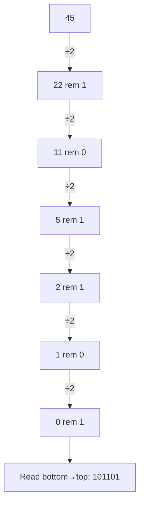
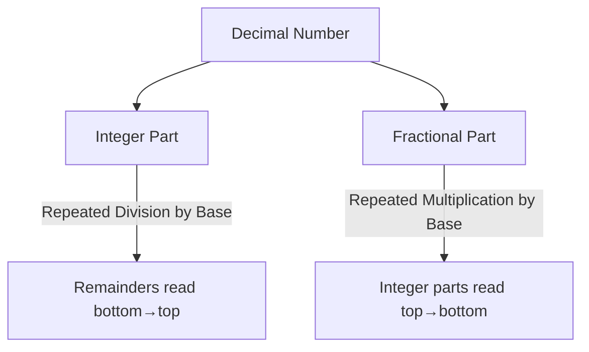
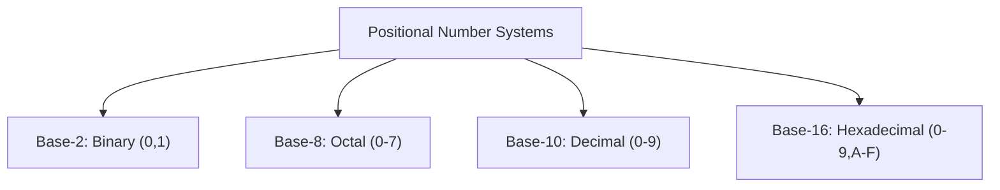
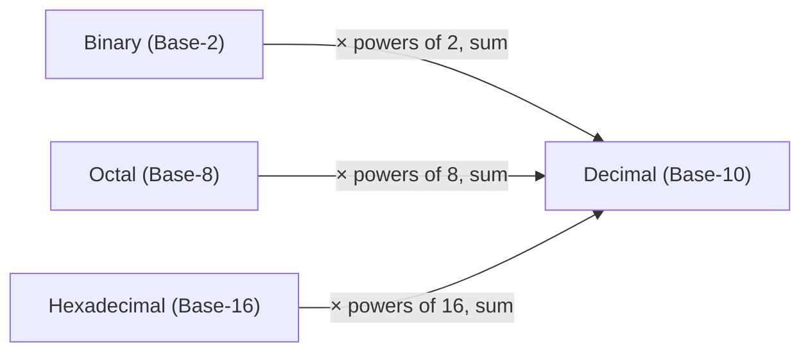

# Decimal Number System

⋆˚꩜｡ *Please Give a Star*

---

## Table of Contents

1. [Introduction to Decimal Number System](#1-introduction-to-decimal-number-system)
2. [Place Value & Powers of 10](#2-place-value--powers-of-10)
3. [Decimal Number System in Computer Science](#3-decimal-number-system-in-computer-science)
4. [Decimal → Binary](#4-decimal--binary)
5. [Decimal → Octal](#5-decimal--octal)
6. [Decimal → Hexadecimal](#6-decimal--hexadecimal)
7. [Decimal Number Representation](#7-decimal-number-representation)
8. [Positional Number System & Base](#8-positional-number-system--base)
9. [Reverse Conversions](#9-reverse-conversions)
10. [Exam Preparation](#10-exam-preparation)
11. [Final Concept Map](#11-final-concept-map)

---

## 1. Introduction to Decimal Number System

### Definition

> The **Decimal Number System** is a **positional number system with base (radix) 10**, using **ten digits (0–9)** to represent any numeric value. It is the number system humans use in everyday life.

### Base-10

* "Base 10" means there are **10 unique symbols** available at each position, and every position's value is a **power of 10**.
* The name "decimal" comes from the Latin *decem*, meaning "ten."

### Digits 0–9

* The decimal system uses exactly **ten digits**:

```text
0   1   2   3   4   5   6   7   8   9
```

* No single digit can represent a value of 10 or more — larger values require **multiple digit positions** working together.

### Positional Notation

* In a positional (place-value) system, the **value of a digit depends on its position** within the number, not just the digit itself.
* Example: In `345`, the digit `3` doesn't just mean "three" — it means **three hundreds** because of its position.



⋆.˚ **Key Point:** Positional notation is what makes it possible to represent **infinitely large numbers** using only ten symbols — by combining digits across positions.

---

## 2. Place Value & Powers of 10

### Concept

Every digit in a decimal number has a **place value** determined by its distance from the decimal point, expressed as a **power of 10**.

### Integer Part

* Positions to the **left** of the decimal point represent **increasing positive powers of 10**, starting from `10⁰` at the rightmost integer digit.

```text
   Number:        4     5     3     2
   Position:     10³   10²   10¹   10⁰
   Value:       Thousands Hundreds Tens Units
```

* Example: `4532`
  * = 4×10³ + 5×10² + 3×10¹ + 2×10⁰
  * = 4000 + 500 + 30 + 2
  * = 4532

### Fractional Part

* Positions to the **right** of the decimal point represent **increasing negative powers of 10**, starting from `10⁻¹`.

```text
   Number:            .    7      2     5
   Position:               10⁻¹  10⁻²  10⁻³
   Value:              Tenths Hundredths Thousandths
```

* Example: `0.725`
  * = 7×10⁻¹ + 2×10⁻² + 5×10⁻³
  * = 0.7 + 0.02 + 0.005
  * = 0.725

### Complete Example: `254.36`

```text
2×10² + 5×10¹ + 4×10⁰ + 3×10⁻¹ + 6×10⁻²
=  200 +   50 +    4  +   0.3  +  0.06
=  254.36
```



---

## 3. Decimal Number System in Computer Science

### Human-Readable Representation

* Decimal is the number system **humans naturally understand and use** — it's how we read prices, dates, measurements, and quantities.
* All user-facing numeric displays (bank balances, scores, calculators) are shown in decimal for this reason.

### Computer Representation

* Internally, **computers do not use the decimal system** to store or process data.
* Computer hardware is built from **binary (base-2)** electronic components — circuits that are naturally either **ON (1) or OFF (0)**.
* All data — numbers, text, images — is ultimately stored and processed as **binary digits (bits)**.

### Need for Number-System Conversion

* Since humans think in **decimal** but computers operate in **binary** (and related systems like octal and hexadecimal are used for convenience), **conversion between number systems** is essential.


* **Octal (base-8)** and **Hexadecimal (base-16)** are commonly used as **shorthand representations of binary**, since they group binary digits neatly (3 bits per octal digit, 4 bits per hex digit) and are easier for humans to read than long binary strings.

⋆˚꩜｡ *This is exactly why the upcoming conversion sections matter — converting decimal to binary/octal/hexadecimal is not just a math exercise, it reflects how computers actually represent the numbers we type in.*

---

## 4. Decimal → Binary

### Integer Conversion

**Method: Division by 2 (Double Dabble / Repeated Division)**

* Divide the decimal number **repeatedly by 2**, recording the **remainder** at each step, until the quotient becomes 0.
* Read the remainders **from bottom to top** to get the binary equivalent.

**Example: Convert 45 to Binary**

```text
45 ÷ 2 = 22   remainder 1
22 ÷ 2 = 11   remainder 0
11 ÷ 2 =  5   remainder 1
 5 ÷ 2 =  2   remainder 1
 2 ÷ 2 =  1   remainder 0
 1 ÷ 2 =  0   remainder 1

Read remainders bottom to top: 1 0 1 1 0 1
```

**Result: (45)₁₀ = (101101)₂**



### Fractional Conversion

**Method: Multiplication by 2**

* Multiply the fractional part **repeatedly by 2**.
* At each step, record the **integer part** (0 or 1) generated — this becomes a binary digit.
* Discard the integer part and continue multiplying the **remaining fractional part**, until it becomes 0 or the desired precision is reached.
* Read the recorded integer parts **from top to bottom**.

**Example: Convert 0.625 to Binary**

```text
0.625 × 2 = 1.250   →  integer part: 1
0.250 × 2 = 0.500   →  integer part: 0
0.500 × 2 = 1.000   →  integer part: 1

Read top to bottom: 1 0 1
```

**Result: (0.625)₁₀ = (0.101)₂**

### Complete Example: Convert 45.625 to Binary

```text
Integer part (45)      → 101101
Fractional part (0.625) → 0.101

(45.625)₁₀ = (101101.101)₂
```

---

## 5. Decimal → Octal

### Integer Conversion

**Method: Division by 8**

* Divide the decimal number **repeatedly by 8**, recording remainders, until the quotient is 0.
* Read remainders **bottom to top**.

**Example: Convert 175 to Octal**

```text
175 ÷ 8 = 21   remainder 7
 21 ÷ 8 =  2   remainder 5
  2 ÷ 8 =  0   remainder 2

Read bottom to top: 2 5 7
```

**Result: (175)₁₀ = (257)₈**

### Fractional Conversion

**Method: Multiplication by 8**

* Multiply the fractional part **repeatedly by 8**, recording the integer part generated at each step.
* Read the integer parts **top to bottom**.

**Example: Convert 0.375 to Octal**

```text
0.375 × 8 = 3.000   →  integer part: 3

Read top to bottom: 3
```

**Result: (0.375)₁₀ = (0.3)₈**

### Complete Example: Convert 175.375 to Octal

```text
Integer part (175)       → 257
Fractional part (0.375)  → 0.3

(175.375)₁₀ = (257.3)₈
```

---

## 6. Decimal → Hexadecimal

### Integer Conversion

**Method: Division by 16**

* Divide the decimal number **repeatedly by 16**, recording remainders, until the quotient is 0.
* Since hexadecimal needs 16 symbols, remainders **10–15** are represented using letters **A–F**:

| Decimal | 10 | 11 | 12 | 13 | 14 | 15 |
|---|---|---|---|---|---|---|
| Hex | A | B | C | D | E | F |

* Read remainders **bottom to top**.

**Example: Convert 478 to Hexadecimal**

```text
478 ÷ 16 = 29   remainder 14 → E
 29 ÷ 16 =  1   remainder 13 → D
  1 ÷ 16 =  0   remainder  1 → 1

Read bottom to top: 1 D E
```

**Result: (478)₁₀ = (1DE)₁₆**

### Fractional Conversion

**Method: Multiplication by 16**

* Multiply the fractional part **repeatedly by 16**, recording the integer part (converted to a hex symbol if 10–15) at each step.
* Read the integer parts **top to bottom**.

**Example: Convert 0.5625 to Hexadecimal**

```text
0.5625 × 16 = 9.000   →  integer part: 9

Read top to bottom: 9
```

**Result: (0.5625)₁₀ = (0.9)₁₆**

### Complete Example: Convert 478.5625 to Hexadecimal

```text
Integer part (478)         → 1DE
Fractional part (0.5625)   → 0.9

(478.5625)₁₀ = (1DE.9)₁₆
```



---

## 7. Decimal Number Representation

### Signed Numbers

> **Signed numbers** are decimal numbers that can be either **positive or negative**, indicated using a **+ or − sign**.

* Example: `+45`, `−17`
* In everyday decimal use, a number **without a sign is assumed positive**.
* Signed representation is essential wherever quantities can meaningfully go below zero (temperature, bank balance, coordinates).

### Unsigned Numbers

> **Unsigned numbers** are decimal numbers that are always **assumed to be non-negative (zero or positive)** — no sign is used or needed.

* Example: `45`, `0`, `128`
* Commonly used when a negative value doesn't make logical sense — e.g., counting the number of students in a class.

### Signed vs Unsigned — Quick Comparison

| Signed Numbers | Unsigned Numbers |
|---|---|
| Can represent both positive and negative values | Can only represent zero and positive values |
| Requires a sign indicator (+/−) | No sign required |
| Example: temperature (−5°C, +30°C) | Example: age, count, quantity |

⋆.˚ *In computer systems, this distinction becomes especially important when numbers are stored in binary — signed and unsigned binary representations use different encoding schemes, which will be studied under Binary Number System.*

---

## 8. Positional Number System & Base

### Concept

> A **positional number system** is one where the value of each digit depends on both the digit itself and its **position**, with each position representing a power of the system's **base (radix)**.

* The **base** defines how many unique digit symbols the system uses at each position.

### Base-2 (Binary)

* Uses **2 digits**: 0, 1
* Positions represent powers of 2 (..., 2², 2¹, 2⁰)
* Used internally by all digital computer hardware.

### Base-8 (Octal)

* Uses **8 digits**: 0–7
* Positions represent powers of 8.
* Used as a compact shorthand for binary (groups of 3 bits).

### Base-10 (Decimal)

* Uses **10 digits**: 0–9
* Positions represent powers of 10.
* The number system used by humans in daily life.

### Base-16 (Hexadecimal)

* Uses **16 digits**: 0–9 and A–F
* Positions represent powers of 16.
* Used as a compact shorthand for binary (groups of 4 bits) — common in memory addresses, color codes, etc.

### Comparison Table

| Number System | Base | Digits Used |
|---|---|---|
| Binary | 2 | 0, 1 |
| Octal | 8 | 0–7 |
| Decimal | 10 | 0–9 |
| Hexadecimal | 16 | 0–9, A–F |



---

## 9. Reverse Conversions

*(These conversions bring numbers from other systems back into decimal — the reverse of Sections 4–6 — and are essential for verifying conversions and understanding the relationship between systems.)*

### Binary → Decimal

**Method:** Multiply each binary digit by its corresponding **power of 2** based on position, and sum the results.

**Example: Convert (101101)₂ to Decimal**

```text
1×2⁵ + 0×2⁴ + 1×2³ + 1×2² + 0×2¹ + 1×2⁰
= 32  +  0  +  8   +  4   +  0   +  1
= 45
```

**Result: (101101)₂ = (45)₁₀**

### Octal → Decimal

**Method:** Multiply each octal digit by its corresponding **power of 8** based on position, and sum the results.

**Example: Convert (257)₈ to Decimal**

```text
2×8² + 5×8¹ + 7×8⁰
= 128 +  40 +  7
= 175
```

**Result: (257)₈ = (175)₁₀**

### Hexadecimal → Decimal

**Method:** Multiply each hex digit (converting A–F to 10–15 as needed) by its corresponding **power of 16** based on position, and sum the results.

**Example: Convert (1DE)₁₆ to Decimal**

```text
1×16² + D×16¹ + E×16⁰
= 1×256 + 13×16 + 14×1
= 256 + 208 + 14
= 478
```

**Result: (1DE)₁₆ = (478)₁₀**

### Reverse Conversion Summary Diagram



⋆˚꩜｡ **Key Point:** Reverse conversion always follows the same logic — **multiply each digit by (base)^position, then add all the results together.** Only the base and digit symbols change between number systems.

---

## 10. Exam Preparation

### Important Definitions

* Decimal Number System
* Positional Notation
* Place Value
* Base / Radix
* Signed Number
* Unsigned Number

### Important Concepts

* Why decimal is base-10 and how positional notation gives digits their meaning.
* The repeated-division method for integer conversion, and repeated-multiplication method for fractional conversion.
* Why computers use binary internally despite humans using decimal.
* The relationship between binary, octal, and hexadecimal as different "shorthand" bases.
* How to reverse any conversion using powers of the base.

### Common Confusions

* **Division method vs Multiplication method** — division by the base converts the **integer part**; multiplication by the base converts the **fractional part**. Students often try to use one method for both.
* **Reading remainder order** — remainders from integer conversion are read **bottom to top**; integer parts from fractional conversion are read **top to bottom**. Mixing these up gives a wrong answer.
* **Signed vs Unsigned** — this is about whether negative values are possible, not about how large a number is.
* **Base vs Number of Digits** — the base equals the **count** of digit symbols used (e.g., base-8 uses 8 symbols: 0–7), not the highest digit value.

### Exam-Oriented Questions

**Very Short Questions**
* What is the base of the decimal number system?
* What are the digit symbols used in hexadecimal?
* Convert (10)₁₀ to binary.

**Short-Answer Questions**
* Explain positional notation with an example.
* Differentiate between signed and unsigned numbers.
* Convert (0.75)₁₀ into binary.

**Long-Answer Questions**
* Explain, with steps, how to convert a decimal number with both integer and fractional parts into binary.
* Explain the need for number system conversion in computer science.
* Convert (355.5)₁₀ into binary, octal, and hexadecimal, showing all steps.

**Conceptual Questions**
* Why do octal and hexadecimal exist if computers only use binary internally?
* Why is the multiplication method used for fractional conversion instead of division?
* Why might a fractional decimal number never convert into an exact, terminating binary fraction?

---

## 11. Final Concept Map

```mermaid
flowchart TD
    DNS["Decimal Number System"]

    DNS --> Intro["Introduction"]
    Intro --> I1["Base-10, Digits 0-9"]
    Intro --> I2["Positional Notation"]

    DNS --> PV["Place Value"]
    PV --> PV1["Integer Part: Powers of 10"]
    PV --> PV2["Fractional Part: Negative Powers of 10"]

    DNS --> CS["Role in Computer Science"]
    CS --> CS1["Human-readable vs Computer (Binary) form"]
    CS --> CS2["Need for Conversion"]

    DNS --> Conv["Conversions from Decimal"]
    Conv --> C1["To Binary - Division/Multiplication by 2"]
    Conv --> C2["To Octal - Division/Multiplication by 8"]
    Conv --> C3["To Hexadecimal - Division/Multiplication by 16"]

    DNS --> Rep["Number Representation"]
    Rep --> R1["Signed Numbers"]
    Rep --> R2["Unsigned Numbers"]

    DNS --> Pos["Positional Systems & Base"]
    Pos --> P1["Base-2, Base-8, Base-10, Base-16"]

    DNS --> Rev["Reverse Conversions"]
    Rev --> Rv1["Binary to Decimal"]
    Rev --> Rv2["Octal to Decimal"]
    Rev --> Rv3["Hexadecimal to Decimal"]
```



𖹭 *This map ties together how decimal numbers are structured, why they matter in computing, and how they connect to every other number system — use it as your master revision anchor.*

---

<div align="center">
⋆˚꩜｡
</div>

<div align="center">

</div>

If you enjoyed these notes, you'll probably enjoy the rest too.

| Platform | Link |
|---|---|
| Instagram | @mehrunnisa.ai |
| SubStack | The Epoch |
| YouTube | @mehrunnisa.ai |

**Usage Terms**

These notes are free to use for personal learning, revision, and study. Please do not:
- Sell or redistribute for profit.
- Claim them as your own work.
- Modify and republish without permission.
- Use for any unethical or unauthorized purpose.

Thank you for respecting the effort behind these notes. Happy learning. ♡

</div>
