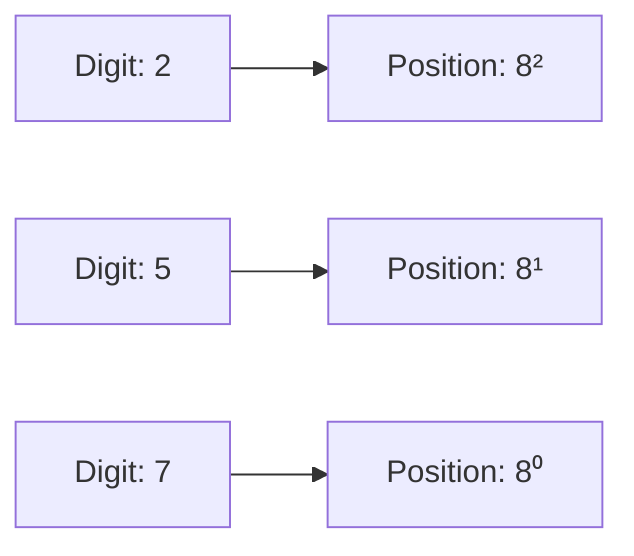
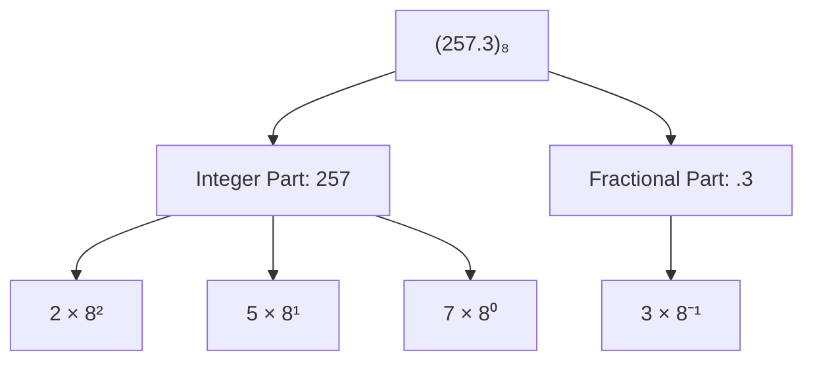
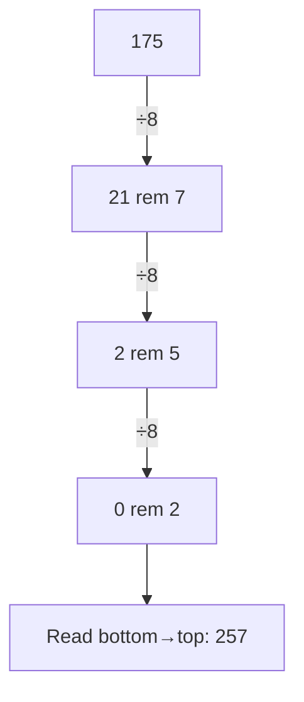
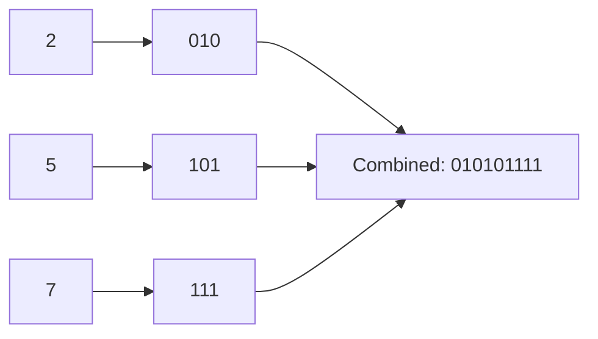
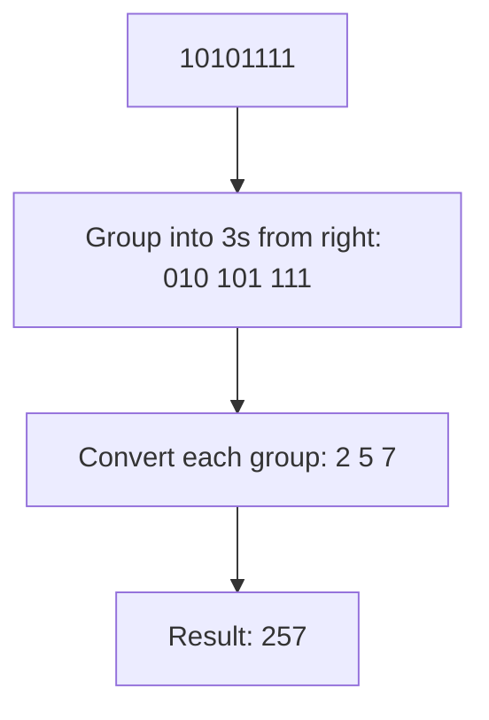
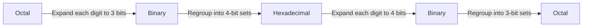
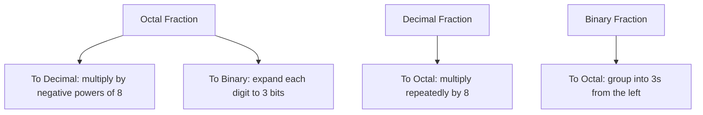
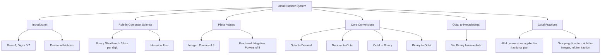

# Octal Number System

⋆˚꩜｡ *Please give a star*

---

## Table of Contents

1. [Introduction](#1-introduction)
2. [Octal in Computer Science](#2-octal-in-computer-science)
3. [Octal Place Values](#3-octal-place-values)
4. [Octal → Decimal](#4-octal--decimal)
5. [Decimal → Octal](#5-decimal--octal)
6. [Octal → Binary](#6-octal--binary)
7. [Binary → Octal](#7-binary--octal)
8. [Octal ↔ Hexadecimal](#8-octal--hexadecimal)
9. [Octal Fractions](#9-octal-fractions)
10. [Exam Preparation](#10-exam-preparation)
11. [Final Concept Map](#11-final-concept-map)

---

## 1. Introduction

### Definition

> The **Octal Number System** is a **positional number system with base (radix) 8**, using **eight digits (0–7)** to represent numeric values.

### Base-8

* "Base 8" means there are **8 unique symbols** available at each digit position, and each position's value is a **power of 8**.
* The name "octal" comes from the Latin *octo*, meaning "eight."

### Digits 0–7

* The octal system uses exactly **eight digits**:

```text
0   1   2   3   4   5   6   7
```

* There is **no digit 8 or 9** in octal — a value of 8 rolls over into the next position, just like 10 does in decimal.

### Positional Notation

* Like the decimal system, octal is **positional** — the value of a digit depends on both the digit itself and its position, with each position representing a **power of 8**.



⋆.˚ *Note: `(257)₈` looks similar to a decimal number but must be read entirely differently — always check the base subscript before interpreting a number.*

---

## 2. Octal in Computer Science

### Uses

* Historically used as a **compact, human-readable shorthand for binary** — since computers work in binary but long binary strings are hard for humans to read and write.
* Occasionally still used in contexts like **UNIX/Linux file permissions**, where permission sets are represented as octal digits.

### Historical Significance

* Octal was **more prominent in early computing** (1950s–1970s), especially on systems whose word lengths were **multiples of 3 bits** (e.g., 12-bit, 24-bit, 36-bit machines).
* As computing shifted toward **8-bit bytes** (and multiples of 4, like 16-bit, 32-bit, 64-bit systems), **hexadecimal** became more convenient than octal, since 4 bits map neatly into a byte structure — leading to octal's decline in mainstream use.

### Binary Relationship

* Octal's biggest advantage is its **clean relationship with binary**:
  * **1 octal digit = exactly 3 binary bits** (since 2³ = 8).
  * This allows quick, direct conversion between binary and octal **without needing a full decimal conversion step**.

```text
Binary (3 bits) → Octal (1 digit)
   000          →     0
   001          →     1
   010          →     2
   011          →     3
   100          →     4
   101          →     5
   110          →     6
   111          →     7
```


---

## 3. Octal Place Values

### Integer Positions

* Positions to the **left** of the octal point represent **increasing positive powers of 8**, starting from `8⁰` at the rightmost digit.

```text
   Number:        2      5      7
   Position:      8²     8¹     8⁰
   Value:        64s    8s     1s
```

### Fractional Positions

* Positions to the **right** of the octal point represent **increasing negative powers of 8**, starting from `8⁻¹`.

```text
   Number:            .    3      5
   Position:               8⁻¹   8⁻²
   Value:              Eighths  64ths
```

### Complete Example: `(257.3)₈`

```text
2×8² + 5×8¹ + 7×8⁰ + 3×8⁻¹
= 128 +  40 +   7  +  0.375
= 175.375
```



---

## 4. Octal → Decimal

### Method

Multiply each octal digit by its corresponding **power of 8** based on position, and sum the results.

### Example: Convert `(257)₈` to Decimal

```text
2×8² + 5×8¹ + 7×8⁰
= 128 +  40 +   7
= 175
```

**Result: (257)₈ = (175)₁₀**

### Example: Convert `(107)₈` to Decimal

```text
1×8² + 0×8¹ + 7×8⁰
= 64  +  0  +   7
= 71
```

**Result: (107)₈ = (71)₁₀**


---

## 5. Decimal → Octal

### Method: Division by 8

* Divide the decimal number **repeatedly by 8**, recording the remainder at each step, until the quotient becomes 0.
* Read the remainders **from bottom to top**.

### Example: Convert 175 to Octal

```text
175 ÷ 8 = 21   remainder 7
 21 ÷ 8 =  2   remainder 5
  2 ÷ 8 =  0   remainder 2

Read bottom to top: 2 5 7
```

**Result: (175)₁₀ = (257)₈**



⋆.˚ **Key Point:** This division method mirrors decimal-to-binary conversion exactly — only the divisor changes from 2 to 8.

---

## 6. Octal → Binary

### Method

* Since **1 octal digit = 3 binary bits**, convert **each octal digit individually** into its 3-bit binary equivalent, then concatenate the results.

### Example: Convert `(257)₈` to Binary

```text
2 → 010
5 → 101
7 → 111

Combine: 010 101 111
```

**Result: (257)₈ = (010101111)₂ = (10101111)₂** *(leading zero dropped)*



⋆˚꩜｡ *This digit-by-digit method is much faster than converting octal → decimal → binary, since it skips decimal entirely.*

---

## 7. Binary → Octal

### Method

* Group the binary digits into sets of **3 bits**, starting from the **right** (adding leading zeros to the leftmost group if needed).
* Convert each 3-bit group into its equivalent **single octal digit**.

### Example: Convert `(10101111)₂` to Octal

```text
Original:        10101111
Group in 3s
(from right):     010 101 111
                    2   5   7
```

**Result: (10101111)₂ = (257)₈**



⋆.˚ **Key Point:** Always group from the **right** for the integer part — this ensures each group correctly aligns with powers of 8. If the leftmost group has fewer than 3 bits, pad it with leading zeros.

---

## 8. Octal ↔ Hexadecimal

### Using Binary as Intermediate

* There is **no direct shortcut** between octal (base-8) and hexadecimal (base-16), because their digit groupings (3 bits vs 4 bits) don't align neatly.
* The standard method is to **convert through binary**:



### Example: Convert `(257)₈` to Hexadecimal

**Step 1 — Octal to Binary** (3 bits per digit):

```text
2 → 010
5 → 101
7 → 111

Combined: 010101111   (9 bits)
```

**Step 2 — Regroup into 4-bit sets** (from the right, pad leftmost group with zeros):

```text
010101111 → pad left with 3 zeros → 000010101111
Groups: 0000  1010  1111
Hex digits: 0     A     F
```

**Result: (257)₈ = (0AF)₁₆ = (AF)₁₆**

*(Check: (AF)₁₆ = 10×16 + 15×1 = 160+15 = 175 ✓ — matches (257)₈ = 175 in decimal.)*

### Example: Convert `(2F)₁₆` to Octal

**Step 1 — Hex to Binary** (4 bits per digit):

```text
2 → 0010
F → 1111

Combined: 00101111
```

**Step 2 — Regroup into 3-bit sets** (from the right):

```text
00101111 → pad to 9 bits → 000101111
Groups: 000  101  111
Octal digits: 0   5   7
```

**Result: (2F)₁₆ = (057)₈ = (57)₈**

*(Check: (57)₈ = 5×8+7 = 47; (2F)₁₆ = 2×16+15 = 47 ✓)*

⋆˚꩜｡ **Key Point:** Always convert **through binary** for octal ↔ hexadecimal — there is no valid digit-by-digit shortcut directly between these two systems.

---

## 9. Octal Fractions

*(Applying all four conversion directions specifically to fractional octal numbers.)*

### Octal → Decimal (Fractional)

* Multiply each fractional octal digit by its corresponding **negative power of 8**, and sum.

**Example: Convert `(0.3)₈` to Decimal**

```text
3×8⁻¹ = 3/8 = 0.375
```

**Result: (0.3)₈ = (0.375)₁₀**

### Decimal → Octal (Fractional)

* Multiply the decimal fraction **repeatedly by 8**, recording the integer part generated at each step, until the fraction becomes 0 or desired precision is reached.
* Read the integer parts **top to bottom**.

**Example: Convert `0.375` to Octal**

```text
0.375 × 8 = 3.000   →  integer part: 3

Read top to bottom: 3
```

**Result: (0.375)₁₀ = (0.3)₈**

### Octal → Binary (Fractional)

* Convert **each octal fractional digit individually** into its 3-bit binary equivalent, same as with the integer part.

**Example: Convert `(0.3)₈` to Binary**

```text
3 → 011
```

**Result: (0.3)₈ = (0.011)₂**

### Binary → Octal (Fractional)

* Group binary digits into sets of **3 bits**, starting from the **left** this time (right after the binary point) — padding the rightmost group with trailing zeros if needed.

**Example: Convert `(0.011)₂` to Octal**

```text
0.011 → already exactly 3 bits: 011
011 → 3
```

**Result: (0.011)₂ = (0.3)₈**



⋆.˚ **Important Distinction:** For the **integer part**, binary is grouped into 3s from the **right**. For the **fractional part**, binary is grouped into 3s from the **left** (starting right after the point). Mixing up this direction is a very common exam mistake.

---

## 10. Exam Preparation

### Important Definitions

* Octal Number System
* Base / Radix (in context of octal = 8)
* Positional Notation
* Binary-to-Octal grouping relationship

### Important Concepts

* Why octal uses only digits 0–7 and how positional value works with base 8.
* The direct digit-by-digit relationship between 3 binary bits and 1 octal digit.
* Why octal-to-hexadecimal conversion must go through binary rather than being direct.
* The difference in grouping direction (right vs left) for integer vs fractional binary-octal conversions.
* Why octal has become less common than hexadecimal in modern computing.

### Common Confusions

* **Octal digits vs Decimal digits** — students sometimes mistakenly use 8 or 9 in an octal number; only 0–7 are valid.
* **Grouping direction** — grouping binary into 3s from the right (integer part) vs from the left (fractional part) are easy to mix up.
* **Direct Octal ↔ Hex shortcut** — there is **no direct digit mapping** between octal and hexadecimal; binary must be used as an intermediate step.
* **Octal vs Decimal-looking numbers** — a number like `257` could be valid in both decimal and octal, but represents **different actual values** — always check the base.

### Exam-Oriented Questions

**Very Short Questions**
* What is the base of the octal number system?
* How many binary bits correspond to one octal digit?
* Convert (7)₈ to binary.

**Short-Answer Questions**
* Convert (351)₈ to decimal.
* Convert (98)₁₀ to octal.
* Explain why octal-to-hexadecimal conversion requires binary as an intermediate step.

**Long-Answer Questions**
* Explain, with steps, how to convert an octal number with both integer and fractional parts into binary.
* Convert (472.25)₈ to decimal, showing all working.
* Convert (156)₁₀ to octal, binary, and hexadecimal, showing all steps.

**Conceptual Questions**
* Why is octal considered a convenient shorthand for binary?
* Why did octal's popularity decline compared to hexadecimal in modern systems?
* Why must the grouping direction differ between integer and fractional binary-to-octal conversion?

---

## 11. Final Concept Map



𖹭 *This map connects octal's structure, its special relationship with binary, and every conversion pathway — use it as your master revision anchor for this topic.*

---

<div align="center">
⋆˚꩜｡
</div>

<div align="center">

</div>

If you enjoyed these notes, you'll probably enjoy the rest too.

| Platform | Link |
|---|---|
| Instagram | @mehrunnisa.ai |
| SubStack | The Epoch |
| YouTube | @mehrunnisa.ai |

**Usage Terms**

These notes are free to use for personal learning, revision, and study. Please do not:
- Sell or redistribute for profit.
- Claim them as your own work.
- Modify and republish without permission.
- Use for any unethical or unauthorized purpose.

Thank you for respecting the effort behind these notes. Happy learning. ♡

</div>
