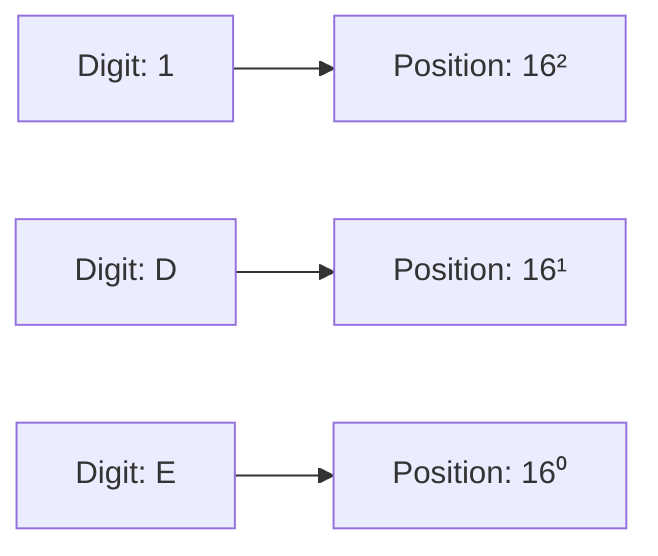
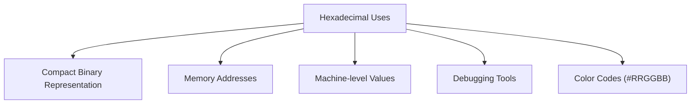
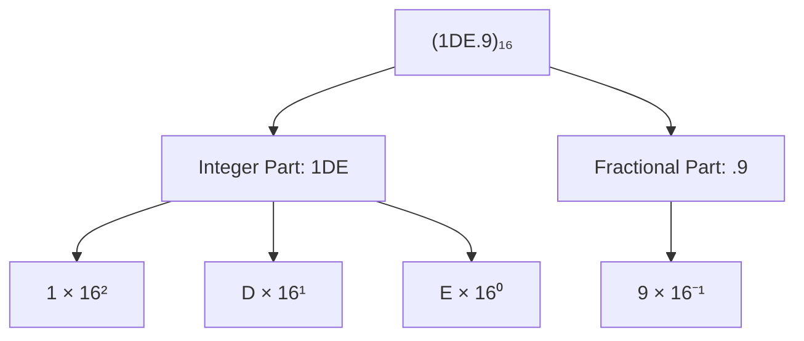
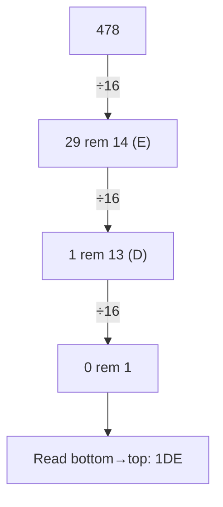
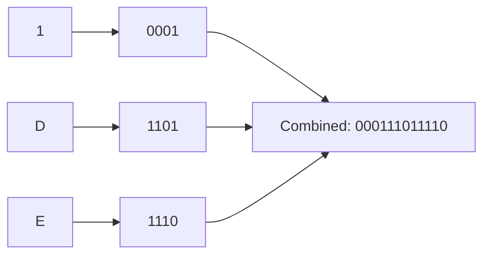
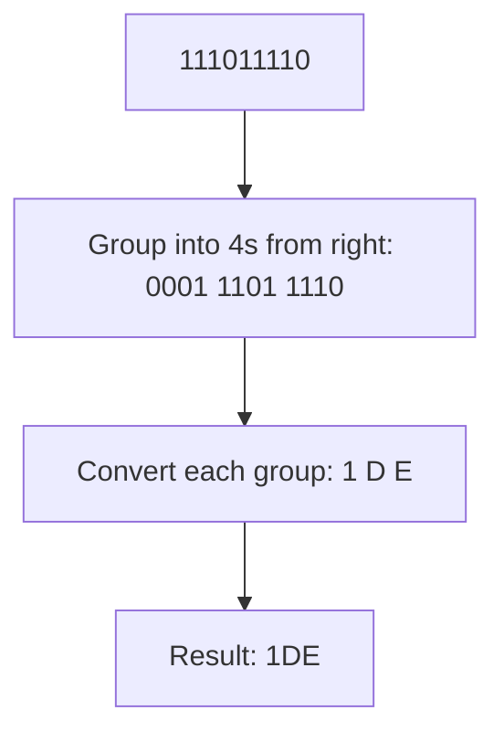
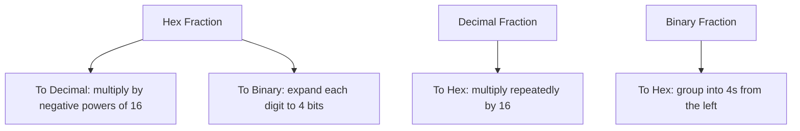

# Hexadecimal Number System

⋆˚꩜｡ *Please give a star*

---

## Table of Contents

1. [Introduction](#1-introduction)
2. [Hexadecimal in Computer Science](#2-hexadecimal-in-computer-science)
3. [Hexadecimal Place Values](#3-hexadecimal-place-values)
4. [Hexadecimal → Decimal](#4-hexadecimal--decimal)
5. [Decimal → Hexadecimal](#5-decimal--hexadecimal)
6. [Hexadecimal → Binary](#6-hexadecimal--binary)
7. [Binary → Hexadecimal](#7-binary--hexadecimal)
8. [Hexadecimal ↔ Octal](#8-hexadecimal--octal)
9. [Hexadecimal Fractions](#9-hexadecimal-fractions)
10. [Exam Preparation](#10-exam-preparation)
11. [Final Concept Map](#11-final-concept-map)

---

## 1. Introduction

### Definition

> The **Hexadecimal Number System** is a **positional number system with base (radix) 16**, using **sixteen symbols (0–9 and A–F)** to represent numeric values.

### Base-16

* "Base 16" means there are **16 unique symbols** available at each digit position, and each position's value is a **power of 16**.
* The name "hexadecimal" comes from Greek *hex* (six) + Latin *decem* (ten) → "sixteen." It is often shortened to **"hex."**

### Digits 0–9

* Just like decimal, hexadecimal reuses the digits:

```text
0   1   2   3   4   5   6   7   8   9
```

### Letters A–F

* Since 10 digit symbols aren't enough to represent 16 values, hexadecimal uses **letters A–F** to represent the values **10 through 15**:

| Decimal Value | 10 | 11 | 12 | 13 | 14 | 15 |
|---|---|---|---|---|---|---|
| Hex Symbol | A | B | C | D | E | F |

* Full hexadecimal digit set (16 symbols):

```text
0  1  2  3  4  5  6  7  8  9  A  B  C  D  E  F
```

### Positional Notation

* Like all positional systems studied so far, the value of each hex digit depends on both the symbol and its **position**, with each position representing a **power of 16**.



⋆.˚ *Hexadecimal numbers are often written with a prefix like `0x` (e.g., `0x1DE`) in programming contexts, in addition to the subscript notation `(1DE)₁₆` used in mathematics.*

---

## 2. Hexadecimal in Computer Science

### Compact Binary Representation

* Hexadecimal's biggest advantage: **1 hex digit = exactly 4 binary bits** (since 2⁴ = 16).
* This makes hex an extremely compact and human-friendly way to represent binary data — a full **byte (8 bits)** is represented using just **2 hex digits**.

```text
Binary (4 bits) → Hex (1 digit)
  Byte (8 bits) → 2 Hex digits
```

### Memory Addresses

* Computer memory addresses are commonly displayed and written in **hexadecimal**, since raw binary addresses would be far too long and error-prone for humans to read or type.

### Machine-Level Values

* Registers, opcodes, and raw machine data are frequently shown in hex during low-level programming and system-level work, since it maps cleanly onto the underlying binary without decimal's awkward conversion.

### Debugging

* Debuggers and disassemblers display memory contents, register values, and error/status codes in hexadecimal, since it's far more compact and pattern-friendly than binary while still reflecting the exact bit structure.

### Color Representation

* Digital colors (e.g., in web design) are commonly represented as hexadecimal codes, such as `#FF5733`, where each pair of hex digits represents the intensity of **Red, Green, and Blue** (0–255 each, expressed as `00`–`FF`).



---

## 3. Hexadecimal Place Values

### Integer Positions

* Positions to the **left** of the hexadecimal point represent **increasing positive powers of 16**, starting from `16⁰` at the rightmost digit.

```text
   Number:        1      D      E
   Position:      16²    16¹    16⁰
   Value:        256s    16s    1s
```

### Fractional Positions

* Positions to the **right** of the hexadecimal point represent **increasing negative powers of 16**, starting from `16⁻¹`.

```text
   Number:            .    9
   Position:               16⁻¹
   Value:              Sixteenths
```

### Complete Example: `(1DE.9)₁₆`

```text
1×16² + D×16¹ + E×16⁰ + 9×16⁻¹
= 1×256 + 13×16 + 14×1 + 9×0.0625
= 256 + 208 + 14 + 0.5625
= 478.5625
```



---

## 4. Hexadecimal → Decimal

### Method

Multiply each hex digit (converting A–F to 10–15 where needed) by its corresponding **power of 16** based on position, and sum the results.

### Example: Convert `(1DE)₁₆` to Decimal

```text
1×16² + D×16¹ + E×16⁰
= 1×256 + 13×16 + 14×1
= 256 + 208 + 14
= 478
```

**Result: (1DE)₁₆ = (478)₁₀**

### Example: Convert `(2AF)₁₆` to Decimal

```text
2×16² + A×16¹ + F×16⁰
= 2×256 + 10×16 + 15×1
= 512 + 160 + 15
= 687
```

**Result: (2AF)₁₆ = (687)₁₀**


---

## 5. Decimal → Hexadecimal

### Method: Division by 16

* Divide the decimal number **repeatedly by 16**, recording the remainder at each step, until the quotient becomes 0.
* Convert any remainder **10–15** into its corresponding letter (A–F).
* Read the remainders **from bottom to top**.

### Example: Convert 478 to Hexadecimal

```text
478 ÷ 16 = 29   remainder 14 → E
 29 ÷ 16 =  1   remainder 13 → D
  1 ÷ 16 =  0   remainder  1 → 1

Read bottom to top: 1 D E
```

**Result: (478)₁₀ = (1DE)₁₆**



⋆.˚ **Key Point:** This is the same repeated-division technique used for decimal-to-binary and decimal-to-octal — only the divisor (16) and the need to convert remainders ≥10 into letters changes.

---

## 6. Hexadecimal → Binary

### 4-Bit Mapping

* Since **1 hex digit = 4 binary bits**, every hex digit has a **fixed 4-bit binary equivalent**:

| Hex | Binary | Hex | Binary |
|---|---|---|---|
| 0 | 0000 | 8 | 1000 |
| 1 | 0001 | 9 | 1001 |
| 2 | 0010 | A | 1010 |
| 3 | 0011 | B | 1011 |
| 4 | 0100 | C | 1100 |
| 5 | 0101 | D | 1101 |
| 6 | 0110 | E | 1110 |
| 7 | 0111 | F | 1111 |

### Method

* Convert **each hex digit individually** into its 4-bit binary equivalent, then concatenate the results.

### Example: Convert `(1DE)₁₆` to Binary

```text
1 → 0001
D → 1101
E → 1110

Combine: 0001 1101 1110
```

**Result: (1DE)₁₆ = (000111011110)₂ = (111011110)₂** *(leading zeros dropped)*



---

## 7. Binary → Hexadecimal

### Grouping into 4 Bits

* Group the binary digits into sets of **4 bits**, starting from the **right** (padding the leftmost group with leading zeros if needed).
* Convert each 4-bit group into its equivalent **single hex digit**.

### Example: Convert `(111011110)₂` to Hexadecimal

```text
Original:          111011110
Group in 4s
(from right, pad):  0001 1101 1110
                      1    D    E
```

**Result: (111011110)₂ = (1DE)₁₆**



⋆.˚ **Key Point:** Just like with octal grouping, always group **from the right** for the integer part, padding the leftmost group with leading zeros as needed.

---

## 8. Hexadecimal ↔ Octal

### Using Binary as Intermediate

* There is **no direct digit-to-digit shortcut** between hexadecimal (4-bit groups) and octal (3-bit groups), since 4 and 3 don't divide evenly into each other.
* The standard method is to **convert through binary**:


### Example: Convert `(AF)₁₆` to Octal

**Step 1 — Hex to Binary** (4 bits per digit):

```text
A → 1010
F → 1111

Combined: 10101111   (8 bits)
```

**Step 2 — Regroup into 3-bit sets** (from the right, pad leftmost group):

```text
10101111 → pad left with 1 zero → 010101111
Groups: 010  101  111
Octal digits: 2    5    7
```

**Result: (AF)₁₆ = (257)₈**

*(Check: (257)₈ = 2×64+5×8+7 = 128+40+7 = 175; (AF)₁₆ = 10×16+15 = 175 ✓)*

### Example: Convert `(257)₈` to Hexadecimal

**Step 1 — Octal to Binary** (3 bits per digit):

```text
2 → 010
5 → 101
7 → 111

Combined: 010101111   (9 bits)
```

**Step 2 — Regroup into 4-bit sets** (from the right, pad leftmost group):

```text
010101111 → pad left with 3 zeros → 000010101111
Groups: 0000  1010  1111
Hex digits: 0     A     F
```

**Result: (257)₈ = (0AF)₁₆ = (AF)₁₆**

⋆˚꩜｡ **Key Point:** Always convert **through binary** for hex ↔ octal conversions. This is identical to the octal ↔ hexadecimal method covered earlier, just approached from the hexadecimal side.

---

## 9. Hexadecimal Fractions

*(Applying all four conversion directions specifically to fractional hexadecimal numbers.)*

### Hex → Decimal (Fractional)

* Multiply each fractional hex digit (converting letters to values if needed) by its corresponding **negative power of 16**, and sum.

**Example: Convert `(0.9)₁₆` to Decimal**

```text
9×16⁻¹ = 9/16 = 0.5625
```

**Result: (0.9)₁₆ = (0.5625)₁₀**

### Decimal → Hex (Fractional)

* Multiply the decimal fraction **repeatedly by 16**, recording the integer part (converted to a hex symbol if 10–15) generated at each step.
* Read the integer parts **top to bottom**.

**Example: Convert `0.5625` to Hexadecimal**

```text
0.5625 × 16 = 9.000   →  integer part: 9

Read top to bottom: 9
```

**Result: (0.5625)₁₀ = (0.9)₁₆**

### Hex → Binary (Fractional)

* Convert **each hex fractional digit individually** into its 4-bit binary equivalent, same as with the integer part.

**Example: Convert `(0.9)₁₆` to Binary**

```text
9 → 1001
```

**Result: (0.9)₁₆ = (0.1001)₂**

### Binary → Hex (Fractional)

* Group binary digits into sets of **4 bits**, starting from the **left** this time (right after the binary point) — padding the rightmost group with trailing zeros if needed.

**Example: Convert `(0.1001)₂` to Hexadecimal**

```text
0.1001 → already exactly 4 bits: 1001
1001 → 9
```

**Result: (0.1001)₂ = (0.9)₁₆**



⋆.˚ **Important Distinction:** For the **integer part**, binary is grouped into 4s from the **right**. For the **fractional part**, binary is grouped into 4s from the **left** (starting right after the point) — the same rule that applied for octal, just with groups of 4 instead of 3.

---

## 10. Exam Preparation

### Important Definitions

* Hexadecimal Number System
* Base / Radix (in context of hex = 16)
* Positional Notation
* Nibble (a 4-bit group, equal to one hex digit)

### Important Concepts

* Why hexadecimal needs 16 symbols and how letters A–F extend the digit set.
* The direct digit-by-digit relationship between 4 binary bits and 1 hex digit.
* Why hexadecimal is preferred over octal in most modern computing contexts (byte-alignment).
* Why hex-to-octal conversion must go through binary rather than being direct.
* Practical uses of hex: memory addresses, debugging, and color codes.

### Common Confusions

* **Letters as digit values** — A–F are **digit symbols**, not variables; A always equals 10, F always equals 15, regardless of context.
* **Grouping direction** — grouping binary into 4s from the right (integer part) vs from the left (fractional part) is a common exam mistake.
* **Direct Hex ↔ Octal shortcut** — there is **no direct digit mapping**; binary must be used as an intermediate step.
* **Hex digit vs Decimal digit confusion** — a hex number like `(19)₁₆` is easy to misread as decimal 19; always verify the base before converting or interpreting.

### Exam-Oriented Questions

**Very Short Questions**
* What is the base of the hexadecimal number system?
* What decimal value does the hex symbol "C" represent?
* How many binary bits correspond to one hex digit?

**Short-Answer Questions**
* Convert (3F)₁₆ to decimal.
* Convert (100)₁₀ to hexadecimal.
* Explain why hex-to-octal conversion requires binary as an intermediate step.

**Long-Answer Questions**
* Explain, with steps, how to convert a hexadecimal number with both integer and fractional parts into binary.
* Convert (2AF.8)₁₆ to decimal, showing all working.
* Convert (500)₁₀ to hexadecimal, binary, and octal, showing all steps.

**Conceptual Questions**
* Why is hexadecimal considered more convenient than octal for modern 8-bit-based systems?
* Why does a "nibble" (4 bits) map so naturally to a single hex digit?
* Why must the grouping direction differ between integer and fractional binary-to-hex conversion?

---

## 11. Final Concept Map

```mermaid
flowchart TD
    HNS["Hexadecimal Number System"]

    HNS --> Intro["Introduction"]
    Intro --> I1["Base-16, Digits 0-9 & A-F"]
    Intro --> I2["Positional Notation"]

    HNS --> CS["Role in Computer Science"]
    CS --> CS1["Compact Binary - 4 bits per digit"]
    CS --> CS2["Memory Addresses & Debugging"]
    CS --> CS3["Color Codes"]

    HNS --> PV["Place Values"]
    PV --> PV1["Integer: Powers of 16"]
    PV --> PV2["Fractional: Negative Powers of 16"]

    HNS --> Conv["Core Conversions"]
    Conv --> C1["Hex to Decimal"]
    Conv --> C2["Decimal to Hex"]
    Conv --> C3["Hex to Binary"]
    Conv --> C4["Binary to Hex"]

    HNS --> Oct["Hex to Octal"]
    Oct --> O1["Via Binary Intermediate"]

    HNS --> Frac["Hex Fractions"]
    Frac --> F1["All 4 conversions applied to fractional part"]
    Frac --> F2["Grouping direction: right for integer, left for fraction"]
```



𖹭 *This map connects hexadecimal's structure, its close relationship with binary, and every conversion pathway — use it as your master revision anchor for this topic.*

---

<div align="center">
⋆˚꩜｡
</div>

<div align="center">

</div>

If you enjoyed these notes, you'll probably enjoy the rest too.

| Platform | Link |
|---|---|
| Instagram | @mehrunnisa.ai |
| SubStack | The Epoch |
| YouTube | @mehrunnisa.ai |

**Usage Terms**

These notes are free to use for personal learning, revision, and study. Please do not:
- Sell or redistribute for profit.
- Claim them as your own work.
- Modify and republish without permission.
- Use for any unethical or unauthorized purpose.

Thank you for respecting the effort behind these notes. Happy learning. ♡

</div>
