# Number System Conversions
### BCA Study Notes — All 12 Conversions (Decimal, Binary, Octal, Hexadecimal)

⋆˚꩜｡ *Please give a STAR*

---

## Table of Contents

1. [Quick Overview — The Conversion Map](#1-quick-overview--the-conversion-map)
2. [Decimal → Binary](#2-decimal--binary)
3. [Decimal → Octal](#3-decimal--octal)
4. [Decimal → Hexadecimal](#4-decimal--hexadecimal)
5. [Binary → Decimal](#5-binary--decimal)
6. [Binary → Octal](#6-binary--octal)
7. [Binary → Hexadecimal](#7-binary--hexadecimal)
8. [Octal → Decimal](#8-octal--decimal)
9. [Octal → Binary](#9-octal--binary)
10. [Octal → Hexadecimal](#10-octal--hexadecimal)
11. [Hexadecimal → Decimal](#11-hexadecimal--decimal)
12. [Hexadecimal → Binary](#12-hexadecimal--binary)
13. [Hexadecimal → Octal](#13-hexadecimal--octal)
14. [Master Trick Summary Table](#14-master-trick-summary-table)
15. [Exam Preparation](#15-exam-preparation)
16. [Final Concept Map](#16-final-concept-map)

---

## 1. Quick Overview — The Conversion Map

Before diving in, see how all four systems connect. **Binary is the "hub"** — every conversion either goes directly to/from binary, or passes *through* binary.

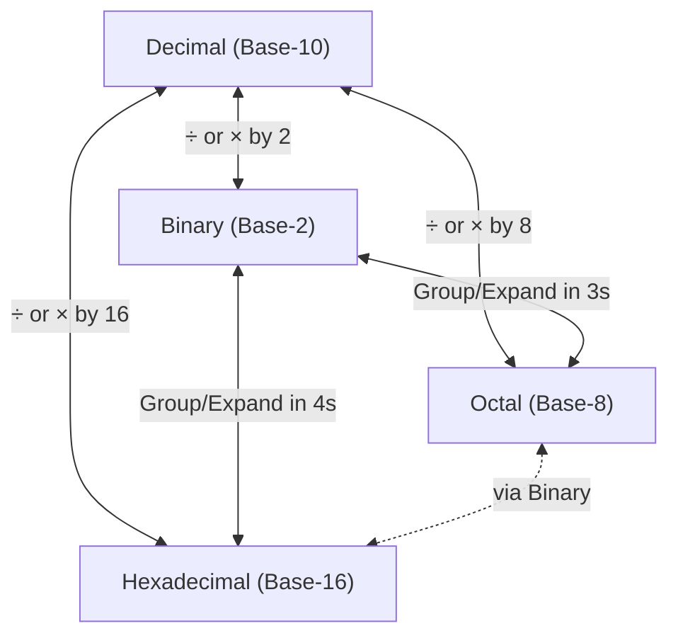

⋆.˚ **Master Key Trick:** There are really only **3 techniques** in this entire topic:
1. **Decimal ↔ Others:** Repeated Division (to convert) / Multiply-by-power-and-sum (to convert back).
2. **Binary ↔ Octal/Hex:** Direct digit grouping (3 bits ↔ 1 octal digit, 4 bits ↔ 1 hex digit) — **no decimal needed**.
3. **Octal ↔ Hex:** Always go **through binary** — there's no direct shortcut.

---

## 2. Decimal → Binary

### Explanation

* Binary uses base **2**, so we use **repeated division by 2**.
* Divide the number by 2, note the **remainder** (always 0 or 1), and keep dividing the quotient until it reaches 0.
* Read all remainders **from bottom to top** — that's your binary number.

### Worked Example: Convert 45 to Binary

```text
45 ÷ 2 = 22   remainder 1   ↑
22 ÷ 2 = 11   remainder 0   ↑
11 ÷ 2 =  5   remainder 1   ↑
 5 ÷ 2 =  2   remainder 1   ↑
 2 ÷ 2 =  1   remainder 0   ↑
 1 ÷ 2 =  0   remainder 1   ↑  (start reading from here, upward)
```

**Result: (45)₁₀ = (101101)₂**

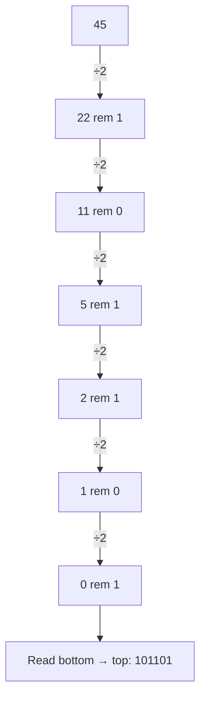

### 🔑 Key Trick

* **"Divide, Note, Flip"** — Divide repeatedly by 2, note down every remainder in a column, and **flip (reverse) the whole column** at the end.
* **Fastest shortcut for small numbers:** Memorize powers of 2 (1, 2, 4, 8, 16, 32, 64, 128...) and mentally **subtract the largest power of 2 that fits**, marking a `1`; if it doesn't fit, mark `0`. Repeat.
  * Example: 45 → 32 fits (1) → remainder 13 → 16 doesn't fit (0) → 8 fits (1) → remainder 5 → 4 fits (1) → remainder 1 → 2 doesn't fit (0) → 1 fits (1) → **101101**
* Never forget: the **last division** (where quotient becomes 0) gives the **leftmost (most significant)** digit.

---

## 3. Decimal → Octal

### Explanation

* Octal uses base **8**, so we use **repeated division by 8**.
* Same process as decimal → binary, but dividing by 8 instead of 2. Remainders will range from **0 to 7**.
* Read remainders **bottom to top**.

### Worked Example: Convert 175 to Octal

```text
175 ÷ 8 = 21   remainder 7   ↑
 21 ÷ 8 =  2   remainder 5   ↑
  2 ÷ 8 =  0   remainder 2   ↑  (start reading from here, upward)
```

**Result: (175)₁₀ = (257)₈**

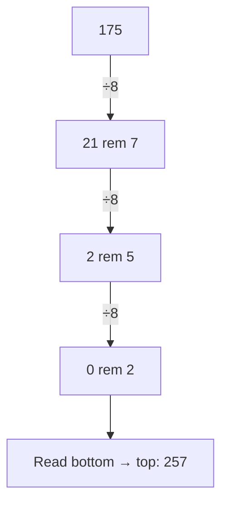

### 🔑 Key Trick

* **Same "Divide, Note, Flip" method as binary — just swap the divisor to 8.**
* Because octal remainders are always **0–7**, if you ever get a remainder of 8 or 9, you've made an arithmetic mistake — **instant self-check**.
* Fast shortcut: Convert to binary first (if you're faster at binary), then group the binary into **3-bit chunks** (see Section 9) — often quicker than repeated division by 8 for larger numbers.

---

## 4. Decimal → Hexadecimal

### Explanation

* Hexadecimal uses base **16**, so we use **repeated division by 16**.
* Remainders range from **0–15** — remainders **10–15 must be converted to letters A–F**.
* Read remainders **bottom to top**.

### Worked Example: Convert 478 to Hexadecimal

```text
478 ÷ 16 = 29   remainder 14 → E   ↑
 29 ÷ 16 =  1   remainder 13 → D   ↑
  1 ÷ 16 =  0   remainder  1 → 1   ↑  (start reading from here, upward)
```

**Result: (478)₁₀ = (1DE)₁₆**

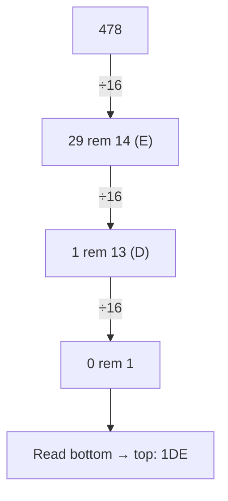

### 🔑 Key Trick

* **Memorize this bridge once, use it forever:**

```text
10=A   11=B   12=C   13=D   14=E   15=F
```

* Mnemonic: **"A**fter **B**ig **C**ars **D**rive **E**very**F**where"** (A,B,C,D,E,F in order of 10→15).
* Same "Divide, Note, Flip" as before — just divide by 16 and convert any remainder ≥10 into its letter **immediately**, don't wait until the end.

---

## 5. Binary → Decimal

### Explanation

* Multiply each binary digit by its **positional power of 2** (starting from `2⁰` on the rightmost bit), then **add everything up**.

### Worked Example: Convert (101101)₂ to Decimal

```text
Position:   5    4    3    2    1    0
Bit:        1    0    1    1    0    1
Power:     2⁵   2⁴   2³   2²   2¹   2⁰
Value:     32    0    8    4    0    1

Sum = 32 + 0 + 8 + 4 + 0 + 1 = 45
```

**Result: (101101)₂ = (45)₁₀**

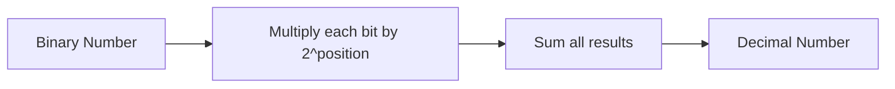

### 🔑 Key Trick

* **Memorize powers of 2 up to at least 2¹⁰:**

```text
2⁰=1  2¹=2  2²=4  2³=8  2⁴=16  2⁵=32  2⁶=64  2⁷=128  2⁸=256  2⁹=512  2¹⁰=1024
```

* **Shortcut:** Only **add up the powers where the bit is 1** — completely skip positions with a `0` bit, don't even calculate them.
* Write the powers of 2 **above each bit position first**, then just add the ones under a `1`. This avoids silly mistakes.

---

## 6. Binary → Octal

### Explanation

* Group binary digits into sets of **3 bits** (since 2³ = 8), starting from the **right** for the integer part.
* Pad the leftmost group with leading zeros if it has fewer than 3 bits.
* Convert each 3-bit group into its equivalent single octal digit.

### Worked Example: Convert (10101111)₂ to Octal

```text
Original:        10101111
Group in 3s
(from right):     010 101 111
                    2   5   7
```

**Result: (10101111)₂ = (257)₈**

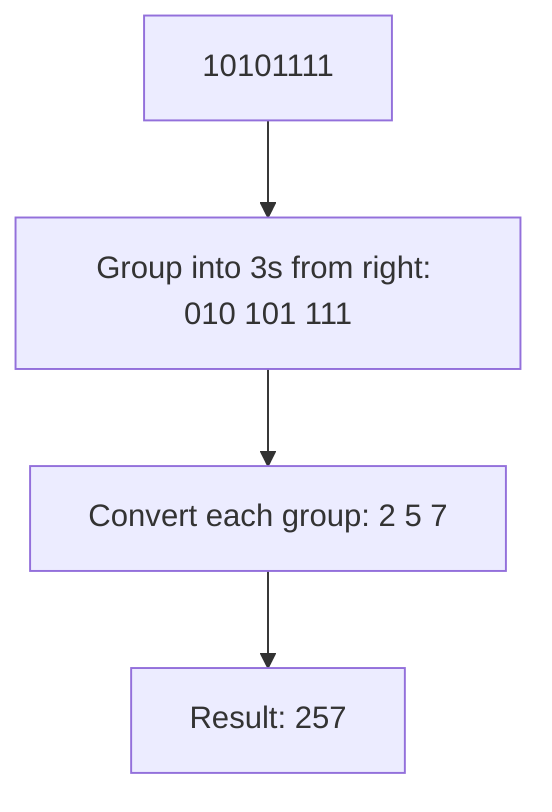

### 🔑 Key Trick

* **No decimal needed — this is a direct shortcut!**
* Memorize this tiny table once (only 8 entries):

```text
000=0  001=1  010=2  011=3  100=4  101=5  110=6  111=7
```

* **"3 for 8"** — remember: **3 bits per digit** because octal's base is **2³ = 8**.
* Always group starting from the **rightmost bit** — pad the **left** side with zeros, never the right (for integer parts).

---

## 7. Binary → Hexadecimal

### Explanation

* Group binary digits into sets of **4 bits** (since 2⁴ = 16), starting from the **right** for the integer part.
* Pad the leftmost group with leading zeros if needed.
* Convert each 4-bit group into its equivalent single hex digit.

### Worked Example: Convert (111011110)₂ to Hexadecimal

```text
Original:          111011110
Group in 4s
(from right, pad):  0001 1101 1110
                      1    D    E
```

**Result: (111011110)₂ = (1DE)₁₆**

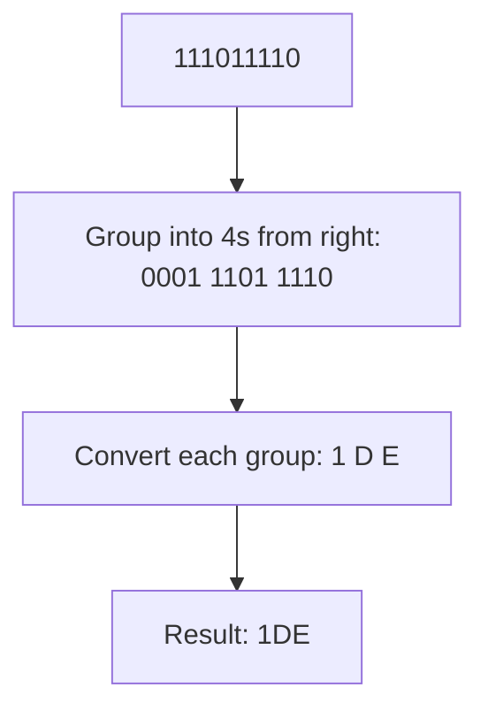

### 🔑 Key Trick

* **"4 for 16"** — remember: **4 bits per digit** (a "nibble") because hex's base is **2⁴ = 16**.
* Memorize the 4-bit table (this is the single most useful table in the entire topic — used constantly in programming):

```text
0000=0  0001=1  0010=2  0011=3  0100=4  0101=5  0110=6  0111=7
1000=8  1001=9  1010=A  1011=B  1100=C  1101=D  1110=E  1111=F
```

* Trick to memorize fast: think of it as **counting 0 to 15 in binary**, split into two rows of 8 — the second row is just the first row with a `1` stuck in front.

---

## 8. Octal → Decimal

### Explanation

* Multiply each octal digit by its **positional power of 8** (starting from `8⁰` on the rightmost digit), then **add everything up**.

### Worked Example: Convert (257)₈ to Decimal

```text
Position:   2    1    0
Digit:      2    5    7
Power:     8²   8¹   8⁰
Value:    128   40    7

Sum = 128 + 40 + 7 = 175
```

**Result: (257)₈ = (175)₁₀**

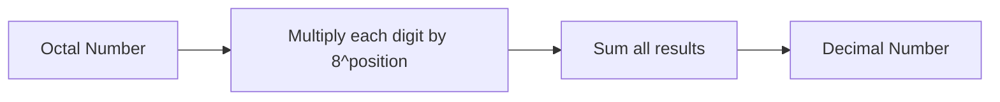

### 🔑 Key Trick

* Memorize powers of 8:

```text
8⁰=1   8¹=8   8²=64   8³=512   8⁴=4096
```

* **Shortcut connection:** 8² = 64 is also `2⁶` — if you already know powers of 2 well, powers of 8 are just **every 3rd power of 2** (2³, 2⁶, 2⁹...).
* Since octal only has digits 0–7, **no letter conversion is ever needed** — this is the simplest "multiply and sum" conversion of the three (compared to hex, which needs letter lookups).

---

## 9. Octal → Binary

### Explanation

* Since **1 octal digit = 3 binary bits**, convert **each digit individually** to its 3-bit binary form, then join them together — **no decimal step required**.

### Worked Example: Convert (257)₈ to Binary

```text
2 → 010
5 → 101
7 → 111

Combine: 010 101 111
```

**Result: (257)₈ = (10101111)₂**

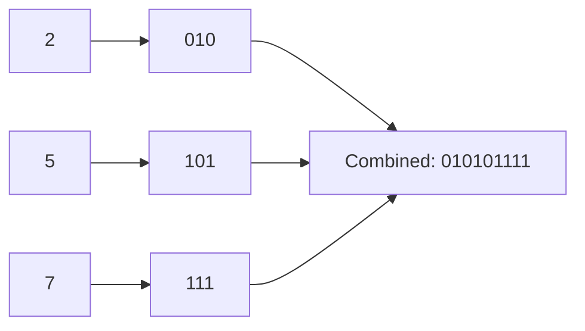

### 🔑 Key Trick

* This is the **reverse lookup** of Section 6's table — memorize it **both directions**:

```text
0=000  1=001  2=010  3=011  4=100  5=101  6=110  7=111
```

* **Every octal digit ALWAYS becomes exactly 3 bits** — even if the digit is small (like `1` → `001`), **never drop the leading zeros within a group** until the very final answer is assembled.
* Trick to avoid mistakes: write **three blank underscores** under each octal digit before filling them in — this stops you from accidentally writing 2 or 4 bits for a digit.

---

## 10. Octal → Hexadecimal

### Explanation

* **No direct shortcut exists** between octal (3-bit groups) and hex (4-bit groups) because 3 and 4 don't align.
* Always convert **octal → binary → hexadecimal**.

### Worked Example: Convert (257)₈ to Hexadecimal

**Step 1 — Octal to Binary** (3 bits per digit):

```text
2 → 010
5 → 101
7 → 111
Combined: 010101111   (9 bits)
```

**Step 2 — Regroup into 4-bit sets** (from the right, pad leftmost group):

```text
010101111 → pad left with 3 zeros → 000010101111
Groups: 0000  1010  1111
Hex digits: 0     A     F
```

**Result: (257)₈ = (AF)₁₆**

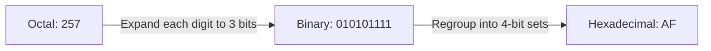

### 🔑 Key Trick

* **"When in doubt, go through binary"** — this applies to octal ↔ hex only, since these two are the **only pair** without a direct base relationship (2³ ≠ 2⁴).
* **Padding rule:** Always pad zeros on the **far left (start)** of the combined binary string — never insert padding in the middle, or you'll shift every group and get a wrong answer.
* Sanity check: convert your final hex answer back to decimal and compare with the octal number's decimal value — if they match, you converted correctly.

---

## 11. Hexadecimal → Decimal

### Explanation

* Multiply each hex digit (convert letters A–F to 10–15 first) by its **positional power of 16** (starting from `16⁰`), then **add everything up**.

### Worked Example: Convert (1DE)₁₆ to Decimal

```text
Position:   2    1    0
Digit:      1    D    E
Value:      1   13   14
Power:    16²  16¹  16⁰
Result:   256  208   14

Sum = 256 + 208 + 14 = 478
```

**Result: (1DE)₁₆ = (478)₁₀**

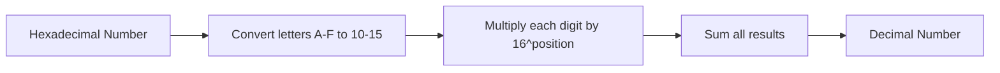

### 🔑 Key Trick

* Memorize powers of 16:

```text
16⁰=1   16¹=16   16²=256   16³=4096
```

* **Always convert letters to numbers FIRST**, before multiplying — doing math with a letter symbol directly is a common source of errors.
* Quick recall: 16² = 256 is a very common number in computing (max value of one byte + 1) — memorizing it makes hex-to-decimal calculations much faster.

---

## 12. Hexadecimal → Binary

### Explanation

* Since **1 hex digit = 4 binary bits**, convert **each digit individually** to its 4-bit binary form, then join them together.

### Worked Example: Convert (1DE)₁₆ to Binary

```text
1 → 0001
D → 1101
E → 1110

Combine: 0001 1101 1110
```

**Result: (1DE)₁₆ = (111011110)₂**

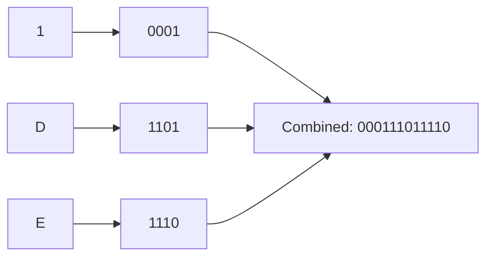

### 🔑 Key Trick

* This is the **reverse lookup** of Section 7's table — memorize both directions.
* **Every hex digit ALWAYS becomes exactly 4 bits** — write **four blank underscores** under each hex digit first to avoid dropping digits, especially for small values like `1` → `0001`.
* Since this table is used constantly (in programming, networking, memory dumps), it's worth memorizing **cold** rather than looking it up every time.

---

## 13. Hexadecimal → Octal

### Explanation

* Just like Octal → Hex, there's **no direct shortcut** — always convert **hexadecimal → binary → octal**.

### Worked Example: Convert (AF)₁₆ to Octal

**Step 1 — Hex to Binary** (4 bits per digit):

```text
A → 1010
F → 1111
Combined: 10101111   (8 bits)
```

**Step 2 — Regroup into 3-bit sets** (from the right, pad leftmost group):

```text
10101111 → pad left with 1 zero → 010101111
Groups: 010  101  111
Octal digits: 2    5    7
```

**Result: (AF)₁₆ = (257)₈**

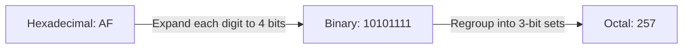

### 🔑 Key Trick

* Same principle as Section 10, reversed: **binary is always the bridge** between octal and hex.
* **Count your total bits before regrouping** — if hex digits × 4 doesn't divide evenly by 3, you'll need padding; quickly check `(total bits) mod 3` to know how many zeros to pad.
* Double-check by converting both the original hex and your final octal answer to decimal separately — they must match.

---

## 14. Master Trick Summary Table

| Conversion | Method | One-Line Trick |
|---|---|---|
| Decimal → Binary | Repeated ÷2 | Divide, note remainder, flip the order |
| Decimal → Octal | Repeated ÷8 | Same as binary, divisor = 8 |
| Decimal → Hexadecimal | Repeated ÷16 | Same, but convert 10–15 to A–F immediately |
| Binary → Decimal | ×2^position, sum | Only add powers where the bit is 1 |
| Binary → Octal | Group in 3s (from right) | "3 for 8" — 2³ = 8 |
| Binary → Hexadecimal | Group in 4s (from right) | "4 for 16" — 2⁴ = 16 |
| Octal → Decimal | ×8^position, sum | No letters needed — simplest "sum" method |
| Octal → Binary | Expand each digit to 3 bits | Reverse of Binary→Octal table |
| Octal → Hexadecimal | Via binary (3-bit → regroup 4-bit) | No direct shortcut — always bridge through binary |
| Hexadecimal → Decimal | ×16^position, sum | Convert letters to numbers FIRST |
| Hexadecimal → Binary | Expand each digit to 4 bits | Reverse of Binary→Hex table; memorize cold |
| Hexadecimal → Octal | Via binary (4-bit → regroup 3-bit) | No direct shortcut — always bridge through binary |

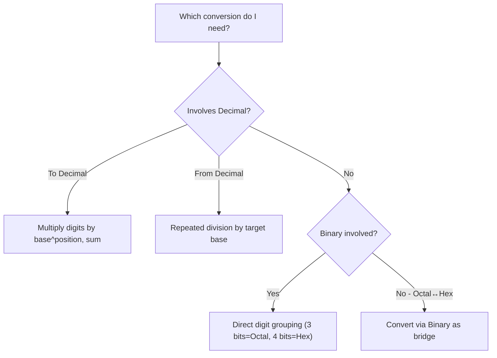

⋆˚꩜｡ **The Golden Rule of this whole chapter:** *Binary is the universal translator.* If you're ever unsure how to convert between two non-decimal systems, converting **through binary** will always work.

---

## 15. Exam Preparation

### Important Concepts

* The three core techniques: repeated division/multiplication (decimal↔others), direct digit grouping (binary↔octal/hex), and binary-as-bridge (octal↔hex).
* Why 3 bits map to one octal digit and 4 bits map to one hex digit (powers of 2 relationship: 2³=8, 2⁴=16).
* Reading order: remainders from repeated division are read **bottom to top**; digit groups from binary are read **left to right** as grouped.
* Why octal and hexadecimal have no direct conversion shortcut between each other.

### Common Confusions

* **Forgetting to reverse remainders** — the very first remainder obtained is actually the **last (rightmost)** digit of the answer, not the first.
* **Wrong grouping size** — using 4-bit groups for octal or 3-bit groups for hex is a very common slip-up; always double check "3 for 8, 4 for 16."
* **Missing leading zero padding** — forgetting to pad the leftmost group with zeros before grouping can shift all digits and produce a wrong answer.
* **Doing hex letter math incorrectly** — always convert A–F to their numeric value (10–15) before multiplying in Hex→Decimal; never try to "multiply a letter."

### Exam-Oriented Questions

**Very Short Questions**
* Convert (12)₁₀ to binary.
* Convert (F)₁₆ to decimal.
* How many bits make up one octal digit? One hex digit?

**Short-Answer Questions**
* Convert (110101)₂ to decimal, octal, and hexadecimal.
* Convert (367)₈ to binary and hexadecimal.
* Convert (2C)₁₆ to binary and octal.

**Long-Answer Questions**
* Convert (250)₁₀ into binary, octal, and hexadecimal, showing all working for each.
* Explain, with a flowchart, why octal-to-hexadecimal conversion must pass through binary.
* Take a binary number of your choice (at least 12 bits) and convert it to decimal, octal, and hexadecimal, verifying that all three answers represent the same value.

**Conceptual Questions**
* Why is binary considered the "central hub" of all number system conversions?
* Why don't octal and hexadecimal have a direct digit-mapping shortcut like binary does with each of them?
* Why is repeated division used for decimal-to-X conversions, while direct grouping is used for binary-to-X conversions?

---

## 16. Final Concept Map

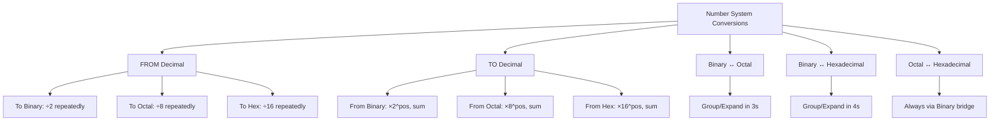

𖹭 *Every conversion in this chapter reduces to one of these three moves: divide/multiply with decimal, group/expand with binary, or bridge through binary for octal↔hex. Master these three, and every conversion becomes routine.*

---

<div align="center">
⋆˚꩜｡
</div>

<div align="center">

</div>

If you enjoyed these notes, you'll probably enjoy the rest too.

| Platform | Link |
|---|---|
| Instagram | @mehrunnisa.ai |
| SubStack | The Epoch |
| YouTube | @mehrunnisa.ai |

**Usage Terms**

These notes are free to use for personal learning, revision, and study. Please do not:
- Sell or redistribute for profit.
- Claim them as your own work.
- Modify and republish without permission.
- Use for any unethical or unauthorized purpose.

Thank you for respecting the effort behind these notes. Happy learning. ♡

</div>
