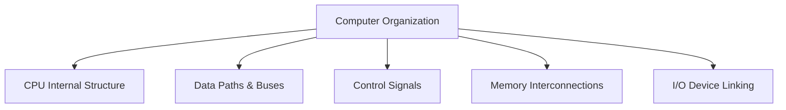

# What is Computer Organization?

⋆˚꩜｡ *Please give a STAR*

---

## Table of Contents

1. [What is Computer Organization?](#1-what-is-computer-organization)
2. [Architecture vs Organization](#2-architecture-vs-organization)
3. [Exam Preparation](#3-exam-preparation)

---

## 1. What is Computer Organization?

### Definition

> **Computer Organization** refers to the **operational structure and behavior** of a computer system — how its hardware components (CPU, memory, I/O devices, buses) are actually **implemented and interconnected** to carry out the instructions defined by the computer's architecture.

### Simple Explanation

* If Computer Architecture tells you **what** a computer should be able to do, Computer Organization tells you **how** it is actually built to do it.
* It deals with the **real, physical, working details** — circuits, control signals, data paths, timing, and the way components are wired together.

### Technical Meaning

* Computer Organization studies the **operational units and their interconnections** that realize the architectural specifications, including:
  * How the CPU is internally structured (registers, ALU, control unit).
  * How data moves between the CPU, memory, and I/O devices.
  * How control signals coordinate hardware operations.
  * How memory is physically organized and accessed.

### What Computer Organization Covers

* **Hardware details** — circuit design, control signal generation, data pathways.
* **Interconnections** — how the CPU, memory, and I/O devices are linked (buses, interfaces).
* **Implementation choices** — the specific technology and design used to realize architectural features (e.g., how pipelining or caching is actually built).
* **Operational behavior** — the sequence of steps hardware follows to execute an instruction.



### Example

* Architecture might specify: *"This processor supports addition of two integers."*
* Organization determines: *how the ALU circuit is built to perform that addition, which registers hold the operands, how many clock cycles it takes, and how control signals trigger each step.*

⋆.˚ **Key Point:** Computer Organization is concerned with the **realization** of architectural features — the actual engineering that makes the specification work in physical hardware.

---

## 2. Architecture vs Organization

### Why This Distinction Matters

* This is one of the **most frequently tested conceptual distinctions** in Computer Organization & Architecture courses — students often use the two terms interchangeably, but they describe **different levels of abstraction**.

### Computer Architecture

> **Computer Architecture** refers to the **attributes visible to the programmer** — the conceptual structure and functional behavior of a computer system, as seen from the perspective of someone writing programs or instructions for it.

* Concerned with **"what"** the system does.
* Includes: instruction set (ISA), addressing modes, data types supported, number of registers exposed to the programmer, and how memory is addressed logically.
* These attributes have a **direct impact on the logical execution of a program**.

### Computer Organization

> **Computer Organization** refers to the **operational units and their interconnections** that realize the architectural specification — the way hardware is actually structured and functions internally.

* Concerned with **"how"** the system does it.
* Includes: control signals, hardware interfaces, physical memory technology, actual circuit design, and timing.
* These details are usually **hidden from the programmer** and can vary between implementations of the same architecture.

### Direct Comparison Table

| Aspect | Computer Architecture | Computer Organization |
|---|---|---|
| Focus | **What** the system does (functional behavior) | **How** the system does it (implementation) |
| Visibility | Visible to the **programmer** | Usually **hidden**, internal hardware detail |
| Deals With | Instruction set, addressing modes, data types | Circuit design, control signals, data paths |
| Nature | Conceptual, logical structure | Physical, operational structure |
| Changeability | Stays the same across different implementations of the same architecture | Can differ between implementations, even for the same architecture |
| Example Concern | "Does the CPU support multiplication?" | "How is the multiplication circuit built and how many cycles does it take?" |

### Real-World Example

* Two different computers can share the **same architecture** (e.g., both implement the same instruction set) but have **completely different organizations** (different cache sizes, different pipelining, different clock speeds) — because architecture is the specification, and organization is the specific implementation choice.
* Example: Multiple processor models from the same family may support the **same instruction set (same architecture)** while differing internally in speed, cache design, and circuitry (**different organization**).


### Architecture vs Organization — Layered View

```text
              Programmer's View
                     │
        ┌────────────▼────────────┐
        │   Computer Architecture  │   ← "What" (Instruction Set, Registers exposed)
        │        (Conceptual)      │
        └────────────┬────────────┘
                      │  realized by
        ┌────────────▼────────────┐
        │  Computer Organization   │   ← "How" (Circuits, Control Signals)
        │        (Physical)        │
        └────────────┬────────────┘
                      │
                   Hardware
```

⋆˚꩜｡ **Simple way to remember:** *Architecture is the blueprint (design plan); Organization is the actual construction (how it's built).*

---

## 3. Exam Preparation

### Important Definitions

* Computer Organization
* Computer Architecture

### Important Concepts

* Architecture defines **what** a system can do (programmer-visible behavior); Organization defines **how** it actually does it (hardware implementation).
* Two systems can share the same architecture but differ in organization.
* Organization details are usually **hidden** from the programmer, while architecture details are **exposed** to them.

### Common Confusions

* **Using the terms interchangeably** — Architecture and Organization describe **different levels of abstraction**, not the same thing.
* **Assuming same architecture means identical hardware** — systems with the same architecture (same instruction set) can have very different organizations (speed, circuit design, cache).
* **Thinking Organization is only about physical hardware** — it also includes the *operational* logic (control signals, sequencing) that makes the hardware function correctly, not just its physical layout.

### Exam-Oriented Questions

**Very Short Questions**
* Define Computer Organization.
* Define Computer Architecture.
* Is the instruction set part of architecture or organization?

**Short-Answer Questions**
* Differentiate between Computer Architecture and Computer Organization with one example each.
* Why can two computers with the same architecture have different organizations?

**Long-Answer Questions**
* Explain Computer Organization in detail, covering what it deals with and why it matters.
* Discuss the distinction between Computer Architecture and Computer Organization, using a real-world example to support your answer.

**Conceptual Questions**
* Why is the architecture-organization distinction important when designing a family of processors?
* Why are organizational details usually hidden from the programmer while architectural details are not?


---

 
<div align="center">

</div>

<div align="center">

 ***If you enjoyed these notes, you'll probably enjoy the rest too.***
⋆˚꩜｡

</div>


 
| Platform | Link |
|---|---|
| Instagram | @mehrunnisa.ai |
| SubStack | The Epoch |
| YouTube | @mehrunnisa.ai |
 
**Usage Terms**
 
These notes are free to use for personal learning, revision, and study. Please do not:
- Sell or redistribute for profit.
- Claim them as your own work.
- Modify and republish without permission.
- Use for any unethical or unauthorized purpose.
Thank you for respecting the effort behind these notes. Happy learning. ♡
 
</div>
