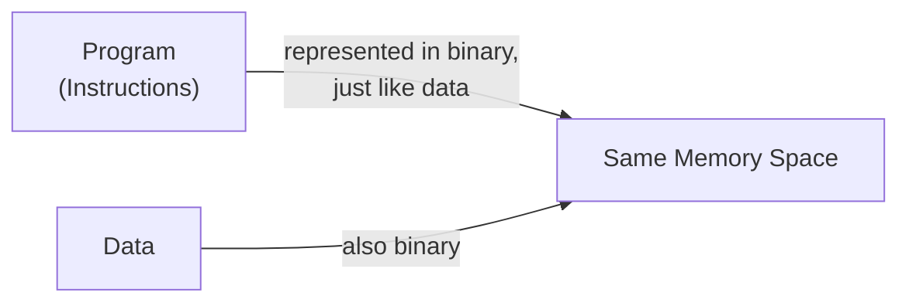
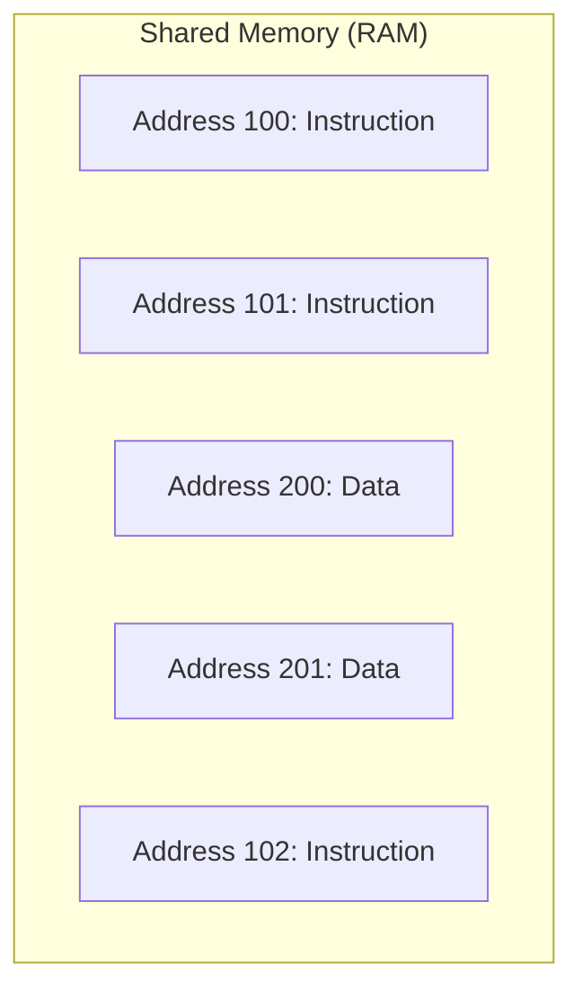
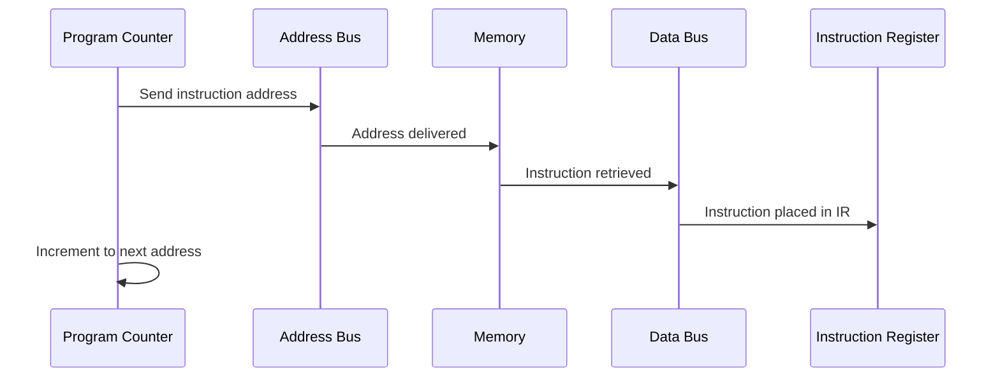
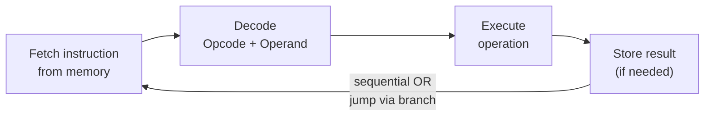
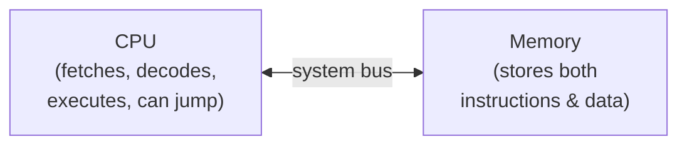
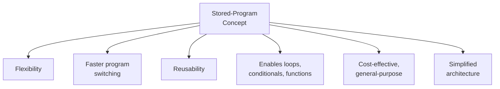
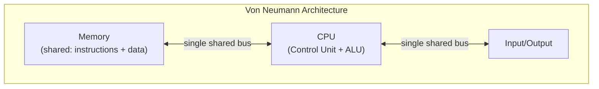

# 2.10 Stored-Program Concept ⋆˚꩜｡

> Give a STAR ♡

---

## Table of Contents (tap to zoom there)

- [What is the Stored-Program Concept?](#what-is-the-stored-program-concept)
- [Basic Principle](#basic-principle)
- [Instructions and Data Stored in Memory](#instructions-and-data-stored-in-memory)
- [Memory Addressing](#memory-addressing)
- [Fetching Instructions from Memory](#fetching-instructions-from-memory)
- [Execution of Stored Instructions](#execution-of-stored-instructions)
- [Role of CPU and Memory](#role-of-cpu-and-memory)
- [Advantages of the Stored-Program Concept](#advantages-of-the-stored-program-concept)
- [Stored-Program Concept and Von Neumann Architecture](#stored-program-concept-and-von-neumann-architecture)

---

## What is the Stored-Program Concept?

Okay so imagine, back in the day, if you wanted your computer to do a DIFFERENT task, you'd have to literally go in and physically rewire cables and flip switches to reprogram it. Every. Single. Time. That's giving "changing outfits by getting entirely new skin" levels of extra.

The **Stored-Program Concept** flipped this completely by saying: **"why don't we just store the instructions (the program) INSIDE the computer's memory, exactly like we store data, so the computer can read and follow them automatically without needing any physical rewiring?"**

Formally: **The Stored-Program Concept is the fundamental idea that both the instructions (program) AND the data a computer works with are stored together in the same memory, allowing the computer to fetch, interpret, and execute instructions automatically in sequence.**

This idea is credited to (and named after) mathematician **John von Neumann**, though several people contributed to it around the same era. It's basically THE foundational idea underlying almost every computer that exists today.

---

## Basic Principle

The core principle boils down to a few key beliefs, stacked together:

1. **Programs are just another form of data** — instructions can be represented in binary, exactly like numbers or text, so there's no reason they can't live in the same memory
2. **Memory is shared** — one single memory space holds BOTH instructions and data, no separate physical storage needed for each
3. **Sequential execution by default** — instructions are stored in an ordered sequence, and the CPU executes them one after another (unless told to jump elsewhere via control flow instructions)
4. **Programs can modify themselves or be replaced easily** — since a program is just data sitting in memory, a NEW program can simply be loaded into that same memory to replace the old one, no hardware rewiring needed

Basically: the big "aha" moment was realizing instructions and data are secretly the SAME kind of thing (binary sequences) once you strip away the meaning — so why not store them together and let the computer sort out what's what based on context?

---

## Instructions and Data Stored in Memory

This is the practical application of the principle above:

- Both **program instructions** and the **data** those instructions operate on are loaded into the SAME main memory (RAM) before execution begins
- They occupy DIFFERENT memory locations (different addresses) within that shared memory, but there's no separate hardware division between "instruction memory" and "data memory" — it's all one unified pool
- The CPU distinguishes between them purely based on **context** — specifically, whatever address the **Program Counter** is currently pointing to gets treated/fetched as an instruction; anything fetched separately as an operand/address reference gets treated as data

Basically it's giving "roommates sharing one big closet" — instructions and data literally live together, just organized by which "shelf" (address) they're placed on.

---

## Memory Addressing

For this whole system to work, every single instruction AND every piece of data needs its own **unique address**, so the CPU always knows exactly where to find (or place) something.

- **Memory Addressing** = the system by which each memory location is assigned a unique numeric identifier
- The **Program Counter (PC)** always holds the address of the NEXT instruction to be fetched — this is literally how the CPU "knows where it is" in the program's execution at any given moment
- When an instruction needs to reference data, its **Operand** portion often contains the memory address of that data (rather than the data itself), so the CPU knows exactly where to go fetch it
- This connects directly back to the address bus concept — addresses generated by the CPU (via PC or operand) travel over the address bus to locate the correct memory cell

Basically: addressing is the "GPS coordinates" system that makes the whole stored-program idea actually functional — without unique addresses, the CPU would have no way to find ANYTHING in that shared memory pool.

---

## Fetching Instructions from Memory

This is where the Stored-Program Concept directly connects to the Fetch-Decode-Execute cycle we covered earlier:

1. **Program Counter** holds the address of the next instruction
2. That address is sent to memory via the **Address Bus**
3. A **Read control signal** tells memory to retrieve whatever's stored at that address
4. Memory sends the instruction back via the **Data Bus** into the **Instruction Register**
5. Program Counter automatically increments, ready to fetch the NEXT instruction in sequence

Because instructions are STORED in memory (not hardwired into the machine), this fetch process can pull ANY sequence of instructions — meaning the exact same hardware can run completely different programs just by loading different instructions into memory. That's literally the whole magic trick.

---

## Execution of Stored Instructions

Once fetched, stored instructions go through the familiar cycle:

1. **Decode** — Control Unit interprets the Opcode + Operand of the fetched instruction
2. **Execute** — the actual operation is carried out (ALU for calculations, data movement, or control flow changes)
3. **Store** (if needed) — result gets written back into memory or held in a register

The KEY thing that makes this "stored-program" specific: since instructions are sitting in memory as addressable data, the program can include **branch/jump instructions** that change WHICH address the Program Counter jumps to next — meaning execution doesn't HAVE to be strictly sequential. This is what enables loops, conditional statements (if-else), and function calls in programming — all built on top of this basic stored-program foundation.

---

## Role of CPU and Memory

Quick recap of who does what in this whole setup:

### CPU
- Fetches instructions from memory using the Program Counter
- Decodes and executes each instruction via the Control Unit and ALU
- Can modify the flow of execution (via jump/branch instructions) by changing what address the Program Counter points to next

### Memory
- Acts as the SINGLE shared storage space holding both the program (instructions) and the data
- Passively responds to Read/Write requests from the CPU — it doesn't "know" or "care" whether what's stored at a given address is an instruction or data, that distinction is entirely up to how the CPU chooses to interpret/access it

This CPU-Memory relationship, built entirely around this shared-storage idea, is really the backbone of the entire stored-program concept — remove either piece and the whole thing falls apart.

---

## Advantages of the Stored-Program Concept

Why did this idea basically take over the entire computing world? Let's get into it:

1. **Flexibility** — the same hardware can run ANY program just by loading different instructions into memory, no physical rewiring needed
2. **Faster program changes** — switching tasks is as simple as loading a new set of instructions, way faster than the old rewiring method
3. **Reusability** — programs can be saved, reloaded, and reused anytime without needing to reconstruct hardware setups
4. **Enables complex programs** — since instructions can include jumps/branches, this allows for loops, conditionals, functions, recursion — basically all the building blocks of modern programming
5. **Cost-effective** — a single general-purpose machine can handle countless different tasks, instead of needing a dedicated machine built for each specific task
6. **Simplified computer design** — one unified memory system instead of separate physical storage systems for instructions vs data, which simplifies the overall architecture

---

## Stored-Program Concept and Von Neumann Architecture

- The Stored-Program Concept is the CORE idea behind what's known as the **Von Neumann Architecture** — named after John von Neumann, who proposed this design in a famous 1945 paper.
- Von Neumann Architecture describes a computer system with:
  - A single **shared memory** for both instructions and data (exactly what we've been covering)
  - A **CPU** with a Control Unit and ALU
  - **Input/Output** mechanisms
  - A **single bus system** connecting these components, over which BOTH instructions and data travel (they can't be fetched at the exact same time since they share the same pathway — this is actually a known limitation, sometimes called the **"Von Neumann Bottleneck"**)

Fun fact: there's also an alternative design called **Harvard Architecture**, which uses SEPARATE memory (and separate buses) for instructions and data, avoiding the "bottleneck" issue — but that's a whole separate topic for another day. For now, just know: **Stored-Program Concept = the foundational IDEA, Von Neumann Architecture = the actual physical DESIGN that implements this idea.**

---

## tl;dr for last-minute revision panic

- **Stored-Program Concept** = storing both instructions (program) AND data together in the same memory, so the computer can automatically fetch and execute them without physical rewiring
- **Basic Principle**: programs are just binary data too, shared memory holds both, execution is sequential by default (with jumps possible), programs can be swapped easily since they're just stored data
- Instructions and Data occupy different addresses within the SAME shared memory; CPU tells them apart via context (Program Counter)
- **Memory Addressing** gives every instruction/data a unique address so the CPU can locate it — Program Counter tracks the next instruction's address
- **Fetching**: PC → Address Bus → Memory → Data Bus → Instruction Register → PC increments
- **Execution**: Decode → Execute → Store (if needed); jump/branch instructions can redirect the Program Counter, enabling loops/conditionals
- **CPU** fetches/decodes/executes and can redirect flow; **Memory** passively stores both instructions and data
- **Advantages**: flexibility, faster program switching, reusability, enables complex programs, cost-effective, simplified design
- **Von Neumann Architecture** = the physical design built on the Stored-Program Concept — shared memory + CPU + I/O + single shared bus (which causes the "Von Neumann Bottleneck" since instructions & data can't be fetched simultaneously)

that's the concept that basically built modern computing, u understand it now, absolute legend ⸜(｡˃ ᵕ ˂ )⸝♡

---

⋆˚꩜｡

If you enjoyed these notes, you'll probably enjoy the rest too.

| Platform | Link |
|---|---|
| Instagram | @mehrunnisa.ai |
| SubStack | The Epoch |
| YouTube | @mehrunnisa.ai |

**Usage Terms**

These notes are free to use for personal learning, revision, and study. Please do not:
- Sell or redistribute for profit.
- Claim them as your own work.
- Modify and republish without permission.
- Use for any unethical or unauthorized purpose.

Thank you for respecting the effort behind these notes. Happy learning. ♡

