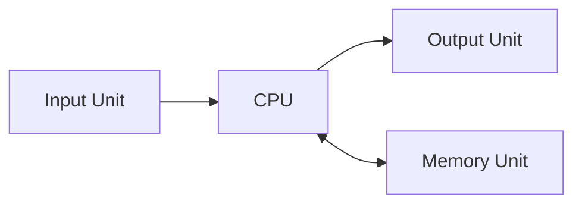
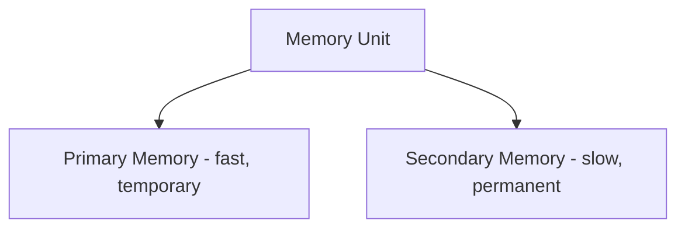
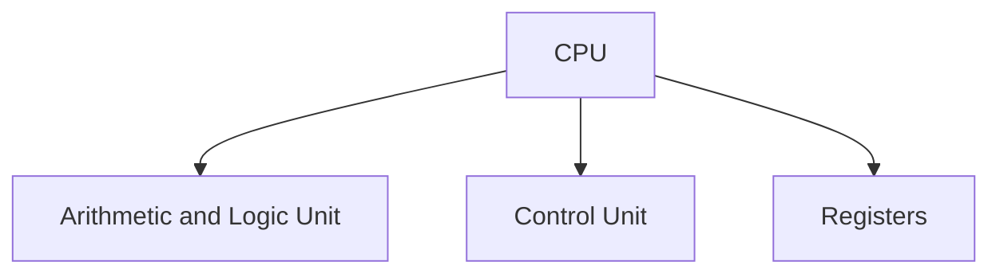
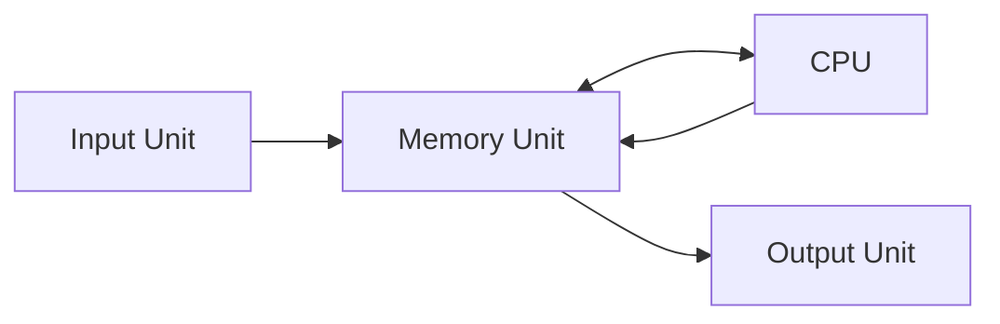

# 2.2 Basic Functional Units

⋆˚꩜｡ *Please give a STAR*

---

## Table of Contents

1. [Overview](#1-overview)
2. [Input Unit](#2-input-unit)
3. [Output Unit](#3-output-unit)
4. [Memory Unit](#4-memory-unit)
5. [CPU](#5-cpu)
6. [Exam Preparation](#6-exam-preparation)

---

## 1. Overview

### Concept

Every computer system, regardless of its size or purpose, is built from **four basic functional units** that work together to accept data, process it, store it, and produce results.



```text
                    Basic Functional Units
                              │
        ┌───────────┬────────┼────────┬───────────┐
        │           │                 │
     Input        Output          Memory          CPU
      Unit          Unit            Unit
```

⋆.˚ *These four units form the foundation on which all computer organization is built — every other component studied later fits into one of these four categories.*

---

## 2. Input Unit

### Concept

> The **Input Unit** is responsible for **accepting data and instructions from the outside world** and converting them into a form the computer can process (i.e., binary/electrical signals).

### Function

* Accepts raw data from the user or an external source.
* Converts this data into **machine-readable form** (binary signals).
* Sends the converted data to the memory or CPU for further processing.

### Examples

* Keyboard, mouse, scanner, microphone, joystick.


⋆˚꩜｡ **Key Point:** Without the Input Unit, a computer would have no way to receive data or commands from the outside world.

---

## 3. Output Unit

### Concept

> The **Output Unit** is responsible for **presenting the processed results** of the computer back to the user, converting the computer's internal binary results into a **human-understandable form**.

### Function

* Receives processed data (results) from the CPU.
* Converts this data from binary/machine form into a format understandable by humans (text, images, sound, printed pages).
* Displays or delivers the final output to the user.

### Examples

* Monitor, printer, speakers, plotter.


⋆.˚ **Key Point:** The Output Unit performs the **reverse conversion** of the Input Unit — machine form back to human-understandable form.

---

## 4. Memory Unit

### Concept

> The **Memory Unit** is responsible for **storing data, instructions, and results**, both temporarily (during processing) and permanently (for later use).

### Function

* Stores the **input data** until it is needed for processing.
* Stores **intermediate results** produced during processing.
* Stores the **final output** until it is sent to the Output Unit.
* Holds the **instructions (program)** that the CPU needs to execute.

### Types (Briefly)

* **Primary Memory (Main Memory)** — fast, temporary storage directly accessible by the CPU (e.g., RAM).
* **Secondary Memory** — slower, permanent storage used for long-term data retention (e.g., hard disk, SSD).



⋆.˚ **Key Point:** The CPU can only directly execute instructions and process data that reside in **primary memory** — this is why the Memory Unit is so tightly linked to the CPU's operation.

---

## 5. CPU

### Concept

> The **CPU (Central Processing Unit)** is the **"brain" of the computer** — the functional unit responsible for **fetching, interpreting, and executing instructions**, and performing all data processing and computation.

### Function

* Fetches instructions and data from the Memory Unit.
* Interprets (decodes) what operation the instruction requires.
* Executes the operation (arithmetic, logical, or control operation).
* Sends results back to the Memory Unit or Output Unit.

### Main Components of the CPU

* **Arithmetic and Logic Unit (ALU)** — performs all arithmetic (addition, subtraction) and logical (comparison, AND/OR) operations.
* **Control Unit (CU)** — directs and coordinates the activities of all other units, ensuring instructions are fetched, decoded, and executed in the correct sequence.
* **Registers** — small, high-speed storage locations within the CPU used to hold data, instructions, and addresses temporarily during processing.



### How the CPU Connects to the Other Units



⋆˚꩜｡ **Key Point:** The CPU doesn't work in isolation — it constantly communicates with the Memory Unit to fetch instructions/data and store results, making Memory and CPU the two most tightly interlinked functional units.

---

## 6. Exam Preparation

### Important Definitions

* Input Unit
* Output Unit
* Memory Unit
* CPU (Central Processing Unit)
* ALU
* Control Unit

### Important Concepts

* The four basic functional units and the distinct role each one plays.
* Input Unit converts human data → machine form; Output Unit converts machine form → human-readable form (reverse of each other).
* Memory Unit stores data/instructions/results and is closely tied to CPU operation.
* CPU consists of ALU, Control Unit, and Registers, and coordinates the entire processing cycle.

### Common Confusions

* **Input Unit vs Output Unit** — easy to remember as **opposite directions of conversion**: Input = human→machine, Output = machine→human.
* **Memory Unit vs CPU** — Memory **stores** data/instructions; the CPU **processes** them. Memory itself does not perform calculations.
* **CPU vs ALU** — the ALU is only **one part** of the CPU (the part that does calculations); the CPU as a whole also includes the Control Unit and Registers.

### Exam-Oriented Questions

**Very Short Questions**
* Name the four basic functional units of a computer.
* What does the ALU do?
* Give two examples of input devices.

**Short-Answer Questions**
* Explain the function of the Memory Unit.
* Differentiate between the Input Unit and Output Unit.
* What are the three main components of the CPU?

**Long-Answer Questions**
* Explain all four basic functional units of a computer with a diagram showing how they interact.
* Describe the CPU's internal structure and explain how it coordinates with the Memory Unit during processing.

**Conceptual Questions**
* Why is the Memory Unit considered essential even though it doesn't perform any processing itself?
* Why must input data always be converted into binary form before the CPU can process it?
