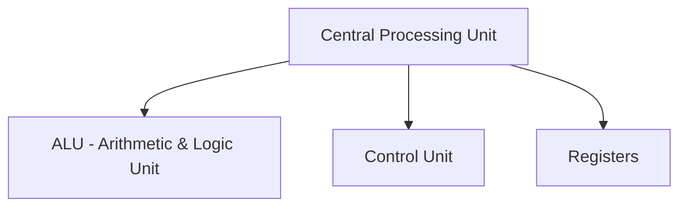
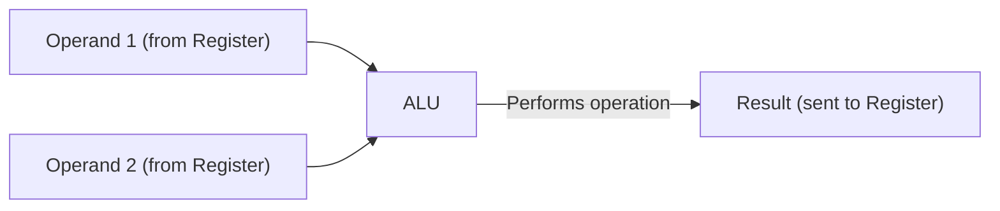
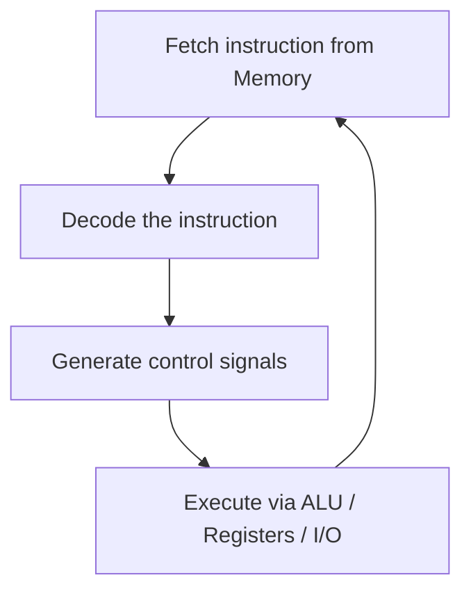
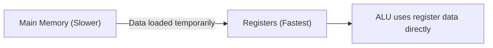

# 2.3 Central Processing Unit

⋆˚꩜｡ *Please give a STAR*

---

## Table of Contents

1. [Overview](#1-overview)
2. [ALU (Arithmetic and Logic Unit)](#2-alu-arithmetic-and-logic-unit)
3. [Control Unit](#3-control-unit)
4. [Registers](#4-registers)
5. [Exam Preparation](#5-exam-preparation)

---

## 1. Overview

### Concept

> The **Central Processing Unit (CPU)** is the **"brain" of the computer** — it fetches, decodes, and executes instructions, and performs all data processing. Internally, the CPU is built from **three core components** working together.



```text
                         CPU
                          │
          ┌───────────────┼───────────────┐
          │               │               │
         ALU        Control Unit      Registers
   (Does the math)  (Directs traffic) (Holds data briefly)
```

⋆.˚ **Simple way to remember:** *ALU calculates, Control Unit coordinates, Registers store — temporarily, right where the action happens.*

---

## 2. ALU (Arithmetic and Logic Unit)

### Definition

> The **ALU** is the component of the CPU responsible for performing **all arithmetic and logical operations** on data.

### Function

* **Arithmetic operations** — addition, subtraction, multiplication, division.
* **Logical operations** — comparisons (equal to, greater than, less than) and logical operations (AND, OR, NOT).
* Takes input from **registers**, performs the required operation, and sends the result back to a register or memory.

### How It Works (Conceptually)



### Example

* Adding two numbers (`5 + 3`) — both values are loaded into registers, the ALU performs the addition, and the result (`8`) is placed back into a register.

⋆˚꩜｡ **Key Point:** The ALU is the **only part of the CPU that actually "computes"** — every calculation and comparison a computer performs happens here.

---

## 3. Control Unit

### Definition

> The **Control Unit (CU)** is the component of the CPU that **directs and coordinates** the operations of the entire computer system, without performing any actual data processing itself.

### Function

* **Fetches** instructions from memory.
* **Decodes** the instruction to determine what operation is required.
* **Generates control signals** that direct the ALU, registers, memory, and I/O devices on what to do and when.
* Ensures instructions are executed in the **correct sequence**.

### Control Unit's Role in the Instruction Cycle



### Control Unit vs ALU — Quick Distinction

| Control Unit | ALU |
|---|---|
| **Directs** operations (does not compute) | **Performs** the actual computation |
| Generates control signals | Executes arithmetic/logic based on signals |
| Acts like a "manager" | Acts like a "worker" |

⋆.˚ **Key Point:** The Control Unit itself performs **no arithmetic or logic** — it purely manages and sequences the activities of the other components.

---

## 4. Registers

### Definition

> **Registers** are small, **high-speed storage locations** built directly into the CPU, used to hold data, instructions, and addresses **temporarily** during processing.

### Function

* Hold data that is **currently being processed** by the ALU.
* Hold **addresses** of memory locations being accessed.
* Hold **instructions** currently being fetched or decoded.
* Provide the **fastest possible access speed** for the CPU, much faster than main memory (RAM).

### Why Registers Are Needed

* The ALU cannot operate directly on data sitting in main memory at the speed the CPU requires — registers sit **right inside the CPU**, eliminating the delay of constantly accessing slower memory.



### Registers vs Main Memory — Quick Distinction

| Registers | Main Memory (RAM) |
|---|---|
| Located **inside** the CPU | Located **outside** the CPU |
| Extremely **fast** access | **Slower** access compared to registers |
| Very **small** storage capacity | Much **larger** storage capacity |
| Holds data only **temporarily**, during active processing | Holds data for the duration of a program's execution |

⋆˚꩜｡ **Key Point:** Registers are the **closest, fastest** storage a CPU has — every value the ALU works on must first pass through a register.

---

## 5. Exam Preparation

### Important Definitions

* ALU (Arithmetic and Logic Unit)
* Control Unit
* Registers

### Important Concepts

* The three components of the CPU and the distinct role each plays: ALU computes, Control Unit coordinates, Registers store temporarily.
* The Control Unit generates control signals but does not perform computation itself.
* Registers provide the fastest possible data access because they are located inside the CPU, unlike main memory.

### Common Confusions

* **Control Unit vs ALU** — the Control Unit **manages and directs**; the ALU **calculates**. The Control Unit does not perform arithmetic or logic itself.
* **Registers vs Main Memory** — registers are **small and extremely fast**, located inside the CPU; main memory is **larger but slower**, located outside the CPU.
* **Thinking the CPU "is" the ALU** — the ALU is only **one part** of the CPU; the Control Unit and Registers are equally essential components.

### Exam-Oriented Questions

**Very Short Questions**
* What does ALU stand for?
* What is the primary function of the Control Unit?
* Where are registers located?

**Short-Answer Questions**
* Explain the function of the ALU with an example.
* Differentiate between the Control Unit and the ALU.
* Why are registers faster than main memory?

**Long-Answer Questions**
* Explain the three core components of the CPU and how they work together during instruction execution.
* Describe the Control Unit's role in the fetch-decode-execute process.

**Conceptual Questions**
* Why can't the ALU operate directly on data stored in main memory?
* Why is the Control Unit described as "directing traffic" rather than "doing work"?


---

 
<div align="center">
⋆˚꩜｡
</div>
<div align="center">

</div>
If you enjoyed these notes, you'll probably enjoy the rest too.
 
| Platform | Link |
|---|---|
| Instagram | @mehrunnisa.ai |
| SubStack | The Epoch |
| YouTube | @mehrunnisa.ai |
 
**Usage Terms**
 
These notes are free to use for personal learning, revision, and study. Please do not:
- Sell or redistribute for profit.
- Claim them as your own work.
- Modify and republish without permission.
- Use for any unethical or unauthorized purpose.
Thank you for respecting the effort behind these notes. Happy learning. ♡
 
</div>
