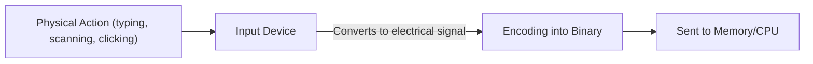
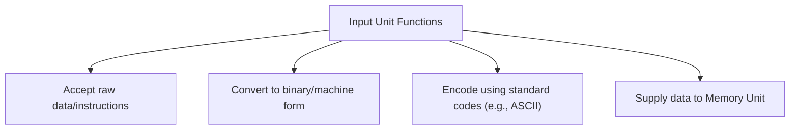
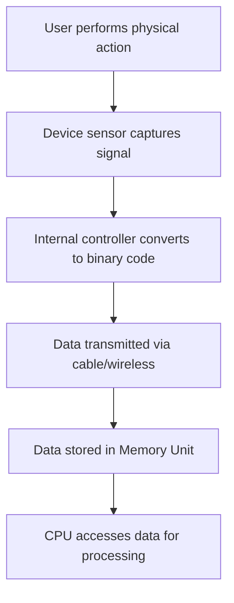
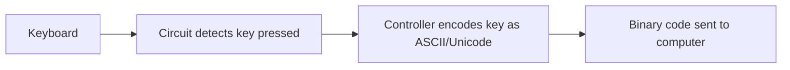
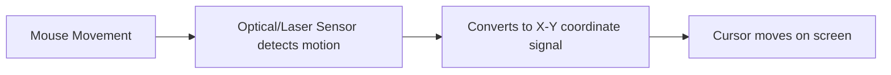
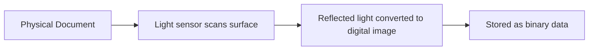
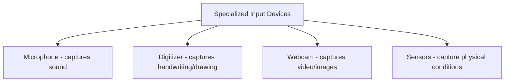
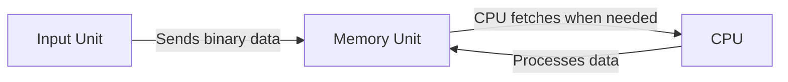
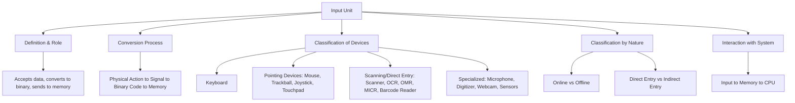

# 2.4 Input Unit

⋆˚꩜｡ *Please give a STAR*

---

## Table of Contents

1. [What is the Input Unit?](#1-what-is-the-input-unit)
2. [Functions of the Input Unit](#2-functions-of-the-input-unit)
3. [How the Input Unit Works — The Conversion Process](#3-how-the-input-unit-works--the-conversion-process)
4. [Characteristics of a Good Input Device](#4-characteristics-of-a-good-input-device)
5. [Classification of Input Devices](#5-classification-of-input-devices)
6. [Keyboard](#6-keyboard)
7. [Pointing Devices](#7-pointing-devices)
8. [Scanning / Direct Data-Entry Devices](#8-scanning--direct-data-entry-devices)
9. [Other Specialized Input Devices](#9-other-specialized-input-devices)
10. [Online vs Offline Input Devices](#10-online-vs-offline-input-devices)
11. [Direct Entry vs Indirect Entry Devices](#11-direct-entry-vs-indirect-entry-devices)
12. [Input Unit's Interaction with CPU and Memory](#12-input-units-interaction-with-cpu-and-memory)
13. [Exam Preparation](#13-exam-preparation)
14. [Final Concept Map](#14-final-concept-map)

---

## 1. What is the Input Unit?

### Definition

> The **Input Unit** is the functional unit of a computer responsible for **accepting data and instructions from the external environment** (typically from a user) and **converting them into a machine-readable (binary) form** that the CPU and memory can process.

### Simple Explanation

* Every computer needs a way to receive information from the outside world — whether that's a person typing, a document being scanned, or a sensor sending a signal.
* The Input Unit is the **entry gateway** of the computer system — nothing can be processed until it first passes through this unit.

### Technical Meaning

* Internally, all input devices work by converting a **physical action or signal** (a keystroke, a mouse movement, light reflected off a scanned page) into **electrical signals**, which are then encoded into **binary digits (0s and 1s)** — the only form of data the CPU can actually process.



⋆.˚ *The Input Unit doesn't process or interpret meaning — it purely captures and converts raw data into a form the system can work with.*

---

## 2. Functions of the Input Unit

The Input Unit performs several distinct tasks, not just "accepting data":

* **Accepting Data and Instructions**
  * Takes raw input from the user or an external source (a document, a sensor, another device).
* **Converting Input into Machine-Readable Form**
  * Translates human-understandable input (a keypress, a spoken word, an image) into binary code.
* **Supplying Converted Data to the Computer**
  * Sends this binary data to the **Memory Unit** for temporary storage, ready to be used by the CPU.
* **Validating and Encoding**
  * Many input devices also perform basic checks/encoding (e.g., a keyboard encodes each key into a standard character code such as ASCII/Unicode) before passing data along.



---

## 3. How the Input Unit Works — The Conversion Process

### Step-by-Step Process

1. **Physical Action Occurs** — the user performs an action (presses a key, moves a mouse, scans a document).
2. **Device Captures the Signal** — the input device's internal sensor/circuitry detects this action as an **electrical signal**.
3. **Signal Conversion** — the device's internal controller converts this electrical signal into a **standardized digital code** (e.g., a keyboard converts a keypress into its ASCII/Unicode binary value).
4. **Data Transmission** — the binary-encoded data travels through a **cable or wireless connection** to the computer's input interface (a port or controller).
5. **Data Reaches Memory** — the binary data is placed into the **Memory Unit**, ready for the CPU to access and process.



### Example: Pressing the Key "A" on a Keyboard

```text
User presses "A"
     ↓
Keyboard circuit detects which key was pressed
     ↓
Keyboard controller looks up the ASCII code for "A" → 01000001
     ↓
Binary code (01000001) sent to the computer
     ↓
Stored in Memory Unit, ready for CPU to use
```

---

## 4. Characteristics of a Good Input Device

* **Accuracy** — must capture the exact data intended, without distortion or error.
* **Speed** — should be able to accept and convert data quickly, without becoming a bottleneck.
* **Reliability** — should function consistently over repeated, prolonged use.
* **Ease of Use** — should be simple and comfortable for the user to operate.
* **Compatibility** — should work correctly with the given computer system's ports/interfaces.

⋆˚꩜｡ *These characteristics are why different input devices exist for different tasks — a keyboard is ideal for text, but a scanner is ideal for images, because each is optimized for accuracy and speed in its specific use case.*

---

## 5. Classification of Input Devices

Input devices are broadly grouped based on **how** they capture data:

```text
                          Input Devices
                                │
      ┌──────────────┬─────────┼──────────┬────────────────┐
      │               │                    │                │
  Keyboard        Pointing            Scanning /        Other Specialized
   Devices          Devices          Direct Entry            Devices
                (Mouse, Joystick,    (Scanner, OCR,      (Microphone, Sensors,
                 Trackball, etc.)     OMR, MICR, etc.)     Digitizer, etc.)
```

The following sections cover each category and its major devices in detail.

---

## 6. Keyboard

### Definition

> The **keyboard** is the most common input device, used to enter **alphabetic, numeric, and special characters**, as well as control commands, into the computer.

### How It Works

* Each key press causes a change in an electrical circuit beneath the key.
* The keyboard's internal controller detects **which key** was pressed and how long it was held.
* The controller converts the keypress into its corresponding **character code** (commonly **ASCII** or **Unicode**) and sends this binary code to the computer.

### Key Groups on a Standard Keyboard

* **Alphanumeric Keys** — letters (A–Z) and numbers (0–9).
* **Function Keys** — F1–F12, used for special commands specific to software/OS.
* **Control Keys** — Ctrl, Alt, Shift, Esc — used in combination with other keys for commands.
* **Navigation Keys** — arrow keys, Home, End, Page Up/Down — used to move the cursor.
* **Numeric Keypad** — a separate number pad for fast numeric entry.



⋆.˚ **Key Point:** The keyboard is a **direct entry device** — data goes straight from the human action into digital form, with no intermediate physical document involved.

---

## 7. Pointing Devices

### Concept

> **Pointing devices** allow the user to control an on-screen pointer and interact with graphical elements, rather than entering text directly.

### Mouse

* Detects **movement** (traditionally via a rolling ball, now typically via optical/laser sensors) and translates this into corresponding **cursor movement** on screen.
* Buttons on the mouse (left, right, scroll wheel) send additional **click/selection signals**.



### Trackball

* Works like an **"upside-down mouse"** — instead of moving the whole device, the user rotates a ball embedded in a fixed housing to move the cursor.
* Useful where desk space is limited, since the device itself doesn't need to move.

### Joystick

* A lever that pivots on a base, sending directional and positional data to the computer.
* Commonly used in **gaming** and **simulation/control systems**.

### Touchpad

* A flat, touch-sensitive surface (common on laptops) that detects the position and movement of a finger to control the cursor.

### Pointing Devices — Quick Comparison

| Device | Primary Use | Movement Method |
|---|---|---|
| Mouse | General cursor control | Physical movement of the device |
| Trackball | Cursor control in limited space | Rotating an embedded ball |
| Joystick | Gaming, simulations | Tilting a pivoted lever |
| Touchpad | Laptop cursor control | Finger movement on a flat surface |

---

## 8. Scanning / Direct Data-Entry Devices

### Concept

> These devices **read data directly from a physical source** (a printed page, a card, a document) and convert it into digital form, without requiring manual typing.

### Scanner

* Captures an **image of a physical document** by passing a light-sensing mechanism over it.
* Converts the reflected light patterns into a digital image, made up of binary-coded pixel data.



### OCR (Optical Character Recognition)

* A technology (often used **with** a scanner) that recognizes **printed or handwritten text** within a scanned image and converts it into **editable, machine-readable text**, rather than just a picture of the text.

### OMR (Optical Mark Recognition)

* Detects the **presence of marks** (like pencil-filled bubbles) at specific positions on a form.
* Commonly used for **checking answer sheets** in multiple-choice exams and surveys.

### MICR (Magnetic Ink Character Recognition)

* Reads characters printed using **special magnetic ink**, commonly used on **bank cheques**, since magnetic ink is hard to forge and can be read even if partially obscured.

### Barcode Reader

* Reads **barcodes** (patterns of parallel lines of varying widths) using a light beam, converting the pattern into the encoded numeric/alphanumeric data.
* Widely used in **retail billing and inventory management**.

### Scanning Devices — Quick Comparison

| Device | Reads | Common Use |
|---|---|---|
| Scanner | Full document/image | Digitizing documents/photos |
| OCR | Printed/handwritten text within a scan | Converting scanned text to editable text |
| OMR | Filled-in marks/bubbles | Exam answer sheets, surveys |
| MICR | Magnetic ink characters | Bank cheque processing |
| Barcode Reader | Barcodes | Retail billing, inventory |

⋆˚꩜｡ **Key Point:** All these devices belong to the same family because they capture data **directly from a physical source**, avoiding manual re-typing and the errors that can come with it.

---

## 9. Other Specialized Input Devices

### Microphone

* Captures **sound waves** (such as spoken voice) and converts them into an electrical signal, which is then digitized for use in voice input, recording, or voice-recognition systems.

### Digitizer / Graphics Tablet

* Converts **hand-drawn images, sketches, or handwriting** made with a stylus into digital form, commonly used by designers and artists.

### Webcam

* Captures **live video/images** and converts the visual data into a digital signal for the computer.

### Sensors

* Devices that detect **physical conditions** (temperature, light, motion, pressure) in the environment and convert these readings into digital data for the computer to process — common in embedded and automated systems.



---

## 10. Online vs Offline Input Devices

### Online Input Devices

* Devices that are **directly connected** to the computer and send data to it **immediately, in real time**, as the data is captured.
* Example: A keyboard or mouse — data is transmitted to the computer the instant an action occurs.

### Offline Input Devices

* Devices that **capture and store data separately first**, and this data is transferred to the computer **later**, not in real time.
* Example: Data collected on a separate device or medium and then loaded into the computer afterward.

### Quick Comparison

| Online Input Devices | Offline Input Devices |
|---|---|
| Directly connected to the computer | Not directly/immediately connected during data capture |
| Data reaches the computer in **real time** | Data reaches the computer **later**, after being stored separately |
| Example: Keyboard, mouse | Example: Data recorded separately and transferred afterward |

---

## 11. Direct Entry vs Indirect Entry Devices

### Direct Entry Devices

* Devices that **read data straight from its source** without requiring a human to manually re-type or re-enter it.
* Example: Barcode reader, MICR, OMR, scanner — these read existing physical data directly.

### Indirect Entry Devices

* Devices that require a **human to manually enter data**, translating information from a source into the device action-by-action.
* Example: Keyboard — a person must read a document and manually type its contents; the device doesn't read the source itself.

### Quick Comparison

| Direct Entry Devices | Indirect Entry Devices |
|---|---|
| Read data directly from its physical source | Require manual human entry/typing |
| Faster, fewer human transcription errors | Slower, more prone to human error |
| Example: Barcode Reader, MICR, OMR, Scanner | Example: Keyboard |

⋆.˚ **Key Point:** This distinction is about **how** the data reaches the device — whether it's read automatically from an existing source, or manually entered by a human.

---

## 12. Input Unit's Interaction with CPU and Memory

### Concept

The Input Unit does not process data itself — it **only captures and converts** it, then hands it off to the rest of the system.



### Step-by-Step Interaction

1. The Input Unit converts a physical action into binary data.
2. This binary data is placed into the **Memory Unit** (not sent directly to the CPU for processing).
3. The **CPU** later fetches this data from memory whenever an instruction requires it.
4. Processing happens **inside the CPU**, not inside the Input Unit — the Input Unit's job ends once the data is safely stored in memory.

⋆˚꩜｡ **Key Point:** The Input Unit is a "one-way gateway" into the system — it converts and delivers data, but has **no role in interpreting or computing** with that data.

---

## 13. Exam Preparation

### Important Definitions

* Input Unit
* Direct Entry Device
* Indirect Entry Device
* OCR / OMR / MICR

### Important Concepts

* The Input Unit's core job: accept data, convert to binary, and supply it to memory.
* The step-by-step conversion process from physical action to binary data in memory.
* The classification of input devices: keyboard, pointing devices, scanning/direct-entry devices, and specialized devices.
* The distinction between Online vs Offline devices, and Direct Entry vs Indirect Entry devices.

### Common Confusions

* **Direct Entry vs Online Input** — these describe **different things**: Direct Entry is about whether data is read automatically from a source vs manually typed; Online vs Offline is about whether data reaches the computer immediately or later. A device can be both online AND indirect entry (e.g., a keyboard).
* **OCR vs Scanner** — a scanner captures an **image**; OCR is the technology that recognizes **text within** that image and makes it editable. A scanner alone does not "read" text — it just captures a picture of it.
* **Input Unit processes data** — incorrect; the Input Unit only **captures and converts** data. Actual processing happens in the CPU.

### Exam-Oriented Questions

**Very Short Questions**
* Define the Input Unit.
* Name two direct entry input devices.
* What does OCR stand for?

**Short-Answer Questions**
* Explain the step-by-step process of how the Input Unit converts a keypress into machine-readable form.
* Differentiate between Direct Entry and Indirect Entry devices with examples.
* What is the difference between a scanner and OCR?

**Long-Answer Questions**
* Explain the functions of the Input Unit and describe, with a diagram, how data flows from a physical action to the CPU.
* Classify input devices into their major categories and describe at least one device from each category in detail.
* Discuss MICR and OMR technologies, including how they work and where they are commonly used.

**Conceptual Questions**
* Why is the Input Unit considered a "one-way gateway" with no processing role?
* Why are direct entry devices generally considered more reliable than indirect entry devices?
* Why does data from the Input Unit go to the Memory Unit first, rather than directly to the CPU?

---

## 14. Final Concept Map




---

 
<div align="center">
⋆˚꩜｡
</div>
<div align="center">

</div>
If you enjoyed these notes, you'll probably enjoy the rest too.
 
| Platform | Link |
|---|---|
| Instagram | @mehrunnisa.ai |
| SubStack | The Epoch |
| YouTube | @mehrunnisa.ai |
 
**Usage Terms**
 
These notes are free to use for personal learning, revision, and study. Please do not:
- Sell or redistribute for profit.
- Claim them as your own work.
- Modify and republish without permission.
- Use for any unethical or unauthorized purpose.
Thank you for respecting the effort behind these notes. Happy learning. ♡
 
</div>
