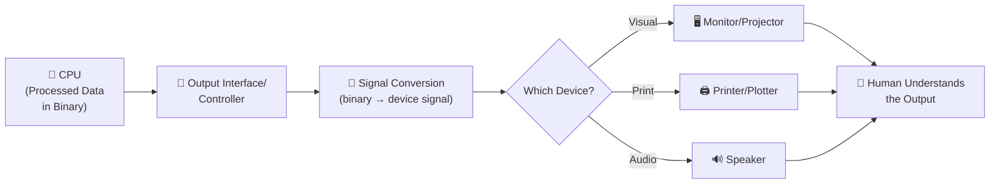
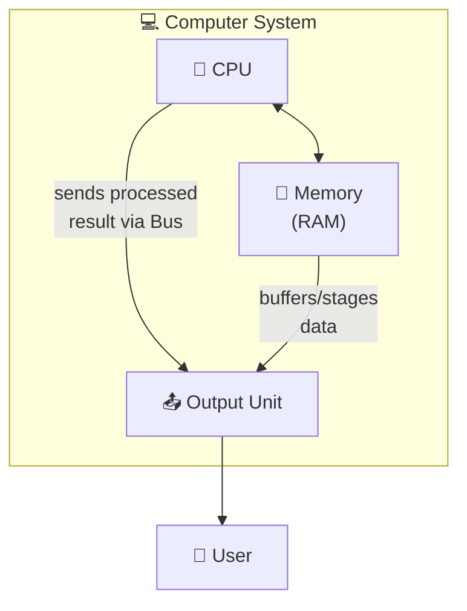
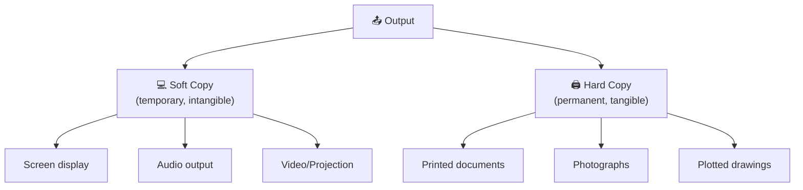
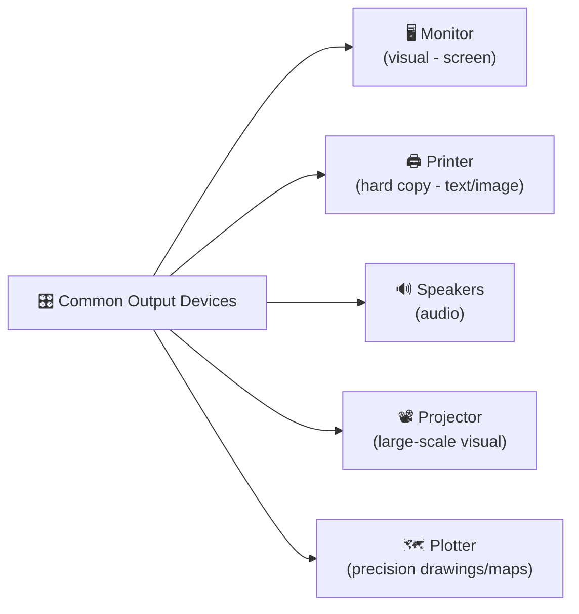
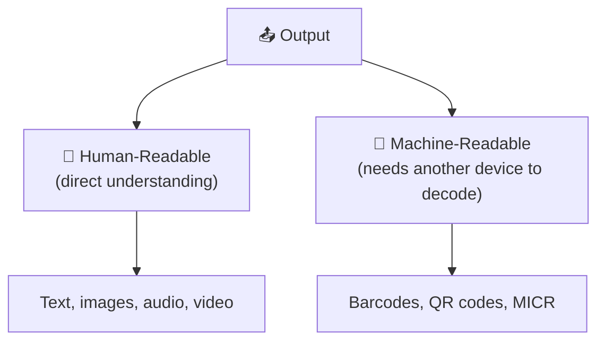
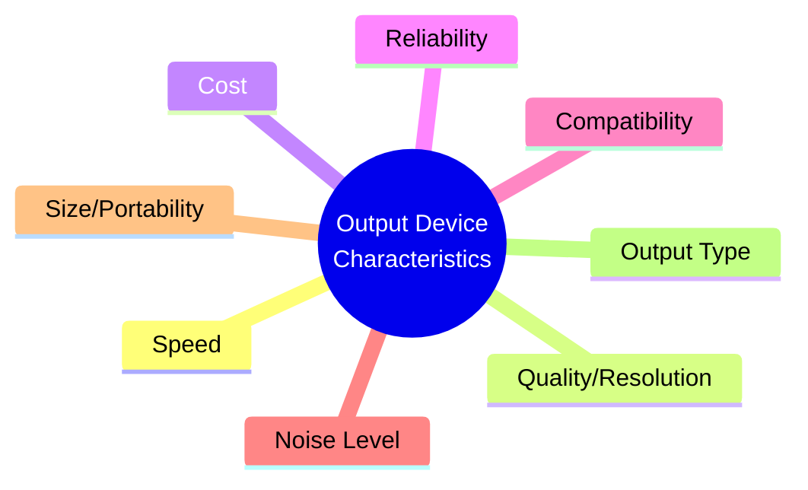

# 2.4 Output Unit ⋆˚꩜｡

> bestie sit down, get ur chai/coffee ☕, we're about to make "Output Unit" actually make sense instead of that textbook definition that makes u wanna close the book forever ♡

---

## 📑 Table of Contents (clicky clicky, go ahead)

- [2.4.1 Definition of Output Unit](#241-definition-of-output-unit)
- [2.4.2 Purpose of Output Unit](#242-purpose-of-output-unit)
- [2.4.3 Functions of Output Unit](#243-functions-of-output-unit)
- [2.4.4 Working of Output Unit](#244-working-of-output-unit)
- [2.4.5 Output Unit and CPU/Memory](#245-output-unit-and-cpumemory)
- [2.4.6 Types of Output](#246-types-of-output)
  - [Soft Copy](#-soft-copy)
  - [Hard Copy](#-hard-copy)
- [2.4.7 Common Output Devices](#247-common-output-devices)
  - [Monitor](#️-monitor)
  - [Printer](#️-printer)
  - [Speakers](#-speakers)
  - [Projector](#-projector)
  - [Plotter](#-plotter)
- [2.4.8 Machine-Readable vs Human-Readable Output](#248-machine-readable-vs-human-readable-output)
- [2.4.9 Basic Characteristics of Output Devices](#249-basic-characteristics-of-output-devices)

---

## 2.4.1 Definition of Output Unit

Okay so imagine ur computer is like that one friend group where:
- **Input Unit** = the friend who's ALWAYS talking, feeding info in (keyboard, mouse, mic, scanner, all of them yapping data into the system)
- **CPU** = the smart friend who processes all the drama and makes decisions
- **Memory** = the friend with main character memory who remembers everything
- **Output Unit** = the friend who FINALLY tells everyone else "okay here's what we decided 💅" — the one that translates all that internal computer gossip into something YOU (a human, presumably) can actually understand

So formally: **Output Unit is the hardware component of a computer system that converts the processed data (binary language — 0s and 1s, basically machine talk) into a human-readable/understandable form**, and presents it to the user.

Think of it as the **"reveal"** step. Input gives raw info, CPU cooks it, Memory holds the ingredients, and Output Unit is literally the plating of the dish ✦ ݁˖ — presentation matters!

---

## 2.4.2 Purpose of Output Unit

Why does this thing even exist? Like why can't the computer just... keep the results to itself? 🤔

Because bro — a computer that processes stuff internally but never SHOWS you anything is basically useless. Like cooking a 5-star meal and then not letting anyone eat it. Purpose check:

1. **To communicate results** — CPU did all this math/logic, now someone's gotta tell you "hey the answer is 42."
2. **To bridge the machine-human gap** — computers "think" in binary (0s and 1s), humans think in words, images, sounds. Output Unit = the translator bestie.
3. **To enable decision making** — you can't act on info you never received. Output lets humans (or other machines) DO something with the processed data.
4. **To provide feedback** — every time you type something and it shows on screen, that's output confirming "yes bestie i heard you."
5. **To produce permanent/temporary records** — sometimes you need proof (printouts) sometimes you just need a vibe check on screen (soft copy).

Basically: no output = computer working in complete secrecy and telling nobody anything. Rude behavior tbh.

---

## 2.4.3 Functions of Output Unit

Let's get into the actual JOB description of Output Unit, like if it had a LinkedIn:

| Function | What it actually means |
|---|---|
| **Accepts data from CPU/Memory** | takes the processed (binary) result handed over after all the calculations |
| **Converts machine language → human language** | binary code gets transformed into text, images, sound, video etc. |
| **Displays/prints/plays the result** | pushes it out through the right device (screen shows, printer prints, speaker plays) |
| **Provides temporary or permanent output** | screen = temporary (soft copy), printer = permanent (hard copy) |
| **Acts as communication interface** | final handshake between machine and user |

Basically the output unit's whole personality is: **receive → convert → present.** That's it, that's the job. Simple but SO necessary 🫶

---

## 2.4.4 Working of Output Unit

Here's the tea on how it actually works step by step, no cap:

1. CPU finishes processing the data (it's in binary — 0s & 1s, unreadable to us mortals)
2. This processed binary data is sent to the **output unit's controller/interface**
3. Controller converts binary signals into the appropriate format needed by the specific output device (pixels for monitor, dots for printer, sound waves for speaker)
4. The output device receives this converted signal
5. Device physically produces the output — lights up pixels, moves print heads, vibrates speaker diaphragm, whatever it's built to do
6. Human receives it via their senses (seeing, hearing) — and the loop is complete ✨

### Mermaid flowchart bc visuals hit different:

See? It's literally a relay race 🏃‍♀️ — CPU passes the baton to output interface, which passes it to the device, which passes it to YOUR eyeballs/ears.

---

## 2.4.5 Output Unit and CPU/Memory

Okay so this trio is basically a group project where everyone HAS to do their part or the whole thing flops:

- **Memory (RAM)** temporarily stores the data that's about to be sent out, kind of like a waiting room before the data gets its turn.
- **CPU** processes/fetches this data and sends the final result toward the output unit through the **system bus** (data bus specifically, since it's literally transporting the data).
- **Output Unit** just waits patiently, receives whatever CPU sends via memory, converts it, and displays/prints/plays it.

Relationship status: **it's complicated but they need each other.** Without CPU, output unit has nothing to show. Without memory, there's no buffer/staging area for data before display. Without output unit, CPU's hard work goes completely unnoticed (tragic).

Fun fact: this data transfer happens at LIGHTNING speed, we're talking nanoseconds. So when u click "print," it feels instant but there's a whole relay happening behind the scenes.

---

## 2.4.6 Types of Output

Two main vibes here, and honestly this is the easiest part of the chapter so don't stress:

### 💻 Soft Copy

- Output that is **temporary**, **intangible** (you literally cannot touch it), and exists only in **electronic/digital form**.
- Disappears when power goes off or device is closed — poof, gone, like your motivation on a Monday morning.
- Examples: text/images on a monitor screen, audio from speakers, a video playing, a projected presentation.
- **Pros:** editable, shareable instantly, eco-friendly (no paper waste 🌱), can be updated in real time.
- **Cons:** not permanent, needs power/device to view, can be lost if not saved.

### 🖨️ Hard Copy

- Output that is **permanent**, **tangible** (you CAN touch it, feel it, staple it, lose it in your bag), and physical.
- Doesn't need power to "exist" once produced — a printed page is a printed page forever (well until it gets wet or something 💀).
- Examples: printed documents, photographs from a printer, plotted engineering drawings/maps.
- **Pros:** permanent record, doesn't need a device to view later, good for legal/official documents, signatures etc.
- **Cons:** uses paper/ink (cost + environment 🌍), can't be edited once printed, physical storage needed.

Quick vibe check to remember: **Soft copy = you can EDIT it. Hard copy = you can HOLD it.** That's literally the whole difference bestie.

---

## 2.4.7 Common Output Devices

Now let's meet the actual squad 👯‍♀️ — the physical devices that do the outputting:

### 🖥️ Monitor

- The MVP, the main character, the one everyone thinks of first when they hear "output device."
- Displays soft copy output — text, images, videos — using pixels (tiny dots of light arranged in a grid).
- Types: CRT (the old chunky boi, basically extinct now), LCD, LED, OLED (sleek, modern, energy efficient).
- Measured in terms of resolution (like 1920x1080), refresh rate, screen size.

### 🖨️ Printer

- Converts soft copy into hard copy — the "make it real" device.
- Types:
  - **Impact printers** (dot matrix) — physically strikes paper, noisy, old school, still used for carbon-copy receipts/bills.
  - **Non-impact printers** (inkjet, laser) — no physical striking, quieter, higher quality, used everywhere now.
- Speed measured in **ppm (pages per minute)**.

### 🔊 Speakers

- Converts electrical signals into sound waves — output you HEAR not see.
- Used for music, notifications, voice calls, system alerts (that "ding" when you get a message).
- Can range from tiny built-in laptop speakers to full home theater setups.

### 📽️ Projector

- Takes the display signal and blows it up onto a big screen/wall — basically a monitor's extroverted older sibling.
- Used in classrooms, offices, cinemas, presentations.
- Types: LCD projectors, DLP projectors.

### 🗺️ Plotter

- A specialized printer for producing **large, high-precision line-based drawings** — think maps, architectural blueprints, engineering CAD designs.
- Uses pens or ink to draw continuous lines instead of dot-by-dot printing like regular printers.
- Not something you'll find in a regular household, but essential in engineering/architecture firms.

---

## 2.4.8 Machine-Readable vs Human-Readable Output

This is where it gets a lil spicy 🌶️ because not ALL output is meant for humans, shocking I know.

### 👤 Human-Readable Output
- Format that we mortals can directly understand without needing any extra tool.
- Examples: text on screen, printed documents, images, sound, video.
- Straight up designed for **our eyes and ears.**

### 🤖 Machine-Readable Output
- Format meant to be read by **another machine/device**, not directly understandable by humans without decoding.
- Examples: barcodes, QR codes, magnetic ink characters (those weird numbers on cheques), punched cards (old school), output stored on storage media meant for another computer to process later.
- Basically it's like output that's still "talking machine language" just packaged for a different machine to pick up and continue the conversation.

| Aspect | Human-Readable | Machine-Readable |
|---|---|---|
| Understood directly by | Humans | Machines/Devices |
| Examples | Screen text, printouts, sound | Barcodes, QR codes, magnetic ink |
| Needs decoding? | No | Yes (needs a scanner/reader) |
| Purpose | Communication with user | Communication between systems |

---

## 2.4.9 Basic Characteristics of Output Devices

Before buying/choosing an output device, here's what you (or ur exam) should check for — basically the "specs" that matter:

1. **Speed** — how fast can it produce output? (ppm for printers, refresh rate for monitors)
2. **Quality/Resolution** — how clear/sharp is the output? (DPI for printers, pixel resolution for monitors)
3. **Cost** — both initial cost AND running cost (ink, paper, maintenance — printers are secretly expensive bestie, it's the ink that gets u)
4. **Reliability** — does it work consistently without breaking down every other week
5. **Compatibility** — does it work with the system/software you're using
6. **Noise level** — some devices (old dot matrix printers) are LOUD, others (laser printers, modern monitors obviously) are silent
7. **Size/Portability** — desk space, portability for travel, wall-mountability etc.
8. **Type of output produced** — soft copy vs hard copy, and whether it fits the use case (you don't need a plotter for checking emails lol)

Basically — before picking any output device, ask yourself: **is it fast, is it clear, is it affordable, is it reliable, does it fit, is it quiet, is it convenient, and does it do what I actually need?** If yes to (most of) these, you've found The One 💍

---

## 🎀 tl;dr for last-minute revision panic

- Output Unit = translator between machine (binary) and human (readable form)
- Purpose = communicate results, bridge gap, enable decisions
- Function = accept → convert → present
- Working = CPU → controller → conversion → device → human
- Connected to CPU/Memory via system bus, receives processed & buffered data
- Two types of output: **Soft copy** (temporary, intangible) & **Hard copy** (permanent, tangible)
- Devices: Monitor 🖥️, Printer 🖨️, Speakers 🔊, Projector 📽️, Plotter 🗺️
- Output can be **human-readable** (direct) or **machine-readable** (needs decoding)
- Characteristics to judge devices: speed, quality, cost, reliability, compatibility, noise, size, output type

that's it, that's the whole unit, u got this 🫡

---

⋆˚꩜｡

If you enjoyed these notes, you'll probably enjoy the rest too.

| Platform | Link |
|---|---|
| Instagram | @mehrunnisa.ai |
| SubStack | The Epoch |
| YouTube | @mehrunnisa.ai |

**Usage Terms**

These notes are free to use for personal learning, revision, and study. Please do not:
- Sell or redistribute for profit.
- Claim them as your own work.
- Modify and republish without permission.
- Use for any unethical or unauthorized purpose.

Thank you for respecting the effort behind these notes. Happy learning. ♡

