# System Bus ⋆˚꩜｡

> round 3 of "making computer architecture actually bearable" bestie ♡ today's topic: **System Bus** — basically the WiFi/group chat that lets every part of your computer gossip with each other. let's get into it 🚌

---

## Table of Contents (tap and teleport)

- [1. Introduction to Bus](#1-introduction-to-bus)
  - [Definition](#-definition)
  - [Purpose](#-purpose)
  - [Need for a Bus](#-need-for-a-bus)
- [2. Types of System Bus](#2-types-of-system-bus)
  - [Data Bus](#-data-bus)
  - [Address Bus](#-address-bus)
  - [Control Bus](#-control-bus)
- [3. Data Bus](#3-data-bus)
  - [Purpose](#-purpose-1)
  - [Direction](#-direction)
  - [Data Bus Width](#-data-bus-width)
- [4. Address Bus](#4-address-bus)
  - [Purpose](#-purpose-2)
  - [Direction](#-direction-1)
  - [Address Lines](#-address-lines)
  - [Addressable Locations](#-addressable-locations)
- [5. Control Bus](#5-control-bus)
  - [Purpose](#-purpose-3)
  - [Control Signals](#-control-signals)
- [6. Comparison of Three Buses](#6-comparison-of-three-buses)
- [7. How Buses Work Together](#7-how-buses-work-together)
  - [Memory Read](#-memory-read)
  - [Memory Write](#-memory-write)
- [8. Bus Width](#8-bus-width)
  - [Address Bus Width](#-address-bus-width)
  - [Data Bus Width](#-data-bus-width-1)
- [9. Bus Master and Bus Slave](#9-bus-master-and-bus-slave)
- [10. Bus Transfer](#10-bus-transfer)
- [11. Bus Arbitration](#11-bus-arbitration)
- [12. Advantages and Limitations](#12-advantages-and-limitations)

---

## 1. Introduction to Bus

### Definition

A **Bus** is a **set of parallel wires/lines that connects different components of a computer system (CPU, Memory, I/O devices) and allows them to transfer data/signals between each other.**

Literally imagine a real-life bus 🚌 — it's a shared vehicle that different people (data, addresses, signals) hop on and ride from one stop (component) to another. That's it, that's a bus. Not that deep conceptually, but SUPER important functionally.

### Purpose

- To provide a **common communication pathway** between all the major components of the computer.
- Without a bus, every single component would need a DIRECT dedicated wire to every OTHER component — which is giving spaghetti nightmare 🍝 (imagine wiring CPU directly to memory, directly to keyboard, directly to printer, directly to monitor... and then memory directly to printer too... u get the mess).
- Bus = shared highway that EVERYONE uses, so we don't need a billion separate direct roads.

### Need for a Bus

Why can't components just talk directly to each other without this whole "bus" business?

1. **Reduces wiring complexity** — one shared pathway instead of a web of individual connections
2. **Saves cost** — fewer wires/connections = cheaper to manufacture
3. **Standardization** — components can be designed to a common bus standard, making them plug-and-play compatible
4. **Efficient communication** — organized, structured way for components to exchange info without total chaos
5. **Scalability** — easier to add new components later (just connect to the existing bus instead of running new dedicated wires everywhere)

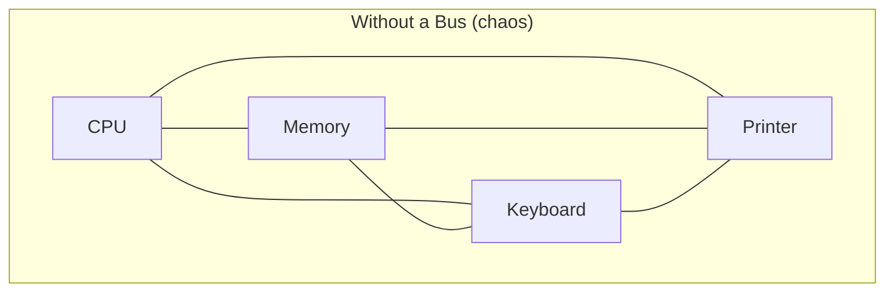

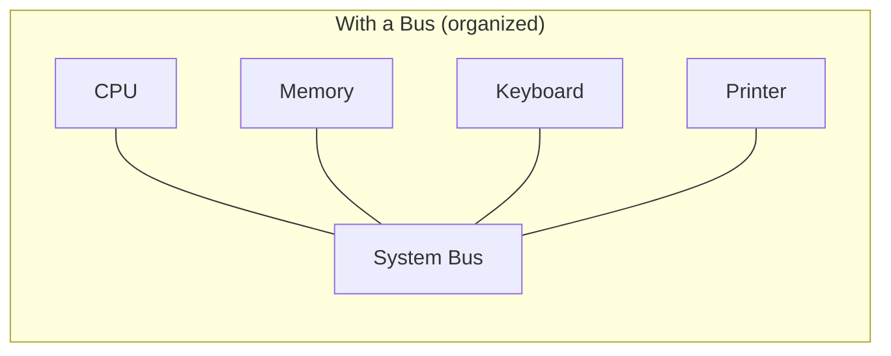

See the difference? One's a mess, one's clean. Bus = the ultimate decluttering hack for computer architecture, Marie Kondo would be proud ✨

---

## 2. Types of System Bus

The System Bus isn't ONE single thing — it's actually a squad of **THREE buses**, each with their own specific job:

### Data Bus
Carries the actual **data/information** being transferred.

### Address Bus
Carries the **address** (location info) of where data needs to go/come from.

### Control Bus
Carries **control signals** that manage/coordinate the entire operation.

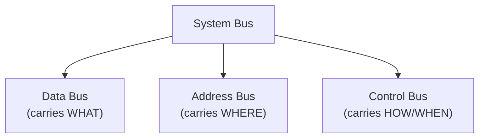

Think of it like ordering food delivery 🍕: **Address Bus** = your delivery address, **Data Bus** = the actual pizza, **Control Bus** = the instructions like "ring the bell" or "leave at door." All three need to work together or ur pizza (data) ain't arriving correctly.

---

## 3. Data Bus

### Purpose

- Responsible for **transferring actual data/instructions** between CPU, memory, and I/O devices.
- This is the bus that carries the REAL content — the numbers, text, instructions, everything that's actually "the information."

### Direction

- **Bidirectional** — data can flow BOTH ways: CPU → Memory (during write operations) AND Memory → CPU (during read operations).
- Makes sense right? Sometimes you're sending data out, sometimes you're pulling data in — same road, both directions of traffic.

### Data Bus Width

- Refers to the **number of parallel lines** in the data bus, which determines **how many bits can be transferred simultaneously** in one go.
- Common widths: 8-bit, 16-bit, 32-bit, 64-bit (yep, this connects to those CPU spec numbers you've heard — "64-bit processor" often relates to this).
- **Wider data bus = more bits transferred per cycle = faster overall data transfer.** It's like a highway with more lanes — more cars (bits) can travel at once.

---

## 4. Address Bus

### Purpose

- Responsible for **carrying the address** of the memory location or I/O device that the CPU wants to access.
- Basically it's the "WHERE do I need to go" bus.

### Direction

- **Unidirectional** — travels only ONE way: CPU → Memory/I/O device.
- Why only one way? Because only the CPU decides and generates WHICH address to access. Memory doesn't send addresses back to CPU, it just receives them and complies.

### Address Lines

- The actual physical wires that make up the address bus.
- The **number of address lines (n)** directly determines how many unique memory locations can be addressed.

### Addressable Locations

> **Number of addressable locations = 2ⁿ** (where n = number of address lines)

Example: if a system has **16 address lines**, addressable locations = 2¹⁶ = **65,536 locations** (which is also written as 64K). More address lines = bigger memory the CPU can "see" and access.

---

## 5. Control Bus

### Purpose

- Carries **control and timing signals** that coordinate and synchronize the activities of all the connected components.
- It's basically the traffic cop 🚦 of the whole system — tells everyone WHEN to do WHAT.
- Without control bus, address bus and data bus would just be sitting there with no instructions on what operation to actually perform.

### Control Signals

Some common control signals traveling on this bus:

| Signal | What it does |
|---|---|
| **Read (RD)** | tells memory/device "give me data" |
| **Write (WR)** | tells memory/device "take this data and store it" |
| **Clock signal** | synchronizes timing across all components |
| **Interrupt signals** | tells CPU "hey something urgent happened, pause what you're doing" |
| **Bus request/grant signals** | used when multiple devices want to use the bus (we'll cover this in Bus Arbitration) |
| **Reset signal** | resets components to initial state |

---

## 6. Comparison of Three Buses

Time for the ultimate side-by-side glow-up comparison table, perfect for last minute cramming:

| Feature | Data Bus | Address Bus | Control Bus |
|---|---|---|---|
| **Carries** | Actual data/instructions | Memory/device address | Control & timing signals |
| **Direction** | Bidirectional  | Unidirectional  | Mixed (both directions depending on signal) |
| **Purpose** | "WHAT" is being transferred | "WHERE" it's going/coming from | "HOW/WHEN" the transfer happens |
| **Width determines** | Amount of data transferred per cycle | Number of addressable locations | Number/type of control operations possible |
| **Who initiates** | CPU or Memory (depending on read/write) | Only CPU | CPU (mostly), sometimes devices (interrupts) |

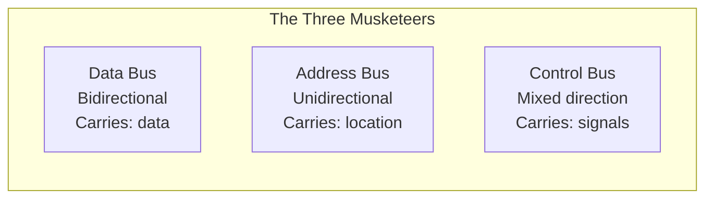

---

## 7. How Buses Work Together

None of these buses work solo — they're literally a group project where everyone submits their part for the whole thing to function. Let's see it in action:

### Memory Read

1. CPU places the target **address** on the **Address Bus**
2. CPU sends a **"Read" signal** via the **Control Bus**
3. Memory decodes the address, locates the data
4. Memory places the requested data on the **Data Bus**
5. CPU picks up the data from the Data Bus

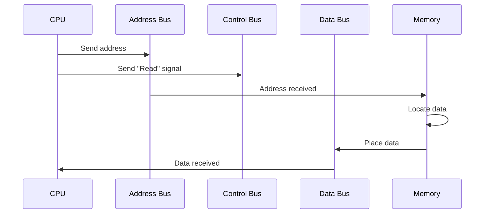

### Memory Write

1. CPU places the target **address** on the **Address Bus**
2. CPU places the **data to be written** on the **Data Bus**
3. CPU sends a **"Write" signal** via the **Control Bus**
4. Memory decodes the address, receives the data from Data Bus
5. Memory **stores** the data at that location (overwriting old data)

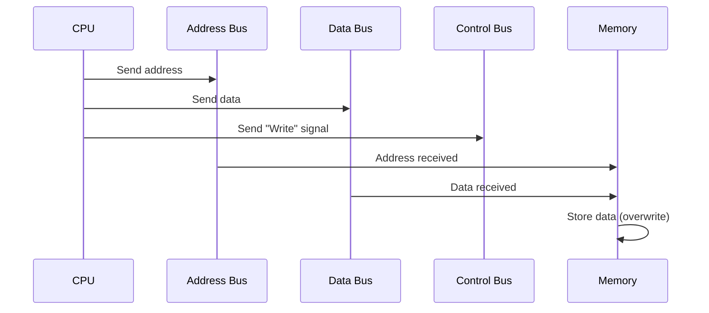

Basically: **Read = data flows OUT of memory. Write = data flows INTO memory.** Address and control bus behavior stays mostly the same, only the data bus direction + control signal type flips.

---

## 8. Bus Width

### Address Bus Width

- Number of lines in the address bus.
- Directly determines the **maximum addressable memory** (via 2ⁿ formula).
- Bigger address bus width = CPU can "see"/address more memory locations = supports larger RAM.

### Data Bus Width

- Number of lines in the data bus.
- Directly determines **how much data can be moved in a single transfer**.
- Bigger data bus width = faster data transfer, less waiting around.

> Quick example: a system with a **32-bit address bus** can address 2³² = **4,294,967,296 locations** (roughly 4GB max addressable memory) — this is literally why old 32-bit systems couldn't use more than ~4GB RAM, it's a hardware address bus limitation, not just a software thing!

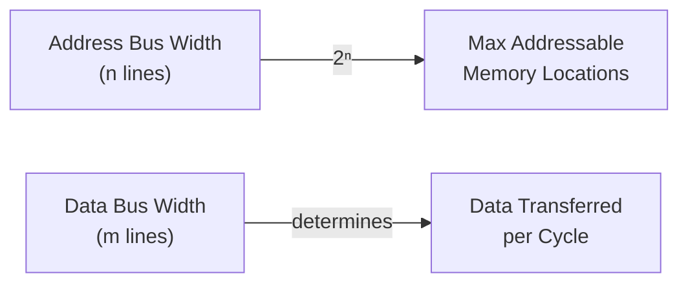

---

## 9. Bus Master and Bus Slave

Not every device on the bus has equal power, there's a lil hierarchy here:

### Bus Master
- The device that **initiates/controls** a data transfer on the bus.
- It's the one that says "okay we're doing a transfer NOW, here's the address, here's the signal."
- CPU is USUALLY the bus master, but other devices (like a DMA controller) can also become bus masters temporarily.

### Bus Slave
- The device that **responds** to the bus master's request.
- It doesn't initiate anything, it just listens and reacts — like "oh you're asking for data at this address? here you go."
- Memory and I/O devices are typically bus slaves.

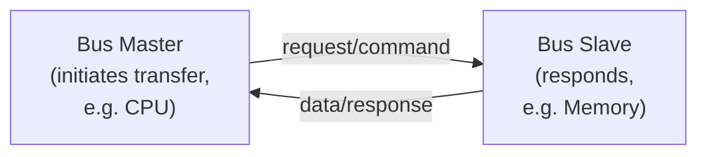

Basically Bus Master = the one giving orders, Bus Slave = the one following them. Very "who texts first" energy honestly.

---

## 10. Bus Transfer

**Bus Transfer** refers to the actual **movement of data from one component to another via the bus system**, following a defined sequence of steps (like the read/write sequences we saw above).

Two main types of bus transfer:

1. **Synchronous Transfer** — all transfers happen according to a **shared clock signal**, everything is timed and synchronized to clock ticks. Fast and predictable, but requires all devices to be in sync (bit like everyone in a group project working at exactly the same pace).
2. **Asynchronous Transfer** — no shared clock; instead, transfer happens using a **handshaking mechanism** (sender signals "ready," receiver signals "received," back and forth). More flexible since devices don't need matching speeds, but has slightly more overhead due to the handshake process.

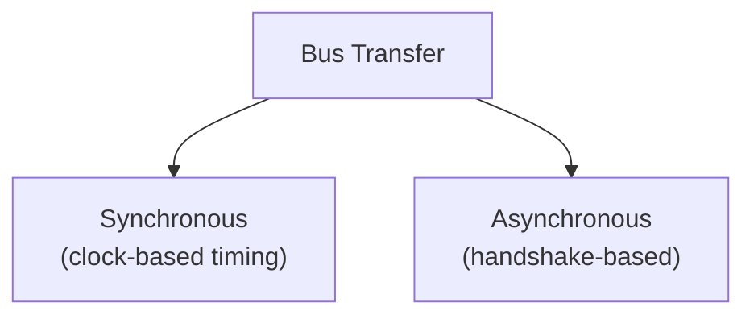

---

## 11. Bus Arbitration

Okay so here's a REAL problem: what happens when **multiple devices want to use the bus AT THE SAME TIME**? Like, only one device can be "talking" on the shared bus at once (it's a shared highway remember, not infinite lanes for everyone simultaneously).

**Bus Arbitration** = the process/mechanism used to **decide which device gets control of the bus** when there are multiple requests, avoiding conflicts/collisions.

Common methods:

1. **Centralized Arbitration** — a single central controller (like a bus arbiter or the CPU itself) decides who gets access, based on priority.
2. **Distributed Arbitration** — no single central controller; instead, devices collectively negotiate among themselves who gets to go next (each device has its own arbitration logic).

Common techniques within these:
- **Daisy Chaining** — devices are connected in a series/chain, and priority is determined by physical position in the chain (closer to controller = higher priority usually)
- **Polling** — controller asks each device one by one "do you need the bus?" in a round-robin manner
- **Independent Request** — each device has its own dedicated request/grant lines directly to the controller (fastest but needs more wiring)

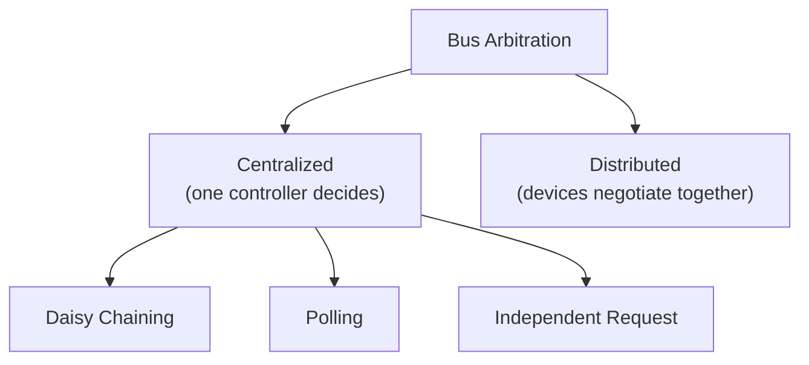

Basically Bus Arbitration = **the referee that prevents two devices from talking over each other on the shared bus at the exact same time.** Very necessary, very underrated job.

---

## 12. Advantages and Limitations

### Advantages

- **Reduces cost & complexity** — one shared pathway instead of tons of individual dedicated connections
- **Easy to add new devices** — just connect to existing bus (scalability win)
- **Standardization** — components built to common bus specs can work across different systems
- **Simplifies design** — easier to design/troubleshoot a system with organized shared buses vs a tangled mess of direct wires

### Limitations

- **Speed bottleneck** — since it's SHARED, only one device can transfer data at a time, so as more devices are added, there's more waiting/contention for bus access
- **Single point of failure** — if the bus itself fails, EVERYTHING connected to it stops working (harsh but true)
- **Bus width limits capacity/speed** — a fixed number of address/data lines puts a hard ceiling on max memory addressable or data transferred per cycle
- **Needs arbitration overhead** — managing who gets to use the bus adds extra complexity/delay, especially with lots of connected devices

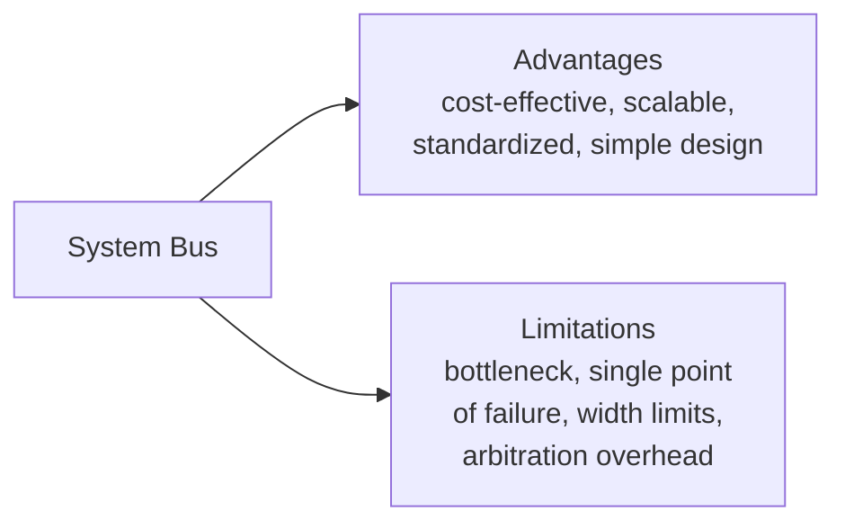

---

## 🎀 tl;dr for last-minute revision panic

- Bus = shared communication pathway connecting CPU, Memory, I/O devices
- Needed to avoid messy direct wiring between every single component
- 3 types: **Data Bus** (bidirectional, carries actual data), **Address Bus** (unidirectional, carries location), **Control Bus** (mixed, carries signals like Read/Write/Clock/Interrupt)
- Addressable locations = **2ⁿ** (n = address lines)
- Read: address+control sent → memory sends data back via data bus
- Write: address+data+control sent → memory stores data (overwrites)
- Bus width (address & data) directly determines max memory & transfer speed
- **Bus Master** initiates transfer (usually CPU), **Bus Slave** responds (memory/I-O)
- Bus Transfer types: **Synchronous** (clock-based) vs **Asynchronous** (handshake-based)
- **Bus Arbitration** decides who gets bus access when multiple devices want it — centralized (daisy chain, polling, independent request) or distributed
- Advantages: cheaper, scalable, standardized. Limitations: bottleneck, single point of failure, width limits capacity/speed

that's a wrap on System Bus, u certified computer architecture bestie now 🫡🚌

---

⋆˚꩜｡

If you enjoyed these notes, you'll probably enjoy the rest too.

| Platform | Link |
|---|---|
| Instagram | @mehrunnisa.ai |
| SubStack | The Epoch |
| YouTube | @mehrunnisa.ai |

**Usage Terms**

These notes are free to use for personal learning, revision, and study. Please do not:
- Sell or redistribute for profit.
- Claim them as your own work.
- Modify and republish without permission.
- Use for any unethical or unauthorized purpose.

Thank you for respecting the effort behind these notes. Happy learning. ♡

