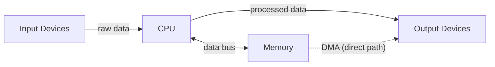
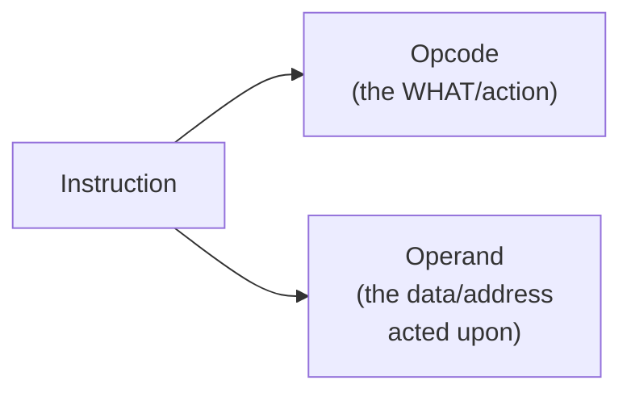
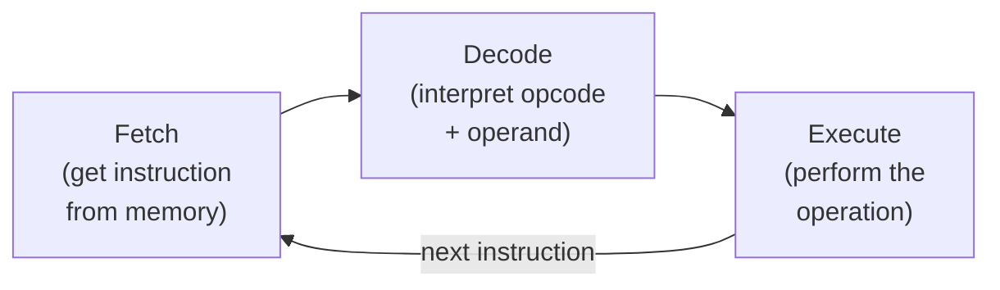
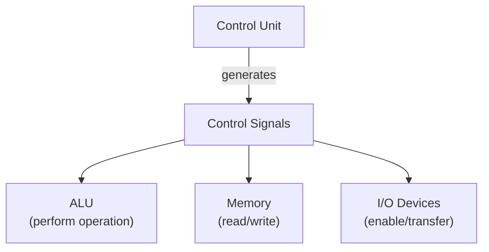
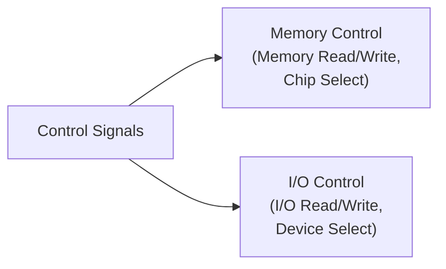
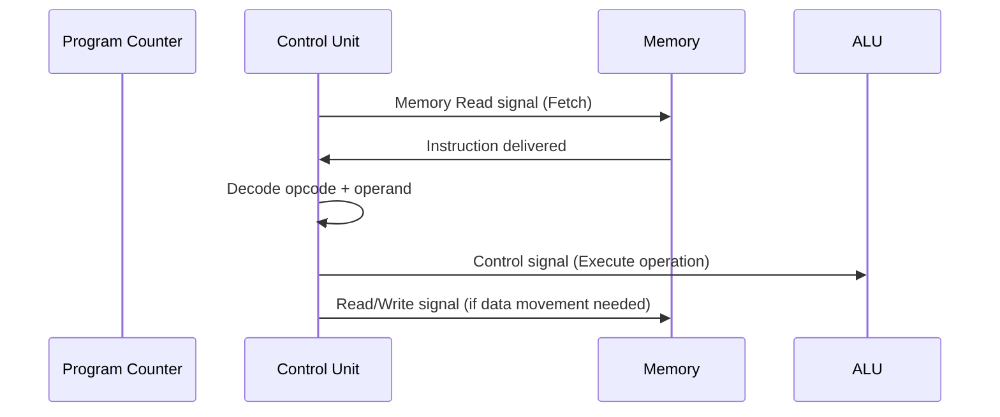

# 2.8 Data, Instructions & Control Signals ⋆˚꩜｡

> okay bestie last one for now (or is it ⸜(｡˃ ᵕ ˂ )⸝♡) — today we're unpacking the holy trinity of "stuff that flows around inside your computer": **Data, Instructions, and Control Signals.** let's gooo ♡

---

## Table of Contents 

- [2.8.1 Data](#281-data)
  - [Definition of Data](#definition-of-data)
  - [Types of Data](#types-of-data)
  - [Data Representation in Computers](#data-representation-in-computers)
  - [Data as Binary Values](#data-as-binary-values)
  - [Data Stored in Memory](#data-stored-in-memory)
  - [Data Transfer Between CPU, Memory and I/O](#data-transfer-between-cpu-memory-and-io)
- [2.8.2 Instructions](#282-instructions)
  - [Definition of an Instruction](#definition-of-an-instruction)
  - [Purpose of Instructions](#purpose-of-instructions)
  - [Machine Instructions](#machine-instructions)
  - [Instruction Components](#instruction-components)
    - [Opcode](#opcode)
    - [Operand](#operand)
  - [Instruction Stored in Memory](#instruction-stored-in-memory)
  - [Instruction Execution](#instruction-execution)
  - [Data vs Instruction](#data-vs-instruction)
- [2.8.3 Control Signals](#283-control-signals)
  - [Definition of Control Signals](#definition-of-control-signals)
  - [Purpose of Control Signals](#purpose-of-control-signals)
  - [Control Unit and Control Signals](#control-unit-and-control-signals)
  - [Control Signals for Data Transfer](#control-signals-for-data-transfer)
  - [Read and Write Control Signals](#read-and-write-control-signals)
  - [Memory Control Signals](#memory-control-signals)
  - [I/O Control Signals](#io-control-signals)
  - [Role of Control Signals in CPU Operation](#role-of-control-signals-in-cpu-operation)

---

## 2.8.1 Data

### Definition of Data

Data is basically the raw, unprocessed facts and figures that a computer works with. Think numbers, text, images, sound — literally anything that hasn't been "made meaningful" yet. Like flour before it becomes bread, data is the raw material, and the CPU is the baker turning it into something useful (information).

Formally: **Data refers to raw facts, figures, or symbols that are given as input to a computer system for processing.**

### Types of Data

Data isn't one flavor, it comes in different types depending on what it represents:

| Type | What it is | Example |
|---|---|---|
| **Numeric Data** | numbers, used in calculations | 42, 3.14, -7 |
| **Alphanumeric/Text Data** | letters, digits, symbols combined | "Hello123" |
| **Alphabetic Data** | just letters | "COMPUTER" |
| **Image Data** | visual info, pixels | photos, graphics |
| **Audio Data** | sound waves digitized | music, voice recordings |
| **Video Data** | sequence of images + audio | movies, clips |
| **Boolean Data** | true/false, yes/no type values | True, False |

### Data Representation in Computers

Here's the thing — computers don't understand "Hello" or "42" the way we do. Everything, and I mean EVERYTHING, has to be converted into a format the machine can process, which is...

### Data as Binary Values

- Computers understand ONLY **binary** — a system of just two digits, **0 and 1**.
- Every single type of data (numbers, text, images, sound) gets converted into a sequence of 0s and 1s before the computer can store/process it.
- Text uses encoding schemes like **ASCII** or **Unicode** to map each character to a binary code (e.g., letter 'A' = 01000001 in ASCII).
- Numbers get converted using binary number systems directly.
- Images = pixels, each pixel's color represented in binary. Audio = sound waves sampled and converted into binary values too.

Basically: no matter WHAT kind of data goes in, it all gets reduced down to the same universal binary language internally. Computer doesn't discriminate, everything becomes 0s and 1s eventually ⸜(｡˃ ᵕ ˂ )⸝♡

### Data Stored in Memory

- Once converted to binary, data is stored in **memory locations**, each with its own unique address (yep, this connects back to memory unit concepts).
- Data sits in memory temporarily (RAM, while being processed) or permanently (secondary storage, for long-term keeping).
- CPU accesses this stored data whenever it needs it for a calculation/operation, by referencing the memory address.

### Data Transfer Between CPU, Memory and I/O

Data doesn't just sit still, it's constantly moving around the system:

- **CPU ↔ Memory** — CPU fetches data from memory to process it, and sends results back to memory for storage
- **CPU ↔ I/O Devices** — CPU receives data from input devices (keyboard, mouse) and sends processed data to output devices (monitor, printer)
- **Memory ↔ I/O Devices** — sometimes data moves directly between memory and I/O devices without going through CPU every single time (this is called DMA - Direct Memory Access, a whole separate topic but worth knowing it exists)

All this movement happens via the **system bus** (data bus specifically, since that's literally its job — carrying the actual data).

---

## 2.8.2 Instructions

### Definition of an Instruction

An **Instruction** is a command given to the CPU that tells it EXACTLY what operation to perform on a piece of data.

If Data is the raw ingredients, Instructions are the recipe steps — "chop the onions," "add salt," "stir for 2 minutes." Data alone does nothing on its own; it needs Instructions to tell the CPU what to DO with it.

### Purpose of Instructions

- To **direct the CPU's operations** — literally guides every single action the CPU performs
- To form the building blocks of a **program** — a program is nothing but a sequence of instructions arranged in the right order
- To specify **what operation** happens (add, subtract, compare, move, jump, etc.) and **on what data**

Without instructions, the CPU is just... sitting there. Powerful, but directionless. Like a chef with all the ingredients in the world but no recipe — nothing's getting cooked.

### Machine Instructions

- **Machine Instructions** are instructions written in **binary form (machine language)** — the ONLY language the CPU directly understands and executes without needing translation.
- Every instruction we write in higher-level languages (Python, C++, etc.) eventually gets converted DOWN into machine instructions before the CPU can actually run them.
- Each machine instruction tells the CPU to do ONE specific micro-task (like "add these two values" or "move this data from here to there").

### Instruction Components

Every single machine instruction is broken into two core parts, no exceptions:

#### Opcode

- Short for **"Operation Code."**
- This part tells the CPU **WHAT operation to perform** — add, subtract, load, store, jump, compare, etc.
- It's basically the "verb" of the instruction sentence.

#### Operand

- This part specifies **the data (or the address of the data)** on which the operation is to be performed.
- It's basically the "object" of the instruction sentence — the thing the verb acts upon.

Example to make it click: instruction "**ADD R1, R2**" — here **ADD** is the Opcode (what to do), and **R1, R2** are the Operands (what to do it to/with). Like a sentence: "ADD (verb) R1 and R2 (objects)." Simple grammar, honestly.

### Instruction Stored in Memory

- Just like data, instructions are ALSO stored in memory — as binary code, in memory locations, each with its own address.
- In fact, a computer's memory holds BOTH data and instructions simultaneously (this is called the **stored program concept**, a foundational idea in computer architecture).
- The CPU fetches instructions from memory one at a time (in sequence, unless told to jump elsewhere), following the **Fetch-Decode-Execute cycle.**

### Instruction Execution

Here's the lifecycle of a single instruction, step by step:

1. **Fetch** — CPU retrieves the instruction from memory (using the address stored in a special register, the Program Counter)
2. **Decode** — CPU's Control Unit interprets/decodes the instruction, figuring out the opcode and operand
3. **Execute** — CPU actually performs the operation specified (via ALU for calculations, or moving data, etc.)
4. Cycle repeats for the NEXT instruction

This cycle (Fetch-Decode-Execute) repeats CONSTANTLY, millions/billions of times per second, for every single instruction in a program, until the program finishes. Wild honestly, ur computer is basically sprinting a marathon every second of its existence.

### Data vs Instruction

Both are stored in memory, both are represented in binary — so what's actually different?? Here's the comparison table everyone needs:

| Aspect | Data | Instruction |
|---|---|---|
| **What it is** | Raw facts/figures to be processed | Commands telling CPU what to do |
| **Role** | The "object" being worked on | The "action" being performed |
| **Storage** | Stored in memory locations | Also stored in memory locations |
| **Format** | Binary representation of numbers/text/etc. | Binary representation split into opcode + operand |
| **Used by** | Processed BY the CPU | Interpreted/executed BY the CPU |
| **Analogy** | Ingredients | Recipe steps |

Basically: **Data is the "what" being acted upon, Instruction is the "how/what action" is being taken.** Both live in memory together, and honestly the CPU can't even tell them apart just by looking at the binary — it only knows which is which based on CONTEXT (what the Program Counter is currently pointing to).

---

## 2.8.3 Control Signals

### Definition of Control Signals

**Control Signals** are the electronic signals generated (mainly by the Control Unit) that **coordinate, direct, and synchronize the activities of all the components** within the computer system.

If Data is the ingredients and Instructions are the recipe, Control Signals are basically the kitchen timer + the head chef literally shouting "NOW, do this step, THIS second" — pure timing and coordination energy.

### Purpose of Control Signals

- To **synchronize** the operations of CPU, memory, and I/O devices so everything happens in the correct order, at the correct time
- To **trigger specific actions** like read/write operations, data movement, or enabling/disabling certain components
- To ensure **no conflicts** occur — like preventing two components from trying to use the same bus at the same exact moment (chaos prevention, basically)

### Control Unit and Control Signals

- The **Control Unit (CU)**, part of the CPU, is the one responsible for GENERATING these control signals.
- CU decodes the current instruction and, based on what that instruction needs, sends out the appropriate control signals to the relevant components (ALU, Memory, I/O devices) telling them exactly what to do and when.
- Basically: Control Unit = the "director" and Control Signals = the "directions" being shouted out during filming.

### Control Signals for Data Transfer

- Specific control signals manage the actual MOVEMENT of data across the system bus.
- These signals decide WHEN data should be placed on the data bus, and WHEN it should be picked up by the receiving component.
- Without these, data would just be floating around the bus with no coordination on timing — total confusion.

### Read and Write Control Signals

The two MVP control signals we've been mentioning throughout these notes:

- **Read Signal (RD)** — tells memory (or an I/O device) "the CPU wants to RETRIEVE data from you, send it over"
- **Write Signal (WR)** — tells memory (or an I/O device) "the CPU wants to SEND/STORE data into you, receive it"

These two signals travel via the **Control Bus** and are what actually differentiate a Read operation from a Write operation happening on the same address/data bus setup.

### Memory Control Signals

Specific control signals dedicated to managing memory operations:

- **Memory Read (MR)** — activates memory to output data at the specified address
- **Memory Write (MW)** — activates memory to accept and store data at the specified address
- **Memory Enable/Chip Select** — activates a specific memory chip/module when multiple memory units exist in the system

### I/O Control Signals

Similarly, dedicated signals for managing input/output device operations:

- **I/O Read** — tells an input device to send its data to the CPU
- **I/O Write** — tells an output device to accept data from the CPU
- **I/O Select/Enable** — activates the specific I/O device being addressed (since multiple I/O devices might be connected)

### Role of Control Signals in CPU Operation

Bringing it all together — here's how control signals fit into the CPU's overall operation:

1. During **Fetch**, control signals trigger the Program Counter to send the instruction address, and a Memory Read signal retrieves the instruction
2. During **Decode**, control signals within the Control Unit interpret the opcode and prepare the necessary pathways
3. During **Execute**, control signals activate the ALU (for calculations) or trigger Memory/IO Read-Write signals (for data movement), depending on what the instruction requires
4. Throughout ALL of this, **timing/clock-related control signals** ensure every step happens in perfect synchronization, so nothing overlaps or misfires

Basically, without Control Signals, the CPU would have Data (ingredients) and Instructions (recipe) but absolutely NO coordination on when to actually cook anything — total kitchen chaos, nothing ever gets made 😭 Control Signals are what makes the whole system actually WORK in sync, not just sit there with potential.

---

## 🎀 tl;dr for last-minute revision panic

- **Data** = raw facts/figures (numeric, text, image, audio, video, boolean); converted to binary, stored in memory, transferred via CPU-Memory-I/O
- **Instruction** = a command telling CPU what operation to do; also stored in memory as binary
- Instruction has 2 parts: **Opcode** (the action/what to do) + **Operand** (the data/address to act on)
- Instruction lifecycle = **Fetch → Decode → Execute** (repeats continuously)
- Data vs Instruction: Data is the "object," Instruction is the "action" — both live in memory, distinguished by context (Program Counter)
- **Control Signals** = signals generated mainly by Control Unit to coordinate/synchronize CPU, Memory, I/O operations
- Key signals: **Read (RD)** and **Write (WR)**, plus specific Memory Control Signals (Memory Read/Write, Chip Select) and I/O Control Signals (I/O Read/Write, Device Select)
- Control Signals are essential at every stage of CPU operation: Fetch, Decode, and Execute — they're the timing/coordination glue holding the whole system together

that's the full trio down, u absolute legend ⸜(｡˃ ᵕ ˂ )⸝♡

---

⋆˚꩜｡

If you enjoyed these notes, you'll probably enjoy the rest too.

| Platform | Link |
|---|---|
| Instagram | @mehrunnisa.ai |
| SubStack | The Epoch |
| YouTube | @mehrunnisa.ai |

**Usage Terms**

These notes are free to use for personal learning, revision, and study. Please do not:
- Sell or redistribute for profit.
- Claim them as your own work.
- Modify and republish without permission.
- Use for any unethical or unauthorized purpose.

Thank you for respecting the effort behind these notes. Happy learning. ♡

