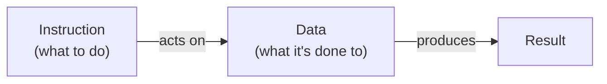
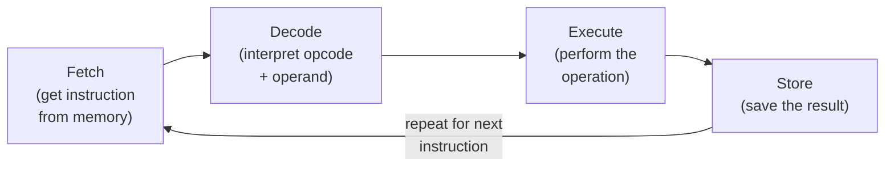
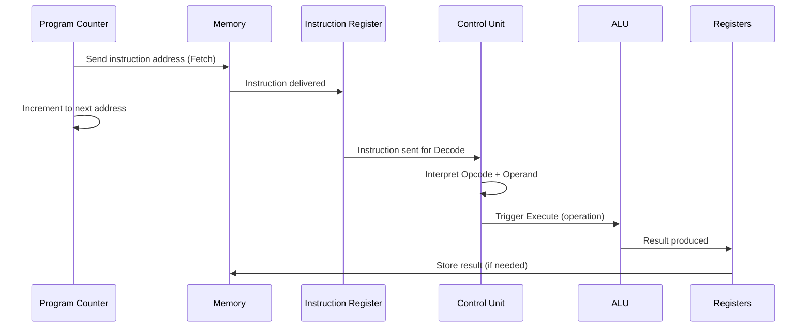
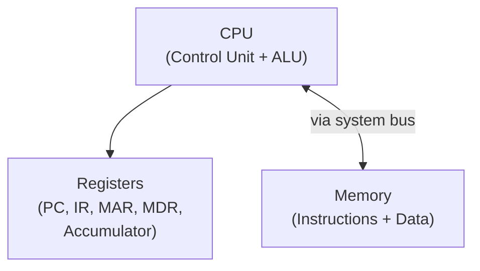
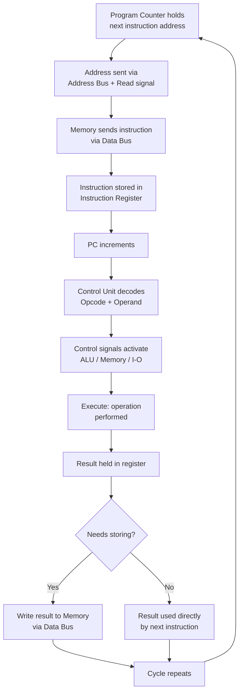

# 2.9 Basic Computer Operation ⋆˚꩜｡

> Give a STAR ♡

---

## Table of Contents 

- [What is a Computer Operation?](#what-is-a-computer-operation)
- [Instruction and Data](#instruction-and-data)
- [Fetch](#fetch)
- [Decode](#decode)
- [Execute](#execute)
- [Store](#store)
- [Fetch-Decode-Execute Cycle](#fetch-decode-execute-cycle)
- [Role of CPU, Memory, and Registers](#role-of-cpu-memory-and-registers)
- [Basic Flow of Instruction Execution](#basic-flow-of-instruction-execution)

---

## What is a Computer Operation?

Okay so let's zoom out for a sec. A **Computer Operation** is basically any single task the computer performs to process an instruction — like adding two numbers, moving data from one place to another, comparing values, or storing a result.

Formally: **A Computer Operation refers to the sequence of steps a computer's CPU carries out to fetch an instruction from memory, understand what it means, execute it, and (if needed) store the result — completing one full "unit of work."**

Basically, every single thing your computer does — opening an app, typing a letter, playing a video — is really just MILLIONS of these tiny basic operations happening one after another, at insane speed. It's giving "many small steps make one big result" energy, like literally the whole philosophy of computing in one sentence.

---

## Instruction and Data

Quick refresher because these two are the raw material for every operation:

- **Instruction** = the command telling the CPU WHAT to do (made of Opcode + Operand, remember?)
- **Data** = the actual information/values that the instruction operates ON

Both live together in memory (stored program concept), and the CPU pulls them out as needed. Without Data, an instruction has nothing to work on. Without Instructions, Data just sits there doing nothing. They're basically a package deal — like fries and ketchup, technically separate but need each other to make sense.

---

## Fetch

**Fetch** is the FIRST step in every basic computer operation — this is where the CPU goes and RETRIEVES the next instruction from memory.

How it works:
1. A special CPU register called the **Program Counter (PC)** holds the address of the NEXT instruction to be executed
2. CPU sends this address out via the **Address Bus** to memory
3. CPU sends a **Read control signal** telling memory "give me what's at this address"
4. Memory locates the instruction and sends it back via the **Data Bus**
5. The instruction is placed into a register called the **Instruction Register (IR)**, ready to be worked on
6. The Program Counter automatically increments (moves forward) to point to the NEXT instruction's address, so it's ready for the next Fetch cycle

Basically: Fetch = "go get the next command." Nothing gets interpreted or acted on yet, it's purely a retrieval step.

---

## Decode

**Decode** is the SECOND step, where the CPU actually figures out WHAT the fetched instruction means.

How it works:
1. The instruction sitting in the Instruction Register (IR) gets passed to the **Control Unit**
2. Control Unit breaks the instruction down into its two core parts — **Opcode** (what operation) and **Operand** (what data/address)
3. Control Unit interprets the opcode to determine exactly which operation is needed (addition, subtraction, data movement, comparison, jump, etc.)
4. Based on this interpretation, the Control Unit prepares/activates the necessary internal pathways and components required for the NEXT step (Execute)

Basically: Decode = "translate the command from binary-speak into an actual actionable plan." It's the CPU going "oh okay, THIS is what you're asking me to do, got it."

---

## Execute

**Execute** is the THIRD step — where the actual operation specified by the instruction is PERFORMED.

How it works:
- If it's an **arithmetic/logic operation** (add, subtract, AND, OR, etc.) — the **ALU (Arithmetic Logic Unit)** carries it out using the operand data
- If it's a **data movement operation** — data gets transferred between registers, memory, or I/O as specified
- If it's a **control flow operation** (like a jump/branch) — the Program Counter gets updated to point somewhere different than the "next in sequence" address

This is genuinely the step where the "work" actually happens. Fetch and Decode were prep steps — Execute is where the magic (or math, or data-shuffling) actually goes down.

---

## Store

**Store** is the final step — where the RESULT of the executed operation gets saved somewhere for later use.

How it works:
1. Once ALU (or whichever component) finishes the operation, the result is temporarily held in a register
2. If needed, this result is then WRITTEN back into memory (using a Write control signal, address bus, and data bus, exactly like we covered in the Memory Unit notes) OR kept in a register for immediate further use by the next instruction
3. Not every single instruction needs a "store" step btw — some instructions' results just get used directly by the following instruction without needing to be permanently saved

Basically: Store = "don't let this result vanish into thin air, keep it somewhere safe/accessible."

---

## Fetch-Decode-Execute Cycle

Now let's put it ALL together. This is quite literally the heartbeat of every computer that has ever existed — the **Fetch-Decode-Execute Cycle** (sometimes extended to Fetch-Decode-Execute-Store):

This cycle repeats over and over and over, non-stop, for every single instruction in every single program running on your computer, billions of times per second (depending on the clock speed). Like it NEVER stops as long as your computer is on — it's basically the world's most committed gym routine, no missed days ever.

A more detailed sequence view showing the components involved:

---

## Role of CPU, Memory, and Registers

Let's break down WHO does WHAT during this entire process, because it really is a full team effort:

### CPU
- The overall "brain" that coordinates and carries out the entire cycle
- Contains the Control Unit (decodes instructions, generates control signals) and ALU (performs actual calculations/logic)
- Directs traffic between all the other components throughout Fetch, Decode, Execute, Store

### Memory
- Stores BOTH the instructions (the program) and the data being processed
- Supplies instructions to the CPU during Fetch, and supplies/receives data during Execute/Store
- Passive participant — it doesn't "decide" anything, it just responds to Read/Write requests from CPU

### Registers
Small, super-fast storage locations INSIDE the CPU itself (way faster than accessing main memory), used to temporarily hold stuff during processing:

| Register | Role |
|---|---|
| **Program Counter (PC)** | holds address of the NEXT instruction to fetch |
| **Instruction Register (IR)** | holds the CURRENTLY fetched instruction, being decoded/executed |
| **Accumulator/General Registers** | hold data/operands and intermediate results during Execute |
| **Memory Address Register (MAR)** | holds the address about to be sent to memory |
| **Memory Data Register (MDR)** | holds the data being transferred to/from memory |

Basically: CPU = the manager, Memory = the storage warehouse, Registers = the manager's personal desk where they keep the stuff they're ACTIVELY working with right this second (way faster to grab from the desk than walk to the warehouse every time).

---

## Basic Flow of Instruction Execution

Let's walk through ONE complete instruction's journey from start to finish, tying literally everything together:

1. **Program Counter** holds the address of the next instruction
2. CPU sends this address via **Address Bus** to Memory, with a **Read control signal** (Fetch begins)
3. Memory retrieves the instruction and sends it back via **Data Bus** into the **Instruction Register**
4. Program Counter increments to prepare for the next fetch
5. **Control Unit** decodes the instruction in the IR — splits it into Opcode + Operand
6. Based on the Opcode, Control Unit sends the appropriate **control signals** to activate the right components (ALU for calculation, or Memory/IO Read-Write for data movement)
7. **Execute** happens — ALU performs the operation using the Operand data (fetched from registers or memory as needed)
8. Result is produced and held temporarily in a register
9. If required, **Store** happens — result gets written back to memory via Write control signal, Address Bus, and Data Bus
10. Cycle restarts — Program Counter (already incremented) points to the next instruction, and Fetch begins again

This ENTIRE flow, from step 1 to step 10, happens in a matter of nanoseconds. Your computer is doing this literally billions of times every second you're using it, for every tiny action, even just moving your mouse cursor. Genuinely unhinged levels of speed when you actually sit and think about it 😭

---

## tl;dr for last-minute revision panic

- **Computer Operation** = the full sequence CPU follows to process one instruction, start to finish
- **Instruction + Data** work together — instruction is the command, data is what it acts on
- **Fetch** = retrieve instruction from memory (using PC, Address Bus, Read signal) into Instruction Register; PC increments
- **Decode** = Control Unit interprets Opcode + Operand from the fetched instruction
- **Execute** = the actual operation is performed (ALU for calculations, or data movement/control flow)
- **Store** = result gets saved (to register or written back to memory) if needed
- **Fetch-Decode-Execute (Store) Cycle** = this loop repeats continuously, non-stop, for every instruction, billions of times per second
- **CPU** coordinates everything (Control Unit + ALU); **Memory** stores instructions & data passively; **Registers** (PC, IR, MAR, MDR, Accumulator) hold actively-used data right inside the CPU for speed
- Basic flow ties EVERYTHING together: PC → Fetch (bus+signals) → Decode (opcode/operand) → Execute (ALU/control signals) → Store (if needed) → repeat

that's the full basic computer operation cycle down, u officially understand how ur computer actually "thinks" now ⸜(｡˃ ᵕ ˂ )⸝♡

---

⋆˚꩜｡

If you enjoyed these notes, you'll probably enjoy the rest too.

| Platform | Link |
|---|---|
| Instagram | @mehrunnisa.ai |
| SubStack | The Epoch |
| YouTube | @mehrunnisa.ai |

**Usage Terms**

These notes are free to use for personal learning, revision, and study. Please do not:
- Sell or redistribute for profit.
- Claim them as your own work.
- Modify and republish without permission.
- Use for any unethical or unauthorized purpose.

Thank you for respecting the effort behind these notes. Happy learning. ♡

