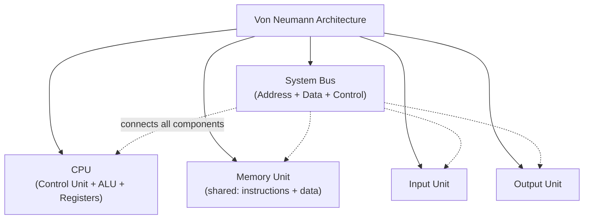
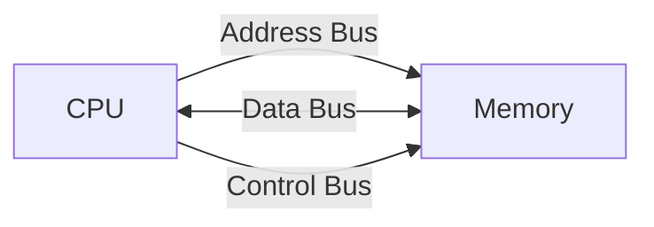
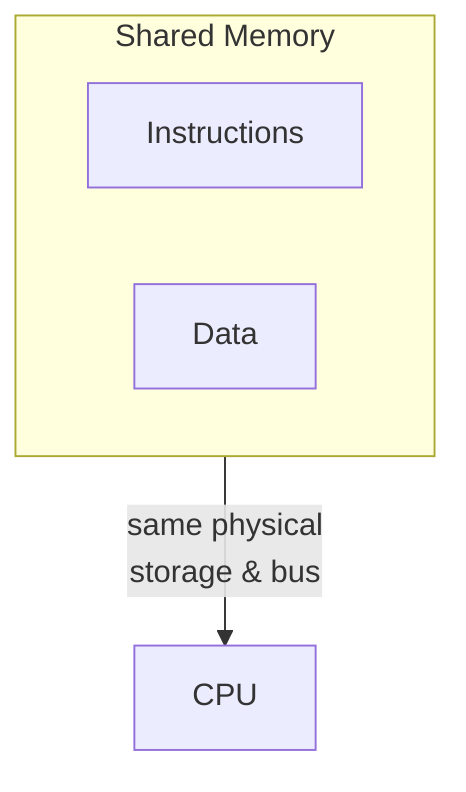
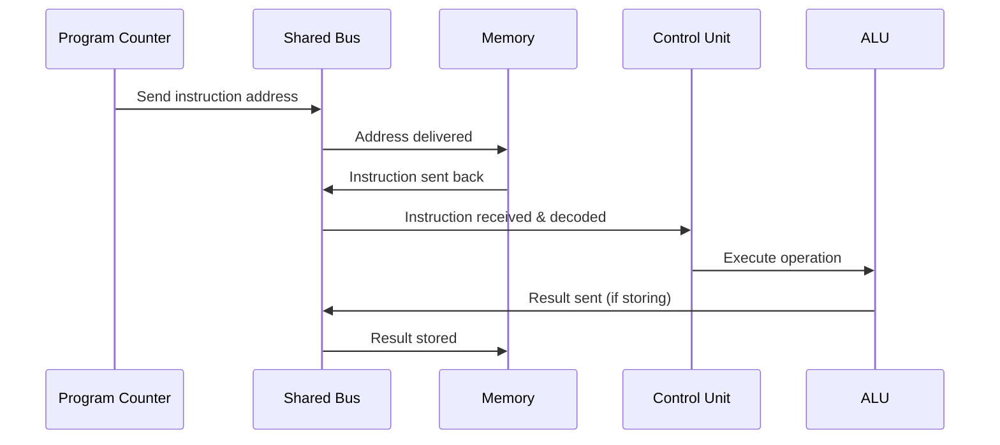
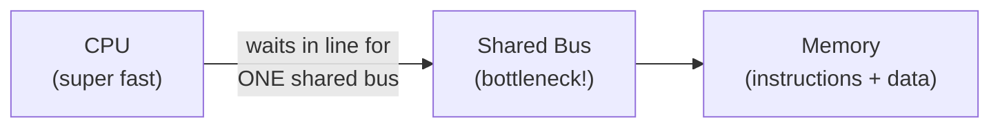
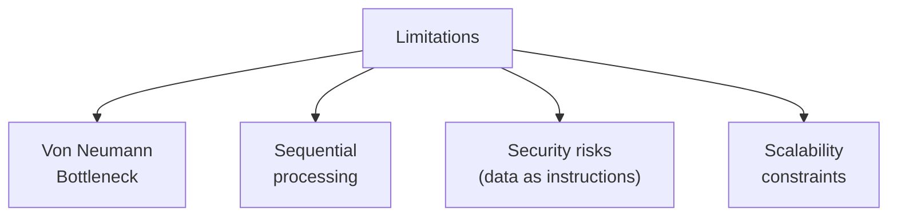
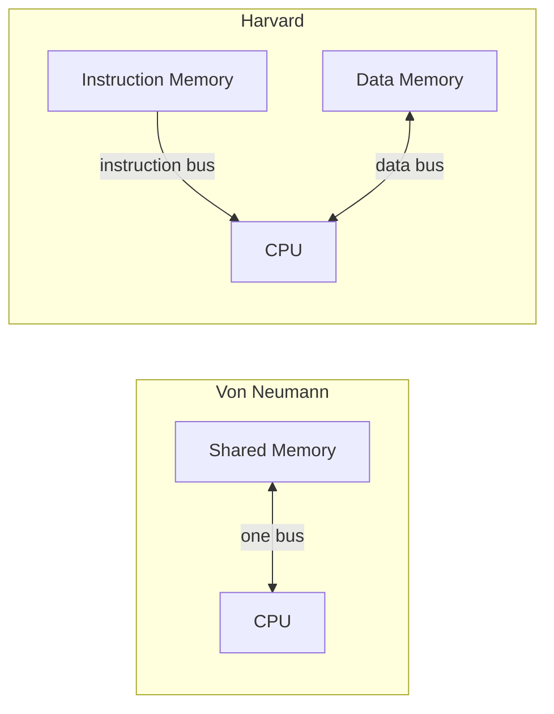

# 2.11 Von Neumann Architecture ⋆˚꩜｡

> Give a Starr!! ♡

---

## Table of Contents (tap to zoom there)

- [What is Von Neumann Architecture?](#what-is-von-neumann-architecture)
- [Basic Components](#basic-components)
- [Central Processing Unit (CPU)](#central-processing-unit-cpu)
- [Arithmetic Logic Unit (ALU)](#arithmetic-logic-unit-alu)
- [Control Unit (CU)](#control-unit-cu)
- [Registers](#registers)
- [Memory Unit](#memory-unit)
- [Input Unit](#input-unit)
- [Output Unit](#output-unit)
- [System Bus](#system-bus)
- [Stored-Program Concept](#stored-program-concept)
- [Instruction and Data Sharing the Same Memory](#instruction-and-data-sharing-the-same-memory)
- [Instruction Fetch and Execution](#instruction-fetch-and-execution)
- [Von Neumann Bottleneck](#von-neumann-bottleneck)
- [Advantages](#advantages)
- [Limitations](#limitations)
- [Von Neumann Architecture vs Harvard Architecture](#von-neumann-architecture-vs-harvard-architecture)

---

## What is Von Neumann Architecture?

**Von Neumann Architecture** is a computer design model proposed by mathematician **John von Neumann** in 1945, which describes a system where a **single shared memory** holds BOTH instructions (the program) and data, connected to a CPU via a **single shared bus system.**

Formally: **Von Neumann Architecture is a computer architecture design based on the stored-program concept, where instructions and data are stored together in the same memory and accessed through a common bus, with a CPU (containing a Control Unit and ALU) that fetches, decodes, and executes these instructions sequentially.**

If you've been following along with our previous notes, this one's basically the "final boss reveal" where all the individual pieces (memory unit, system bus, stored-program concept, data/instructions/control signals) get assembled into ONE complete working system. It's giving "the whole is greater than the sum of its parts" energy, honestly.

---

## Basic Components

Von Neumann Architecture is built from these core building blocks, all working together:

Let's break down each one, one at a time.

---

## Central Processing Unit (CPU)

- The **"brain"** of the entire system — responsible for fetching, decoding, and executing instructions.
- Made up of THREE main sub-components: the **Control Unit**, the **Arithmetic Logic Unit (ALU)**, and a set of **Registers**.
- Everything in the system, at the end of the day, exists to feed data/instructions INTO the CPU and receive results OUT of it.

---

## Arithmetic Logic Unit (ALU)

- The component that actually PERFORMS calculations and logical operations.
- Handles **arithmetic operations** (addition, subtraction, multiplication, division) AND **logical operations** (AND, OR, NOT, comparisons like greater-than/less-than).
- Takes operand data as input, performs the operation specified by the current instruction's opcode, and produces a result.
- Basically: this is the "math nerd" of the CPU squad, does all the actual number-crunching work.

---

## Control Unit (CU)

- The component responsible for **decoding instructions** and **generating control signals** to coordinate the rest of the system.
- Directs the Fetch-Decode-Execute cycle — tells memory when to send instructions, tells the ALU when/what to compute, tells registers when to load/store values.
- Basically: this is the "manager/director" of the CPU squad, doesn't do the actual math itself, just tells everyone else what to do and when.

---

## Registers

- Small, extremely fast storage locations located INSIDE the CPU itself (much faster to access than main memory).
- Used to temporarily hold data/addresses actively being worked with during instruction execution.
- Key registers include:

| Register | Role |
|---|---|
| **Program Counter (PC)** | holds address of the next instruction to fetch |
| **Instruction Register (IR)** | holds the current instruction being decoded/executed |
| **Memory Address Register (MAR)** | holds the address about to be sent to memory |
| **Memory Data Register (MDR)** | holds data being transferred to/from memory |
| **Accumulator/General Registers** | hold operands and intermediate results during ALU operations |

---

## Memory Unit

- The **single, shared storage space** that holds BOTH the program instructions and the data those instructions work on — this is the literal heart of the stored-program concept, embedded right into the architecture.
- Organized into individually addressable locations, each holding a fixed-size word.
- Memory doesn't "know" whether what's stored at a location is instruction or data — that distinction is purely determined by how the CPU chooses to access/interpret it (based on what the Program Counter is pointing to).

---

## Input Unit

- The component responsible for **bringing data and instructions INTO the system** from the outside world.
- Devices like keyboard, mouse, scanner, microphone all fall under this category.
- Converts human-friendly input into binary form the computer can process, then feeds it into memory for the CPU to eventually work with.

---

## Output Unit

- The component responsible for **presenting the processed results OUT to the user**, in a human-understandable form.
- Devices like monitor, printer, speakers, projector fall under this category.
- Converts binary results back into text, images, sound, or printed form for humans to actually understand.

---

## System Bus

- The **shared communication pathway** connecting CPU, Memory, Input, and Output components.
- Made up of THREE separate buses working together:
  - **Address Bus** — unidirectional, carries the location/address being accessed
  - **Data Bus** — bidirectional, carries the actual data/instructions being transferred
  - **Control Bus** — carries control signals (Read, Write, Clock, etc.) that coordinate timing

The KEY thing to remember about Von Neumann specifically: it's ONE shared bus system used for BOTH instructions and data — this becomes very important later (see Bottleneck section below, spoiler alert it's not all good news).

---

## Stored-Program Concept

- This is the FOUNDATIONAL idea baked directly into Von Neumann Architecture: both instructions AND data are stored together in the same memory, represented in binary form.
- This means programs can be loaded, changed, and reloaded easily — no physical rewiring needed to run a different program, just load different instructions into memory.
- We covered this in full detail in our previous notes (2.10), but the short version: **Von Neumann Architecture is literally the physical implementation of the Stored-Program Concept.**

---

## Instruction and Data Sharing the Same Memory

- Both instructions and data occupy the SAME memory space, just at different addresses.
- The CPU distinguishes them based on context — the **Program Counter** tracks which address holds the NEXT instruction, while operands reference addresses containing data.
- This shared arrangement is efficient in terms of hardware design (only one memory system needed) but comes with a notable trade-off we'll discuss shortly.

---

## Instruction Fetch and Execution

Following the now-familiar cycle, tied directly to Von Neumann's shared memory + shared bus design:

1. **Fetch** — PC sends instruction address via Address Bus, Read signal sent, instruction retrieved via Data Bus into Instruction Register, PC increments
2. **Decode** — Control Unit interprets Opcode + Operand
3. **Execute** — ALU (or relevant component) performs the operation
4. **Store** (if needed) — result written back to memory via the same shared bus

Notice how EVERYTHING — the instruction fetch AND the data transfer — travels over that SAME shared bus. That's the defining characteristic (and eventual limitation) of this whole architecture.

---

## Von Neumann Bottleneck

Okay here's the plot twist bestie — this elegant "one shared memory, one shared bus" design has a pretty significant downside:

- Since instructions AND data travel over the SAME bus, the CPU **cannot fetch an instruction and access data at the exact same time** — they have to take turns, one after another.
- This creates a **speed limitation**, because no matter how fast the CPU itself can process things internally, it's constantly stuck WAITING for the bus to be free to either fetch the next instruction or grab/store data.
- This limitation is famously called the **Von Neumann Bottleneck** — the shared bus becomes a literal traffic jam that limits overall system performance, especially as CPUs got faster and faster while the bus speed struggled to keep up.

Basically: imagine a super fast chef 👨‍🍳 who can cook multiple dishes simultaneously, but there's only ONE door in and out of the kitchen for both ingredients AND finished dishes. No matter how fast the chef is, that one door becomes the actual limiting factor. That's the Von Neumann Bottleneck in a nutshell.

---

## Advantages

Despite the bottleneck, this architecture has stuck around for DECADES because of some serious upsides:

1. **Simple design** — one unified memory and bus system is easier/cheaper to design and manufacture than having separate systems
2. **Flexibility** — since it's built on the stored-program concept, the same hardware can run any program just by loading new instructions
3. **Cost-effective** — general-purpose design means one machine handles countless different tasks
4. **Easier programming model** — having a unified memory space makes it simpler for programmers/compilers to manage memory
5. **Efficient use of memory** — since instructions and data share the same pool, memory isn't wastefully divided/underused between separate instruction-only and data-only spaces

---

## Limitations

But let's be real about the downsides too, no sugarcoating:

1. **Von Neumann Bottleneck** — the shared bus limits how fast data/instructions can move, capping overall system performance
2. **Sequential processing by default** — instructions are typically fetched and executed one at a time (though modern CPUs use tricks like pipelining to work around this)
3. **Security risks** — since instructions and data live in the same memory space, there's a risk of data being MISTAKENLY (or maliciously) executed as if it were an instruction, which is actually the root cause behind certain types of security vulnerabilities/exploits
4. **Scalability limits** — as processing speeds increase, the shared-bus design becomes an increasingly bigger constraint on overall performance gains

---

## Von Neumann Architecture vs Harvard Architecture

Time for the comparison everyone's been waiting for. **Harvard Architecture** is the main alternative design, and the key difference is refreshingly simple:

| Feature | Von Neumann Architecture | Harvard Architecture |
|---|---|---|
| **Memory** | Single shared memory for instructions + data | Separate memory for instructions and data |
| **Bus** | Single shared bus for both | Separate buses for instructions and data |
| **Fetch instruction + access data** | Cannot happen simultaneously (bottleneck) | CAN happen simultaneously (no bottleneck there) |
| **Design complexity** | Simpler, cheaper | More complex, more expensive |
| **Speed** | Limited by shared bus | Generally faster due to parallel access |
| **Common use** | General-purpose computers (PCs, laptops) | Often used in specialized systems, microcontrollers, digital signal processors |

Basically: Von Neumann = one shared road for everything (simpler but can get congested), Harvard = two separate dedicated roads (more complex to build, but way less traffic jams). Most everyday general-purpose computers (your laptop, your phone's main processor) still lean Von Neumann-ish at their core, sometimes with Harvard-style tweaks (like separate instruction/data caches) to reduce that bottleneck without a full redesign.

---

## tl;dr for last-minute revision panic

- **Von Neumann Architecture** = computer design with single shared memory (instructions + data together) and single shared bus, connected to a CPU
- Basic components: **CPU** (Control Unit + ALU + Registers), **Memory Unit**, **Input Unit**, **Output Unit**, **System Bus**
- **ALU** does calculations/logic, **Control Unit** decodes instructions & generates control signals, **Registers** (PC, IR, MAR, MDR, Accumulator) hold actively-used values
- Built on the **Stored-Program Concept** — instructions and data share the same memory, distinguished by context (Program Counter)
- Instruction cycle: Fetch → Decode → Execute → Store, all traveling over the SAME shared bus
- **Von Neumann Bottleneck** = since instructions and data share one bus, they can't be accessed simultaneously, creating a speed limitation
- **Advantages**: simple design, flexible, cost-effective, easier programming model, efficient memory use
- **Limitations**: bottleneck, mostly sequential processing, security risks (data mistaken for instructions), scalability limits
- **vs Harvard Architecture**: Harvard uses SEPARATE memory + buses for instructions and data, avoiding the bottleneck (simultaneous access possible), but is more complex/costly to build

that's Von Neumann Architecture fully unpacked, u now understand the actual blueprint behind basically every computer u own, absolute legend ⸜(｡˃ ᵕ ˂ )⸝♡

---

⋆˚꩜｡

If you enjoyed these notes, you'll probably enjoy the rest too.

| Platform | Link |
|---|---|
| Instagram | @mehrunnisa.ai |
| SubStack | The Epoch |
| YouTube | @mehrunnisa.ai |

**Usage Terms**

These notes are free to use for personal learning, revision, and study. Please do not:
- Sell or redistribute for profit.
- Claim them as your own work.
- Modify and republish without permission.
- Use for any unethical or unauthorized purpose.

Thank you for respecting the effort behind these notes. Happy learning. ♡

