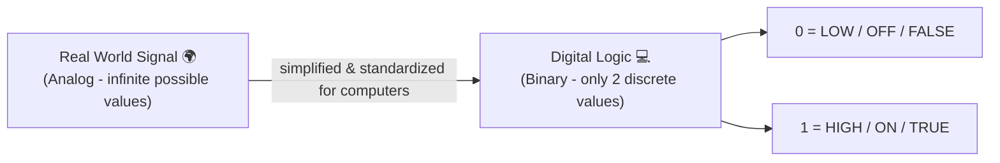
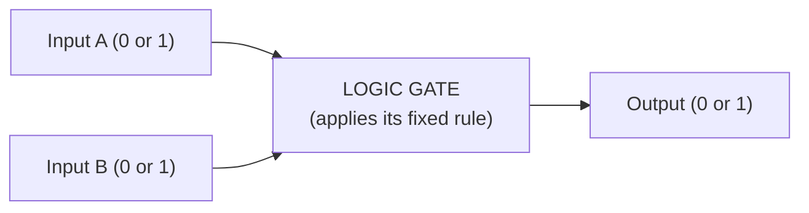
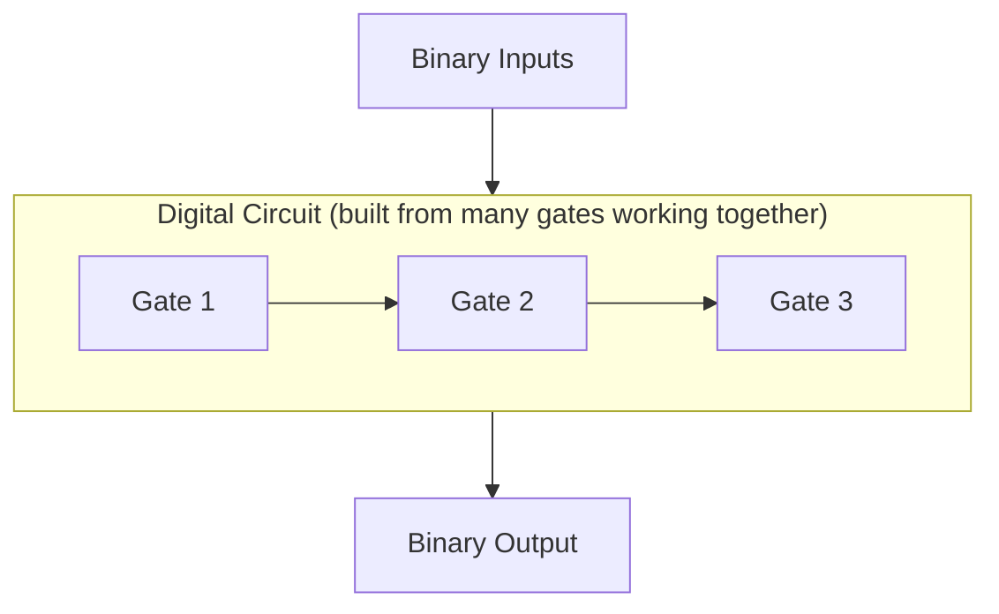
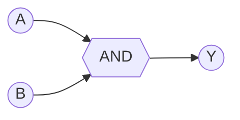
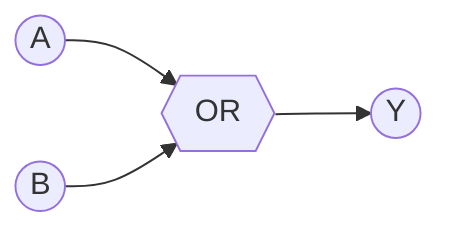
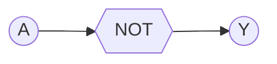
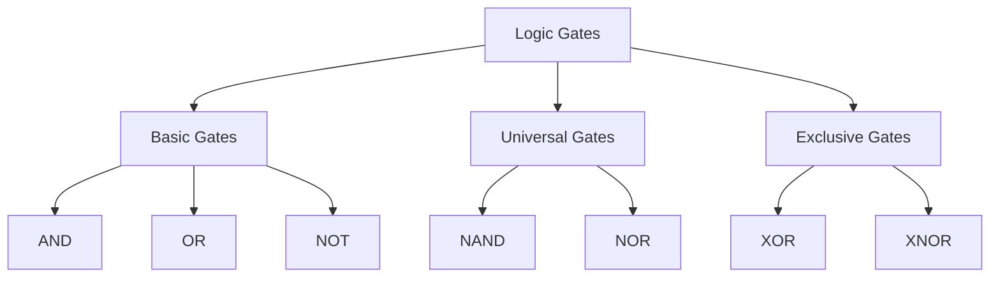

# 3.1 What is a Logic Gate? ⋆˚꩜｡
### *Please give a STAR!!!*

---

## 📋 Table of Contents

- [1. Definition of a Logic Gate](#1-definition-of-a-logic-gate)
- [2. Digital Logic and Binary Values](#2-digital-logic-and-binary-values)
- [3. Logic 0 and Logic 1](#3-logic-0-and-logic-1)
- [4. Inputs and Outputs](#4-inputs-and-outputs)
- [5. Boolean Logic](#5-boolean-logic)
- [6. Logic Gate as a Digital Circuit](#6-logic-gate-as-a-digital-circuit)
- [7. Truth Table](#7-truth-table)
- [8. Logic Expression](#8-logic-expression)
- [9. Logic Gate Symbols](#9-logic-gate-symbols)
- [10. Basic Types of Logic Gates](#10-basic-types-of-logic-gates)
- [11. Applications of Logic Gates](#11-applications-of-logic-gates)

---

## 1. Definition of a Logic Gate

Okay so imagine a tiny bouncer standing at the door of a club. The bouncer looks at who's trying to come in (that's your **input**), applies ONE simple, unchanging rule (that's the **logic**), and then makes a decision whether to let anyone through (that's your **output**). That bouncer? Basically a logic gate in human form.

Now zoom out. A logic gate is the smallest "decision-making unit" in all of digital electronics. It doesn't think, it doesn't get tired, it doesn't have opinions — it just takes electrical signals that represent 0s and 1s, runs them through a fixed rule, and gives back exactly one 0 or 1 as the answer. Every single time, no exceptions, no mood swings, no "let me think about it."

Here's the wild part: your phone unlocking with face ID, your calculator doing 7×8, your WiFi router routing packets, your laptop booting up — literally ALL of it, at the very bottom layer, is just an insane number of these tiny bouncers stacked, wired, and combined together, each doing their one simple job at billions of times per second. ⋆˚꩜｡

A logic gate always has:
- One or more **inputs** (the stuff going in — usually 2, sometimes 1 or 3+)
- Exactly **one output** (the decision it spits out)
- A fixed **rule** it never breaks (this rule is what makes it an AND gate vs an OR gate vs whatever)

Gates are physically built using **transistors** — tiny electronic switches — arranged in specific patterns so that the circuit's electrical behavior matches the logical rule it's supposed to follow. But for this chapter, don't stress about the transistor-level wiring. Just understand: logic gate = "a rule-following mini decision box that runs on electricity."

#### 📖 Formal Definition
> A **logic gate** is a fundamental building block of digital electronic circuits that performs a specific Boolean (logical) operation on one or more binary inputs and produces a single binary output, based strictly on the rules of Boolean algebra.

---

## 2. Digital Logic and Binary Values

Here's the tea: computers don't understand "yes," "maybe," "kinda," "let me get back to you," or your general indecisiveness. They understand exactly **two** states. Full stop. No in-between, no vibes, no gray area, no 50 shades of anything.

This is called **digital logic** — a system of representing and processing information using a small, fixed, discrete set of values (in our case, just two), as opposed to **analog** systems, where a signal can smoothly take on literally any value within a range (think of an old volume dial that can be anywhere between 0 and 10, including 3.7 or 8.213).

So why did engineers pick binary (base-2, only using digits `0` and `1`) instead of something with more options? A few solid reasons:

1. **Reliability** — Electronic circuits are amazing at telling the difference between "there's a strong voltage here" and "there's basically no voltage here." But asking a circuit to reliably tell apart 10 different voltage levels (like in a base-10 system) is way harder and way more error-prone, especially with electrical noise messing things up.
2. **Simplicity** — Two-state systems are mathematically simple to design circuits for, using Boolean algebra (see [Section 5](#5-boolean-logic)).
3. **Speed** — Because the circuit only ever needs to check "is this HIGH or LOW," it can make that check unbelievably fast — literally billions of times per second in a modern processor.
4. **Noise immunity** — Even if there's a little electrical interference, a "1" signal and "0" signal are so far apart in voltage that small disturbances won't accidentally flip one into the other.

This is why literally everything digital — your phone, laptop, smartwatch, microwave's tiny brain — runs on binary under the hood, even though what you SEE on screen (photos, videos, text, sound) looks nothing like a string of 0s and 1s. It's all translated back and forth constantly.

#### 📖 Formal Definition
> **Digital logic** is the branch of electronics concerned with circuits that operate using discrete (binary) values, typically represented as `0` and `1`, as opposed to analog electronics which deals with continuously variable signals. A **binary value** refers to a numerical or logical value expressed using the base-2 number system, consisting only of the digits 0 and 1.

---

## 3. Logic 0 and Logic 1

These two values are the entire vocabulary of digital electronics, but they go by a bunch of different nicknames depending on the context you find them in. Don't let that confuse you — they always mean the exact same underlying idea.

| Logic 0 | Logic 1 |
|---|---|
| LOW | HIGH |
| FALSE | TRUE |
| OFF | ON |
| No voltage / low voltage (roughly 0V) | Voltage present (commonly +5V or +3.3V depending on the system) |
| "nah" | "yeah" |
| Switch open | Switch closed |

In real circuits, these aren't just abstract ideas — they correspond to actual voltage ranges. For example, in a common system:
- Anything close to 0V might be read by the circuit as **Logic 0**
- Anything close to +5V might be read as **Logic 1**
- There's usually a small "forbidden zone" in between that the circuit should never sit in for long, because that's where things get unreliable

So when a wire in a circuit is sitting at **Logic 1**, it basically means "there's current/voltage flowing here, this signal is active, this represents TRUE." When it's at **Logic 0**, it means "there's essentially no voltage here, this signal is inactive, this represents FALSE."

Every single logic gate's entire job is just this: look at the 0s and 1s coming IN, apply its rule, and decide what 0 or 1 should go OUT.

#### 📖 Formal Definition
> **Logic 1** represents the binary state of TRUE, HIGH, or ON, typically corresponding to the presence of a defined voltage level in a digital circuit. **Logic 0** represents the binary state of FALSE, LOW, or OFF, typically corresponding to the absence of voltage (or a voltage near zero) in a digital circuit.

---

## 4. Inputs and Outputs

Every logic gate, no matter which type it is, follows the same basic structure:

- **Inputs** – the signal(s) going INTO the gate. Depending on the type of gate, there can be just 1 input (like NOT), 2 inputs (the most common setup, like AND/OR), or even more inputs in more advanced multi-input gate designs.
- **Output** – the signal coming OUT of the gate. No matter how many inputs a gate has, it ALWAYS produces exactly **one** output signal.

Think of it like a group project (yes, we're doing this analogy again because it just works). Multiple group members each contribute their part — those are your inputs. But at the end of the day, only **one final file** gets submitted — that's your output. What ends up in that final submission depends entirely on the specific "combination rule" the group follows (in gate-world, that rule is what makes something an AND gate vs an OR gate vs whatever else).

Each input and the output can only ever be one of two values — `0` or `1` — never anything else. There's no "half input" or "output equals maybe."

Important thing to remember for exams: the number of possible input **combinations** a gate can face is `2ⁿ`, where `n` is the number of inputs. So:
- 1 input → 2 possible combinations
- 2 inputs → 4 possible combinations
- 3 inputs → 8 possible combinations

This directly determines how many rows will be in that gate's truth table (see [Section 7](#7-truth-table)).

#### 📖 Formal Definition
> An **input** of a logic gate is a binary signal (0 or 1) supplied to the gate for processing. An **output** is the single resulting binary signal (0 or 1) produced by the gate after it has processed its input(s) according to its defined logical operation.

---

## 5. Boolean Logic

Boolean logic is basically the entire "math syllabus" that every logic gate strictly follows, no exceptions. It's named after **George Boole**, a 19th-century mathematician who developed a whole system of algebra where variables can only ever take on two values — TRUE (1) or FALSE (0) — instead of the infinite range of numbers you're used to in regular algebra.

In regular algebra, you've got operators like `+`, `-`, `×`, `÷`. In Boolean algebra, the main operators are completely different, and they map directly onto logic gates:

| Boolean Operator | Symbol(s) used | Meaning | Everyday translation |
|---|---|---|---|
| AND | `·`, `∧`, or just writing letters together (AB) | Result is true only if BOTH conditions are true | "I'll go out only if it's sunny AND I have money" |
| OR | `+`, `∨` | Result is true if AT LEAST ONE condition is true | "I'll eat if there's pizza OR biryani" |
| NOT | `¬`, `'`, or a bar over the letter (Ā) | Flips/inverts the value | "I will NOT skip class" (flips skip → attend) |

Boolean algebra also comes with its own set of **laws and rules**, similar to how regular algebra has rules like the distributive property. Some famous ones you'll bump into later in this chapter (not going deep here since it's a separate topic, but good to know they exist):
- Commutative Law (A+B = B+A)
- Associative Law
- Distributive Law
- De Morgan's Laws (super important later — connects AND/OR through NOT)

The key relationship to lock into your brain: **logic gates are the real, physical, electronic implementation of Boolean operations**. Boolean algebra is the pure math theory sitting on a whiteboard; logic gates are that same theory built into actual hardware that can process real electrical signals. One is the concept, the other is the concept made real. ✦ ݁˖

#### 📖 Formal Definition
> **Boolean logic** (or Boolean algebra) is a branch of mathematics dealing with variables that can hold only two possible values — TRUE (1) and FALSE (0) — combined using logical operators such as AND, OR, and NOT, to determine the truth value of logical expressions.

---

## 6. Logic Gate as a Digital Circuit

A logic gate isn't just some abstract symbol floating around in a textbook diagram — it's an actual, physical, real-world electronic circuit. Under the hood, it's typically built from **transistors** (tiny electronic switches that can be either "on" or "off"), wired together in very specific arrangements so that the overall circuit behaves exactly according to the Boolean rule it's meant to represent.

So when you see a triangle or D-shape gate symbol drawn on paper, that symbol is standing in for a real chunk of circuitry that:

1. **Receives** electrical signals (voltages) as its input(s)
2. **Processes** those signals through an arrangement of transistors that either allow or block current flow depending on the input combination
3. **Produces** one electrical signal as its output, which itself can then become the input to the NEXT gate down the line

This is exactly how bigger, more powerful digital circuits get built — you don't design a processor gate-by-gate from scratch every time, you combine tons of individual gates into larger functional blocks (like adders, multiplexers, memory cells), and then combine THOSE blocks into even bigger systems. It's basically digital Lego, except instead of building a castle you're building the thing running your Instagram feed right now.

A modern CPU can contain **billions** of these individual gates, all switching on and off potentially billions of times per second, working together to run every calculation, every app, every pixel you see. Wild to think this whole markdown file rendering on your screen ultimately traces back to gates like these. 𐔌՞ ܸ.ˬ.ܸ՞𐦯

#### 📖 Formal Definition
> A logic gate, as a **digital circuit**, is a physically realized electronic circuit — commonly constructed using transistors — designed to accept one or more binary input signals and produce a binary output signal that corresponds precisely to a specific Boolean logic operation.

---

## 7. Truth Table

A **truth table** is basically a gate's entire personality summed up in a neat little chart. It lists out **every single possible combination** of input values the gate could ever receive, and next to each one, tells you exactly what output the gate will give. No surprises, no randomness, no "it depends on my mood" — gates are 100% predictable machines, unlike literally every group project member you've ever had. ⸜(｡˃ ᵕ ˂ )⸝♡

For a gate with 2 inputs, there are always exactly **4 possible combinations** of those inputs (mathematically, this is `2² = 4`):

| A | B |
|---|---|
| 0 | 0 |
| 0 | 1 |
| 1 | 0 |
| 1 | 1 |

You then add an "Output" column to this table showing what that SPECIFIC gate produces for each of those 4 combos — and that output column is literally the only thing that differs between an AND gate's truth table and an OR gate's truth table. Same input combos, different output rule. We'll build out the actual truth tables for every gate type in [Section 10](#10-basic-types-of-logic-gates).

Quick formula to remember for exams: if a gate has **n inputs**, its truth table will always have **2ⁿ rows**.
- 1 input → 2 rows
- 2 inputs → 4 rows
- 3 inputs → 8 rows
- 4 inputs → 16 rows

Don't get caught off guard on a test when they throw a 3-input gate at you and you only draw 4 rows out of habit. Count your inputs first, THEN build the table.

#### 📖 Formal Definition
> A **truth table** is a tabular representation that lists all possible combinations of input values for a logical operation or circuit, along with the corresponding output value for each combination, thereby completely defining the behavior of that logic gate or expression.

---

## 8. Logic Expression

A **logic expression** (also called a Boolean expression) is the compact, symbolic, mathematical way of writing down exactly what a gate (or a whole circuit of gates) does — instead of having to draw out a full truth table or a full circuit diagram every single time you want to describe it.

It's basically shorthand. Once you know the notation, you can read a circuit's entire behavior from a single line of symbols. Some standard examples:

- AND gate → `Y = A · B` (often just written as `Y = AB`, dropping the dot)
- OR gate → `Y = A + B`
- NOT gate → `Y = A'` (also written as `Y = Ā`, with a bar over the A)
- NAND gate → `Y = (A · B)'`
- NOR gate → `Y = (A + B)'`
- XOR gate → `Y = A ⊕ B`
- XNOR gate → `Y = (A ⊕ B)'`

Here, `Y` (or sometimes `Q` or `F`) represents the **output**, while `A`, `B`, etc. represent the **inputs**. These expressions aren't just notation for notation's sake — they let engineers describe massively complicated digital circuits, with potentially hundreds of gates, as compact one-line (or few-line) equations. It's basically the ultimate flex of "why draw 50 boxes and lines when I can just write one clean equation that means the exact same thing."

Logic expressions also let you **simplify** circuits using Boolean algebra laws — meaning you can sometimes take a messy, complicated expression and reduce it down to something way simpler that still gives the exact same output for every input combination. This directly translates to needing FEWER physical gates in the real circuit — which means cheaper, faster, and more power-efficient hardware. That whole simplification process is usually a topic of its own (Boolean simplification / K-maps), but it's good to know why expressions matter beyond just "notation."

#### 📖 Formal Definition
> A **logic expression** (or Boolean expression) is a symbolic representation of a logical operation or a combination of logical operations, written using Boolean variables and operators (AND, OR, NOT, etc.), that mathematically defines the relationship between the inputs and the output of a digital circuit.

---

## 9. Logic Gate Symbols

Every gate has its own unique, standardized shape so that engineers anywhere in the world can look at a circuit diagram and instantly recognize which gate is which — kind of like how you can recognize your best friend's texting style without even needing to see their name pop up. These symbols follow international standards (like ANSI/IEEE), so a gate diagram drawn in one country means the exact same thing in another.

Quick shape cheat-sheet (properly explained + drawn per gate in [Section 10](#10-basic-types-of-logic-gates)):

- **AND** → a shape with a flat back and a rounded/D-shaped front
- **OR** → a curved-back shield/pointed shape
- **NOT** → a triangle pointing forward with a small circle (bubble) at its tip
- **NAND** → same shape as AND, but with a bubble added at the output
- **NOR** → same shape as OR, but with a bubble added at the output
- **XOR** → same as OR's shield shape, but with an extra curved line right behind the input side
- **XNOR** → same as XOR, but with a bubble added at the output

The single most important symbol detail to remember: that little **bubble** (small circle) drawn at a gate's output always means "invert this result" — flip whatever the output would normally have been. It's basically the universal "plot twist" symbol in logic-gate-world. See a bubble, know instantly: "oh this is the NOT version of whatever gate shape this is based on."

#### 📖 Formal Definition
> **Logic gate symbols** are standardized graphical representations used in circuit diagrams to denote different types of logic gates, allowing engineers to visually represent the logical function and connections of a digital circuit without describing the underlying transistor-level implementation.

---

## 10. Basic Types of Logic Gates

Let's actually meet the squad properly — seven main characters, each with their own distinct personality, rule, symbol, and truth table. ꉂ(˵˃ ᗜ ˂˵)

### 🔹 AND Gate

**Vibe:** the strict teacher who needs ALL conditions met before giving credit.

The AND gate looks at all of its inputs, and only outputs a `1` if **every single input** is also `1`. The moment even ONE input slacks off and sits at `0`, the whole output collapses to `0`. No partial credit here.

**Expression:** `Y = A · B`

| A | B | Y |
|---|---|---|
| 0 | 0 | 0 |
| 0 | 1 | 0 |
| 1 | 0 | 0 |
| 1 | 1 | 1 |

#### 📖 Formal Definition
> The **AND gate** is a logic gate that produces a HIGH (1) output only when all of its inputs are HIGH (1); if any input is LOW (0), the output is LOW (0). It implements the Boolean AND (multiplication) operation.

---

### 🔹 OR Gate

**Vibe:** the chill friend who's satisfied as long as at least ONE thing goes right.

The OR gate outputs a `1` if **any** of its inputs is `1` — it doesn't need everyone to cooperate, just one. It only outputs `0` in the one scenario where literally everyone fails, i.e. all inputs are `0`.

**Expression:** `Y = A + B`

| A | B | Y |
|---|---|---|
| 0 | 0 | 0 |
| 0 | 1 | 1 |
| 1 | 0 | 1 |
| 1 | 1 | 1 |

#### 📖 Formal Definition
> The **OR gate** is a logic gate that produces a HIGH (1) output when at least one of its inputs is HIGH (1); the output is LOW (0) only when all inputs are LOW (0). It implements the Boolean OR (addition) operation.

---

### 🔹 NOT Gate

**Vibe:** the contrarian friend who disagrees with literally everything you say, purely on principle.

Unlike every other gate here, the NOT gate only ever takes **ONE** input. Its entire job is to flip that input — if it receives a `0`, it outputs `1`; if it receives a `1`, it outputs `0`. It's also called an **inverter** for exactly this reason.

**Expression:** `Y = A'`

| A | Y |
|---|---|
| 0 | 1 |
| 1 | 0 |

#### 📖 Formal Definition
> The **NOT gate**, also known as an **inverter**, is a logic gate with a single input that produces an output which is the logical complement (opposite) of that input — a HIGH (1) input yields a LOW (0) output, and a LOW (0) input yields a HIGH (1) output.

---

### 🔹 NAND Gate (NOT + AND)

**Vibe:** AND gate's rebellious phase — does the literal opposite of AND at every step.

Take everything the AND gate does, and flip the final answer. So the NAND gate's output is `0` **only** when every input is `1` (the one case AND would've said yes to) — and `1` for every other combination.

**Expression:** `Y = (A · B)'`

| A | B | Y |
|---|---|---|
| 0 | 0 | 1 |
| 0 | 1 | 1 |
| 1 | 0 | 1 |
| 1 | 1 | 0 |

Fun fact worth remembering for exams: NAND is called a **"universal gate"**, because you can build literally ANY other logic gate — AND, OR, NOT, all of them — using nothing but a bunch of NAND gates wired together cleverly. Absolute overachiever of the gate world.

#### 📖 Formal Definition
> The **NAND gate** ("NOT-AND") is a logic gate that produces a LOW (0) output only when all of its inputs are HIGH (1); for every other input combination, the output is HIGH (1). It is functionally equivalent to an AND gate followed by a NOT gate, and is classified as a universal gate since any Boolean function can be implemented using only NAND gates.

---

### 🔹 NOR Gate (NOT + OR)

**Vibe:** OR gate's rebellious phase — does the literal opposite of OR at every step.

Take everything the OR gate does, and flip the final answer. So the NOR gate's output is `1` **only** when every single input is `0` — and `0` the moment even one input becomes `1`.

**Expression:** `Y = (A + B)'`

| A | B | Y |
|---|---|---|
| 0 | 0 | 1 |
| 0 | 1 | 0 |
| 1 | 0 | 0 |
| 1 | 1 | 0 |

NOR is also a **universal gate**, same overachiever energy as NAND — you can build any other gate out of just NOR gates too.

#### 📖 Formal Definition
> The **NOR gate** ("NOT-OR") is a logic gate that produces a HIGH (1) output only when all of its inputs are LOW (0); if any input is HIGH (1), the output is LOW (0). It is functionally equivalent to an OR gate followed by a NOT gate, and is classified as a universal gate.

---

### 🔹 XOR Gate (Exclusive OR)

**Vibe:** the "opposites attract" gate. It's only happy when its inputs are DIFFERENT from each other.

The XOR gate outputs `1` only when its inputs are **not equal** to each other (one is 0, the other is 1). If both inputs match — both 0 or both 1 — the output is `0`.

**Expression:** `Y = A ⊕ B`

| A | B | Y |
|---|---|---|
| 0 | 0 | 0 |
| 0 | 1 | 1 |
| 1 | 0 | 1 |
| 1 | 1 | 0 |

XOR gates show up a LOT in things like binary addition circuits and basic error-detection systems, because "are these two things different?" is a surprisingly common question in digital systems.

#### 📖 Formal Definition
> The **XOR gate** ("Exclusive OR") is a logic gate that produces a HIGH (1) output only when its inputs are unequal (i.e., different from one another); if the inputs are equal, the output is LOW (0).

---

### 🔹 XNOR Gate (Exclusive NOR)

**Vibe:** the "we're basically the same person" gate. It's happy when its inputs MATCH.

The XNOR gate is simply the exact opposite of XOR. It outputs `1` only when its inputs are **equal** to each other (both 0 or both 1), and outputs `0` when they differ.

**Expression:** `Y = (A ⊕ B)'`

| A | B | Y |
|---|---|---|
| 0 | 0 | 1 |
| 0 | 1 | 0 |
| 1 | 0 | 0 |
| 1 | 1 | 1 |

Because it checks for "sameness," XNOR gates are commonly used in circuits that need to **compare** two binary values to see if they're identical (equality checkers/comparators).

#### 📖 Formal Definition
> The **XNOR gate** ("Exclusive NOR") is a logic gate that produces a HIGH (1) output only when its inputs are equal (i.e., identical to one another); if the inputs differ, the output is LOW (0). It is the logical complement of the XOR gate.

---

### Quick recap map of the whole gate squad:

---

## 11. Applications of Logic Gates

Okay so why does any of this actually matter beyond passing your exam next week? Because logic gates are, quite literally, everywhere around you, silently running the show:

- **Processors (CPUs)** – built from billions of gates working together to do arithmetic, make decisions, and execute every instruction your programs run
- **Calculators** – gates directly handle the actual binary math operations happening behind every button press
- **Memory devices (RAM, flip-flops, registers)** – built using clever combinations of gates, especially NAND/NOR, to actually "remember" a bit of data
- **Traffic light systems** – the decision logic for when to switch signals often boils down to simple AND/OR conditions
- **Security systems & alarms** – "IF door is open AND system is armed, THEN trigger alarm" is literally an AND gate in disguise
- **Digital watches, washing machines, microwaves** – small embedded control logic runs on these exact same gate principles
- **Arithmetic Logic Units (ALUs)** – the part of a CPU that does binary addition, subtraction, comparisons, etc., built from structured combinations of gates like XOR (for addition) and AND/OR (for control logic)
- **Password / access control systems** – multi-condition checks like "correct password AND correct device AND correct time window" are all AND/OR logic in action
- **Error detection circuits** – XOR gates are especially popular here, since they're perfect at spotting when two signals don't match

Basically: any time a digital device needs to make a decision along the lines of "IF these specific conditions are true, THEN do this specific thing" — there's a logic gate (or realistically, a huge number of them working together) quietly doing that decision-making in the background, at speeds way beyond anything you could consciously notice.

#### 📖 Formal Definition
> The **applications of logic gates** refer to the practical use of individual gates and combinations of gates in the design of digital systems — including processors, memory units, control circuits, and arithmetic units — to perform computation, data storage, and decision-making operations based on binary logic.

---

₍^. .^₎⟆ *that's a wrap on logic gates, you got this* ₍^. .^₎⟆

---

⋆˚꩜｡

If you enjoyed these notes, you'll probably enjoy the rest too.

| Platform | Link |
|---|---|
| Instagram | @mehrunnisa.ai |
| SubStack | The Epoch |
| YouTube | @mehrunnisa.ai |

**Usage Terms**

These notes are free to use for personal learning, revision, and study. Please do not:
- Sell or redistribute for profit.
- Claim them as your own work.
- Modify and republish without permission.
- Use for any unethical or unauthorized purpose.

Thank you for respecting the effort behind these notes. Happy learning. ♡

