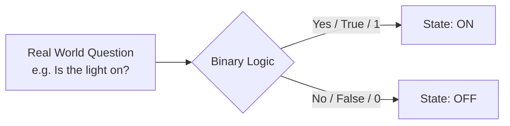
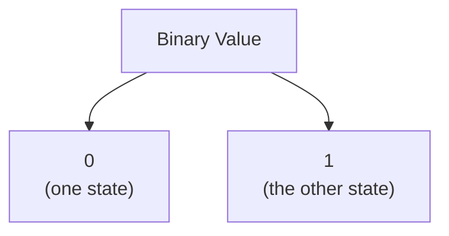
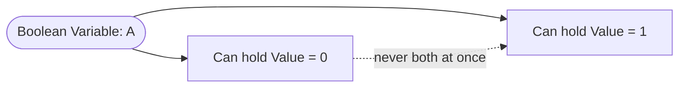
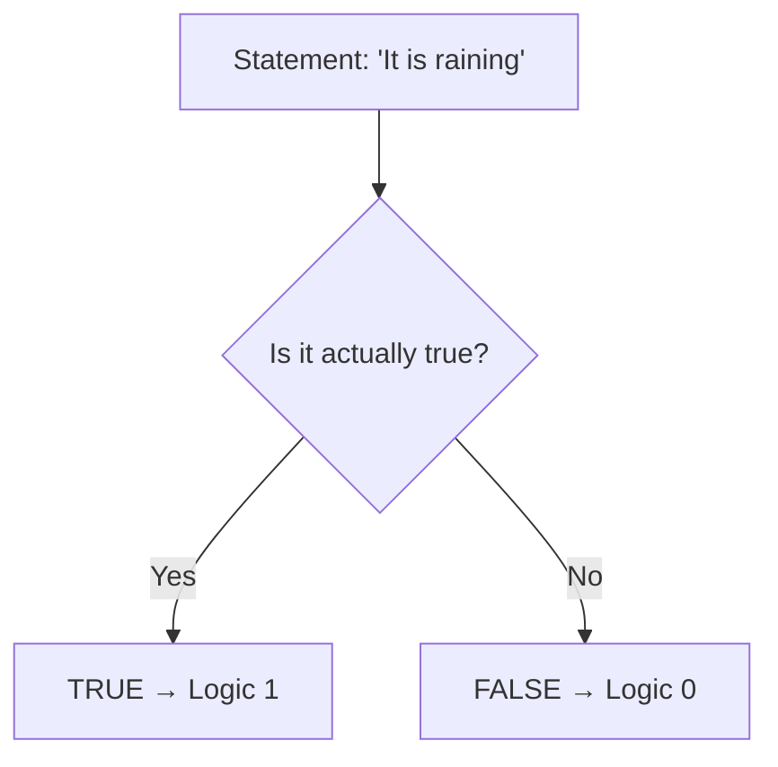
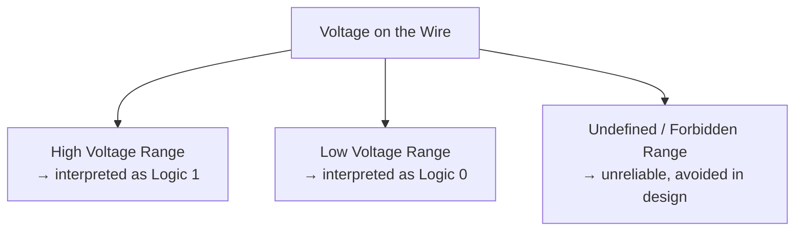
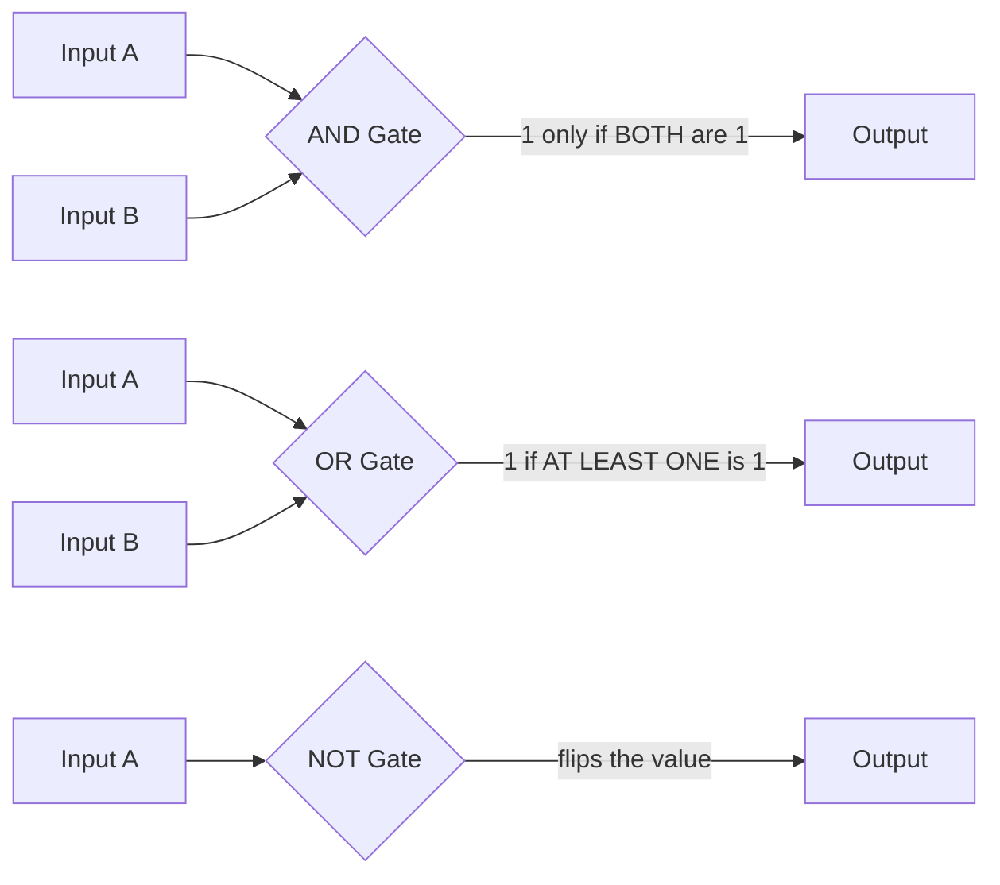
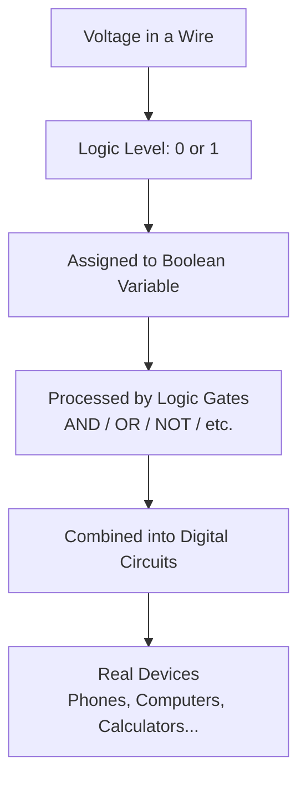
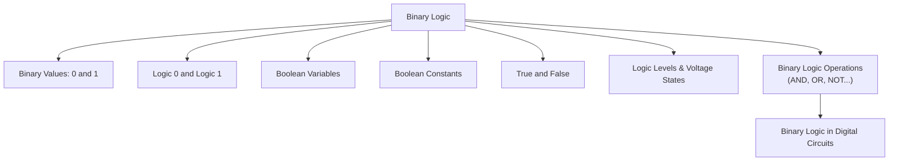

# 3.b Binary Logic

> Please give a STARRR!!! 𐔌՞ ܸ.ˬ.ܸ՞𐦯

---

## 📑 Table of Contents

- [What is Binary Logic?](#what-is-binary-logic)
- [Binary Values: 0 and 1](#binary-values-0-and-1)
- [Logic 0 and Logic 1](#logic-0-and-logic-1)
- [Boolean Variables](#boolean-variables)
- [Boolean Constants](#boolean-constants)
- [True and False in Digital Logic](#true-and-false-in-digital-logic)
- [Logic Levels and Voltage States](#logic-levels-and-voltage-states)
- [Binary Logic Operations](#binary-logic-operations)
- [Binary Logic in Digital Circuits](#binary-logic-in-digital-circuits)
- [The Big Recap Map](#the-big-recap-map)

---

## What is Binary Logic?

Okay imagine your phone could only understand two answers to every question: "yeah" or "nah." No maybes, no "kinda," no "let me check." That's basically what binary logic is — a whole system of reasoning built on **exactly two possible states**.

Everything your computer, your calculator, your smart fridge, whatever — every single one of them is having a never-ending conversation using only two words. And somehow that's enough to run Netflix, your bank account, and this very document. Wild, right?

Binary logic is the branch of logic (and by extension, digital electronics) that deals with statements and variables that can only be one of two values. It's the backbone of every digital system that exists, because at the hardware level, a transistor is either letting current through or it isn't — there's no vibe in between ⸜(｡˃ ᵕ ˂ )⸝♡



### Formal Definition
**Binary Logic** is a system of logic in which variables and functions take on only two discrete values — commonly denoted as 0 and 1 — and combinations of these values are manipulated according to a defined set of rules (Boolean algebra) to represent and process logical or arithmetic operations in digital systems.

---

## Binary Values: 0 and 1

So here's the deal — in binary logic, literally everything gets squeezed into two boxes: **0** and **1**. Not "3," not "maybe," not "it's complicated." Just two.

Think of it like a light switch you're forced to label with numbers instead of words:
- **1** = the switch is flipped one way (commonly "on")
- **0** = the switch is flipped the other way (commonly "off")

That's it. That's the whole vibe. But don't get it twisted — these aren't just numbers doing math class stuff (like in normal counting), they're **symbols representing a condition or state**. The number "1" here isn't necessarily "the quantity one" — it's a label for one of two possible states a system can be in.



### Formal Definition
A **binary value** is one of the two symbols, 0 or 1, used in a binary (base-2) numeral or logic system to represent the two possible states of a variable, bit, or signal.

---

## Logic 0 and Logic 1

Now here's where people mix things up — Logic 0 and Logic 1 aren't just "the number zero" and "the number one" doing casual math. They're **logical states**, meaning they represent a condition, not a quantity.

Depending on the context, Logic 1 and Logic 0 can mean a bunch of different things:

| Logic 1 could mean... | Logic 0 could mean... |
|---|---|
| True | False |
| On | Off |
| High | Low |
| Yes | No |
| Closed switch | Open switch |
| High voltage | Low/no voltage |

Basically Logic 1 and Logic 0 are like nicknames — the "real name" changes depending on which chapter of digital electronics you're in, but the energy (pun intended) stays the same: two opposite states, no in-betweens.

### Formal Definition
**Logic 0** and **Logic 1** refer to the two defined logic states in a binary system, representing opposite conditions (such as false/true, off/on, or low/high) that a digital signal or variable can assume.

---

## Boolean Variables

Okay so if Logic 0 and Logic 1 are the *values*, a **Boolean variable** is basically the *container* that holds one of those values. Think of it as a labeled box (let's call it `A`) that can only ever have "0" or "1" written inside it — never both at once, never something else.

So when you see something like:

```
A = 1
B = 0
```

That's just saying "hey, the variable A is currently sitting in the state 1, and B is chilling in state 0." Super simple once you strip away the intimidating math-class vibes.

Boolean variables are named after **George Boole**, the guy who basically invented the math of true/false thinking back in the 1800s — waaay before computers even existed. He was just vibing with logic and accidentally built the foundation for every computer ever made ꉂ(˵˃ ᗜ ˂˵)



### Formal Definition
A **Boolean variable** is a variable that can assume only one of two possible values, typically denoted 0 and 1 (or FALSE and TRUE), used to represent logical states within Boolean algebra and digital logic systems.

---

## Boolean Constants

Alright, quick vocab check — if a **variable** is something that *can change* (like A going from 0 to 1), a **Boolean constant** is something that's *fixed*, permanently. It doesn't change no matter what's happening around it.

So in Boolean algebra, there are literally only two constants that will ever exist:

- **0** (the constant representing False)
- **1** (the constant representing True)

That's the entire list. No 2, no 3, no secret hidden third constant. Just these two forever and always. When you write an expression like:

```
F = A + 1
```

that "1" isn't a variable that could someday become something else — it's a hardcoded, unchanging constant. Kind of like how your birthday doesn't change no matter how old you get (sorry).

### Formal Definition
A **Boolean constant** is a fixed value in Boolean algebra, limited to exactly two possible values — 0 (representing FALSE) and 1 (representing TRUE) — that does not vary during the evaluation of a logical expression.

---

## True and False in Digital Logic

Here's the thing that trips people up: **True** and **False** aren't computer-only concepts — they come straight from classical logic (like, philosophy-class logic, thousands of years old). Digital logic just borrowed them and gave them a computer science makeover.

In digital logic:
- **True** = the condition/statement holds = represented by **Logic 1**
- **False** = the condition/statement does not hold = represented by **Logic 0**

So when your code says `if (isRaining == True)`, deep under the hood, that's really just checking if a bit is sitting at value 1. No poetry, no drama — just a bit flipped one way or another.



### Formal Definition
In digital logic, **True** and **False** are the two truth values a logical statement or variable can hold, conventionally mapped to Logic 1 (True) and Logic 0 (False) respectively, forming the basis for evaluating logical expressions.

---

## Logic Levels and Voltage States

Okay THIS is where binary logic stops being abstract and gets real physical. Because at the end of the day, your computer isn't magically "thinking" in 0s and 1s — it's dealing with **actual electricity** running through **actual wires**.

A **logic level** is basically a voltage range that a circuit agrees to interpret as either a 0 or a 1. It's not usually one exact number (like "5V = 1, 0V = 0" precisely) — it's more like a *range*, because real-world electronics are messy and voltages fluctuate a little.

Typical setup (this varies by technology, e.g. TTL vs CMOS, but the general idea):

| Logic Level | Voltage Range (example) | Meaning |
|---|---|---|
| Logic 1 (HIGH) | ~2V to 5V | "On" state |
| Undefined / Forbidden zone | in between | circuit shouldn't sit here |
| Logic 0 (LOW) | ~0V to 0.8V | "Off" state |

So basically your circuit is like a strict bouncer at a club: if the voltage shows up looking like "High," it gets treated as 1. If it shows up looking "Low," it's a 0. If it shows up looking sketchy and in-between — the circuit gets confused (this is literally called the "forbidden region" lol).



### Formal Definition
**Logic levels** are the specific ranges of voltage used in digital circuits to represent the binary states Logic 0 (LOW) and Logic 1 (HIGH), with a defined threshold or forbidden region separating the two to ensure reliable signal interpretation.

---

## Binary Logic Operations

Now for the fun part — the actual "operations," aka the verbs of binary logic. These are the moves you can perform ON binary values to combine or transform them. The core three every student meets first:

- **AND** — output is 1 only if *both* inputs are 1 (basically the strictest friend group, everyone has to agree)
- **OR** — output is 1 if *at least one* input is 1 (way more chill, just needs one yes)
- **NOT** — flips the value; 1 becomes 0, 0 becomes 1 (the ultimate plot twist operator)

There are more advanced ones too (NAND, NOR, XOR, XNOR) but AND, OR, NOT are the OG trio everything else is built from.

Quick truth tables (the "cheat sheet" of what each operation outputs):

**AND**
| A | B | A AND B |
|---|---|---|
| 0 | 0 | 0 |
| 0 | 1 | 0 |
| 1 | 0 | 0 |
| 1 | 1 | 1 |

**OR**
| A | B | A OR B |
|---|---|---|
| 0 | 0 | 0 |
| 0 | 1 | 1 |
| 1 | 0 | 1 |
| 1 | 1 | 1 |

**NOT**
| A | NOT A |
|---|---|
| 0 | 1 |
| 1 | 0 |



### Formal Definition
**Binary logic operations** are mathematical operations — such as AND, OR, and NOT — defined over binary variables in Boolean algebra, which combine or transform 0s and 1s according to fixed rules to produce a determinate binary output.

---

## Binary Logic in Digital Circuits

Alright, tying it all together — everything above isn't just theory sitting in a textbook. It's the actual blueprint for how real digital circuits (the ones inside literally every electronic device you own) are built.

Here's the chain reaction:

1. Voltage levels physically represent Logic 0 / Logic 1
2. Those logic values get assigned to Boolean variables
3. Logic gates (physical implementations of AND, OR, NOT, etc.) perform binary logic operations on those variables
4. Combining tons of these gates together = a **digital circuit**
5. Combine enough digital circuits = a processor, a calculator, your phone, literally anything digital

It's honestly kind of poetic — your entire phone is just billions of tiny "yes or no" decisions happening a gazillion times per second, and somehow that adds up to memes, group chats, and this markdown file.



### Formal Definition
A **digital circuit** is an electronic circuit that operates using binary logic, processing discrete voltage levels representing Logic 0 and Logic 1 through interconnected logic gates to perform computation, storage, or control functions.

---

## The Big Recap Map

Here's the entire topic squished into one flowchart because why not, closure is nice:



that's the whole chapter, no cap. two values, infinite possibilities ₍^. .^₎⟆

---

<div align="center">
⋆˚꩜｡
</div>
<div align="center">

</div>

If you enjoyed these notes, you'll probably enjoy the rest too.

| Platform | Link |
|---|---|
| Instagram | @mehrunnisa.ai |
| SubStack | The Epoch |
| YouTube | @mehrunnisa.ai |

**Usage Terms**

These notes are free to use for personal learning, revision, and study. Please do not:
- Sell or redistribute for profit.
- Claim them as your own work.
- Modify and republish without permission.
- Use for any unethical or unauthorized purpose.

Thank you for respecting the effort behind these notes. Happy learning. ♡
</div>
