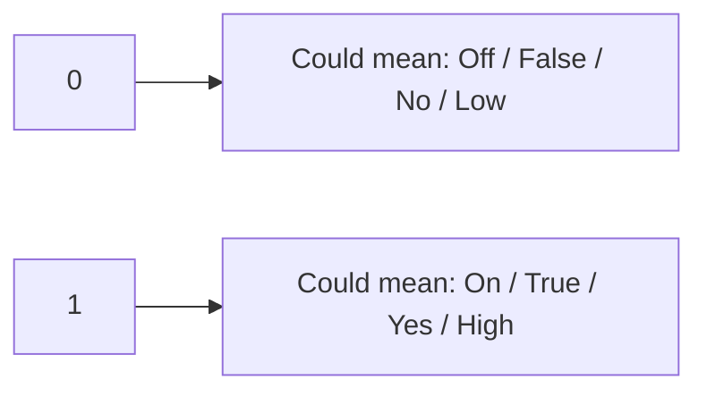
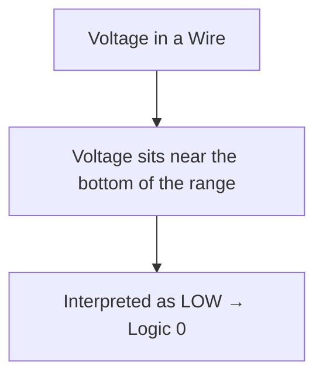
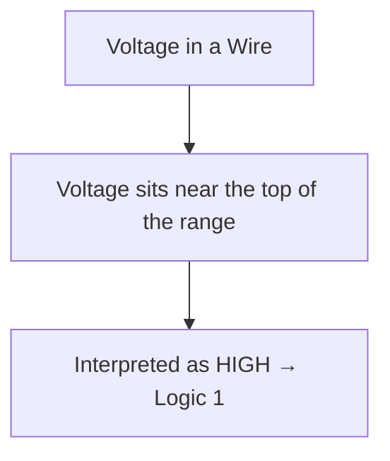
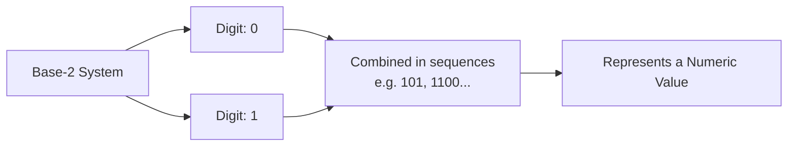
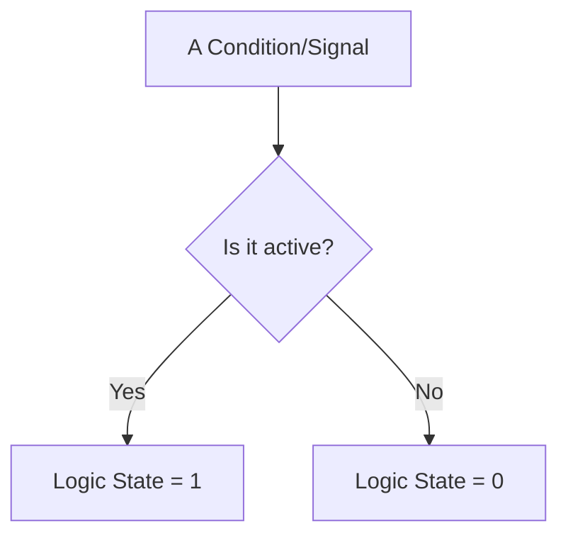
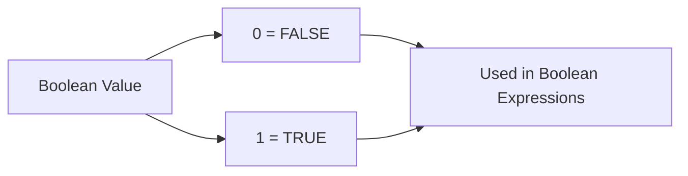
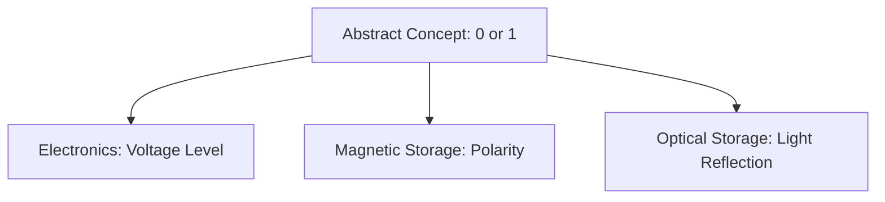
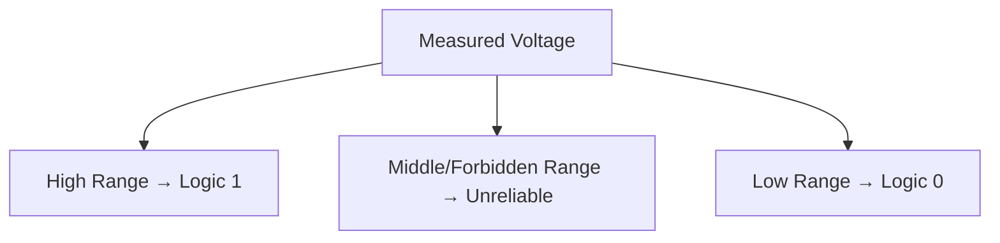
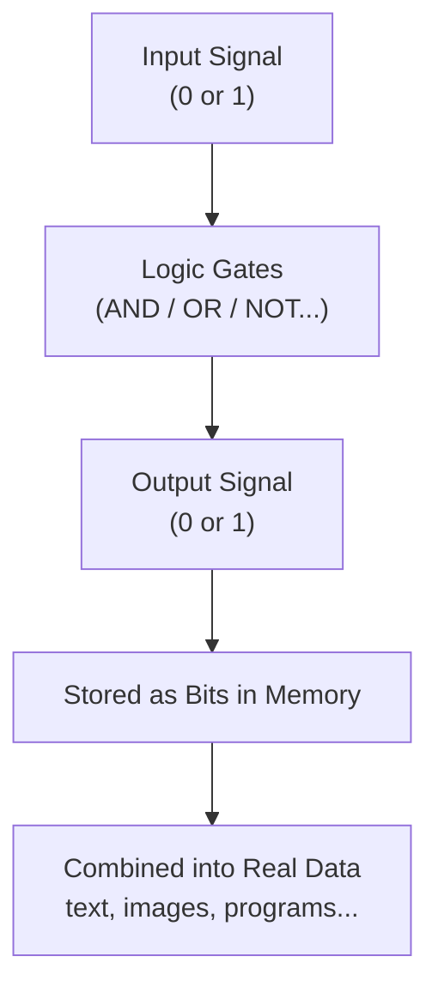
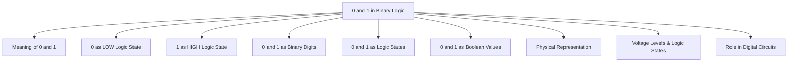

Binary Logic.

## 📑 Table of Contents

- [Meaning of 0 and 1](#meaning-of-0-and-1)
- [0 as LOW Logic State](#0-as-low-logic-state)
- [1 as HIGH Logic State](#1-as-high-logic-state)
- [0 and 1 as Binary Digits](#0-and-1-as-binary-digits)
- [0 and 1 as Logic States](#0-and-1-as-logic-states)
- [0 and 1 as Boolean Values](#0-and-1-as-boolean-values)
- [Physical Representation of 0 and 1](#physical-representation-of-0-and-1)
- [Voltage Levels and Logic States](#voltage-levels-and-logic-states)
- [Role of 0 and 1 in Digital Circuits](#role-of-0-and-1-in-digital-circuits)
- [The Big Recap Map](#the-big-recap-map)

---

## Meaning of 0 and 1

Okay so plot twist right off the bat — 0 and 1 in digital logic almost never mean "zero the number" and "one the number" the way you learned in 1st grade math. Most of the time they're just **labels for two opposite conditions**. Like, imagine calling your two best friends "Person A" and "Person B" instead of their actual names — same idea, just simplified so a machine can deal with it.

Depending on where you spot them, 0 and 1 could be standing in for:

- Off / On
- False / True
- No / Yes
- Low / High
- Open switch / Closed switch

The number itself is just the costume — what actually matters is the **state** it's representing underneath. That's the whole "meaning" behind 0 and 1: two labels, endless contexts, same core energy of "opposite conditions" ⸜(｡˃ ᵕ ˂ )⸝♡



### Formal Definition
**0** and **1** are the two symbols of the binary number system that, in digital logic, represent the two mutually exclusive states a variable or signal can take — commonly interpreted as FALSE/TRUE, OFF/ON, or LOW/HIGH depending on context.

---

## 0 as LOW Logic State

So specifically zooming into **0** now — in a LOT of digital electronics contexts, 0 gets nicknamed "LOW." Not because it's sad or lesser than 1 (0 doesn't need your pity), but because it's usually tied to a **lower voltage** in the actual physical circuit.

Think of LOW as the "resting" or "quiet" state in a lot of systems — like a phone on silent mode. It's not broken, it's not doing nothing important, it's just sitting at the bottom of the voltage range instead of the top.

Quick vibe check:
- **LOW = 0 = usually near 0V** (or close to the ground reference in the circuit)
- Often associated with: OFF, FALSE, inactive, no current flowing (in certain logic families)



### Formal Definition
The **LOW logic state (0)** refers to the binary state in a digital circuit that corresponds to a lower voltage range (typically near 0V or ground), conventionally interpreted as representing OFF, FALSE, or an inactive condition.

---

## 1 as HIGH Logic State

Now flip it — **1** gets nicknamed "HIGH," and yep, you guessed it, that's because it usually lines up with the **higher voltage** end of the range in a circuit. It's the "wide awake, fully charged, ready to go" state.

HIGH is basically the show-off of the two — it's the one associated with:
- **HIGH = 1 = usually near the supply voltage** (like 5V, 3.3V, etc, depending on the tech)
- Often associated with: ON, TRUE, active, current flowing / signal present

Fun way to remember it: HIGH voltage → HIGH energy → 1. LOW voltage → LOW energy → 0. Vibes matching numbers, easy.



### Formal Definition
The **HIGH logic state (1)** refers to the binary state in a digital circuit that corresponds to a higher voltage range (typically near the supply voltage), conventionally interpreted as representing ON, TRUE, or an active condition.

---

## 0 and 1 as Binary Digits

Zooming out a sec — outside of "logic states" territory, 0 and 1 also moonlight as **binary digits**, aka "bits" (literally short for **bi**nary digi**t**, no cap). In this role, they're not about ON/OFF vibes anymore — they're doing actual number-representing work, just in base-2 instead of the base-10 you grew up with.

Base-10 (what humans normally use) has 10 digits: 0–9.
Base-2 (binary) has only 2 digits: 0 and 1.

So instead of counting 0,1,2,3,4,5,6,7,8,9,10... binary counts like this:

| Decimal | Binary |
|---|---|
| 0 | 0 |
| 1 | 1 |
| 2 | 10 |
| 3 | 11 |
| 4 | 100 |
| 5 | 101 |

See how it "rolls over" way faster than decimal does? That's because it only has two symbols to work with before it has to add a new column. Same 0 and 1, but now they're stacking together to represent bigger numbers instead of just a single on/off state.



### Formal Definition
A **binary digit (bit)** is a single digit in the base-2 (binary) number system, which uses only the symbols 0 and 1 to represent numeric values through positional notation, analogous to how base-10 uses digits 0–9.

---

## 0 and 1 as Logic States

Coming back to the logic side of the house — when 0 and 1 are being **logic states**, they're not counting anything at all. They're purely describing a **condition**. No math, just status.

So "0 as a logic state" basically answers the question: *"is this thing active or not?"* — and the answer is either yes (1) or no (0). That's genuinely the whole job description.

This is different from "0 and 1 as binary digits" (the numbers section above) because here there's no place value, no counting, no "10 means two." It's literally just a switch that's either flipped or not.



### Formal Definition
A **logic state** is the condition represented by a binary value (0 or 1) at a given point in a digital system, indicating whether a signal, variable, or component is active/inactive, true/false, or high/low — independent of any numeric or positional meaning.

---

## 0 and 1 as Boolean Values

Okay now the Boolean algebra flavor of 0 and 1 — here they're not voltage, not digits, not even really "states" in the physical sense. They're **abstract truth values** used purely for logical reasoning and math, courtesy of George Boole (the OG logic guy we mentioned last chapter, hi again ꉂ(˵˃ ᗜ ˂˵)).

In this world:
- **0 = FALSE**
- **1 = TRUE**

And they get plugged into Boolean expressions to evaluate whether a statement holds up. Like:

```
A = 1 (TRUE)
B = 0 (FALSE)
A AND B = 0 (FALSE, because B killed the vibe)
```

This is the "math class" version of 0 and 1 — completely detached from actual circuits or voltages, existing purely in the world of logic and algebra. It's the theory that later gets *implemented* using the physical voltage stuff we cover below.



### Formal Definition
A **Boolean value** is a data type or logical value that can be exactly one of two states — 0 (FALSE) or 1 (TRUE) — used in Boolean algebra to evaluate logical expressions independent of physical implementation.

---

## Physical Representation of 0 and 1

Alright so here's the reality check: 0 and 1 are abstract concepts, but computers are physical objects made of actual materials sitting on your desk. So SOMETHING has to physically carry that 0-or-1 information. That "something" is what we call the **physical representation**.

Different technologies represent 0 and 1 in totally different physical ways:

| Technology | How "1" is represented | How "0" is represented |
|---|---|---|
| Electronic circuits | Higher voltage | Lower voltage |
| Magnetic storage (old hard drives) | One magnetic polarity | Opposite polarity |
| Optical storage (CDs/DVDs) | Presence/absence of a pit reflecting light | The opposite reflection state |
| Punch cards (ancient history lol) | Hole punched | No hole |

The actual "0" and "1" you write on paper is just a human-friendly shorthand — the real thing happening is some physical property (voltage, magnetism, light, etc.) sitting in one of two distinguishable states.



### Formal Definition
The **physical representation** of 0 and 1 refers to the actual physical property (such as voltage, magnetic polarity, or light reflectance) used by a given hardware technology to encode and distinguish the two binary states in the real world.

---

## Voltage Levels and Logic States

Zooming back into the electronics side specifically (since that's what basically all modern computing runs on) — voltage is the go-to physical property for representing 0 and 1. But here's the important nuance: it's not one exact voltage number, it's a whole **range**, because real circuits are a little messy and imprecise.

Typical (simplified, varies by logic family):

| Range | Interpreted As |
|---|---|
| High voltage range (e.g. ~2V–5V) | Logic 1 (HIGH) |
| Undefined "forbidden" middle zone | Unreliable — avoid |
| Low voltage range (e.g. ~0V–0.8V) | Logic 0 (LOW) |

That "forbidden zone" in the middle is basically the circuit's way of saying "please don't put me here, I genuinely won't know if that's a 0 or a 1 and things will get weird." Good circuit design keeps voltages solidly in the HIGH or LOW zones, never lingering awkwardly in between.



### Formal Definition
**Voltage levels** are the defined ranges of electrical potential in a digital circuit that correspond to Logic 0 (LOW) and Logic 1 (HIGH), with threshold boundaries separating valid states from an undefined or forbidden intermediate region.

---

## Role of 0 and 1 in Digital Circuits

Bringing it all home — 0 and 1 aren't just cute symbols sitting in a textbook, they're literally the **entire operating language** of digital circuits. Every single function your device performs boils down to combinations of 0s and 1s getting pushed, flipped, and combined at insane speeds.

Here's their job description in a digital circuit:

1. Represent input signals (button pressed = 1, not pressed = 0, etc.)
2. Get processed by logic gates (AND, OR, NOT, etc.)
3. Produce output signals that trigger the next part of the circuit
4. Get stored in memory as bits (literally billions of 0s and 1s sitting in your RAM/storage right now)
5. Get combined into bytes, then into actual data — text, images, this very markdown file

Basically, 0 and 1 are the alphabet, and everything digital — every app, every game, every meme — is just an insanely long sentence written using only those two letters ₍^. .^₎⟆



### Formal Definition
The **role of 0 and 1 in digital circuits** refers to their function as the fundamental units of information — representing inputs, outputs, and stored data — that are processed through logic gates to perform computation, storage, and control operations in digital systems.

---

## The Big Recap Map



two symbols, every device you own, no notes (except these notes) ⸜(｡˃ ᵕ ˂ )⸝♡

---

<div align="center">
⋆˚꩜｡
</div>
<div align="center">

</div>

If you enjoyed these notes, you'll probably enjoy the rest too.

| Platform | Link |
|---|---|
| Instagram | @mehrunnisa.ai |
| SubStack | The Epoch |
| YouTube | @mehrunnisa.ai |

**Usage Terms**

These notes are free to use for personal learning, revision, and study. Please do not:
- Sell or redistribute for profit.
- Claim them as your own work.
- Modify and republish without permission.
- Use for any unethical or unauthorized purpose.

Thank you for respecting the effort behind these notes. Happy learning. ♡
</div>
