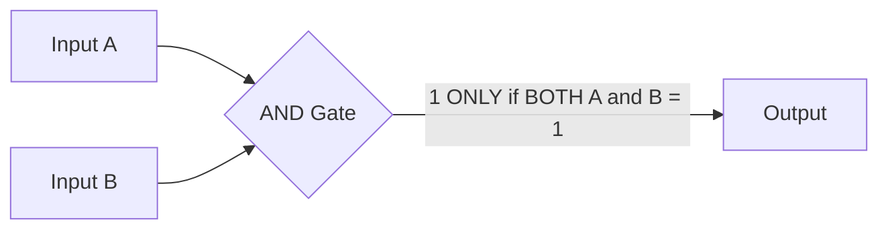
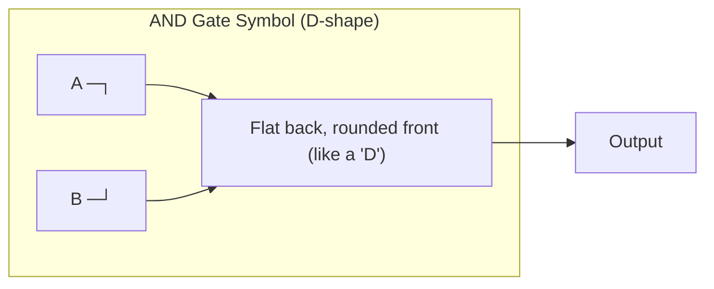
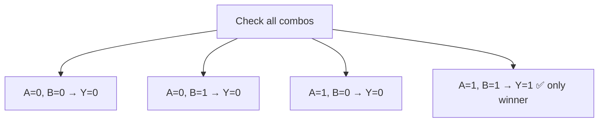
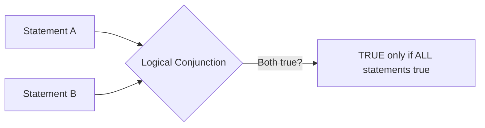
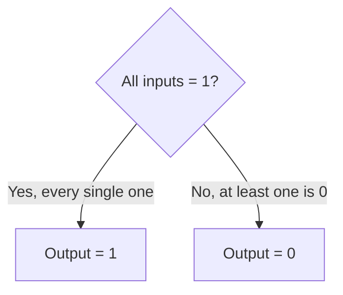
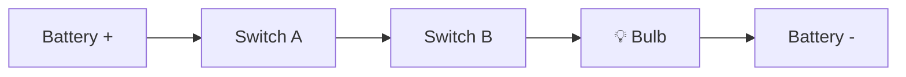
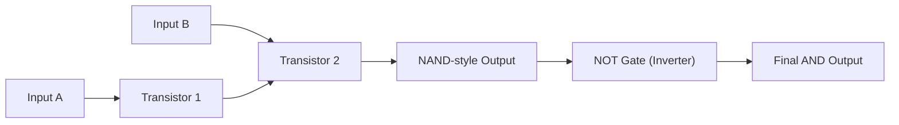
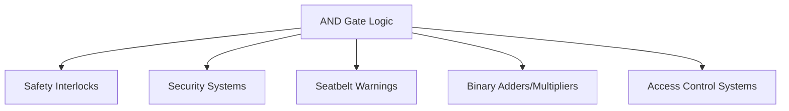
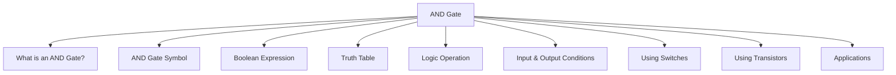

<div align="center">

# 3.4 AND Gate ⋆˚꩜｡
### *Please give a STAR!!!*

</div>

---


## 📑 Table of Contents

- [What is an AND Gate?](#what-is-an-and-gate)
- [AND Gate Symbol](#and-gate-symbol)
- [Boolean Expression](#boolean-expression)
- [Truth Table](#truth-table)
- [Logic Operation](#logic-operation)
- [Input and Output Conditions](#input-and-output-conditions)
- [AND Gate Using Switches](#and-gate-using-switches)
- [AND Gate Using Transistors](#and-gate-using-transistors)
- [Applications of AND Gate](#applications-of-and-gate)
- [The Big Recap Map](#the-big-recap-map)

---

## What is an AND Gate?

Okay so imagine you're trying to unlock your phone with both a fingerprint AND a passcode (fancy security, we love to see it). The phone only unlocks if BOTH checks pass. Miss one? Nope, staying locked. That entire vibe — "everything needs to be true for the result to be true" — is literally what an **AND gate** does, except with electricity instead of your thumb.

An AND gate is a basic building block of digital circuits (a "logic gate") that takes two or more inputs and gives out exactly ONE output. And that output is only 1 (true/high/on) if **every single input** is also 1. The second even one input slacks off and sits at 0, the whole gate says "nope" and outputs 0.

It's honestly the pickiest gate in the friend group — no partial credit, no "well most of them were 1." ALL or nothing ⸜(｡˃ ᵕ ˂ )⸝♡




### Formal Definition
An **AND gate** is a fundamental digital logic gate that performs the logical conjunction (AND) operation, producing a HIGH (1) output only when all of its inputs are HIGH (1); if any input is LOW (0), the output is LOW (0).

---

## AND Gate Symbol

Every logic gate has its own little "signature look" so engineers can spot it instantly on a circuit diagram without reading a single label. The AND gate's signature? A **D-shape** — flat on the input side, curved/rounded on the output side. Kind of looks like a capital D lying on its side, or half a stadium.

Here's the standard symbol logic (ANSI/IEEE style — the one you'll see in most textbooks):



Quick visual cheat: flat side = where inputs enter. Curved/pointed side = where the single output exits. Two (or more) lines go IN on the flat side, one line comes OUT on the rounded side.

### Formal Definition
The **AND gate symbol** is the standardized graphical representation (a flat-backed, rounded/D-shaped figure in ANSI/IEEE notation) used in circuit diagrams to denote a logic gate performing the AND operation, with multiple input lines on the flat side and a single output line on the curved side.

---

## Boolean Expression

Now let's put the AND gate into actual math-speak. In Boolean algebra, the AND operation gets written using a dot (**·**) or sometimes nothing at all (just squishing the letters together like a mini equation), and occasionally the word "AND" itself in plain writing.

The standard way to write it for two inputs A and B:

```
Y = A · B
```
or simply
```
Y = AB
```

Where **Y** is the output. If you had three inputs (A, B, C), it'd just extend naturally:

```
Y = A · B · C
```

Notice there's no "+" sign anywhere — that symbol is reserved for OR (we'll get there eventually). The dot/juxtaposition is the AND gate's signature move in algebra-land, same energy as multiplication in normal math (which honestly makes sense — multiplying by 0 anywhere kills the whole result, just like AND does with inputs).

### Formal Definition
The **Boolean expression** for an AND gate is a mathematical representation of the AND operation, written as Y = A · B (or Y = AB), where Y is the output and A, B are the input variables, indicating that Y equals logical TRUE (1) only when all input variables equal TRUE (1).

---

## Truth Table

The truth table is basically the AND gate's entire personality summed up in a tiny chart — every possible combo of inputs, and exactly what output you'd get for each. No surprises, no randomness, 100% predictable (unlike people).

For a standard 2-input AND gate:

| A | B | Y = A · B |
|---|---|---|
| 0 | 0 | 0 |
| 0 | 1 | 0 |
| 1 | 0 | 0 |
| 1 | 1 | 1 |

Notice the pattern: **only the last row gives a 1** — the one where BOTH inputs are 1. Every other combination (even if one input is 1) still results in 0. That's the "strict group project" energy we talked about earlier — one slacker (a 0) and the whole thing fails.



### Formal Definition
A **truth table** for an AND gate is a tabular listing of every possible combination of input values (0 or 1) alongside the corresponding output value, demonstrating that the output is 1 only for the single case where all inputs are 1.

---

## Logic Operation

So what's actually "happening" logically when an AND gate does its thing? It's performing what's called **logical conjunction** — a fancy term that just means "combining statements where ALL of them need to hold true simultaneously."

Think of it in plain English sentences:
- "It is raining **AND** it is cold" → only true if BOTH are actually happening right now
- "The door is locked **AND** the alarm is set" → only true if BOTH conditions are met

If even one part of the sentence is false, the entire combined statement collapses to false. That's exactly the mechanics of the AND gate — it's literally logical conjunction, wearing a circuit-shaped costume.



### Formal Definition
**Logic operation (AND)** refers to logical conjunction, a Boolean operation that combines two or more logical statements or variables such that the resulting output is TRUE if and only if every individual input is TRUE.

---

## Input and Output Conditions

Let's get super specific about the exact conditions that flip this gate one way or the other, because knowing this cold makes truth tables basically memorize themselves.

**Output = 1 (HIGH) when:**
- Every single input is 1, no exceptions, zero tolerance policy.

**Output = 0 (LOW) when:**
- At least one input is 0 — doesn't matter how many other inputs are 1, one slacker ruins it for everyone.

This scales up too — say you've got a 4-input AND gate. All 4 inputs need to be 1 for the output to be 1. Even if 3 out of 4 are 1 and just one is 0, the output still drops to 0. The gate genuinely does not care about majority vote — it's unanimous decision or bust.



### Formal Definition
**Input and output conditions** of an AND gate describe the deterministic relationship where the output equals 1 only when every input equals 1 simultaneously, and equals 0 if any one or more inputs equal 0.

---

## AND Gate Using Switches

Time to get physical (well, physical-ish). One of the easiest ways to actually SEE an AND gate in action is to build it out of simple switches in a circuit, connected in **series** (one after another, like beads on a string).

Picture this: a battery, a light bulb, and two switches (Switch A and Switch B) all connected in one single loop, one after the other.

- If Switch A is OPEN (off) **OR** Switch B is OPEN (off) → the circuit is broken somewhere along the line → **no current flows → bulb stays OFF**
- Only when Switch A is CLOSED (on) **AND** Switch B is CLOSED (on) → the entire path is complete → **current flows → bulb turns ON**

That's it — that's literally an AND gate built with hardware store parts. Two switches in series = physical AND logic.



*(Bulb only lights up when BOTH switches are closed — break the path at either switch and the light stays off.)*

### Formal Definition
An **AND gate implemented using switches** consists of two or more switches connected in series within a circuit, such that current flows to the output (e.g., a lamp) only when all switches are simultaneously closed, physically demonstrating the logical AND relationship.

---

## AND Gate Using Transistors

Okay now let's go from switches to what's actually happening inside your real devices — **transistors**, the tiny electronic switches that make modern digital logic possible (billions of them crammed onto a single chip, no big deal).

A common way to build an AND gate at the transistor level: put two transistors in **series**, similar spirit to the mechanical switches above, but happening at electronic speed with voltage instead of your hand flipping something.

The core idea:
- Each transistor acts like an electronically-controlled switch — a HIGH voltage on its input ("gate" terminal — yes, confusingly also called "gate" but a different meaning here) turns it ON (conducting), a LOW voltage turns it OFF.
- Wire two of these transistors in series so current can only reach the output when BOTH are turned ON simultaneously.
- Since transistor-only circuits often naturally produce an inverted (NAND) result first, real-world AND gates are frequently built as a **NAND gate followed by a NOT gate (inverter)** to flip the output back to proper AND behavior.



### Formal Definition
An **AND gate implemented using transistors** is a circuit built from semiconductor transistors (commonly arranged in series or as a NAND gate followed by an inverter) that electronically replicates the AND logic function, forming the basis of AND gates in modern integrated circuits.

---

## Applications of AND Gate

Cool, so where does this "strict, everyone-must-agree" gate actually get used in the real world? Basically anywhere a system needs multiple conditions satisfied before doing something important. A few real examples:

- **Safety interlocks** — machinery that only starts if the safety guard is closed AND the start button is pressed (so nobody loses a finger)
- **Security systems** — alarm only disarms if the correct code is entered AND the right key/card is used
- **Car systems** — seatbelt warning light only turns off if the seatbelt is buckled AND the ignition is on
- **Digital arithmetic circuits** — AND gates are core components in binary multipliers and adders
- **Access control** — a door might only unlock if it's an authorized ID AND within permitted hours

Basically, whenever a real-world (or digital) situation needs "multiple boxes checked before proceeding," there's a solid chance an AND gate (or the AND logic principle) is working behind the scenes.



### Formal Definition
The **applications of the AND gate** refer to its practical use in digital and electronic systems wherever an output or action must depend on the simultaneous satisfaction of multiple conditions, including safety systems, security mechanisms, and arithmetic circuits.

---

## The Big Recap Map



moral of the story: the AND gate has zero chill, all inputs must show up, or nothing happens ꉂ(˵˃ ᗜ ˂˵)

---

<div align="center">
⋆˚꩜｡
</div>
<div align="center">

</div>

If you enjoyed these notes, you'll probably enjoy the rest too.

| Platform | Link |
|---|---|
| Instagram | @mehrunnisa.ai |
| SubStack | The Epoch |
| YouTube | @mehrunnisa.ai |

**Usage Terms**

These notes are free to use for personal learning, revision, and study. Please do not:
- Sell or redistribute for profit.
- Claim them as your own work.
- Modify and republish without permission.
- Use for any unethical or unauthorized purpose.

Thank you for respecting the effort behind these notes. Happy learning. ♡
</div>
