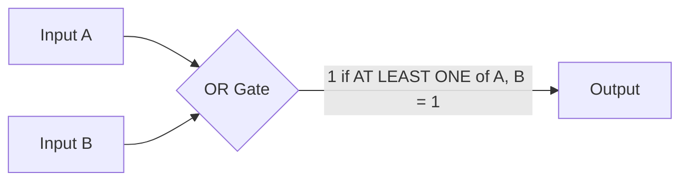
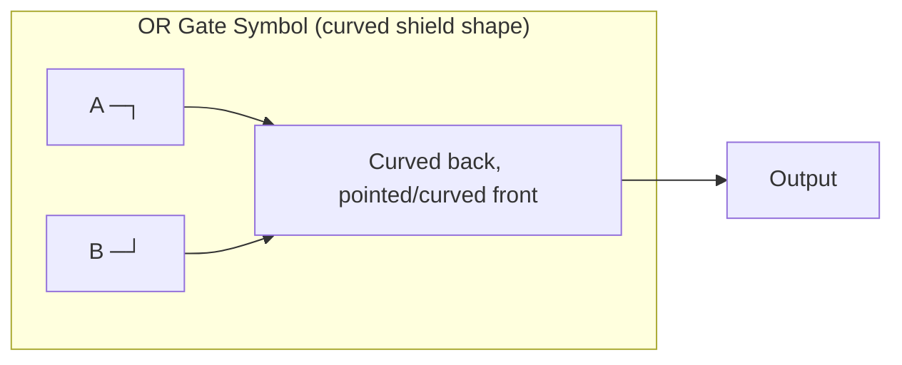
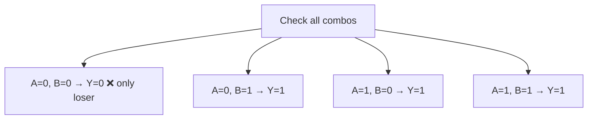
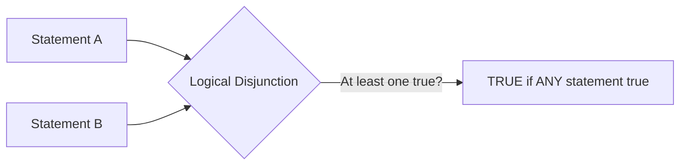
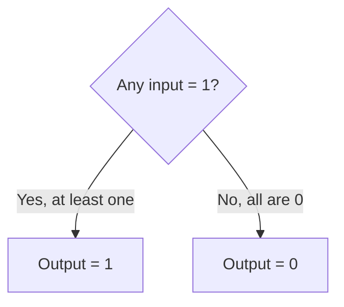
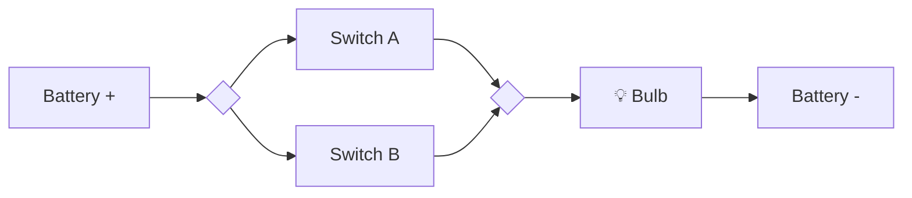
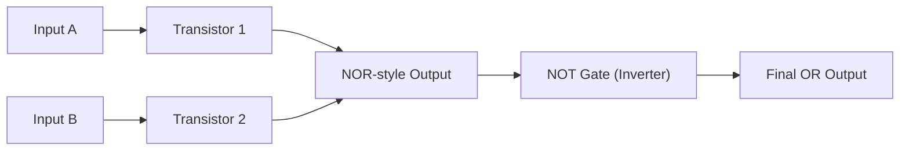
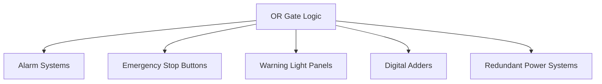
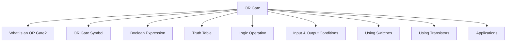

# 3.4 OR Gate — The Notes That Actually Explain Things ⋆˚꩜｡

> if the AND gate was that strict friend who needs EVERYONE to show up, the OR gate is the chill one who's just like "eh, if literally one of you shows up, we're good." let's get into it 𐔌՞ ܸ.ˬ.ܸ՞𐦯

---

## 📑 Table of Contents

- [What is an OR Gate?](#what-is-an-or-gate)
- [OR Gate Symbol](#or-gate-symbol)
- [Boolean Expression](#boolean-expression)
- [Truth Table](#truth-table)
- [Logic Operation](#logic-operation)
- [Input and Output Conditions](#input-and-output-conditions)
- [OR Gate Using Switches](#or-gate-using-switches)
- [OR Gate Using Transistors](#or-gate-using-transistors)
- [Applications of OR Gate](#applications-of-or-gate)
- [The Big Recap Map](#the-big-recap-map)

---

## What is an OR Gate?

Okay picture this — you're setting up a doorbell that should ring if someone presses the FRONT button OR the BACK button. You don't need both people mashing buttons at once, just one is enough to get the bell ringing. That's the entire personality of an **OR gate** in one sentence.

An OR gate is a basic logic gate that takes two or more inputs and gives one output, and that output is 1 (true/high/on) if **at least one** of the inputs is 1. It only outputs 0 in the one single scenario where literally ALL inputs are 0. Compare that to the AND gate's strict "everyone must agree" energy — the OR gate is out here handing out participation trophies ⸜(｡˃ ᵕ ˂ )⸝♡



### Formal Definition
An **OR gate** is a fundamental digital logic gate that performs the logical disjunction (OR) operation, producing a HIGH (1) output if one or more of its inputs are HIGH (1); the output is LOW (0) only when all inputs are LOW (0).

---

## OR Gate Symbol

Every logic gate has its signature shape, and the OR gate's look is unmistakable once you know it — it's got a **curved, shield-like or arrowhead shape**, with a pointy/curved front (where the output comes out) and a curved-in back (where the inputs enter). Basically looks like a rounded shield or a curvy triangle pointing forward.



Easy way to tell it apart from an AND gate: AND gate = flat back (straight line), OR gate = curved-in back (like it's "scooping" the inputs in). Both point forward to a single output, but that back edge is your tell every time.

### Formal Definition
The **OR gate symbol** is the standardized graphical representation (a curved, shield-shaped figure with a concave back and pointed front in ANSI/IEEE notation) used in circuit diagrams to denote a logic gate performing the OR operation.

---

## Boolean Expression

In Boolean algebra, the OR operation is written using a plus sign (**+**) — and honestly this makes intuitive sense if you think about it: with OR, having "more" inputs active kind of feels like "adding up" chances of getting a 1, unlike AND's multiplication vibe.

For two inputs A and B:

```
Y = A + B
```

Where **Y** is the output. Extend it to three inputs and it just keeps growing the same way:

```
Y = A + B + C
```

Important callout though — this "+" is NOT regular arithmetic addition (in Boolean world, 1 + 1 doesn't become 2, it stays 1, because we're in a strictly 0-or-1 universe). It's purely logical addition — meaning "if any of these is true, the whole thing is true."

### Formal Definition
The **Boolean expression** for an OR gate is a mathematical representation of the OR operation, written as Y = A + B, where Y is the output and A, B are input variables, indicating that Y equals logical TRUE (1) whenever at least one input variable equals TRUE (1).

---

## Truth Table

Let's chart out every possible input combo and see what the OR gate spits out — spoiler, it's way more "generous" than the AND gate's truth table.

For a standard 2-input OR gate:

| A | B | Y = A + B |
|---|---|---|
| 0 | 0 | 0 |
| 0 | 1 | 1 |
| 1 | 0 | 1 |
| 1 | 1 | 1 |

Notice the flip in personality here — **only the FIRST row gives a 0** (when both inputs are 0). Every other combination results in a 1, even if just ONE input is active. That's the OR gate's whole thing: minimum effort required, maximum inclusivity.



### Formal Definition
A **truth table** for an OR gate is a tabular listing of every possible combination of input values (0 or 1) alongside the corresponding output value, demonstrating that the output is 0 only for the single case where all inputs are 0, and 1 for every other combination.

---

## Logic Operation

The technical name for what an OR gate is doing is **logical disjunction** — a fancy term for combining statements where you just need AT LEAST ONE of them to be true for the whole combo to count as true.

Plain English examples:
- "I'll have coffee **OR** tea" → satisfied if you get either one (or even both, tbh)
- "The alarm rings if the window is open **OR** the door is open" → one is enough to trigger it

Unlike AND (where one false ruins everything), with OR, one true SAVES everything. It's a much more forgiving relationship between the inputs — the gate just needs a single "yes" vote to pass.



### Formal Definition
**Logic operation (OR)** refers to logical disjunction, a Boolean operation that combines two or more logical statements or variables such that the resulting output is TRUE if at least one of the individual inputs is TRUE, and FALSE only if all inputs are FALSE.

---

## Input and Output Conditions

Let's nail down exactly when this gate flips to 1 versus 0, no guessing needed.

**Output = 1 (HIGH) when:**
- At least ONE input is 1 — could be one, could be all of them, doesn't matter, one is already enough to seal the deal.

**Output = 0 (LOW) when:**
- Every single input is 0, with zero exceptions — this is literally the ONLY way to get a 0 out of this gate.

Scaling this up: say you've got a 5-input OR gate. Even if just 1 out of those 5 inputs is sitting at 1 and the rest are all 0, the output is STILL 1. The gate genuinely does not care about "majority" or "most" — a single active input is all it takes.



### Formal Definition
**Input and output conditions** of an OR gate describe the deterministic relationship where the output equals 1 if any one or more inputs equal 1, and equals 0 only when every input equals 0 simultaneously.

---

## OR Gate Using Switches

Let's build it physically. This time, instead of connecting switches in a single-file line (series, like AND), you connect them in **parallel** — side by side, offering multiple separate paths for current to travel.

Picture: a battery, a bulb, and two switches (Switch A and Switch B), but this time they're each on their OWN separate branch, both branches reconnecting before hitting the bulb.

- If Switch A is CLOSED **OR** Switch B is CLOSED (or both) → current finds a path through whichever switch is closed → **bulb turns ON**
- Only if BOTH Switch A and Switch B are OPEN at the same time → no path exists anywhere → **bulb stays OFF**

Two switches in parallel = physical OR logic. Current is lazy, it just needs ONE open road to get through.



*(Bulb lights up if EITHER switch is closed — both need to be open for the light to stay off.)*

### Formal Definition
An **OR gate implemented using switches** consists of two or more switches connected in parallel within a circuit, such that current flows to the output (e.g., a lamp) if any one switch is closed, physically demonstrating the logical OR relationship.

---

## OR Gate Using Transistors

Now let's peek under the hood at how real chips pull this off using transistors — the tiny electronic switches doing the heavy lifting inside every digital device.

The core idea for a transistor-based OR gate:
- Same principle as the switch version, but electronic: put transistors in **parallel** instead of series, so current can reach the output if EITHER transistor is switched ON (i.e., its input is HIGH).
- Like with AND gates, pure transistor logic often naturally produces an inverted result first — so real-world OR gates are frequently built as a **NOR gate followed by a NOT gate (inverter)** to flip it back into proper OR behavior.



### Formal Definition
An **OR gate implemented using transistors** is a circuit built from semiconductor transistors (commonly arranged in parallel or as a NOR gate followed by an inverter) that electronically replicates the OR logic function, forming the basis of OR gates in modern integrated circuits.

---

## Applications of OR Gate

So where does this "just need one yes vote" gate show up in the real world? Basically anywhere a system should trigger if ANY one of several conditions is met, not requiring all of them at once. Some real examples:

- **Alarm systems** — the alarm triggers if the front door sensor OR the back door sensor OR any window sensor is tripped
- **Emergency stop systems** — a machine halts if ANY one of multiple emergency stop buttons is pressed (you don't want to require pressing all of them in a panic!)
- **Multi-input control panels** — a warning light turns on if fuel is low OR oil pressure is low OR engine temp is high
- **Digital arithmetic circuits** — OR gates show up in adders and various combinational logic circuits
- **Redundant systems** — backup power kicks in if the main supply OR the secondary supply fails (whichever condition trips first)

Basically, anywhere a situation should respond to "any single trigger" instead of needing everything to align at once, there's a good chance OR gate logic is running the show.



### Formal Definition
The **applications of the OR gate** refer to its practical use in digital and electronic systems wherever an output or action must trigger upon the satisfaction of any one of multiple possible conditions, including alarm systems, safety mechanisms, and arithmetic circuits.

---

## The Big Recap Map



moral of the story: the OR gate is out here saying "just one of you needs to show up and we're vibing" ꉂ(˵˃ ᗜ ˂˵)

---

<div align="center">
⋆˚꩜｡
</div>
<div align="center">

</div>

If you enjoyed these notes, you'll probably enjoy the rest too.

| Platform | Link |
|---|---|
| Instagram | @mehrunnisa.ai |
| SubStack | The Epoch |
| YouTube | @mehrunnisa.ai |

**Usage Terms**

These notes are free to use for personal learning, revision, and study. Please do not:
- Sell or redistribute for profit.
- Claim them as your own work.
- Modify and republish without permission.
- Use for any unethical or unauthorized purpose.

Thank you for respecting the effort behind these notes. Happy learning. ♡
</div>
