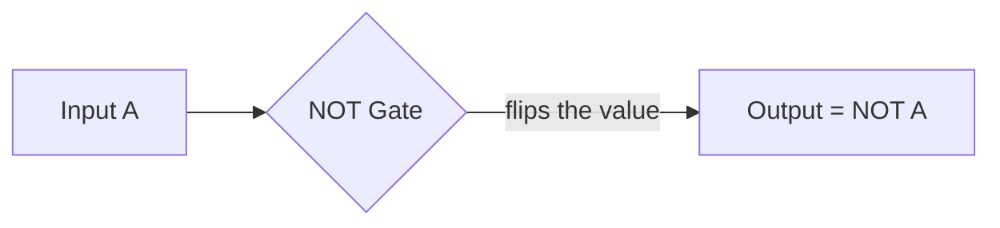
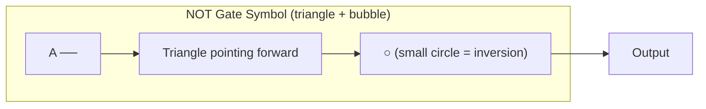
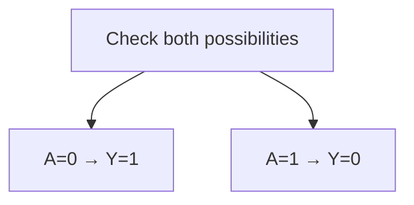
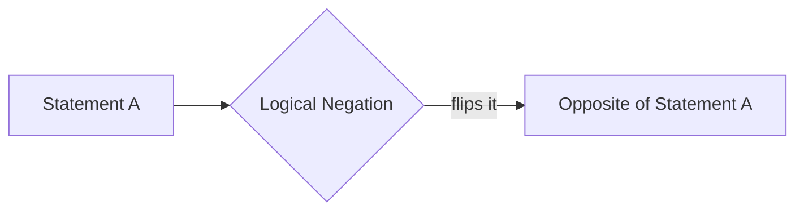
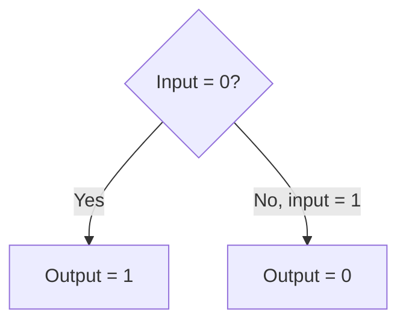
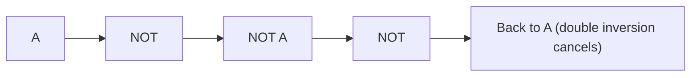
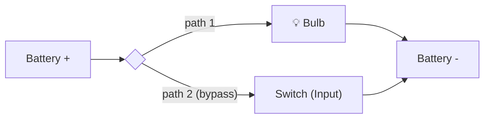
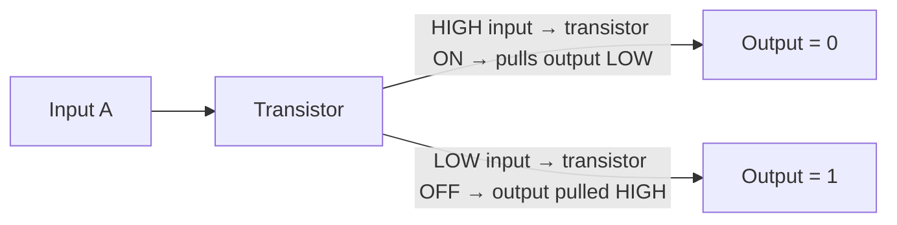
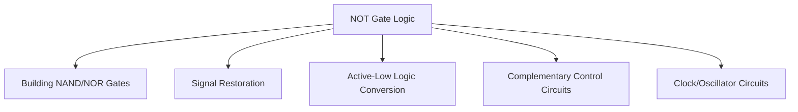
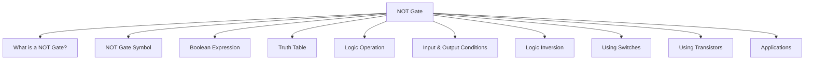

<div align="center">

# 3.6 NOT Gate⋆˚꩜｡
### *Please give a STAR!!!*

</div>

---

## 📑 Table of Contents

- [What is a NOT Gate?](#what-is-a-not-gate)
- [NOT Gate Symbol](#not-gate-symbol)
- [Boolean Expression](#boolean-expression)
- [Truth Table](#truth-table)
- [Logic Operation](#logic-operation)
- [Input and Output Conditions](#input-and-output-conditions)
- [Logic Inversion](#logic-inversion)
- [NOT Gate Using Switches](#not-gate-using-switches)
- [NOT Gate Using Transistors](#not-gate-using-transistors)
- [Applications of NOT Gate](#applications-of-not-gate)
- [The Big Recap Map](#the-big-recap-map)

---

## What is a NOT Gate?

Okay so unlike AND and OR (who both need TWO inputs minimum to have any fun), the NOT gate is a total loner — it only ever takes **ONE input**, and its entire job is to just... flip it. That's it. That's the whole personality. Give it a 1, it hands you back a 0. Give it a 0, it hands you back a 1. No negotiation, no exceptions, pure chaotic-opposite energy ⸜(｡˃ ᵕ ˂ )⸝♡

Because of this single-input, flip-the-value behavior, the NOT gate has a nickname: the **inverter**. Which, honestly, is the most accurate nickname any logic gate has ever gotten — it literally just inverts stuff.



### Formal Definition
A **NOT gate**, also known as an inverter, is a fundamental digital logic gate that accepts a single binary input and produces an output that is the logical complement (opposite) of that input — outputting 1 when the input is 0, and 0 when the input is 1.

---

## NOT Gate Symbol

The NOT gate's symbol is basically a mashup: take a **triangle** (pointing forward, like a little arrowhead), and stick a **small circle (called a "bubble")** right on its output tip. That bubble is doing a LOT of heavy lifting visually — it's the universal "this signal just got inverted" indicator across all digital logic diagrams.



Fun fact: that little inversion bubble isn't exclusive to the NOT gate — you'll see it tacked onto other gates too (like turning an AND gate into a NAND gate) precisely because it universally means "invert whatever comes out of here."


> *image from geeksforgeeks*


### Formal Definition
The **NOT gate symbol** is the standardized graphical representation — a triangle pointing toward the output with a small circle ("inversion bubble") at its tip — used in circuit diagrams to denote a logic gate that performs the NOT (inversion) operation.

---

## Boolean Expression

In Boolean algebra, the NOT operation gets written a few different ways depending on which textbook/region/professor you're dealing with, but they all mean the exact same thing. The most common notations:

```
Y = A'
```
or
```
Y = Ā   (a bar drawn over the letter)
```
or sometimes
```
Y = NOT A
```

Where **Y** is the output and **A** is the single input. That little apostrophe or the bar-on-top are both just shorthand for "give me the opposite of A." Unlike AND (dot) and OR (plus), NOT doesn't combine two variables — it just transforms the one variable it's given.

### Formal Definition
The **Boolean expression** for a NOT gate is a mathematical representation of the logical complement operation, written as Y = A' or Y = Ā, where Y is the output and A is the single input variable, indicating that Y equals the opposite logical value of A.

---

## Truth Table

The NOT gate has, hands down, the shortest truth table of any logic gate — because with only ONE input, there are only TWO possible situations to account for. No combinations, no multiple rows to memorize, just flip and done.

| A | Y = A' |
|---|---|
| 0 | 1 |
| 1 | 0 |

That's genuinely it. Input 0, get 1. Input 1, get 0. If you remember nothing else about the NOT gate, remember this two-row table — you basically already know the whole gate.



### Formal Definition
A **truth table** for a NOT gate is a tabular listing of the single input value (0 or 1) alongside its corresponding inverted output value, showing that an input of 0 produces an output of 1, and an input of 1 produces an output of 0.

---

## Logic Operation

The technical term for what a NOT gate does is **logical negation** (or logical complementation) — basically the "opposite-ify this statement" operation in classical logic, borrowed straight into digital circuits.

Plain English examples:
- "It is raining" → NOT("It is raining") = "It is NOT raining"
- "The door is locked" → NOT("The door is locked") = "The door is NOT locked" (i.e. it's unlocked)

Negation is the only one of the "big three" gate operations (AND, OR, NOT) that works on just a single statement instead of combining two. It doesn't ask "do these agree?" — it just straight up flips whatever it's handed.



### Formal Definition
**Logic operation (NOT)** refers to logical negation, a Boolean operation applied to a single input that produces an output equal to the logical complement (opposite) of that input — TRUE becomes FALSE, and FALSE becomes TRUE.

---

## Input and Output Conditions

Since there's only one input in play, the conditions here are refreshingly simple — no combos to track, just a direct flip relationship.

**Output = 1 (HIGH) when:**
- Input A = 0. That's the only scenario that gives a 1.

**Output = 0 (LOW) when:**
- Input A = 1. That's the only scenario that gives a 0.

There is no "at least one" or "all of them" logic to worry about here like with AND/OR — because there's only ever ONE input to check in the first place. The gate looks at exactly one thing and does exactly one thing back: opposite day, always.



### Formal Definition
**Input and output conditions** of a NOT gate describe the deterministic inverse relationship where the output equals 1 when the single input equals 0, and equals 0 when the single input equals 1.

---

## Logic Inversion

Let's zoom out on this concept of "inversion" itself, since it's bigger than just the NOT gate — inversion is basically a whole design pattern that shows up constantly in digital logic. Anytime you see that little bubble symbol we mentioned earlier, that's "inversion" being applied at that specific point in a circuit.

Key things to know about logic inversion:
- It can be applied to a single signal (that's exactly what a NOT gate does)
- It can be applied to the OUTPUT of another gate (e.g., AND + inversion = NAND, OR + inversion = NOR)
- Applying inversion TWICE in a row cancels itself out and returns the original value — i.e., NOT(NOT(A)) = A. Double negatives make a positive, same as in English grammar ("I don't NOT like it" = "I like it," kind of energy)

This double-inversion cancellation is actually a genuinely useful trick in circuit design — sometimes engineers pass a signal through two inverters just to "clean up" or restore a signal's timing/strength without changing its logical value.



### Formal Definition
**Logic inversion** is the process of applying the NOT (complement) operation to a binary signal, flipping its logical value; applying inversion an even number of times restores the original value, while an odd number of times yields the complement.

---

## NOT Gate Using Switches

Time to build one physically — and this one's actually pretty clever, because unlike AND/OR (series vs parallel switch arrangements), the NOT gate needs a slightly different trick: a switch connected in a way that it **breaks the path to the output when closed**, essentially rerouting current away from where you'd normally expect it.

One classic way to visualize it: imagine a switch connected in parallel with the load (like a bulb), such that:

- When the Switch is OPEN (input = 0) → current is forced to flow through the bulb → **bulb turns ON (output = 1)**
- When the Switch is CLOSED (input = 1) → current takes the "easy path" through the switch instead, bypassing the bulb entirely → **bulb turns OFF (output = 0)**

See the flip happening? Closing the switch (input goes to 1) makes the bulb turn OFF (output goes to 0) — exactly the inverse relationship a NOT gate is supposed to model.



*(Closing the switch bypasses the bulb, so bulb ON = switch OPEN, and bulb OFF = switch CLOSED — the literal opposite relationship.)*

### Formal Definition
A **NOT gate implemented using switches** consists of a switch arranged such that its closed (activated) state diverts current away from the output load, so that the output is the logical opposite of the switch's input state, physically demonstrating the logical NOT relationship.

---

## NOT Gate Using Transistors

At the transistor level, the NOT gate is actually one of the simplest and most fundamental circuits in all of digital electronics — it's often the very FIRST logic gate students build with transistors because it only needs ONE transistor to work (compare that to AND/OR which typically need at least two).

The core idea:
- A single transistor is set up so that when the input voltage is HIGH (1), the transistor turns ON and conducts, pulling the output down to LOW (0)
- When the input voltage is LOW (0), the transistor turns OFF (doesn't conduct), and the output gets pulled UP to HIGH (1) instead (usually via a resistor or a complementary transistor pulling it high)

This single-transistor inverter design is literally one of the basic building blocks (alongside its "sibling" configurations) used to construct EVERY other more complex logic gate in modern chips. Respect the little guy, it's doing a lot of unseen work.



### Formal Definition
A **NOT gate implemented using transistors** is a circuit typically built from a single transistor (or a complementary transistor pair, as in CMOS technology) that conducts or blocks current based on the input voltage, producing an output voltage that is the electrical inverse of the input, thereby performing the NOT logic function.

---

## Applications of NOT Gate

So where does this "just flip it" gate actually earn its paycheck in real systems? Turns out — basically everywhere, since inversion is such a fundamental building block. A few real examples:

- **Building other gates** — NAND = AND + NOT, NOR = OR + NOT; the NOT gate is a literal ingredient in constructing more complex gates
- **Signal cleanup/restoration** — passing a weakened signal through inverters (often in pairs) to sharpen or refresh it
- **Active-low logic systems** — many real circuits use "active-low" signals (meaning 0 = "on/active"), and NOT gates convert between active-high and active-low conventions
- **Complementary control logic** — e.g., a system where a warning light should be ON exactly when a sensor reading is LOW, requiring the sensor's signal to be inverted first
- **Clock signal generation** — inverters are core components in oscillator circuits that generate the timing "heartbeat" of digital systems

Basically, whenever a circuit needs to flip a signal's meaning, restore its strength, or serve as a building block inside a bigger gate, the humble NOT gate is quietly doing its one job extremely well.



### Formal Definition
The **applications of the NOT gate** refer to its practical use in digital and electronic systems as a fundamental building block for constructing other logic gates, converting between active-high and active-low signal conventions, restoring signal integrity, and enabling complementary control logic.

---

## The Big Recap Map



moral of the story: the NOT gate is the ultimate contrarian, one input, zero agreement, flip it and move on ₍^. .^₎⟆

---

<div align="center">
⋆˚꩜｡
</div>
<div align="center">

</div>

If you enjoyed these notes, you'll probably enjoy the rest too.

| Platform | Link |
|---|---|
| Instagram | @mehrunnisa.ai |
| SubStack | The Epoch |
| YouTube | @mehrunnisa.ai |

**Usage Terms**

These notes are free to use for personal learning, revision, and study. Please do not:
- Sell or redistribute for profit.
- Claim them as your own work.
- Modify and republish without permission.
- Use for any unethical or unauthorized purpose.

Thank you for respecting the effort behind these notes. Happy learning. ♡
</div>
