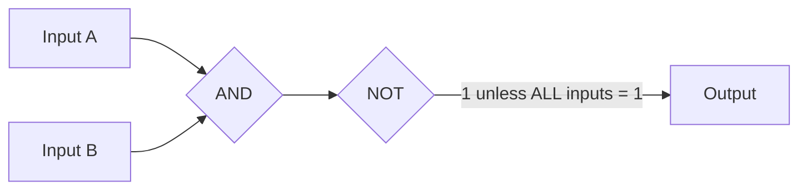
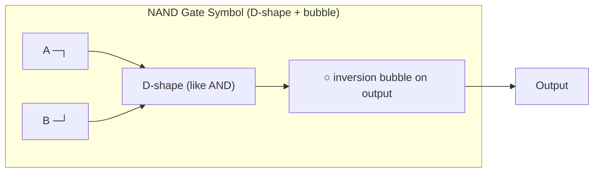
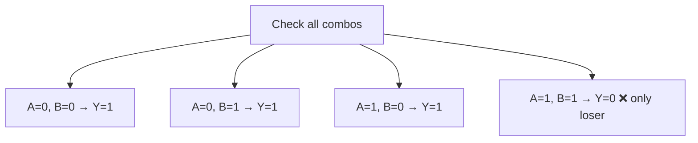
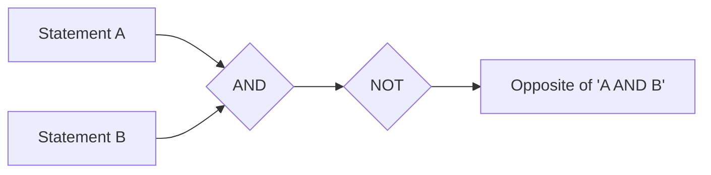
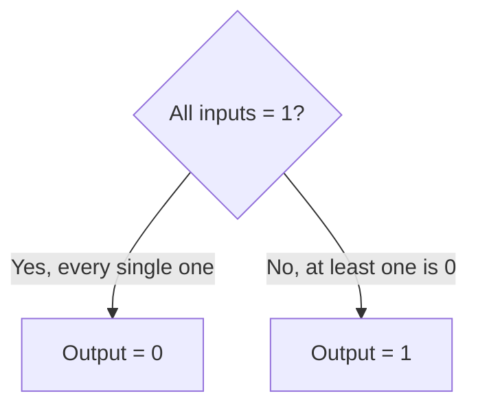
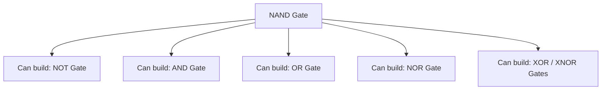
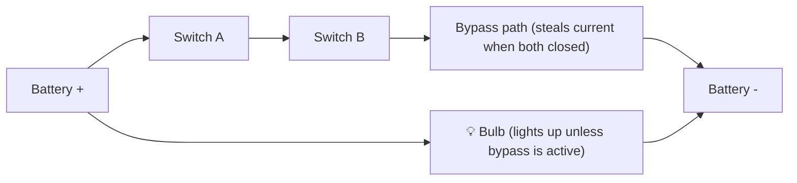
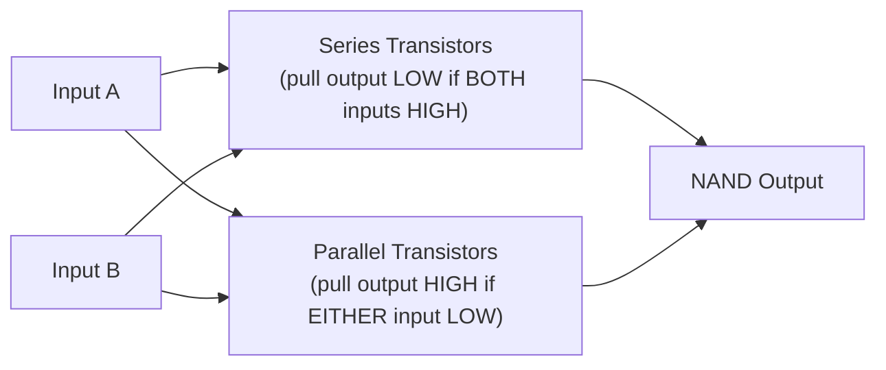
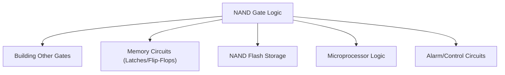
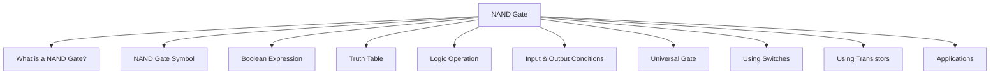

<div align="center">

# 3.6 NAND Gate ⋆˚꩜｡
### *Please give a STAR!!!*

</div>

---

## 📑 Table of Contents

- [What is a NAND Gate?](#what-is-a-nand-gate)
- [NAND Gate Symbol](#nand-gate-symbol)
- [Boolean Expression](#boolean-expression)
- [Truth Table](#truth-table)
- [Logic Operation](#logic-operation)
- [Input and Output Conditions](#input-and-output-conditions)
- [NAND Gate as a Universal Gate](#nand-gate-as-a-universal-gate)
- [NAND Gate Using Switches](#nand-gate-using-switches)
- [NAND Gate Using Transistors](#nand-gate-using-transistors)
- [Applications of NAND Gate](#applications-of-nand-gate)
- [The Big Recap Map](#the-big-recap-map)

---

## What is a NAND Gate?

Okay so the name literally spoils the whole thing — "NAND" is just "**N**OT **AND**" mashed together. You take a regular AND gate, and then you slap a NOT gate right after it. So instead of "output is 1 only if ALL inputs are 1," you get the complete opposite: "output is 1 for EVERY combination EXCEPT when all inputs are 1."

Basically, wherever AND said "yes," NAND says "no," and wherever AND said "no," NAND says "yes." It's the ultimate plot-twist gate — take the strictest gate in the chapter and then flip its entire personality ⸜(｡˃ ᵕ ˂ )⸝♡




> *image from geeksforgeeks* 


### Formal Definition
A **NAND gate** is a fundamental digital logic gate that performs the AND operation followed by logical negation (NOT), producing a LOW (0) output only when all of its inputs are HIGH (1); for every other input combination, the output is HIGH (1).

---

## NAND Gate Symbol

Since NAND is literally "AND + NOT," its symbol is exactly what you'd guess: take the AND gate's classic D-shape (flat back, rounded front) and stick that little inversion bubble right on the output tip. That's it, that's the whole visual recipe.



Super easy way to remember: any gate symbol with a bubble on the output tip = "the opposite of whatever that shape normally means." D-shape + bubble = NAND. Simple as that.

### Formal Definition
The **NAND gate symbol** is the standardized graphical representation — an AND gate's D-shaped figure with a small inversion bubble at its output tip — used in circuit diagrams to denote a logic gate performing the NAND (NOT-AND) operation.

---

## Boolean Expression

In Boolean algebra, NAND is written by taking the AND expression and drawing a bar over the WHOLE thing (not just one variable — the entire expression gets negated together).

For two inputs A and B:

```
Y = (A · B)'
```
or, using the overbar notation:
```
Y = A·B (with a bar drawn over the entire "A·B")
```

The key detail here that trips people up: the bar (or the prime symbol) covers the ENTIRE expression, not each variable separately. `(A·B)'` is NOT the same thing as `A' · B'` — that's actually a totally different gate combo (that second one would be "NOT A AND NOT B"). Keep that bar scope in mind, it matters a LOT in Boolean algebra proofs later on (De Morgan's Laws territory, if you've heard of that).

### Formal Definition
The **Boolean expression** for a NAND gate is a mathematical representation of the negated AND operation, written as Y = (A · B)', where Y is the output and A, B are input variables, indicating that Y equals FALSE (0) only when all input variables equal TRUE (1), and TRUE otherwise.

---

## Truth Table

Let's just take the AND gate's truth table and flip every single output — that's genuinely the fastest way to build a NAND truth table.

| A | B | A · B (AND) | Y = (A · B)' (NAND) |
|---|---|---|---|
| 0 | 0 | 0 | 1 |
| 0 | 1 | 0 | 1 |
| 1 | 0 | 0 | 1 |
| 1 | 1 | 1 | 0 |

See the mirror effect? Every row that was 0 in the AND column becomes 1 in the NAND column, and vice versa. **Only the last row (both inputs = 1) gives a 0** — literally the ONE combination that gives 0 in a sea of 1s, exact opposite of the AND gate's lonely single 1.



### Formal Definition
A **truth table** for a NAND gate is a tabular listing of every possible combination of input values (0 or 1) alongside the corresponding output value, demonstrating that the output is 0 only for the single case where all inputs are 1, and 1 for every other combination.

---

## Logic Operation

The logic operation happening here is literally two steps stacked together: **logical conjunction (AND), followed immediately by logical negation (NOT)**. So the gate is essentially asking "are ALL of these true?" and then flat-out lying about the answer — flipping whatever it found to the opposite.

Plain English version:
- AND asks: "Is it raining AND is it cold?"
- NAND asks the same question, gets the answer, and then says the OPPOSITE of what's actually true

It sounds petty when you phrase it that way, but this two-step "combine then invert" pattern is genuinely one of the most important operations in all of digital electronics (wait for the Universal Gate section, it gets wild).



### Formal Definition
**Logic operation (NAND)** refers to the composite Boolean operation of logical conjunction followed by negation, producing an output that is TRUE unless every input is TRUE, in which case the output is FALSE.

---

## Input and Output Conditions

Let's lock in exactly when this gate flips one way or the other.

**Output = 0 (LOW) when:**
- Every single input is 1 — this is the ONLY scenario that produces a 0.

**Output = 1 (HIGH) when:**
- At least one input is 0 — doesn't matter how many inputs, just needs one slacker sitting at 0 and the output jumps straight to 1.

This scales the same way AND does, just inverted: say you've got a 4-input NAND gate. Output is 0 ONLY if all 4 inputs are 1. If even a single one of those inputs drops to 0, the output flips all the way up to 1.



### Formal Definition
**Input and output conditions** of a NAND gate describe the deterministic relationship where the output equals 0 only when every input equals 1 simultaneously, and equals 1 if any one or more inputs equal 0.

---

## NAND Gate as a Universal Gate

Okay THIS is the part where NAND goes from "quirky opposite gate" to "secretly the MVP of the entire chapter." The NAND gate is called a **universal gate**, which means — genuinely wild fact — you can build EVERY OTHER logic gate (AND, OR, NOT, NOR, XOR, XNOR, literally all of them) using ONLY NAND gates. No other gate needed. Just NAND, wired together in clever combinations, over and over.

Quick examples of how this magic works:
- **NOT gate from NAND**: connect BOTH inputs of a NAND gate to the SAME signal → it becomes a NOT gate
- **AND gate from NAND**: take a NAND gate, then feed its output into a NOT-gate-made-from-NAND (see above) → boom, you've re-built AND
- **OR gate from NAND**: invert both inputs first (using NAND-as-NOT tricks) and THEN feed them into another NAND → gives you OR (this is basically De Morgan's Law in action)

This is a genuinely huge deal in real-world chip manufacturing — it's way cheaper and simpler to mass-produce a factory full of ONE type of gate (NAND) than to manufacture five different gate types. So a massive amount of real digital hardware is quietly built entirely out of NAND gates underneath, even though the circuit diagram might show AND/OR/NOT symbols for readability.



### Formal Definition
A **universal gate** is a logic gate from which any other logic gate (AND, OR, NOT, NOR, XOR, XNOR) can be constructed using only gates of that type; the NAND gate is one such universal gate, making it foundational to practical digital circuit design and fabrication.

---

## NAND Gate Using Switches

Building this physically: take the AND gate's series-switch setup (the one from last chapter) and then just... rewire the bulb's connection so it's lit when current is BLOCKED instead of when it flows. Or, more intuitively — build it as an AND gate, then run its output signal through a NOT-style switch inverter (the bypass trick from the NOT gate notes).

Conceptually:
- Switch A and Switch B in series (classic AND wiring)
- Both switches CLOSED (input = 1, 1) → current flows through the AND-series path → this "steals" current away from the output branch → **bulb turns OFF (output = 0)**
- Any switch OPEN (at least one input = 0) → the series path is broken → current instead flows through the alternate/output branch → **bulb turns ON (output = 1)**



*(Bulb stays ON by default — it only turns OFF when BOTH switches close and steal the current away.)*

### Formal Definition
A **NAND gate implemented using switches** consists of switches arranged in series (as in an AND configuration) combined with a bypass path, such that the output (e.g., a lamp) is illuminated by default and turns off only when all series switches are closed simultaneously, physically demonstrating the logical NAND relationship.

---

## NAND Gate Using Transistors

Here's a genuinely cool fact: the NAND gate is actually one of the SIMPLEST and most natural gates to build directly out of transistors — way more natural than a "pure" AND gate, honestly. That's part of WHY it's so widely used in real chips.

The typical setup (common in CMOS technology, which is what basically all modern chips use):
- Two transistors are placed in **series** between the output and ground (similar spirit to the AND-switches idea) — both need to be ON (both inputs HIGH) to pull the output down to LOW
- Two OTHER transistors are placed in **parallel** between the output and the power supply — if EITHER input is LOW, one of these parallel transistors turns on and pulls the output UP to HIGH

Put together, this naturally gives you: output is LOW only when both inputs are HIGH (both series transistors ON), and output is HIGH in every other case (at least one parallel transistor kicks in). That IS the NAND truth table, built straight out of transistor physics with zero extra "inverter" step tacked on — which is exactly why NAND is often the fundamental building block gate in real silicon.



### Formal Definition
A **NAND gate implemented using transistors** is a circuit (commonly built in CMOS technology using series and parallel transistor networks) that directly and naturally produces the NAND logic function at the transistor level, making it one of the most fundamental and efficient gates to fabricate in integrated circuits.

---

## Applications of NAND Gate

Given that it's a universal gate, NAND shows up basically EVERYWHERE in digital electronics — but here are some standout real-world applications specifically:

- **Building all other logic gates** — as covered above, entire circuits can be constructed from NAND gates alone
- **Memory circuits (SRAM, flip-flops, latches)** — NAND gates are core components in building basic memory storage elements
- **Flash memory** — "NAND flash" (yes, the actual name of the memory type in your SSD/USB drive!) is literally named after this gate and uses NAND-gate-style structures for dense data storage
- **Microprocessors** — huge chunks of a CPU's internal logic are constructed from networks of NAND gates due to their efficiency and simplicity in fabrication
- **Alarm and control circuits** — used to build conditional trigger logic where "not all conditions being met" should cause an action

Fun fact to flex at parties (digital-logic parties, specifically): the "NAND flash" storage in your phone and USB drives is literally named after this exact gate, because of how the memory cells are structured internally.



### Formal Definition
The **applications of the NAND gate** refer to its practical use in digital and electronic systems, including its role as a universal building block for other logic gates, its use in memory technologies such as NAND flash storage, and its widespread implementation in microprocessor and control circuit design.

---

## The Big Recap Map



moral of the story: NAND flips AND's whole personality AND secretly builds the entire rest of the chapter out of itself. iconic behavior ꉂ(˵˃ ᗜ ˂˵)

---

<div align="center">
⋆˚꩜｡
</div>
<div align="center">

</div>

If you enjoyed these notes, you'll probably enjoy the rest too.

| Platform | Link |
|---|---|
| Instagram | @mehrunnisa.ai |
| SubStack | The Epoch |
| YouTube | @mehrunnisa.ai |

**Usage Terms**

These notes are free to use for personal learning, revision, and study. Please do not:
- Sell or redistribute for profit.
- Claim them as your own work.
- Modify and republish without permission.
- Use for any unethical or unauthorized purpose.

Thank you for respecting the effort behind these notes. Happy learning. ♡
</div>
