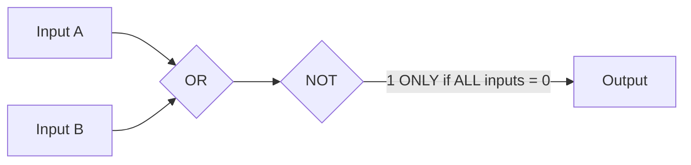
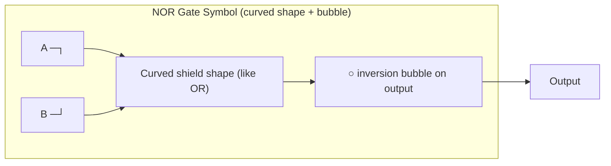
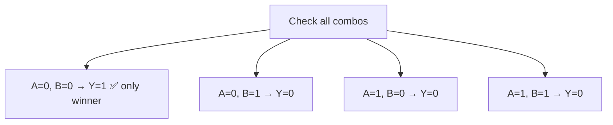
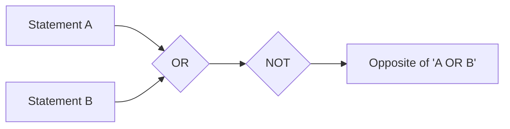
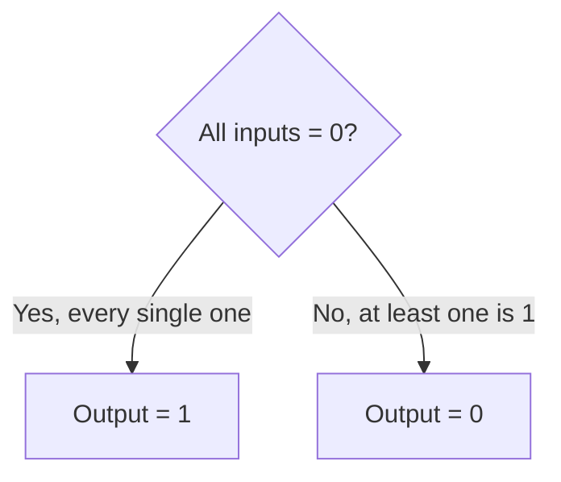
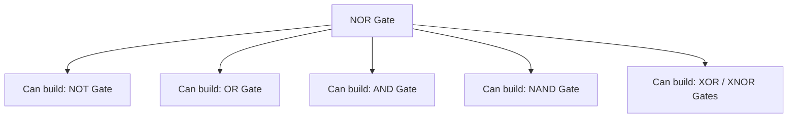
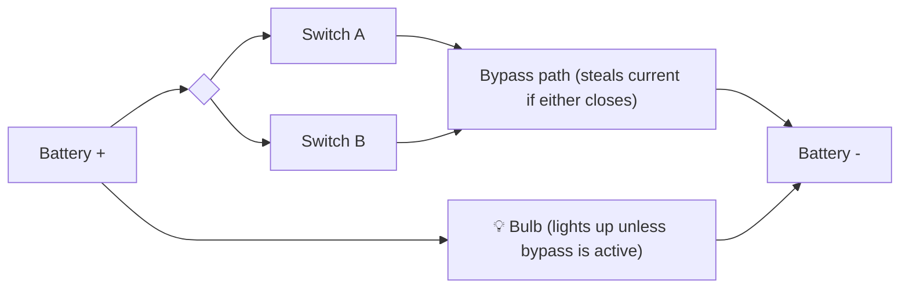
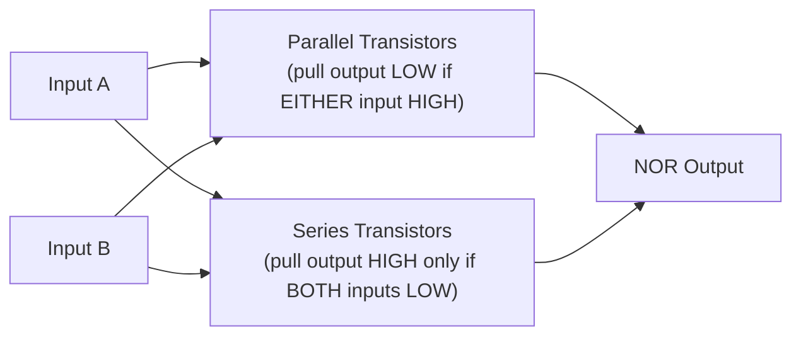
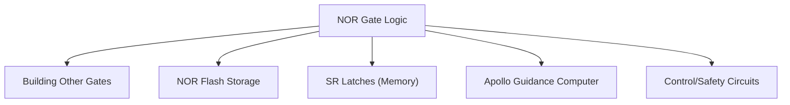
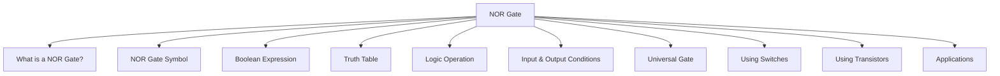

<div align="center">

# 3.7 NOR Gate ⋆˚꩜｡
### *Please give a STAR!!!*

</div>

---


## 📑 Table of Contents

- [What is a NOR Gate?](#what-is-a-nor-gate)
- [NOR Gate Symbol](#nor-gate-symbol)
- [Boolean Expression](#boolean-expression)
- [Truth Table](#truth-table)
- [Logic Operation](#logic-operation)
- [Input and Output Conditions](#input-and-output-conditions)
- [NOR Gate as a Universal Gate](#nor-gate-as-a-universal-gate)
- [NOR Gate Using Switches](#nor-gate-using-switches)
- [NOR Gate Using Transistors](#nor-gate-using-transistors)
- [Applications of NOR Gate](#applications-of-nor-gate)
- [The Big Recap Map](#the-big-recap-map)

---

## What is a NOR Gate?

Okay same trick as last chapter — "NOR" is just "**N**OT **OR**" squished together. Take a regular OR gate (the chill, "one yes is enough" gate) and slap a NOT gate right after it. So instead of "output is 1 if ANY input is 1," you flip it completely to: "output is 1 ONLY if EVERY input is 0."

This makes NOR basically the pickiest, most demanding gate we've met so far — while OR just needed one person to show up, NOR needs literally EVERYONE to be absent to give you a 1. One single active input and the whole thing shuts down to 0 ⸜(｡˃ ᵕ ˂ )⸝♡



### Formal Definition
A **NOR gate** is a fundamental digital logic gate that performs the OR operation followed by logical negation (NOT), producing a HIGH (1) output only when all of its inputs are LOW (0); if any input is HIGH (1), the output is LOW (0).

---

## NOR Gate Symbol

Following the same "AND + NOT" pattern from NAND, the NOR gate's symbol takes the OR gate's curvy shield shape and tacks on that little inversion bubble right at the output tip. Curved back (like OR), pointed front, and now a bubble sitting right on that point.



Same rule as always applies: bubble on the output = "opposite of the base shape's meaning." Curved OR-shape + bubble = NOR. Once you know this pattern, you can basically identify any gate symbol on sight.


> *image from geeksforgeeks*


### Formal Definition
The **NOR gate symbol** is the standardized graphical representation — an OR gate's curved, shield-shaped figure with a small inversion bubble at its output tip — used in circuit diagrams to denote a logic gate performing the NOR (NOT-OR) operation.

---

## Boolean Expression

In Boolean algebra, NOR takes the OR expression and draws a bar over the ENTIRE thing — same rule as NAND, the negation covers the whole expression, not each variable individually.

For two inputs A and B:

```
Y = (A + B)'
```
or with the overbar notation:
```
Y = A+B (with a bar drawn over the entire "A+B")
```

Same important callout as before: `(A + B)'` is very much NOT the same thing as `A' + B'` (that combo would actually represent something else entirely, related to NAND via De Morgan's Laws — the two families of gates are mathematically tangled together in a genuinely elegant way, but that's a rabbit hole for another day).

### Formal Definition
The **Boolean expression** for a NOR gate is a mathematical representation of the negated OR operation, written as Y = (A + B)', where Y is the output and A, B are input variables, indicating that Y equals TRUE (1) only when all input variables equal FALSE (0), and FALSE otherwise.

---

## Truth Table

Fastest way to build this: take the OR gate's truth table and flip every output value — mirror image, same as we did for NAND vs AND.

| A | B | A + B (OR) | Y = (A + B)' (NOR) |
|---|---|---|---|
| 0 | 0 | 0 | 1 |
| 0 | 1 | 1 | 0 |
| 1 | 0 | 1 | 0 |
| 1 | 1 | 1 | 0 |

See the pattern? **Only the FIRST row (both inputs = 0) gives a 1.** Every other combination — even just one active input — drops the output to 0. NOR is basically the "everyone needs to be completely silent" gate; the moment even one input speaks up, the output shuts right down.



### Formal Definition
A **truth table** for a NOR gate is a tabular listing of every possible combination of input values (0 or 1) alongside the corresponding output value, demonstrating that the output is 1 only for the single case where all inputs are 0, and 0 for every other combination.

---

## Logic Operation

The logic operation here is **logical disjunction (OR), followed immediately by logical negation (NOT)**. So the gate asks "is at least one of these true?" and then, just like NAND, flat-out flips whatever answer it gets.

Plain English version:
- OR asks: "Is the coffee ready OR is the tea ready?"
- NOR asks the same question, but reports the exact OPPOSITE of the real answer — it's only satisfied ("true") when NEITHER is ready

This "combine, then invert" pattern is the twin sibling of what NAND does, just built from OR's DNA instead of AND's. And just like its sibling gate, this seemingly petty behavior turns out to be genuinely powerful (universal gate arc incoming, again).



### Formal Definition
**Logic operation (NOR)** refers to the composite Boolean operation of logical disjunction followed by negation, producing an output that is TRUE only when all inputs are FALSE, and FALSE if any input is TRUE.

---

## Input and Output Conditions

Locking in exactly when this gate flips.

**Output = 1 (HIGH) when:**
- Every single input is 0 — this is the ONLY scenario that produces a 1. Total silence required.

**Output = 0 (LOW) when:**
- At least one input is 1 — just a single active input anywhere is enough to drop the output straight down to 0.

Scaling this up: with a 5-input NOR gate, output is 1 ONLY if all 5 inputs sit at 0 simultaneously. The instant even ONE of those inputs flips to 1, the entire output collapses to 0 — no partial credit, no "well most of them were quiet."



### Formal Definition
**Input and output conditions** of a NOR gate describe the deterministic relationship where the output equals 1 only when every input equals 0 simultaneously, and equals 0 if any one or more inputs equal 1.

---

## NOR Gate as a Universal Gate

Just like its sibling NAND, the NOR gate is ALSO a **universal gate** — meaning you can build every single other logic gate (AND, OR, NOT, NAND, XOR, XNOR) using nothing but NOR gates wired together. Genuinely one of the coolest facts in this whole unit: two completely different-looking gates (NAND and NOR) BOTH independently have this "build everything from just me" superpower.

Quick examples of how it works:
- **NOT gate from NOR**: connect BOTH inputs of a NOR gate to the SAME signal → instantly becomes a NOT gate
- **OR gate from NOR**: take a NOR gate, then run its output through a NOT-gate-made-from-NOR → gives you back OR
- **AND gate from NOR**: invert both inputs first (NOR-as-NOT trick) and THEN feed them into another NOR → gives you AND (De Morgan's Law flexing again)

Real-world relevance: certain chip manufacturing processes actually favor NOR-based logic over NAND for specific applications (fun fact — "NOR flash" memory, the OTHER major type of flash storage besides NAND flash, is literally named after this gate too, used in situations needing faster random access, like storing a device's boot firmware).



### Formal Definition
A **universal gate** is a logic gate from which any other logic gate (AND, OR, NOT, NAND, XOR, XNOR) can be constructed using only gates of that type; the NOR gate is one such universal gate, alongside NAND, making both foundational to practical digital circuit design and fabrication.

---

## NOR Gate Using Switches

Building this physically: take the OR gate's parallel-switch setup and rewire it so the bulb lights up when current is BLOCKED rather than when it flows — same "flip the outcome" trick we used for NAND, just built on OR's parallel foundation instead of AND's series one.

Conceptually:
- Switch A and Switch B in parallel (classic OR wiring)
- EITHER switch CLOSED (at least one input = 1) → current finds a path through the parallel branch → this "steals" current away from the output branch → **bulb turns OFF (output = 0)**
- BOTH switches OPEN (all inputs = 0) → no path exists through the parallel branch → current instead flows through the output branch → **bulb turns ON (output = 1)**



*(Bulb stays ON by default — it only turns OFF the moment EITHER parallel switch closes and steals the current away.)*

### Formal Definition
A **NOR gate implemented using switches** consists of switches arranged in parallel (as in an OR configuration) combined with a bypass path, such that the output (e.g., a lamp) is illuminated by default and turns off when any parallel switch is closed, physically demonstrating the logical NOR relationship.

---

## NOR Gate Using Transistors

Just like NAND, the NOR gate is naturally efficient to build straight out of transistors — it just swaps which arrangement goes where compared to NAND's setup.

The typical CMOS-style configuration:
- Two transistors are placed in **parallel** between the output and ground — if EITHER input is HIGH, one of these turns on and pulls the output DOWN to LOW
- Two OTHER transistors are placed in **series** between the output and the power supply — BOTH need to be OFF (meaning both inputs need to be LOW) for this path to successfully pull the output UP to HIGH

Notice this is basically the exact mirror image of the NAND transistor arrangement (series ↔ parallel swapped). Put together, this naturally gives: output is HIGH only when both inputs are LOW (both series-to-power transistors ON), and output is LOW the moment any input goes HIGH (a parallel-to-ground transistor kicks in). That's the NOR truth table, straight from transistor physics, no extra inverter step needed.



### Formal Definition
A **NOR gate implemented using transistors** is a circuit (commonly built in CMOS technology using parallel and series transistor networks, essentially the mirror configuration of a NAND gate) that directly and naturally produces the NOR logic function at the transistor level.

---

## Applications of NOR Gate

Being a universal gate, NOR shows up all over digital electronics — here are some standout real-world applications:

- **Building all other logic gates** — same universal-gate flex as NAND, entire circuits can be built from NOR alone
- **NOR flash memory** — used in devices needing fast random-access reads, commonly found in firmware/BIOS storage where reliability and quick boot-up matter
- **SR latches (Set-Reset latches)** — one of the most classic basic memory elements in digital electronics is built directly from a pair of cross-connected NOR gates
- **Rocket and spacecraft guidance systems** — historically, NOR gates were famously used as basically the ONLY logic gate in the Apollo Guidance Computer (yes, the actual computer that helped land astronauts on the Moon) because of how reliably and simply they could be manufactured
- **Control and safety circuits** — used to build "trigger only if absolutely nothing is active" style conditions

That Apollo fact is genuinely one of the wildest pieces of computing history — an entire spacecraft's guidance computer, running almost entirely on this one type of gate.



### Formal Definition
The **applications of the NOR gate** refer to its practical use in digital and electronic systems, including its role as a universal building block for other logic gates, its use in NOR flash memory and SR latch memory elements, and its historical and ongoing significance in reliable digital circuit design.

---

## The Big Recap Map



moral of the story: NOR only shows up to the party if literally NOBODY else did — but somehow still ends up helping land people on the Moon ₍^. .^₎⟆

---

<div align="center">
⋆˚꩜｡
</div>
<div align="center">

</div>

If you enjoyed these notes, you'll probably enjoy the rest too.

| Platform | Link |
|---|---|
| Instagram | @mehrunnisa.ai |
| SubStack | The Epoch |
| YouTube | @mehrunnisa.ai |

**Usage Terms**

These notes are free to use for personal learning, revision, and study. Please do not:
- Sell or redistribute for profit.
- Claim them as your own work.
- Modify and republish without permission.
- Use for any unethical or unauthorized purpose.

Thank you for respecting the effort behind these notes. Happy learning. ♡
</div>
