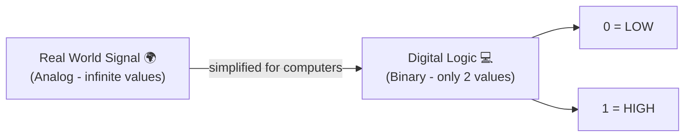
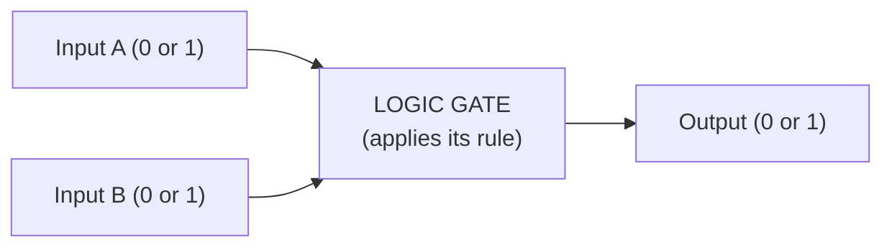
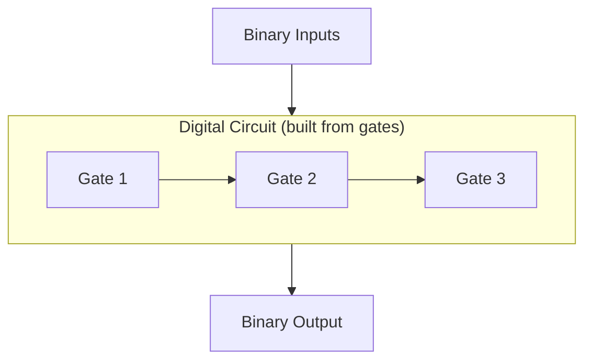
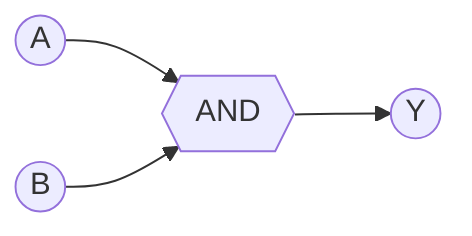
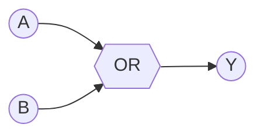
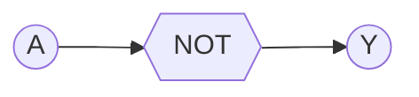
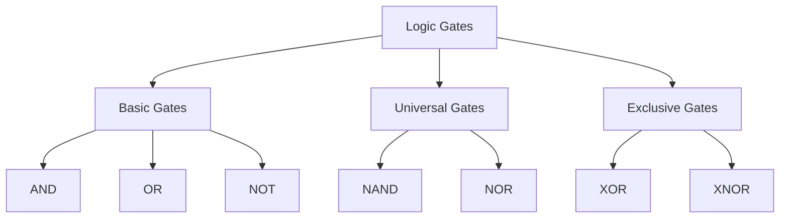

# 3.1 What is a Logic Gate? ⋆˚꩜｡
### *Please give a STAR*

---

## 📋 Table of Contents

- [1. Definition of a Logic Gate](#1-definition-of-a-logic-gate)
- [2. Digital Logic and Binary Values](#2-digital-logic-and-binary-values)
- [3. Logic 0 and Logic 1](#3-logic-0-and-logic-1)
- [4. Inputs and Outputs](#4-inputs-and-outputs)
- [5. Boolean Logic](#5-boolean-logic)
- [6. Logic Gate as a Digital Circuit](#6-logic-gate-as-a-digital-circuit)
- [7. Truth Table](#7-truth-table)
- [8. Logic Expression](#8-logic-expression)
- [9. Logic Gate Symbols](#9-logic-gate-symbols)
- [10. Basic Types of Logic Gates](#10-basic-types-of-logic-gates)
- [11. Applications of Logic Gates](#11-applications-of-logic-gates)

---

## 1. Definition of a Logic Gate

Okay so imagine a tiny bouncer at a club. The bouncer looks at who's trying to come in (that's your **input**), applies ONE simple rule (that's the **logic**), and then decides whether to let anyone through (that's your **output**). That bouncer? Basically a logic gate.

> **Formal definition:** A logic gate is a basic building block of digital electronics that performs a specific logical operation on one or more binary inputs to produce a single binary output.

That's it. That's the whole plot. Everything your phone, laptop, calculator, and literally every digital device does is just millions of these tiny bouncers stacked together making yes/no decisions at lightning speed. ⋆˚꩜｡

Logic gates are physically built using **transistors** (usually), but for this chapter we don't care about the hardware guts — we care about the *logic*, i.e. the decision-making rule.

---

## 2. Digital Logic and Binary Values

Here's the tea: computers don't understand "yes," "maybe," "kinda," or your indecisiveness. They understand exactly TWO states. That's it. No in-between, no vibes, no gray area.

This is called **digital logic** — a system where every signal is one of exactly two discrete values, as opposed to **analog** signals which can be literally anything in a range (like volume on an old-school dial).

Digital logic uses **binary** (base-2) numbers, meaning only two digits exist:
- `0`
- `1`

Why only two? Because electronic circuits are really good at reliably telling the difference between "voltage present" and "voltage absent" — way more reliable than trying to detect 10 different voltage levels. Two states = way less room for error = the entire reason computers are trustworthy little machines.

---

## 3. Logic 0 and Logic 1

These two values have a bunch of nicknames depending on context, but they always mean the same vibe:

| Logic 0 | Logic 1 |
|---|---|
| LOW | HIGH |
| FALSE | TRUE |
| OFF | ON |
| No voltage (roughly 0V) | Voltage present (e.g. +5V) |
| "nah" | "yeah" |

So when a wire in a circuit is at **Logic 1**, it basically means "current is flowing, this is active, this is true." When it's at **Logic 0**, it means "nothing's happening here, this is inactive, this is false."

Everything a logic gate does is just deciding: based on the 0s and 1s coming IN, what 0 or 1 should go OUT.

---

## 4. Inputs and Outputs

Every logic gate has:

- **Inputs** – the signals going INTO the gate (can be 1, 2, or more depending on the gate)
- **Output** – the single signal coming OUT of the gate (logic gates always give exactly ONE output, no matter how many inputs they took)

Think of it like a group project (ugh, we know). Multiple people (inputs) contribute their part, but at the end only ONE final submission (output) gets turned in, based on a specific rule of how everyone's work gets combined.

---

## 5. Boolean Logic

Boolean logic is basically the *math syllabus* that logic gates follow. It was invented by a guy named **George Boole** (that's where the name comes from) and it's a whole branch of algebra where variables only ever hold two values: TRUE (1) or FALSE (0).

Instead of `+`, `-`, `×`, `÷` like regular algebra, Boolean algebra has its own operators:

| Boolean Operator | Meaning | Everyday translation |
|---|---|---|
| AND (`·` or `∧`) | both conditions true | "I'll go out only if it's sunny AND I have money" |
| OR (`+` or `∨`) | at least one condition true | "I'll eat if there's pizza OR biryani" |
| NOT (`¬` or `'`) | flips the value | "I will NOT skip class" (flips skip → attend) |

Logic gates are literally the physical/electronic version of these Boolean operations. Boolean algebra = the theory, logic gates = the hardware doing the theory in real life. ✦ ݁˖

---

## 6. Logic Gate as a Digital Circuit

A logic gate isn't just a concept floating in the void — it's an actual **physical electronic circuit**, usually built from transistors, that's designed to behave exactly according to a Boolean rule.

So when we draw a logic gate symbol on paper, we're representing a real circuit that:
1. Takes in electrical signals (voltages) as inputs
2. Processes them through transistor arrangements
3. Spits out one electrical signal as output

Multiple gates get combined together to build bigger digital circuits — this is literally how a processor (CPU) is built. Billions of tiny logic gates, combined in insanely clever ways, doing math, running your apps, rendering this very markdown file. Wild, right?

---

## 7. Truth Table

A **truth table** is basically the gate's entire personality summarized in a chart. It lists EVERY possible combination of inputs, and tells you exactly what output the gate gives for each one. No surprises, no mood swings — gates are 100% predictable, unlike people.

For a gate with 2 inputs, there are always **4 possible combinations** (because 2² = 4):

| A | B |
|---|---|
| 0 | 0 |
| 0 | 1 |
| 1 | 0 |
| 1 | 1 |

Then you add an "Output" column showing what that specific gate does with each combo. We'll build the actual truth tables for each gate type down in [Section 10](#10-basic-types-of-logic-gates).

Pro tip for exams: if a gate has **n inputs**, it'll have **2ⁿ rows** in its truth table. 3 inputs = 8 rows. Don't get caught off guard. ⸜(｡˃ ᵕ ˂ )⸝♡

---

## 8. Logic Expression

A **logic expression** (a.k.a. Boolean expression) is the mathematical/symbolic way of writing what a gate does, instead of drawing the whole truth table every time.

Examples:
- AND gate → `Y = A · B` (or just `Y = AB`)
- OR gate → `Y = A + B`
- NOT gate → `Y = A'` (or `Y = Ā`)

Here `Y` is the output, and `A`, `B` are inputs. These expressions let engineers write out huge, complicated circuits as compact one-liners instead of massive diagrams — basically the flex version of describing a circuit.

---

## 9. Logic Gate Symbols

Every gate has its own unique shape so engineers can recognize it instantly on a circuit diagram, kind of like how you can recognize your bestie's texting style without seeing their name. Here's a quick visual cheat sheet using shapes (properly drawn versions are in Section 10):

- **AND** → flat-back D shape
- **OR** → curved-back shield shape
- **NOT** → triangle with a little bubble (bubble = "inverted")
- **NAND** → AND shape + bubble
- **NOR** → OR shape + bubble
- **XOR** → OR shape with an extra curved line at the back
- **XNOR** → XOR shape + bubble

The **bubble** (small circle) on any gate symbol always means "invert this output" — it's the universal "plot twist" symbol in logic gate world.

---

## 10. Basic Types of Logic Gates

Let's actually meet the squad. Seven main characters, each with their own personality. ꉂ(˵˃ ᗜ ˂˵)

### 🔹 AND Gate
**Vibe:** the strict teacher who needs ALL conditions met.
Output is 1 **only if every single input is 1**. One input slacks off → output is 0.

`Y = A · B`

| A | B | Y |
|---|---|---|
| 0 | 0 | 0 |
| 0 | 1 | 0 |
| 1 | 0 | 0 |
| 1 | 1 | 1 |

### 🔹 OR Gate
**Vibe:** the chill friend who's happy as long as at least ONE thing goes right.
Output is 1 if **any** input is 1. Only fails (0) when everyone fails.

`Y = A + B`

| A | B | Y |
|---|---|---|
| 0 | 0 | 0 |
| 0 | 1 | 1 |
| 1 | 0 | 1 |
| 1 | 1 | 1 |

### 🔹 NOT Gate
**Vibe:** the contrarian friend who disagrees with literally everything you say.
Only ONE input. It just flips it.

`Y = A'`

| A | Y |
|---|---|
| 0 | 1 |
| 1 | 0 |

### 🔹 NAND Gate (NOT + AND)
**Vibe:** AND gate's rebellious phase — does the opposite of AND.
Output is 0 **only** when all inputs are 1. Everything else is 1.

`Y = (A · B)'`

| A | B | Y |
|---|---|---|
| 0 | 0 | 1 |
| 0 | 1 | 1 |
| 1 | 0 | 1 |
| 1 | 1 | 0 |

Fun fact: NAND is called a **"universal gate"** because you can build literally any other logic gate using only NANDs. Absolute overachiever.

### 🔹 NOR Gate (NOT + OR)
**Vibe:** OR gate's rebellious phase — does the opposite of OR.
Output is 1 **only** when all inputs are 0. Any 1 present kills it.

`Y = (A + B)'`

| A | B | Y |
|---|---|---|
| 0 | 0 | 1 |
| 0 | 1 | 0 |
| 1 | 0 | 0 |
| 1 | 1 | 0 |

NOR is also a universal gate, same overachiever energy as NAND.

### 🔹 XOR Gate (Exclusive OR)
**Vibe:** the "opposites attract" gate. Only happy when inputs are DIFFERENT from each other.
Output is 1 only when A and B are **not equal**.

`Y = A ⊕ B`

| A | B | Y |
|---|---|---|
| 0 | 0 | 0 |
| 0 | 1 | 1 |
| 1 | 0 | 1 |
| 1 | 1 | 0 |

### 🔹 XNOR Gate (Exclusive NOR)
**Vibe:** the "we're the same person" gate. Happy when inputs MATCH.
Output is 1 only when A and B are **equal**.

`Y = (A ⊕ B)'`

| A | B | Y |
|---|---|---|
| 0 | 0 | 1 |
| 0 | 1 | 0 |
| 1 | 0 | 0 |
| 1 | 1 | 1 |

### Quick recap map of the whole gate squad:

---

## 11. Applications of Logic Gates

Okay so why does any of this matter beyond passing your exam? Because logic gates are LITERALLY everywhere:

- **Processors (CPUs)** – built from billions of gates doing arithmetic and decision-making
- **Calculators** – gates handle the actual math operations
- **Memory devices (RAM, flip-flops)** – built using combinations of gates like NAND/NOR
- **Traffic light systems** – decision logic for signal changes
- **Security systems / alarms** – "IF door open AND system armed THEN alarm" is literally an AND gate
- **Digital watches, washing machines, microwaves** – basic embedded logic control
- **Calculators & ALUs (Arithmetic Logic Units)** – core gate to do binary addition, subtraction etc.
- **Password/access systems** – multi-condition checks (AND/OR logic) before granting access

Basically: anytime a device has to make a "based on these conditions, do this specific thing" decision — there's a logic gate (or a thousand of them) quietly doing the work behind the scenes. 𐔌՞ ܸ.ˬ.ܸ՞𐦯

---

₍^. .^₎⟆ *that's a wrap on logic gates, you got this* ₍^. .^₎⟆

---

⋆˚꩜｡

If you enjoyed these notes, you'll probably enjoy the rest too.

| Platform | Link |
|---|---|
| Instagram | @mehrunnisa.ai |
| SubStack | The Epoch |
| YouTube | @mehrunnisa.ai |

**Usage Terms**

These notes are free to use for personal learning, revision, and study. Please do not:
- Sell or redistribute for profit.
- Claim them as your own work.
- Modify and republish without permission.
- Use for any unethical or unauthorized purpose.

Thank you for respecting the effort behind these notes. Happy learning. ♡

